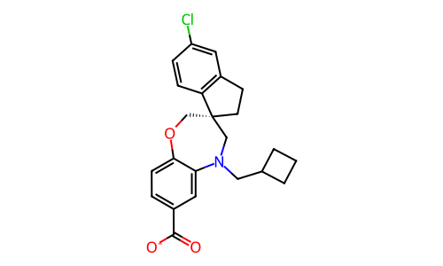
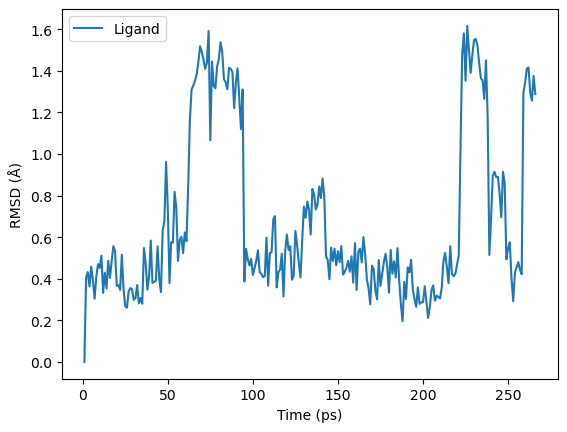
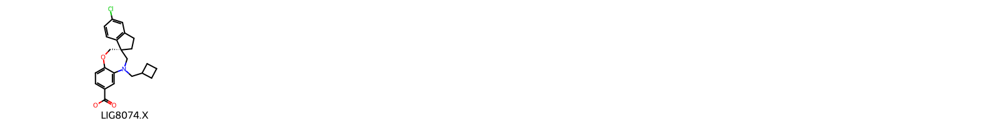
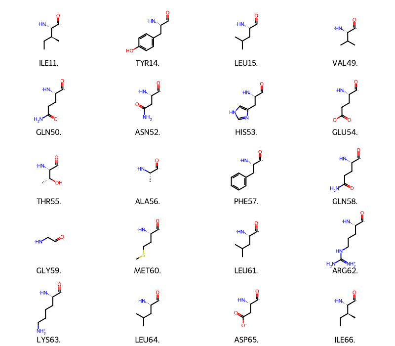
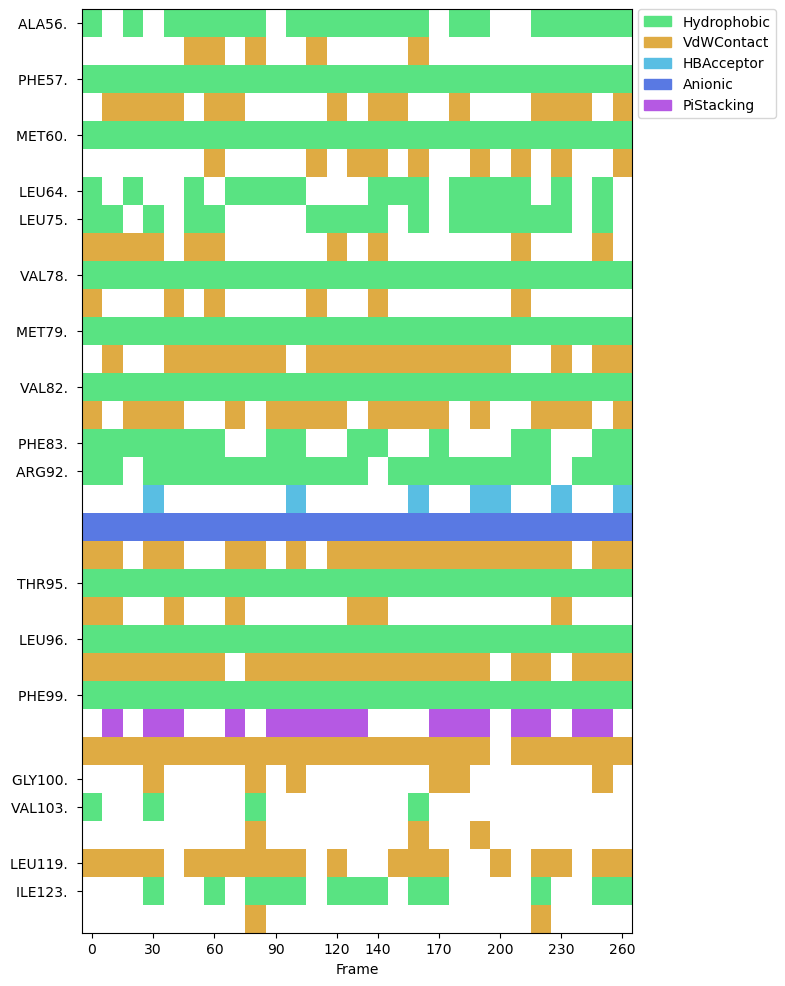

# Parameterisation, Molecular Dynamics, and Trajectory Analysis of a Protein-Ligand Complex with OpenFF, OpenMM, MDAnalysis, and ProLIF

This is the second of two jupyter notebooks on handling force fields using [Open Force Field's](https://openforcefield.org/) software, and subsequent molecular dynamics and analysis. The first notebook (`small_molecule_parameterisation.ipynb`) introduced fundamental concepts in OpenFF and demonstrated parameterisation of a small molecule.
This notebook demonstrates how to prepare a system that combines solvent, a ligand using Sage, and a protein using a standard AMBER force field. We'll take the structures of the MCL-1 and the bound ligand from the crystal structure, but we could just as easily use a ligand pose from docking. We'll solvate the complex, assemble the system, parameterise it, and finally simulate it with OpenMM and visualize the results, all without leaving the notebook. Have fun!

### Prerequisites

 - Basic knowledge of Python
 - Basic familiarity with molecular mechanics force fields and molecular dynamics simulations (see talk by Danny Cole)
 - Completion of `small_molecule_parameterisation.ipynb`

### The Plan

| Action | Software|
|--|--|
| [Visualise the protein and ligand](#visualise) | NGLView |
| [Assemble the topology](#assemble) | OpenFF Toolkit
| [Parameterise the complex](#parameterise) | OpenFF Toolkit and OpenFF Interchange
| [Simulate the complex](#simulate) | OpenMM
| [Analyse pose stability and interactions](#analyse) | MDAnalysis and ProLIF
| [Review what you've learnt](#summary) | 
| [Check out other OpenFF tutorials](#further_materials) | 
| [Check out related non-OpenFF software](#further_non_openff_materials) | 

### Jupyter Cheat Sheet

- To run the currently highlighted cell and move focus to the next cell, hold <kbd>&#x21E7; Shift</kbd> and press <kbd>&#x23ce; Enter</kbd>;
- To run the currently highlighted cell and keep focus in the same cell, hold <kbd>&#x21E7; Ctrl</kbd> and press <kbd>&#x23ce; Enter</kbd>;
- To get help for a specific function, place the cursor within the function's brackets, hold <kbd>&#x21E7; Shift</kbd>, and press <kbd>&#x21E5; Tab</kbd>;

### Acknowledgements

Most of this material was adapted from:


* The OpenFF [toolkit showcase](https://docs.openforcefield.org/en/latest/examples/openforcefield/openff-toolkit/toolkit_showcase/toolkit_showcase.html)
* The [ProLIF Ligand-protein MD tutorial](https://prolif.readthedocs.io/en/latest/notebooks/md-ligand-protein.html#ligand-protein-md)

### Maintainers
 - Finlay Clark -- finlay.clark@newcastle.ac.uk (@fjclark)


<a id="visualise"></a>
## 1. We Can Visualise the Protein and Ligand with NGLView

We'll be using the MCL-1 complex with PDBID `6o6f`. This is a common system for benchmarking protein-ligand binding free energy calcalulations and features in the [protein-ligand benchmark set hosted by OpenFF](https://github.com/openforcefield/protein-ligand-benchmark).

As we've already covered structure preparation, we provide pre-prepared protein and ligand structures in the `structures` directory. These are ready for simulation:

- Their co-ordinates are super-imposable (and there are no clashes between waters and the ligand)
- Hydrogens have been added to protein and crystallographic waters consistent with pH 7
- The protein's termini have been capped where appropriate to prevent unphysical charges
- A missing residue in the middle of the chain has been added
- The protein has been solvated and 150 mM NaCl added
- The overall system is neutral

If you'd like more information on how this was done, check out `structures/README.md`.


```python
receptor_path = "../structures/6o6f_protein_solvated.pdb"
ligand_path = "../structures/6o6f_ligand.sdf"
```

We can visualize each structure using the [NGLView] widget. These visualizations are interactive; rotate by dragging the left mouse button, pan with the right mouse button, and zoom with the scroll wheel. You can also mouse over an atom to see its details, and click an atom to center the view on it. When you mouse over the widget, a full screen button will appear in its top right corner.

[NGLView]: https://github.com/nglviewer/nglview


```python
import nglview

view = nglview.show_structure_file(ligand_path)
view
```


    


    /opt/conda/envs/openff-env/lib/python3.12/site-packages/nglview/__init__.py:12: UserWarning: pkg_resources is deprecated as an API. See https://setuptools.pypa.io/en/latest/pkg_resources.html. The pkg_resources package is slated for removal as early as 2025-11-30. Refrain from using this package or pin to Setuptools<81.
      import pkg_resources


    NGLWidget()


<div class="alert alert-info" style="max-width: 700px; margin-left: auto; margin-right: auto;">
    ℹ️ Try replacing <code>ligand_path</code> with <code>receptor_path</code> to visualize the protein!
</div>


<a id="assemble"></a>
## 2. OpenFF Toolkit Allows Us to Assemble the Topology

Conceptually, this step involves putting together the positions of all of the components of the system. We'll create  a [`Topology`] to keep track of the contents of our system. As discussed in this morning's session, `Topology` represents a collection of molecules; it doesn't have any association with any force field parameters.

[`Topology`]: https://docs.openforcefield.org/projects/toolkit/en/stable/api/generated/openff.toolkit.topology.Topology.html

First, we'll load the ligand and receptor into OpenFF Toolkit [`Molecule`] objects, which keep track of all their chemical information. As discussed previously, `Molecule` represents a collection of atoms with specified formal charges, connected by bonds with specified bond orders, optionally including any number of conformer coordinates. This is intended to closely align with a chemist's intuitive understanding of a molecule, rather than simply wrap the minimal information needed for a calculation.

SDF files include all a molecule's bond orders and formal charges, as well as coordinates, so they're ideal as a format for distributing small molecules. And that's exactly the format the ligand is stored in!

[`Molecule`]: https://docs.openforcefield.org/projects/toolkit/en/stable/api/generated/openff.toolkit.topology.Molecule.html


```python
from openff.toolkit import Molecule

# Load a molecule from a SDF file
ligand = Molecule.from_file(ligand_path)

# Print out a SMILES code for the ligand
print(ligand.to_smiles(explicit_hydrogens=False))

# Visualize the molecule
ligand.visualize(show_all_hydrogens=False)
```

    O=C([O-])c1ccc2c(c1)N(CC1CCC1)C[C@@]1(CCc3cc(Cl)ccc31)CO2


    

    


Conventionally, SDF files are used for ligands and PDB files are used for proteins. The toolkit loads polymers (including biopolymers such as proteins) via PDB files by inferring chemical information from the file and a known dictionary of common residues (and water, and ions). To do this, we'll use `Topology.from_pdb`


```python
from openff.toolkit import Topology

topology = Topology.from_pdb(receptor_path)

# Note that we have box vectors:
print(topology.box_vectors)
```

    [[6.5199 0.0 0.0] [0.0 6.5199 0.0] [0.0 0.0 6.5199]] nanometer


We can add the ligand `Molecule` to the topology created from the protein PDB file.


```python
topology.add_molecule(ligand)
```


    7923


Now that we've assembled our topology, we can save it to disk. We can use JSON for this, which makes it human readable in a pinch. This stores everything we've just assembled - molecular identities, conformers, box vectors, and everything else. The topology can then be loaded later on with the [`Topology.from_json()`] method. This is great for running the same system through different force fields, distribution with a paper, or for assembling systems in stages.

[`Topology.from_json()`]: https://docs.openforcefield.org/projects/toolkit/en/stable/api/generated/openff.toolkit.topology.Topology.html#openff.toolkit.topology.Topology.from_json


```python
with open("topology.json", "w") as f:
    print(topology.to_json(), file=f)
```

To visualize inside the notebook, we'll use `Topology.visualize`, which uses NGLview under the hood. NGLview supports a wide variety of [molecular visualization methods], as well as a VMD-like [atom selection language]. This can be used to visualize complex systems like this one.

The widget consists of a minimally documented [Python library frontend] and an extensively documented [JavaScript backend]. You'll need to refer to the documentation for both to do anything sophisticated, as the Python code delegates most of its options and functionality to the JS code.

By default, the toolkit attemps to draw some components with special representations:
* Waters: [line](https://nglviewer.org/ngl/api/manual/molecular-representations.html#line)
* Ions: [spacefill](https://nglviewer.org/ngl/api/manual/molecular-representations.html#spacefill)
* Proteins: [cartoon](https://nglviewer.org/ngl/api/manual/molecular-representations.html#cartoon)

Everything else (i.e. unrecognized ligands) are drawn with the [licorice](https://nglviewer.org/ngl/api/manual/molecular-representations.html#licorice) representation, which is basically a ball+stick model. A box representing the periodic boundary conditions is also added.

[molecular visualization methods]: https://nglviewer.org/ngl/api/manual/molecular-representations.html
[atom selection language]: https://nglviewer.org/ngl/api/manual/selection-language.html
[Python library frontend]: https://nglviewer.org/nglview/latest/api.html
[JavaScript backend]: https://nglviewer.org/ngl/api/manual/index.html


```python
view = topology.visualize()

# can make further modifications to this representation object, or just look at it
view
```


    NGLWidget()


<div class="alert alert-success" style="max-width: 500px; margin-left: auto; margin-right: auto; border-left: 6px solid #5cb85c; background-color: #f1fff1;">
✏️ <b>Exercise:</b>️ Have a play with this visualization! Try clearing the default representations with <code>view.clear()</code> and configuring your own cartoon <em>(Hint: <a href=https://nglviewer.org/nglview/latest/api.html#nglview.NGLWidget>Check the docs</a>)</em>. You'll need <code>view.add_representation</code>. See if you can display the ligand in a way you like. When you're happy with what you've made, save the image with <code>view.download_image()</code>
</div>

<a id="parameterise"></a>
## 3. We Can Assemble a Combined `ForceField` and use this to Parameterise the Whole System

Now that we've prepared our co-ordinates, we should choose the force field. For now, we don't have any single SMIRNOFF force field that can handle both proteins and small molecules; the Rosemary 3.0.0 force field will support this, but it's not yet ready. As an alternative, we'll combine the AMBER-compatible [Sage] small molecule force field with the SMIRNOFF port of AMBER ff14SB. Note that Sage also includes the TIP3P water model, which is appropriate for AMBER ff14SB too.

When we combine multiple SMIRNOFF force fields into one, we provide them in an order from general to specific. Sage includes parameters that could be applied to a protein, but they're general across all molecules; ff14SB's parameters are specific to proteins. Since the Toolkit always applies the last parameters that match a moiety, this order makes sure the right parameters get assigned.

[Sage]: https://openforcefield.org/force-fields/force-fields/#sage

<div class="alert alert-warning" style="max-width: 700px; margin-left: auto; margin-right: auto;">
⚠️ Warning: If your small molecule has an amino acid substructure in it, the specific patterns in the ff14SB force field will override the general ones from openff-2.2.1.offxml. This is the SMIRNOFF format being applied correctly, but some users may find this surprising, especially since terminal caps like ACE and NME are relatively small substructures and will sometimes appear in ligands.
</div>


```python
from openff.toolkit import ForceField

# Assemble the combined force field
sage_ff14sb = ForceField("openff-2.2.1.offxml", "ff14sb_off_impropers_0.0.3.offxml")
```

We now have a `Topology`, which stores the chemical information of the system, and a `ForceField`, which maps chemistry to force field parameters. To parametrize the system, we combine these two objects into an [`Interchange`], as discussed in this morning's session.

An `Interchange` represents a completely parametrized molecular mechanics system. Partial charges are computed here according to the instructions in the force field, and this is where virtual sites required by the force field will be introduced. This all happens behind the scenes; all we have to do is combine an abstract chemical description with a force field. This makes it easy to change water model or force field, as the chemistry being modelled is completely independent of the model itself.

[`Interchange`]: https://docs.openforcefield.org/projects/interchange/en/stable/_autosummary/openff.interchange.components.interchange.Interchange.html


```python
interchange = sage_ff14sb.create_interchange(topology)
```

*(This should take about a minute, largely because of the complexity of the AMBER protein force field port. In the future, this should be faster.)*

While that runs, let's recap. We've constructed a `Topology` out of a number of `Molecule` objects, each of which represents a particular chemical independent of any model details. The `Topology` then represents an entire chemical system, which in theory could be modelled in any number of ways. Our `Topology` also includes atom positions and box vectors, but if we thought that was too concrete for our use case we could leave them out and add them after parametrization.

Separately, we've constructed a `ForceField` by combining a general SMIRNOFF force field with a protein-specific SMIRNOFF force field. A SMIRNOFF force field is a bunch of rules for applying force field parameters to chemicals via SMARTS patterns. The force field includes everything needed to compute an energy: parameters, charges, functional forms, non-bonded methods and cutoffs, virtual sites, and so on.

Then, we've parametrized our `Topology` with our `ForceField` to produce an `Interchange`. This applies all our rules and gives us a system ready to simulate. An `Interchange` can also concretely define positions, velocities, and box vectors, whether they come from the `Topology` or are added after parametrization. Once we have the `Interchange`, we can produce input data for any of the supported MM engines.

This clear delineation makes benchmarking the same system against different force fields or the same force field against different force fields easy. The SMIRNOFF format makes distributing force fields in an engine agnostic way possible. Everything is an open standard or written in open source Python, so we can see how it works and even change it if we need to.

<a id="simulate"></a>
## 4 We can Simulate the Dynamics of the Complex with OpenMM

To use an `Interchange`, we need to convert it to the input expected by a particular molecular mechanics engine. We'll use OpenMM, because its support is the most mature and the fastest, but GROMACS, LAMMPS, and Amber all enjoy [preliminary support]. (TODO: Still preliminary?)

For example, we can write out GROMACS `complex.gro` and `complex.top` files with:


```python
interchange.to_gromacs(prefix="complex")
```

    /opt/conda/envs/openff-env/lib/python3.12/site-packages/openff/interchange/components/mdconfig.py:502: UserWarning: Ambiguous failure while processing constraints. Constraining h-bonds as a stopgap.
      warnings.warn(


All that remains is to tell OpenMM the details about how we want to integrate and record data for the simulation, and then to put everything together and run it! The steps are:

1. Configure and run the simulation
1. Minimise the combined system
1. Run a short simulation
1. Visualise the trajectory

[preliminary support]: https://docs.openforcefield.org/projects/interchange/en/stable/using/output.html

### 4.1 Configure and run the simulation

Here, we'll use a Langevin thermostat at 300 Kelvin and a 2 fs time step. We'll write the structure to disk every 10 steps. In contrast to the previous notebook, we'll add a MonteCarloBarostat to fix the pressure, while allowing the volume to fluctuate. Our simulation corresponds to the $NPT$ ensemble.


```python
import openmm

TEMPERATURE = 300 * openmm.unit.kelvin
PRESSURE = 1 * openmm.unit.atmosphere
FRICTION_COEFFICIENT = 1 / openmm.unit.picosecond
TIMESTEP = 0.002 * openmm.unit.picoseconds

# Construct and configure a LangevinMiddleIntegrator at 300 K with an appropriate friction constant and time-step
integrator = openmm.LangevinMiddleIntegrator(
    TEMPERATURE,
    FRICTION_COEFFICIENT,
    TIMESTEP,
)
barostat = openmm.MonteCarloBarostat(PRESSURE, TEMPERATURE)

# Under the hood, this creates *OpenMM* `System` and `Topology` objects, then combines them together
simulation = interchange.to_openmm_simulation(integrator=integrator, additional_forces=[barostat])

# Add a reporter to record the structure every 50 steps
dcd_reporter = openmm.app.DCDReporter("trajectory.dcd", 50)
simulation.reporters.append(dcd_reporter)
```

### 4.2 Minimise the combined system

This will reduce any forces that are too large to integrate, such as from clashes or from disagreements between the crystal structure and force field.


```python
import numpy as np

def describe_state(state: openmm.State, name: str = "State"):
    max_force = max(np.sqrt(v.x**2 + v.y**2 + v.z**2) for v in state.getForces())
    print(
        f"{name} has energy {round(state.getPotentialEnergy()._value, 2)} kJ/mol "
        f"with maximum force {round(max_force, 2)} kJ/(mol nm)"
    )


describe_state(
    simulation.context.getState(
        getEnergy=True,
        getForces=True,
    ),
    "Original state",
)

simulation.minimizeEnergy()

describe_state(
    simulation.context.getState(getEnergy=True, getForces=True),
    "Minimized state",
)
```

    Original state has energy 14441310.99 kJ/mol with maximum force 1367210431.91 kJ/(mol nm)


    Minimized state has energy -434658.17 kJ/mol with maximum force 2480.58 kJ/(mol nm)


### 4.3 Run a short simulation

If this were anything more than a demonstration of the Toolkit, this example would need to include additional steps like equilibration. 

<div class="alert alert-warning" style="max-width: 700px; margin-left: auto; margin-right: auto;">
⚠️ Make sure you use your own, valid simulation protocol! This is just an example.
</div>


```python
simulation.context.setVelocitiesToTemperature(TEMPERATURE)
simulation.runForClockTime(1.0 * openmm.unit.minute)
```

_(This'll take a minute - literally, this time)_

While that runs, let's talk a bit about OpenFF.

### Open Source Force Fields

A primary goal of the Open Force Field Initiative is to make development and use of force fields as open as possible - it's in our name! We believe that open source development practices have a lot to offer the scientific community, whether that science is academic, commercial, or hobbyist.

#### The SMIRNOFF specification

The SMIRNOFF specification describes a simple format for describing molecular force fields. We provide and maintain this spec in the hopes that it will allow scientists everywhere to contribute to force field development in a unified way, without taking them away from their favourite simulation package.

SMIRNOFF is not just a spec; we're also committed to a reference implementation — that being the OpenFF Toolkit. The Toolkit endeavors to support all the functional forms in both the SMIRNOFF spec and the [`openff-forcefields`](https://github.com/openforcefield/openff-forcefields/) package.

#### Reproducibility

OpenFF force fields are completely specified by the name of the distributed `.offxml` file. We use codenames, version numbers, and tags to accomplish this. This means that as long as a user, designer, or reviewer sees the name of the force field being used, they know exactly what is going in to that simulation. We include parameters that are often neglected in force field specifications, such as the non-bonded cut-off distance, ewald methods, constraints, modifications to the Lennard-Jones function, and partial charge generation methods are all defined by the name of the force field. 

As much as possible, we want energy and force to be a deterministic output of combining a molecule and a force field. If an author provides the name of the force field in their methods section, it should be reproducible. The other side of this coin is that we never want to hide the force field from the user. In all our workflows, the name of the force field must be explicitly provided in the code. This improves reproducibility of the code and helps the user take responsibility for their results. 

#### "Plugin" support for new force fields

The OpenFF Toolkit supports distributing force field files (.offxml) through Conda data packages. Anyone can publish a package on Conda Forge that extends the list of directories the toolkit searches for force fields, allowing anyone to produce force fields without requiring their own tooling, in a format that is designed to be converted to a multitude of simulation packages. See the [FAQ](https://open-forcefield-toolkit.readthedocs.io/en/stable/faq.html#how-can-i-distribute-my-own-force-fields-in-smirnoff-format) for more details.

---

Right! Simulation should be done by now, let's take a look.

### 4.4 Visualize the simulation with nglview

NGLView can display single structures and entire trajectories. Mouse over the widget to see the animation controls. Note that the trajectory generated above is `trajectory.dcd`. However, as this was run on CPUs (slow), we've provided a longer trajectory (`trajectory_gpu.dcd`, saved every 500 steps (1 ps)) for you to use for analysis. Feel free to visualise/ analyse both.


```python
import MDAnalysis as mda

u = mda.Universe(interchange.to_openmm_topology(), "trajectory_gpu.dcd")

view = nglview.show_mdanalysis(u)
view.add_representation("line", selection="protein")
view
```

    /opt/conda/envs/openff-env/lib/python3.12/site-packages/MDAnalysis/coordinates/DCD.py:165: DeprecationWarning: DCDReader currently makes independent timesteps by copying self.ts while other readers update self.ts inplace. This behavior will be changed in 3.0 to be the same as other readers. Read more at https://github.com/MDAnalysis/mdanalysis/issues/3889 to learn if this change in behavior might affect you.
      warnings.warn("DCDReader currently makes independent timesteps"


    NGLWidget(max_frame=265)


<div class="alert alert-success" style="max-width: 500px; margin-left: auto; margin-right: auto; border-left: 6px solid #5cb85c; background-color: #f1fff1;">
    ✏️ <b>Exercise:</b> Can you visualize this trajectory in VMD (or another visualization tool of your choice)? Hint: DCD files only include the trajectory data (positions of each atoms over time) and lack topological information, so you might need another file.
</div>

<a id="analyse"></a>
## 5. MDAnalysis and ProLIF Enable Analysis of Pose Stability and Protein-Ligand Interactions

[`MDAnalysis`](https://www.mdanalysis.org/) is an excellent package (and an alternative to `MDTraj`) for the analysis of simulation data. [`ProLIF`](https://prolif.readthedocs.io/en/stable/) is a handy tool for computing protein-ligand interaction fingerprints based on `MDAnalysis` and the [`RDKit`](https://www.rdkit.org/docs/index.html). We'll demonstrate the use of each to perform some analyses specific to protein-ligand complexes. In particular, we'll analyse:

1. Binding pose stability
1. Protein-ligand interactions

### 5.1 Binding pose stability

RMSDs can tell us about the stability of our binding pose. We can calculate the RMSD of the ligand using `MDAnalysis`:


```python
from MDAnalysis.analysis import rms
import pandas as pd

# Define a selection string for the ligand
LIGAND = "resname LIG"

# Compute the RMSD of the ligand aligned to itself
R = rms.RMSD(u,  # universe to align
             u,  # reference universe or atomgroup
             select=LIGAND,  # group to superimpose and calculate RMSD
             ref_frame=0)  # frame index of the reference
R.run()

# Convert the results to a pandas DataFrame for easier handling
df = pd.DataFrame(R.results.rmsd,
                  columns=['Frame', 'Time (ps)', 'Ligand'])

# Plot
ax = df.plot(x='Time (ps)', y='Ligand', kind='line')
ax.set_ylabel(r'RMSD (Å)')
```


    Text(0, 0.5, 'RMSD (Å)')


    

    


<div class="alert alert-success" style="max-width: 500px; margin-left: auto; margin-right: auto; border-left: 6px solid #5cb85c; background-color: #f1fff1;">
    ✏️ <b>Exercise:</b> Does the RMSD suggest any distinct ligand conformational states? Can you identify what these states correspond to from the trajectory?
</div>

<div class="alert alert-warning" style="max-width: 700px; margin-left: auto; margin-right: auto;">
⚠️ The above analysis tells us about ligand conformation, but is missing key information about pose stability.
</div>

<div class="alert alert-success" style="max-width: 500px; margin-left: auto; margin-right: auto; border-left: 6px solid #5cb85c; background-color: #f1fff1;">
    ✏️ <b>Exercise:</b> Why is the above analysis not sufficient for determining pose stability? (Hint: what would happen if a rigid ligand drifted out of the binding site?) Can you modify the code above to compute an RMSD which is more informative about binding pose stability? (Hint: think about the alignment reference. You can specify additional groups which are used to calculate RMSD but not to align the trajectory -- have a look at the <a href="https://userguide.mdanalysis.org/stable/examples/analysis/alignment_and_rms/rmsd.html">MDAnalysis RMSD tutorial</a>. You might want to check out the <a href="https://userguide.mdanalysis.org/stable/selections.html"> MDAnalysis atom selection language documentation </a>.) When would you expect this new RMSD to be similar or different to the RMSD computed above? If you're stuck, you can click to reveal another hint below.
</div>

<details>
  <summary><b>Click here to reveal another hint</b></summary>
You'll likely want to use a selection string similar to <code>POCKET_RESIDUES = "protein and byres around 10.0 resname LIG"</code>
</details>


```python
# Add code to compute an RMSD which is more informative about binding pose stability
```

<div class="alert alert-warning" style="max-width: 700px; margin-left: auto; margin-right: auto;">
⚠️ Be careful when interpreting RMSDs. A low RMSD is highly informative because it tells you the relevant structure is very similar to your reference, and there are few ways to be similar; a high RMSD is much less informative because it tells you the structures are different, and there are many ways to be different. <a href=https://pubs.acs.org/doi/10.1021/jp412776d>We should take care when interpreting stable high-RMSD conformations as well-defined stable states</a>. <a href="https://pubs.acs.org/doi/10.1021/acs.jctc.7b00028">The interpretation of RMSD may also be affected by molecular size</a>. 
</div>

### 5.2 Protein-Ligand Interactions

Let's analyse the protein-ligand interactions with `ProLIF`. This section is adapted from the [ProLIF tutorial](https://prolif.readthedocs.io/en/stable/notebooks/md-ligand-protein.html#ligand-protein-md) -- check it out for more analyses. First, let's select the ligand and binding site residues:


```python
import prolif as plf

POCKET_RESIDUES = "protein and byres around 10.0 resname LIG"

# create selections for the ligand and protein
ligand_selection = u.select_atoms(LIGAND)
protein_selection = u.select_atoms(POCKET_RESIDUES)
ligand_selection, protein_selection
```

    /opt/conda/envs/openff-env/lib/python3.12/site-packages/MDAnalysis/topology/tables.py:52: DeprecationWarning: Deprecated in version 2.8.0
    MDAnalysis.topology.tables has been moved to MDAnalysis.guesser.tables. This import point will be removed in MDAnalysis version 3.0.0
      warnings.warn(wmsg, category=DeprecationWarning)


    (<AtomGroup with 51 atoms>, <AtomGroup with 1129 atoms>)


... and visualise them:


```python
# create a molecule from the MDAnalysis selection
ligand_mol = plf.Molecule.from_mda(ligand_selection)
# display
plf.display_residues(ligand_mol, size=(400, 200))
```


    

    


```python
protein_mol = plf.Molecule.from_mda(protein_selection)
# remove the `slice(20)` part to show all residues
plf.display_residues(protein_mol, slice(20))
```


    

    


Now, let's calculate the interaction fingerprint using every 10th frame and specifying `count=True` to keep track of all interations (not just the first group of atoms that satisfied the constraints per interaction type and residue pair).

<div class="alert alert-info" style="max-width: 700px; margin-left: auto; margin-right: auto;">
    ℹ️ You may want to adjust the frame frequency depending on how many frames you generated.
</div>


```python
# use default interactions
fp = plf.Fingerprint(count=True)
# run on a slice of the trajectory frames: from begining to end with a step of 10
FRAME_FREQUENCY = 10 # Adjust this value as needed
fp.run(u.trajectory[::FRAME_FREQUENCY], ligand_selection, protein_selection)
```


      0%|          | 0/27 [00:00<?, ?it/s]


    <prolif.fingerprint.Fingerprint: 9 interactions: ['Hydrophobic', 'HBAcceptor', 'HBDonor', 'Cationic', 'Anionic', 'CationPi', 'PiCation', 'PiStacking', 'VdWContact'] at 0x7f07eba51910>


`ProLIF` provides handy functions to display interactions over time, and to visualise the interactions in 2D and 3D!


```python
# Display interactions over time
fp.plot_barcode()
```


    <Axes: xlabel='Frame'>


    

    


```python
# Plot the interactions in 2D
vis = fp.plot_lignetwork(ligand_mol)
vis
```


<iframe width="100%" height="590px" frameborder="0" srcdoc="
        &lt;html&gt;
        &lt;head&gt;
        &lt;script type=&quot;text/javascript&quot; src=&quot;https://unpkg.com/vis-network@9.0.4/dist/vis-network.min.js&quot;&gt;&lt;/script&gt;
        &lt;link href=&quot;https://unpkg.com/vis-network@9.0.4/dist/dist/vis-network.min.css&quot; rel=&quot;stylesheet&quot; type=&quot;text/css&quot; /&gt;
        &lt;style type=&quot;text/css&quot;&gt;
            body {
                padding: 0;
                margin: 0;
                background: #fff;
            }
            .legend-btn.residues.disabled {
                background: #b4b4b4 !important;
                color: #555 !important;
            }
            .legend-btn.interactions.disabled {
                border-color: #b4b4b4 !important;
                color: #555 !important;
            }
        &lt;/style&gt;
        &lt;/head&gt;
        &lt;body&gt;
        &lt;div id=&quot;mynetwork&quot;&gt;&lt;/div&gt;
        &lt;div id=&quot;networklegend&quot;&gt;&lt;/div&gt;
        &lt;script type=&quot;text/javascript&quot;&gt;

        var ifp, legend, nodes, edges, legend_buttons;
        function drawGraph(_id, nodes, edges, options) {
            var container = document.getElementById(_id);
            nodes = new vis.DataSet(nodes);
            edges = new vis.DataSet(edges);
            var data = {nodes: nodes, edges: edges};
            var network = new vis.Network(container, data, options);
            network.on(&quot;stabilizationIterationsDone&quot;, function () {
                network.setOptions( { physics: false } );
            });
            return network;
        }
        nodes = [{&quot;id&quot;: &quot;ALA56. &quot;, &quot;label&quot;: &quot;ALA56. &quot;, &quot;color&quot;: &quot;#59e382&quot;, &quot;shape&quot;: &quot;box&quot;, &quot;borderWidth&quot;: 0, &quot;physics&quot;: true, &quot;mass&quot;: 2, &quot;group&quot;: &quot;protein&quot;, &quot;residue_type&quot;: &quot;Aliphatic&quot;}, {&quot;id&quot;: &quot;ARG92. &quot;, &quot;label&quot;: &quot;ARG92. &quot;, &quot;color&quot;: &quot;#5979e3&quot;, &quot;shape&quot;: &quot;box&quot;, &quot;borderWidth&quot;: 0, &quot;physics&quot;: true, &quot;mass&quot;: 2, &quot;group&quot;: &quot;protein&quot;, &quot;residue_type&quot;: &quot;Basic&quot;}, {&quot;id&quot;: &quot;ILE123. &quot;, &quot;label&quot;: &quot;ILE123. &quot;, &quot;color&quot;: &quot;#59e382&quot;, &quot;shape&quot;: &quot;box&quot;, &quot;borderWidth&quot;: 0, &quot;physics&quot;: true, &quot;mass&quot;: 2, &quot;group&quot;: &quot;protein&quot;, &quot;residue_type&quot;: &quot;Aliphatic&quot;}, {&quot;id&quot;: &quot;LEU119. &quot;, &quot;label&quot;: &quot;LEU119. &quot;, &quot;color&quot;: &quot;#59e382&quot;, &quot;shape&quot;: &quot;box&quot;, &quot;borderWidth&quot;: 0, &quot;physics&quot;: true, &quot;mass&quot;: 2, &quot;group&quot;: &quot;protein&quot;, &quot;residue_type&quot;: &quot;Aliphatic&quot;}, {&quot;id&quot;: &quot;LEU64. &quot;, &quot;label&quot;: &quot;LEU64. &quot;, &quot;color&quot;: &quot;#59e382&quot;, &quot;shape&quot;: &quot;box&quot;, &quot;borderWidth&quot;: 0, &quot;physics&quot;: true, &quot;mass&quot;: 2, &quot;group&quot;: &quot;protein&quot;, &quot;residue_type&quot;: &quot;Aliphatic&quot;}, {&quot;id&quot;: &quot;LEU75. &quot;, &quot;label&quot;: &quot;LEU75. &quot;, &quot;color&quot;: &quot;#59e382&quot;, &quot;shape&quot;: &quot;box&quot;, &quot;borderWidth&quot;: 0, &quot;physics&quot;: true, &quot;mass&quot;: 2, &quot;group&quot;: &quot;protein&quot;, &quot;residue_type&quot;: &quot;Aliphatic&quot;}, {&quot;id&quot;: &quot;LEU96. &quot;, &quot;label&quot;: &quot;LEU96. &quot;, &quot;color&quot;: &quot;#59e382&quot;, &quot;shape&quot;: &quot;box&quot;, &quot;borderWidth&quot;: 0, &quot;physics&quot;: true, &quot;mass&quot;: 2, &quot;group&quot;: &quot;protein&quot;, &quot;residue_type&quot;: &quot;Aliphatic&quot;}, {&quot;id&quot;: &quot;MET60. &quot;, &quot;label&quot;: &quot;MET60. &quot;, &quot;color&quot;: &quot;#e3ce59&quot;, &quot;shape&quot;: &quot;box&quot;, &quot;borderWidth&quot;: 0, &quot;physics&quot;: true, &quot;mass&quot;: 2, &quot;group&quot;: &quot;protein&quot;, &quot;residue_type&quot;: &quot;Sulfur&quot;}, {&quot;id&quot;: &quot;MET79. &quot;, &quot;label&quot;: &quot;MET79. &quot;, &quot;color&quot;: &quot;#e3ce59&quot;, &quot;shape&quot;: &quot;box&quot;, &quot;borderWidth&quot;: 0, &quot;physics&quot;: true, &quot;mass&quot;: 2, &quot;group&quot;: &quot;protein&quot;, &quot;residue_type&quot;: &quot;Sulfur&quot;}, {&quot;id&quot;: &quot;PHE57. &quot;, &quot;label&quot;: &quot;PHE57. &quot;, &quot;color&quot;: &quot;#b559e3&quot;, &quot;shape&quot;: &quot;box&quot;, &quot;borderWidth&quot;: 0, &quot;physics&quot;: true, &quot;mass&quot;: 2, &quot;group&quot;: &quot;protein&quot;, &quot;residue_type&quot;: &quot;Aromatic&quot;}, {&quot;id&quot;: &quot;PHE83. &quot;, &quot;label&quot;: &quot;PHE83. &quot;, &quot;color&quot;: &quot;#b559e3&quot;, &quot;shape&quot;: &quot;box&quot;, &quot;borderWidth&quot;: 0, &quot;physics&quot;: true, &quot;mass&quot;: 2, &quot;group&quot;: &quot;protein&quot;, &quot;residue_type&quot;: &quot;Aromatic&quot;}, {&quot;id&quot;: &quot;PHE99. &quot;, &quot;label&quot;: &quot;PHE99. &quot;, &quot;color&quot;: &quot;#b559e3&quot;, &quot;shape&quot;: &quot;box&quot;, &quot;borderWidth&quot;: 0, &quot;physics&quot;: true, &quot;mass&quot;: 2, &quot;group&quot;: &quot;protein&quot;, &quot;residue_type&quot;: &quot;Aromatic&quot;}, {&quot;id&quot;: &quot;THR95. &quot;, &quot;label&quot;: &quot;THR95. &quot;, &quot;color&quot;: &quot;#59bee3&quot;, &quot;shape&quot;: &quot;box&quot;, &quot;borderWidth&quot;: 0, &quot;physics&quot;: true, &quot;mass&quot;: 2, &quot;group&quot;: &quot;protein&quot;, &quot;residue_type&quot;: &quot;Polar&quot;}, {&quot;id&quot;: &quot;VAL78. &quot;, &quot;label&quot;: &quot;VAL78. &quot;, &quot;color&quot;: &quot;#59e382&quot;, &quot;shape&quot;: &quot;box&quot;, &quot;borderWidth&quot;: 0, &quot;physics&quot;: true, &quot;mass&quot;: 2, &quot;group&quot;: &quot;protein&quot;, &quot;residue_type&quot;: &quot;Aliphatic&quot;}, {&quot;id&quot;: &quot;VAL82. &quot;, &quot;label&quot;: &quot;VAL82. &quot;, &quot;color&quot;: &quot;#59e382&quot;, &quot;shape&quot;: &quot;box&quot;, &quot;borderWidth&quot;: 0, &quot;physics&quot;: true, &quot;mass&quot;: 2, &quot;group&quot;: &quot;protein&quot;, &quot;residue_type&quot;: &quot;Aliphatic&quot;}, {&quot;id&quot;: &quot;centroid(LIG8074.X, PHE99. , PiStacking)&quot;, &quot;x&quot;: 39.57674973805746, &quot;y&quot;: 75.95924945274989, &quot;shape&quot;: &quot;text&quot;, &quot;label&quot;: &quot; &quot;, &quot;fixed&quot;: true, &quot;physics&quot;: false, &quot;group&quot;: &quot;ligand&quot;}, {&quot;label&quot;: &quot;Cl&quot;, &quot;shape&quot;: &quot;circle&quot;, &quot;color&quot;: &quot;white&quot;, &quot;font&quot;: {&quot;color&quot;: &quot;lime&quot;}, &quot;id&quot;: 0, &quot;x&quot;: 100.17575197219848, &quot;y&quot;: 111.23924740552901, &quot;fixed&quot;: true, &quot;group&quot;: &quot;ligand&quot;, &quot;borderWidth&quot;: 0}, {&quot;label&quot;: &quot;O&quot;, &quot;shape&quot;: &quot;circle&quot;, &quot;color&quot;: &quot;white&quot;, &quot;font&quot;: {&quot;color&quot;: &quot;red&quot;}, &quot;id&quot;: 1, &quot;x&quot;: -76.07725400924681, &quot;y&quot;: -147.2217496037483, &quot;fixed&quot;: true, &quot;group&quot;: &quot;ligand&quot;, &quot;borderWidth&quot;: 0}, {&quot;label&quot;: &quot;O-&quot;, &quot;shape&quot;: &quot;ellipse&quot;, &quot;color&quot;: &quot;white&quot;, &quot;font&quot;: {&quot;color&quot;: &quot;red&quot;}, &quot;id&quot;: 2, &quot;x&quot;: -16.535250377655025, &quot;y&quot;: -135.6997449040413, &quot;fixed&quot;: true, &quot;group&quot;: &quot;ligand&quot;, &quot;borderWidth&quot;: 0}, {&quot;label&quot;: &quot;O&quot;, &quot;shape&quot;: &quot;circle&quot;, &quot;color&quot;: &quot;white&quot;, &quot;font&quot;: {&quot;color&quot;: &quot;red&quot;}, &quot;id&quot;: 3, &quot;x&quot;: -79.64025144577025, &quot;y&quot;: 12.553249728679658, &quot;fixed&quot;: true, &quot;group&quot;: &quot;ligand&quot;, &quot;borderWidth&quot;: 0}, {&quot;label&quot;: &quot;N&quot;, &quot;shape&quot;: &quot;circle&quot;, &quot;color&quot;: &quot;white&quot;, &quot;font&quot;: {&quot;color&quot;: &quot;blue&quot;}, &quot;id&quot;: 4, &quot;x&quot;: -4.950250911712642, &quot;y&quot;: -13.19975024461746, &quot;fixed&quot;: true, &quot;group&quot;: &quot;ligand&quot;, &quot;borderWidth&quot;: 0}, {&quot;label&quot;: &quot; &quot;, &quot;shape&quot;: &quot;dot&quot;, &quot;color&quot;: &quot;black&quot;, &quot;size&quot;: 5.6000000000000005, &quot;id&quot;: 5, &quot;x&quot;: -61.20925016403198, &quot;y&quot;: 42.63925007581711, &quot;fixed&quot;: true, &quot;group&quot;: &quot;ligand&quot;, &quot;borderWidth&quot;: 0}, {&quot;label&quot;: &quot; &quot;, &quot;shape&quot;: &quot;dot&quot;, &quot;color&quot;: &quot;black&quot;, &quot;size&quot;: 5.6000000000000005, &quot;id&quot;: 6, &quot;x&quot;: 28.62174978256226, &quot;y&quot;: -32.61774874925613, &quot;fixed&quot;: true, &quot;group&quot;: &quot;ligand&quot;, &quot;borderWidth&quot;: 0}, {&quot;label&quot;: &quot; &quot;, &quot;shape&quot;: &quot;dot&quot;, &quot;color&quot;: &quot;black&quot;, &quot;size&quot;: 5.6000000000000005, &quot;id&quot;: 7, &quot;x&quot;: -0.6102503776550261, &quot;y&quot;: 22.47925060987473, &quot;fixed&quot;: true, &quot;group&quot;: &quot;ligand&quot;, &quot;borderWidth&quot;: 0}, {&quot;label&quot;: &quot; &quot;, &quot;shape&quot;: &quot;dot&quot;, &quot;color&quot;: &quot;black&quot;, &quot;size&quot;: 5.6000000000000005, &quot;id&quot;: 8, &quot;x&quot;: 121.15475282669068, &quot;y&quot;: -29.278751099109645, &quot;fixed&quot;: true, &quot;group&quot;: &quot;ligand&quot;, &quot;borderWidth&quot;: 0}, {&quot;label&quot;: &quot; &quot;, &quot;shape&quot;: &quot;dot&quot;, &quot;color&quot;: &quot;black&quot;, &quot;size&quot;: 5.6000000000000005, &quot;id&quot;: 9, &quot;x&quot;: 69.97075090408325, &quot;y&quot;: 58.67624996900558, &quot;fixed&quot;: true, &quot;group&quot;: &quot;ligand&quot;, &quot;borderWidth&quot;: 0}, {&quot;label&quot;: &quot; &quot;, &quot;shape&quot;: &quot;dot&quot;, &quot;color&quot;: &quot;black&quot;, &quot;size&quot;: 5.6000000000000005, &quot;id&quot;: 10, &quot;x&quot;: -95.34124631881713, &quot;y&quot;: -43.15975238084793, &quot;fixed&quot;: true, &quot;group&quot;: &quot;ligand&quot;, &quot;borderWidth&quot;: 0}, {&quot;label&quot;: &quot; &quot;, &quot;shape&quot;: &quot;dot&quot;, &quot;color&quot;: &quot;black&quot;, &quot;size&quot;: 5.6000000000000005, &quot;id&quot;: 11, &quot;x&quot;: 90.62075090408327, &quot;y&quot;: -46.63175173997879, &quot;fixed&quot;: true, &quot;group&quot;: &quot;ligand&quot;, &quot;borderWidth&quot;: 0}, {&quot;label&quot;: &quot; &quot;, &quot;shape&quot;: &quot;dot&quot;, &quot;color&quot;: &quot;black&quot;, &quot;size&quot;: 5.6000000000000005, &quot;id&quot;: 12, &quot;x&quot;: 103.83674898147584, &quot;y&quot;: 1.052249848842623, &quot;fixed&quot;: true, &quot;group&quot;: &quot;ligand&quot;, &quot;borderWidth&quot;: 0}, {&quot;label&quot;: &quot; &quot;, &quot;shape&quot;: &quot;dot&quot;, &quot;color&quot;: &quot;black&quot;, &quot;size&quot;: 5.6000000000000005, &quot;id&quot;: 13, &quot;x&quot;: -89.23724546432494, &quot;y&quot;: -77.78874789476396, &quot;fixed&quot;: true, &quot;group&quot;: &quot;ligand&quot;, &quot;borderWidth&quot;: 0}, {&quot;label&quot;: &quot; &quot;, &quot;shape&quot;: &quot;dot&quot;, &quot;color&quot;: &quot;black&quot;, &quot;size&quot;: 5.6000000000000005, &quot;id&quot;: 14, &quot;x&quot;: 39.478749942779544, &quot;y&quot;: 40.8682509303093, &quot;fixed&quot;: true, &quot;group&quot;: &quot;ligand&quot;, &quot;borderWidth&quot;: 0}, {&quot;label&quot;: &quot; &quot;, &quot;shape&quot;: &quot;dot&quot;, &quot;color&quot;: &quot;black&quot;, &quot;size&quot;: 5.6000000000000005, &quot;id&quot;: 15, &quot;x&quot;: -23.21325101852417, &quot;y&quot;: 104.81325253248215, &quot;fixed&quot;: true, &quot;group&quot;: &quot;ligand&quot;, &quot;borderWidth&quot;: 0}, {&quot;label&quot;: &quot; &quot;, &quot;shape&quot;: &quot;dot&quot;, &quot;color&quot;: &quot;black&quot;, &quot;size&quot;: 5.6000000000000005, &quot;id&quot;: 16, &quot;x&quot;: 39.814749622344976, &quot;y&quot;: 110.96624783277511, &quot;fixed&quot;: true, &quot;group&quot;: &quot;ligand&quot;, &quot;borderWidth&quot;: 0}, {&quot;label&quot;: &quot; &quot;, &quot;shape&quot;: &quot;dot&quot;, &quot;color&quot;: &quot;black&quot;, &quot;size&quot;: 5.6000000000000005, &quot;id&quot;: 17, &quot;x&quot;: -29.26125059127807, &quot;y&quot;: -67.00875216722487, &quot;fixed&quot;: true, &quot;group&quot;: &quot;ligand&quot;, &quot;borderWidth&quot;: 0}, {&quot;label&quot;: &quot; &quot;, &quot;shape&quot;: &quot;dot&quot;, &quot;color&quot;: &quot;black&quot;, &quot;size&quot;: 5.6000000000000005, &quot;id&quot;: 18, &quot;x&quot;: -44.58425016403198, &quot;y&quot;: 77.27524975538253, &quot;fixed&quot;: true, &quot;group&quot;: &quot;ligand&quot;, &quot;borderWidth&quot;: 0}, {&quot;label&quot;: &quot; &quot;, &quot;shape&quot;: &quot;dot&quot;, &quot;color&quot;: &quot;black&quot;, &quot;size&quot;: 5.6000000000000005, &quot;id&quot;: 19, &quot;x&quot;: -49.69425230026245, &quot;y&quot;: -124.26174746751785, &quot;fixed&quot;: true, &quot;group&quot;: &quot;ligand&quot;, &quot;borderWidth&quot;: 0}, {&quot;label&quot;: &quot; &quot;, &quot;shape&quot;: &quot;dot&quot;, &quot;color&quot;: &quot;black&quot;, &quot;size&quot;: 5.6000000000000005, &quot;id&quot;: 20, &quot;x&quot;: 69.87274866104126, &quot;y&quot;: 93.55725125074386, &quot;fixed&quot;: true, &quot;group&quot;: &quot;ligand&quot;, &quot;borderWidth&quot;: 0}, {&quot;label&quot;: &quot; &quot;, &quot;shape&quot;: &quot;dot&quot;, &quot;color&quot;: &quot;black&quot;, &quot;size&quot;: 5.6000000000000005, &quot;id&quot;: 21, &quot;x&quot;: -68.16725187301635, &quot;y&quot;: -20.486750137805938, &quot;fixed&quot;: true, &quot;group&quot;: &quot;ligand&quot;, &quot;borderWidth&quot;: 0}, {&quot;label&quot;: &quot; &quot;, &quot;shape&quot;: &quot;dot&quot;, &quot;color&quot;: &quot;black&quot;, &quot;size&quot;: 5.6000000000000005, &quot;id&quot;: 22, &quot;x&quot;: -35.31625165939331, &quot;y&quot;: -32.16974917650222, &quot;fixed&quot;: true, &quot;group&quot;: &quot;ligand&quot;, &quot;borderWidth&quot;: 0}, {&quot;label&quot;: &quot; &quot;, &quot;shape&quot;: &quot;dot&quot;, &quot;color&quot;: &quot;black&quot;, &quot;size&quot;: 5.6000000000000005, &quot;id&quot;: 23, &quot;x&quot;: 73.37275133132935, &quot;y&quot;: -16.230750191211698, &quot;fixed&quot;: true, &quot;group&quot;: &quot;ligand&quot;, &quot;borderWidth&quot;: 0}, {&quot;label&quot;: &quot; &quot;, &quot;shape&quot;: &quot;dot&quot;, &quot;color&quot;: &quot;black&quot;, &quot;size&quot;: 5.6000000000000005, &quot;id&quot;: 24, &quot;x&quot;: -56.225248241424545, &quot;y&quot;: -89.80075045824051, &quot;fixed&quot;: true, &quot;group&quot;: &quot;ligand&quot;, &quot;borderWidth&quot;: 0}, {&quot;label&quot;: &quot; &quot;, &quot;shape&quot;: &quot;dot&quot;, &quot;color&quot;: &quot;black&quot;, &quot;size&quot;: 5.6000000000000005, &quot;id&quot;: 25, &quot;x&quot;: 9.308749675750738, &quot;y&quot;: 93.46624783277511, &quot;fixed&quot;: true, &quot;group&quot;: &quot;ligand&quot;, &quot;borderWidth&quot;: 0}, {&quot;label&quot;: &quot; &quot;, &quot;shape&quot;: &quot;dot&quot;, &quot;color&quot;: &quot;black&quot;, &quot;size&quot;: 5.6000000000000005, &quot;id&quot;: 26, &quot;x&quot;: 9.014749622344974, &quot;y&quot;: 58.22124890089035, &quot;fixed&quot;: true, &quot;group&quot;: &quot;ligand&quot;, &quot;borderWidth&quot;: 0}, {&quot;label&quot;: &quot; &quot;, &quot;shape&quot;: &quot;dot&quot;, &quot;color&quot;: &quot;black&quot;, &quot;size&quot;: 5.6000000000000005, &quot;id&quot;: 27, &quot;x&quot;: -25.18024930953979, &quot;y&quot;: 47.7492495417595, &quot;fixed&quot;: true, &quot;group&quot;: &quot;ligand&quot;, &quot;borderWidth&quot;: 0}, {&quot;label&quot;: &quot;H&quot;, &quot;shape&quot;: &quot;circle&quot;, &quot;color&quot;: &quot;white&quot;, &quot;font&quot;: {&quot;color&quot;: &quot;grey&quot;}, &quot;id&quot;: 28, &quot;x&quot;: -90.35025358200073, &quot;y&quot;: 60.39124783277512, &quot;fixed&quot;: true, &quot;group&quot;: &quot;ligand&quot;, &quot;borderWidth&quot;: 0}, {&quot;label&quot;: &quot;H&quot;, &quot;shape&quot;: &quot;circle&quot;, &quot;color&quot;: &quot;white&quot;, &quot;font&quot;: {&quot;color&quot;: &quot;grey&quot;}, &quot;id&quot;: 39, &quot;x&quot;: 65.32274866104126, &quot;y&quot;: -64.0127476811409, &quot;fixed&quot;: true, &quot;group&quot;: &quot;ligand&quot;, &quot;borderWidth&quot;: 0}, {&quot;label&quot;: &quot;H&quot;, &quot;shape&quot;: &quot;circle&quot;, &quot;color&quot;: &quot;white&quot;, &quot;font&quot;: {&quot;color&quot;: &quot;grey&quot;}, &quot;id&quot;: 43, &quot;x&quot;: 39.19175004959107, &quot;y&quot;: 6.148249995708468, &quot;fixed&quot;: true, &quot;group&quot;: &quot;ligand&quot;, &quot;borderWidth&quot;: 0}, {&quot;id&quot;: 3353074511670288400, &quot;x&quot;: -78.83445314106064, &quot;y&quot;: -144.05349252018877, &quot;shape&quot;: &quot;text&quot;, &quot;label&quot;: &quot; &quot;, &quot;fixed&quot;: true, &quot;physics&quot;: false}, {&quot;id&quot;: -6894678570865592928, &quot;x&quot;: -52.45145143207626, &quot;y&quot;: -121.09349038395831, &quot;shape&quot;: &quot;text&quot;, &quot;label&quot;: &quot; &quot;, &quot;fixed&quot;: true, &quot;physics&quot;: false}, {&quot;id&quot;: 4528377656020587849, &quot;x&quot;: -73.320054877433, &quot;y&quot;: -150.39000668730782, &quot;shape&quot;: &quot;text&quot;, &quot;label&quot;: &quot; &quot;, &quot;fixed&quot;: true, &quot;physics&quot;: false}, {&quot;id&quot;: -6481474772400560768, &quot;x&quot;: -46.937053168448635, &quot;y&quot;: -127.43000455107739, &quot;shape&quot;: &quot;text&quot;, &quot;label&quot;: &quot; &quot;, &quot;fixed&quot;: true, &quot;physics&quot;: false}, {&quot;id&quot;: 6766845926251241687, &quot;x&quot;: 72.08887242932055, &quot;y&quot;: 55.049466103881215, &quot;shape&quot;: &quot;text&quot;, &quot;label&quot;: &quot; &quot;, &quot;fixed&quot;: true, &quot;physics&quot;: false}, {&quot;id&quot;: -854919050928182985, &quot;x&quot;: 41.59687146801684, &quot;y&quot;: 37.241467065184935, &quot;shape&quot;: &quot;text&quot;, &quot;label&quot;: &quot; &quot;, &quot;fixed&quot;: true, &quot;physics&quot;: false}, {&quot;id&quot;: 2983268085095343867, &quot;x&quot;: 67.85262937884595, &quot;y&quot;: 62.30303383412995, &quot;shape&quot;: &quot;text&quot;, &quot;label&quot;: &quot; &quot;, &quot;fixed&quot;: true, &quot;physics&quot;: false}, {&quot;id&quot;: 674238227540804404, &quot;x&quot;: 37.360628417542245, &quot;y&quot;: 44.49503479543367, &quot;shape&quot;: &quot;text&quot;, &quot;label&quot;: &quot; &quot;, &quot;fixed&quot;: true, &quot;physics&quot;: false}, {&quot;id&quot;: -6196018547001491958, &quot;x&quot;: 65.77076748127148, &quot;y&quot;: 58.66444962552203, &quot;shape&quot;: &quot;text&quot;, &quot;label&quot;: &quot; &quot;, &quot;fixed&quot;: true, &quot;physics&quot;: false}, {&quot;id&quot;: 7899988554647070580, &quot;x&quot;: 65.67276523822949, &quot;y&quot;: 93.5454509072603, &quot;shape&quot;: &quot;text&quot;, &quot;label&quot;: &quot; &quot;, &quot;fixed&quot;: true, &quot;physics&quot;: false}, {&quot;id&quot;: -7587354074166388327, &quot;x&quot;: 74.17073432689502, &quot;y&quot;: 58.68805031248913, &quot;shape&quot;: &quot;text&quot;, &quot;label&quot;: &quot; &quot;, &quot;fixed&quot;: true, &quot;physics&quot;: false}, {&quot;id&quot;: -2626815628363371631, &quot;x&quot;: 74.07273208385303, &quot;y&quot;: 93.56905159422742, &quot;shape&quot;: &quot;text&quot;, &quot;label&quot;: &quot; &quot;, &quot;fixed&quot;: true, &quot;physics&quot;: false}, {&quot;id&quot;: 6003788820109700348, &quot;x&quot;: -91.20501239228497, &quot;y&quot;: -42.430664659785215, &quot;shape&quot;: &quot;text&quot;, &quot;label&quot;: &quot; &quot;, &quot;fixed&quot;: true, &quot;physics&quot;: false}, {&quot;id&quot;: 8189137359800979250, &quot;x&quot;: -85.10101153779279, &quot;y&quot;: -77.05966017370125, &quot;shape&quot;: &quot;text&quot;, &quot;label&quot;: &quot; &quot;, &quot;fixed&quot;: true, &quot;physics&quot;: false}, {&quot;id&quot;: -6644588648238407759, &quot;x&quot;: -99.47748024534928, &quot;y&quot;: -43.88884010191064, &quot;shape&quot;: &quot;text&quot;, &quot;label&quot;: &quot; &quot;, &quot;fixed&quot;: true, &quot;physics&quot;: false}, {&quot;id&quot;: 446815860411289349, &quot;x&quot;: -93.3734793908571, &quot;y&quot;: -78.51783561582667, &quot;shape&quot;: &quot;text&quot;, &quot;label&quot;: &quot; &quot;, &quot;fixed&quot;: true, &quot;physics&quot;: false}, {&quot;id&quot;: -7544263508334153630, &quot;x&quot;: -98.03198184991813, &quot;y&quot;: -39.93485822728712, &quot;shape&quot;: &quot;text&quot;, &quot;label&quot;: &quot; &quot;, &quot;fixed&quot;: true, &quot;physics&quot;: false}, {&quot;id&quot;: -6651263241054636218, &quot;x&quot;: -70.85798740411735, &quot;y&quot;: -17.261855984245134, &quot;shape&quot;: &quot;text&quot;, &quot;label&quot;: &quot; &quot;, &quot;fixed&quot;: true, &quot;physics&quot;: false}, {&quot;id&quot;: 8246877278357713357, &quot;x&quot;: -92.65051078771613, &quot;y&quot;: -46.38464653440873, &quot;shape&quot;: &quot;text&quot;, &quot;label&quot;: &quot; &quot;, &quot;fixed&quot;: true, &quot;physics&quot;: false}, {&quot;id&quot;: 5370255161383728108, &quot;x&quot;: -65.47651634191536, &quot;y&quot;: -23.711644291366742, &quot;shape&quot;: &quot;text&quot;, &quot;label&quot;: &quot; &quot;, &quot;fixed&quot;: true, &quot;physics&quot;: false}, {&quot;id&quot;: 844991801906939326, &quot;x&quot;: -87.80111789195547, &quot;y&quot;: -73.84190895760423, &quot;shape&quot;: &quot;text&quot;, &quot;label&quot;: &quot; &quot;, &quot;fixed&quot;: true, &quot;physics&quot;: false}, {&quot;id&quot;: 3208078352467517717, &quot;x&quot;: -54.78912066905507, &quot;y&quot;: -85.85391152108079, &quot;shape&quot;: &quot;text&quot;, &quot;label&quot;: &quot; &quot;, &quot;fixed&quot;: true, &quot;physics&quot;: false}, {&quot;id&quot;: 9021709399356216580, &quot;x&quot;: -90.67337303669441, &quot;y&quot;: -81.73558683192368, &quot;shape&quot;: &quot;text&quot;, &quot;label&quot;: &quot; &quot;, &quot;fixed&quot;: true, &quot;physics&quot;: false}, {&quot;id&quot;: 756991405161607470, &quot;x&quot;: -57.66137581379402, &quot;y&quot;: -93.74758939540024, &quot;shape&quot;: &quot;text&quot;, &quot;label&quot;: &quot; &quot;, &quot;fixed&quot;: true, &quot;physics&quot;: false}, {&quot;id&quot;: -5045734818978961576, &quot;x&quot;: 37.399935448484236, &quot;y&quot;: 37.2187947655763, &quot;shape&quot;: &quot;text&quot;, &quot;label&quot;: &quot; &quot;, &quot;fixed&quot;: true, &quot;physics&quot;: false}, {&quot;id&quot;: -1202578897250470071, &quot;x&quot;: 6.935935128049664, &quot;y&quot;: 54.57179273615735, &quot;shape&quot;: &quot;text&quot;, &quot;label&quot;: &quot; &quot;, &quot;fixed&quot;: true, &quot;physics&quot;: false}, {&quot;id&quot;: -5467713032459802307, &quot;x&quot;: 41.55756443707485, &quot;y&quot;: 44.517707095042304, &quot;shape&quot;: &quot;text&quot;, &quot;label&quot;: &quot; &quot;, &quot;fixed&quot;: true, &quot;physics&quot;: false}, {&quot;id&quot;: -1280912217775056858, &quot;x&quot;: 11.093564116640284, &quot;y&quot;: 61.870705065623355, &quot;shape&quot;: &quot;text&quot;, &quot;label&quot;: &quot; &quot;, &quot;fixed&quot;: true, &quot;physics&quot;: false}, {&quot;id&quot;: -325368920577775327, &quot;x&quot;: 41.91973558636559, &quot;y&quot;: 114.60067132093334, &quot;shape&quot;: &quot;text&quot;, &quot;label&quot;: &quot; &quot;, &quot;fixed&quot;: true, &quot;physics&quot;: false}, {&quot;id&quot;: -9166278333584686102, &quot;x&quot;: 71.97773462506187, &quot;y&quot;: 97.1916747389021, &quot;shape&quot;: &quot;text&quot;, &quot;label&quot;: &quot; &quot;, &quot;fixed&quot;: true, &quot;physics&quot;: false}, {&quot;id&quot;: -8901067301078396992, &quot;x&quot;: 37.70976365832436, &quot;y&quot;: 107.33182434461688, &quot;shape&quot;: &quot;text&quot;, &quot;label&quot;: &quot; &quot;, &quot;fixed&quot;: true, &quot;physics&quot;: false}, {&quot;id&quot;: 3338408107165818219, &quot;x&quot;: 67.76776269702064, &quot;y&quot;: 89.92282776258563, &quot;shape&quot;: &quot;text&quot;, &quot;label&quot;: &quot; &quot;, &quot;fixed&quot;: true, &quot;physics&quot;: false}, {&quot;id&quot;: -1996079382013304900, &quot;x&quot;: 41.90465203634167, &quot;y&quot;: 107.32312995107395, &quot;shape&quot;: &quot;text&quot;, &quot;label&quot;: &quot; &quot;, &quot;fixed&quot;: true, &quot;physics&quot;: false}, {&quot;id&quot;: 3287835606586936399, &quot;x&quot;: 11.398652089747435, &quot;y&quot;: 89.82312995107395, &quot;shape&quot;: &quot;text&quot;, &quot;label&quot;: &quot; &quot;, &quot;fixed&quot;: true, &quot;physics&quot;: false}, {&quot;id&quot;: -4478724516602957412, &quot;x&quot;: 37.72484720834828, &quot;y&quot;: 114.60936571447627, &quot;shape&quot;: &quot;text&quot;, &quot;label&quot;: &quot; &quot;, &quot;fixed&quot;: true, &quot;physics&quot;: false}, {&quot;id&quot;: 5878515613349030205, &quot;x&quot;: 7.218847261754041, &quot;y&quot;: 97.10936571447627, &quot;shape&quot;: &quot;text&quot;, &quot;label&quot;: &quot; &quot;, &quot;fixed&quot;: true, &quot;physics&quot;: false}, {&quot;id&quot;: 8711107564314266875, &quot;x&quot;: -33.39921925337331, &quot;y&quot;: -67.72792902413683, &quot;shape&quot;: &quot;text&quot;, &quot;label&quot;: &quot; &quot;, &quot;fixed&quot;: true, &quot;physics&quot;: false}, {&quot;id&quot;: 6631830923721145150, &quot;x&quot;: -39.45422032148855, &quot;y&quot;: -32.88892603341417, &quot;shape&quot;: &quot;text&quot;, &quot;label&quot;: &quot; &quot;, &quot;fixed&quot;: true, &quot;physics&quot;: false}, {&quot;id&quot;: 5913768894539843361, &quot;x&quot;: -25.123281929182834, &quot;y&quot;: -66.28957531031291, &quot;shape&quot;: &quot;text&quot;, &quot;label&quot;: &quot; &quot;, &quot;fixed&quot;: true, &quot;physics&quot;: false}, {&quot;id&quot;: -7713194730866888290, &quot;x&quot;: -31.178282997298073, &quot;y&quot;: -31.450572319590268, &quot;shape&quot;: &quot;text&quot;, &quot;label&quot;: &quot; &quot;, &quot;fixed&quot;: true, &quot;physics&quot;: false}, {&quot;id&quot;: 851848423863293758, &quot;x&quot;: -26.549935969108205, &quot;y&quot;: -70.21636389865495, &quot;shape&quot;: &quot;text&quot;, &quot;label&quot;: &quot; &quot;, &quot;fixed&quot;: true, &quot;physics&quot;: false}, {&quot;id&quot;: -3147133273776034591, &quot;x&quot;: -53.51393361925468, &quot;y&quot;: -93.00836218967059, &quot;shape&quot;: &quot;text&quot;, &quot;label&quot;: &quot; &quot;, &quot;fixed&quot;: true, &quot;physics&quot;: false}, {&quot;id&quot;: -8320648990738415454, &quot;x&quot;: -31.972565213447936, &quot;y&quot;: -63.80114043579479, &quot;shape&quot;: &quot;text&quot;, &quot;label&quot;: &quot; &quot;, &quot;fixed&quot;: true, &quot;physics&quot;: false}, {&quot;id&quot;: -5256614252923315027, &quot;x&quot;: -58.93656286359441, &quot;y&quot;: -86.59313872681044, &quot;shape&quot;: &quot;text&quot;, &quot;label&quot;: &quot; &quot;, &quot;fixed&quot;: true, &quot;physics&quot;: false}, {&quot;id&quot;: -8277676118021613069, &quot;x&quot;: -66.75992858708057, &quot;y&quot;: -16.529548959085947, &quot;shape&quot;: &quot;text&quot;, &quot;label&quot;: &quot; &quot;, &quot;fixed&quot;: true, &quot;physics&quot;: false}, {&quot;id&quot;: 2049361158280324898, &quot;x&quot;: -33.90892837345751, &quot;y&quot;: -28.21254799778223, &quot;shape&quot;: &quot;text&quot;, &quot;label&quot;: &quot; &quot;, &quot;fixed&quot;: true, &quot;physics&quot;: false}, {&quot;id&quot;: 6654111450311621609, &quot;x&quot;: -69.57457515895214, &quot;y&quot;: -24.44395131652593, &quot;shape&quot;: &quot;text&quot;, &quot;label&quot;: &quot; &quot;, &quot;fixed&quot;: true, &quot;physics&quot;: false}, {&quot;id&quot;: -394658033861181077, &quot;x&quot;: -36.723574945329105, &quot;y&quot;: -36.12695035522221, &quot;shape&quot;: &quot;text&quot;, &quot;label&quot;: &quot; &quot;, &quot;fixed&quot;: true, &quot;physics&quot;: false}, {&quot;id&quot;: 3347685264075815062, &quot;x&quot;: 13.50860356019772, &quot;y&quot;: 93.43121428748518, &quot;shape&quot;: &quot;text&quot;, &quot;label&quot;: &quot; &quot;, &quot;fixed&quot;: true, &quot;physics&quot;: false}, {&quot;id&quot;: 8198328995710483431, &quot;x&quot;: 13.214603506791956, &quot;y&quot;: 58.18621535560042, &quot;shape&quot;: &quot;text&quot;, &quot;label&quot;: &quot; &quot;, &quot;fixed&quot;: true, &quot;physics&quot;: false}, {&quot;id&quot;: -8696991790067215917, &quot;x&quot;: 5.1088957913037545, &quot;y&quot;: 93.50128137806504, &quot;shape&quot;: &quot;text&quot;, &quot;label&quot;: &quot; &quot;, &quot;fixed&quot;: true, &quot;physics&quot;: false}, {&quot;id&quot;: 1081066150329086786, &quot;x&quot;: 4.814895737897991, &quot;y&quot;: 58.256282446180286, &quot;shape&quot;: &quot;text&quot;, &quot;label&quot;: &quot; &quot;, &quot;fixed&quot;: true, &quot;physics&quot;: false}];
        edges = [{&quot;from&quot;: 8, &quot;to&quot;: &quot;ALA56. &quot;, &quot;title&quot;: &quot;Hydrophobic: 4.20\u00c5&quot;, &quot;interaction_type&quot;: &quot;Hydrophobic&quot;, &quot;color&quot;: &quot;#59e382&quot;, &quot;smooth&quot;: {&quot;type&quot;: &quot;cubicBezier&quot;, &quot;roundness&quot;: 0.2}, &quot;dashes&quot;: [10], &quot;width&quot;: 4.666666666666667, &quot;group&quot;: &quot;interaction&quot;}, {&quot;from&quot;: 1, &quot;to&quot;: &quot;ARG92. &quot;, &quot;title&quot;: &quot;Anionic: 3.39\u00c5&quot;, &quot;interaction_type&quot;: &quot;Anionic&quot;, &quot;color&quot;: &quot;#5979e3&quot;, &quot;smooth&quot;: {&quot;type&quot;: &quot;cubicBezier&quot;, &quot;roundness&quot;: 0.2}, &quot;dashes&quot;: [10], &quot;width&quot;: 6.0, &quot;group&quot;: &quot;interaction&quot;}, {&quot;from&quot;: 13, &quot;to&quot;: &quot;ARG92. &quot;, &quot;title&quot;: &quot;Hydrophobic: 4.24\u00c5&quot;, &quot;interaction_type&quot;: &quot;Hydrophobic&quot;, &quot;color&quot;: &quot;#59e382&quot;, &quot;smooth&quot;: {&quot;type&quot;: &quot;cubicBezier&quot;, &quot;roundness&quot;: 0.2}, &quot;dashes&quot;: [10], &quot;width&quot;: 5.333333333333333, &quot;group&quot;: &quot;interaction&quot;}, {&quot;from&quot;: 1, &quot;to&quot;: &quot;ARG92. &quot;, &quot;title&quot;: &quot;VdWContact: 2.29\u00c5&quot;, &quot;interaction_type&quot;: &quot;VdWContact&quot;, &quot;color&quot;: &quot;#dfab43&quot;, &quot;smooth&quot;: {&quot;type&quot;: &quot;cubicBezier&quot;, &quot;roundness&quot;: 0.2}, &quot;dashes&quot;: [10], &quot;width&quot;: 3.5555555555555554, &quot;group&quot;: &quot;interaction&quot;}, {&quot;from&quot;: 9, &quot;to&quot;: &quot;ILE123. &quot;, &quot;title&quot;: &quot;Hydrophobic: 4.34\u00c5&quot;, &quot;interaction_type&quot;: &quot;Hydrophobic&quot;, &quot;color&quot;: &quot;#59e382&quot;, &quot;smooth&quot;: {&quot;type&quot;: &quot;cubicBezier&quot;, &quot;roundness&quot;: 0.2}, &quot;dashes&quot;: [10], &quot;width&quot;: 2.888888888888889, &quot;group&quot;: &quot;interaction&quot;}, {&quot;from&quot;: 0, &quot;to&quot;: &quot;LEU119. &quot;, &quot;title&quot;: &quot;VdWContact: 2.68\u00c5&quot;, &quot;interaction_type&quot;: &quot;VdWContact&quot;, &quot;color&quot;: &quot;#dfab43&quot;, &quot;smooth&quot;: {&quot;type&quot;: &quot;cubicBezier&quot;, &quot;roundness&quot;: 0.2}, &quot;dashes&quot;: [10], &quot;width&quot;: 4.222222222222222, &quot;group&quot;: &quot;interaction&quot;}, {&quot;from&quot;: 15, &quot;to&quot;: &quot;LEU64. &quot;, &quot;title&quot;: &quot;Hydrophobic: 4.15\u00c5&quot;, &quot;interaction_type&quot;: &quot;Hydrophobic&quot;, &quot;color&quot;: &quot;#59e382&quot;, &quot;smooth&quot;: {&quot;type&quot;: &quot;cubicBezier&quot;, &quot;roundness&quot;: 0.2}, &quot;dashes&quot;: [10], &quot;width&quot;: 2.888888888888889, &quot;group&quot;: &quot;interaction&quot;}, {&quot;from&quot;: 16, &quot;to&quot;: &quot;LEU75. &quot;, &quot;title&quot;: &quot;Hydrophobic: 4.27\u00c5&quot;, &quot;interaction_type&quot;: &quot;Hydrophobic&quot;, &quot;color&quot;: &quot;#59e382&quot;, &quot;smooth&quot;: {&quot;type&quot;: &quot;cubicBezier&quot;, &quot;roundness&quot;: 0.2}, &quot;dashes&quot;: [10], &quot;width&quot;: 3.7777777777777777, &quot;group&quot;: &quot;interaction&quot;}, {&quot;from&quot;: 0, &quot;to&quot;: &quot;LEU75. &quot;, &quot;title&quot;: &quot;VdWContact: 2.74\u00c5&quot;, &quot;interaction_type&quot;: &quot;VdWContact&quot;, &quot;color&quot;: &quot;#dfab43&quot;, &quot;smooth&quot;: {&quot;type&quot;: &quot;cubicBezier&quot;, &quot;roundness&quot;: 0.2}, &quot;dashes&quot;: [10], &quot;width&quot;: 1.3333333333333333, &quot;group&quot;: &quot;interaction&quot;}, {&quot;from&quot;: 14, &quot;to&quot;: &quot;LEU96. &quot;, &quot;title&quot;: &quot;Hydrophobic: 3.83\u00c5&quot;, &quot;interaction_type&quot;: &quot;Hydrophobic&quot;, &quot;color&quot;: &quot;#59e382&quot;, &quot;smooth&quot;: {&quot;type&quot;: &quot;cubicBezier&quot;, &quot;roundness&quot;: 0.2}, &quot;dashes&quot;: [10], &quot;width&quot;: 4.666666666666667, &quot;group&quot;: &quot;interaction&quot;}, {&quot;from&quot;: 43, &quot;to&quot;: &quot;LEU96. &quot;, &quot;title&quot;: &quot;VdWContact: 2.13\u00c5&quot;, &quot;interaction_type&quot;: &quot;VdWContact&quot;, &quot;color&quot;: &quot;#dfab43&quot;, &quot;smooth&quot;: {&quot;type&quot;: &quot;cubicBezier&quot;, &quot;roundness&quot;: 0.2}, &quot;dashes&quot;: [10], &quot;width&quot;: 4.0, &quot;group&quot;: &quot;interaction&quot;}, {&quot;from&quot;: 8, &quot;to&quot;: &quot;MET60. &quot;, &quot;title&quot;: &quot;Hydrophobic: 3.88\u00c5&quot;, &quot;interaction_type&quot;: &quot;Hydrophobic&quot;, &quot;color&quot;: &quot;#59e382&quot;, &quot;smooth&quot;: {&quot;type&quot;: &quot;cubicBezier&quot;, &quot;roundness&quot;: 0.2}, &quot;dashes&quot;: [10], &quot;width&quot;: 2.0, &quot;group&quot;: &quot;interaction&quot;}, {&quot;from&quot;: 39, &quot;to&quot;: &quot;MET60. &quot;, &quot;title&quot;: &quot;VdWContact: 2.30\u00c5&quot;, &quot;interaction_type&quot;: &quot;VdWContact&quot;, &quot;color&quot;: &quot;#dfab43&quot;, &quot;smooth&quot;: {&quot;type&quot;: &quot;cubicBezier&quot;, &quot;roundness&quot;: 0.2}, &quot;dashes&quot;: [10], &quot;width&quot;: 0.6666666666666666, &quot;group&quot;: &quot;interaction&quot;}, {&quot;from&quot;: 20, &quot;to&quot;: &quot;MET79. &quot;, &quot;title&quot;: &quot;Hydrophobic: 3.47\u00c5&quot;, &quot;interaction_type&quot;: &quot;Hydrophobic&quot;, &quot;color&quot;: &quot;#59e382&quot;, &quot;smooth&quot;: {&quot;type&quot;: &quot;cubicBezier&quot;, &quot;roundness&quot;: 0.2}, &quot;dashes&quot;: [10], &quot;width&quot;: 2.444444444444444, &quot;group&quot;: &quot;interaction&quot;}, {&quot;from&quot;: 25, &quot;to&quot;: &quot;MET79. &quot;, &quot;title&quot;: &quot;VdWContact: 2.66\u00c5&quot;, &quot;interaction_type&quot;: &quot;VdWContact&quot;, &quot;color&quot;: &quot;#dfab43&quot;, &quot;smooth&quot;: {&quot;type&quot;: &quot;cubicBezier&quot;, &quot;roundness&quot;: 0.2}, &quot;dashes&quot;: [10], &quot;width&quot;: 1.1111111111111112, &quot;group&quot;: &quot;interaction&quot;}, {&quot;from&quot;: 8, &quot;to&quot;: &quot;PHE57. &quot;, &quot;title&quot;: &quot;Hydrophobic: 3.61\u00c5&quot;, &quot;interaction_type&quot;: &quot;Hydrophobic&quot;, &quot;color&quot;: &quot;#59e382&quot;, &quot;smooth&quot;: {&quot;type&quot;: &quot;cubicBezier&quot;, &quot;roundness&quot;: 0.2}, &quot;dashes&quot;: [10], &quot;width&quot;: 4.222222222222222, &quot;group&quot;: &quot;interaction&quot;}, {&quot;from&quot;: 8, &quot;to&quot;: &quot;PHE57. &quot;, &quot;title&quot;: &quot;VdWContact: 2.79\u00c5&quot;, &quot;interaction_type&quot;: &quot;VdWContact&quot;, &quot;color&quot;: &quot;#dfab43&quot;, &quot;smooth&quot;: {&quot;type&quot;: &quot;cubicBezier&quot;, &quot;roundness&quot;: 0.2}, &quot;dashes&quot;: [10], &quot;width&quot;: 1.3333333333333333, &quot;group&quot;: &quot;interaction&quot;}, {&quot;from&quot;: 10, &quot;to&quot;: &quot;PHE83. &quot;, &quot;title&quot;: &quot;Hydrophobic: 4.22\u00c5&quot;, &quot;interaction_type&quot;: &quot;Hydrophobic&quot;, &quot;color&quot;: &quot;#59e382&quot;, &quot;smooth&quot;: {&quot;type&quot;: &quot;cubicBezier&quot;, &quot;roundness&quot;: 0.2}, &quot;dashes&quot;: [10], &quot;width&quot;: 3.5555555555555554, &quot;group&quot;: &quot;interaction&quot;}, {&quot;from&quot;: 11, &quot;to&quot;: &quot;PHE99. &quot;, &quot;title&quot;: &quot;Hydrophobic: 3.42\u00c5&quot;, &quot;interaction_type&quot;: &quot;Hydrophobic&quot;, &quot;color&quot;: &quot;#59e382&quot;, &quot;smooth&quot;: {&quot;type&quot;: &quot;cubicBezier&quot;, &quot;roundness&quot;: 0.2}, &quot;dashes&quot;: [10], &quot;width&quot;: 1.7777777777777777, &quot;group&quot;: &quot;interaction&quot;}, {&quot;from&quot;: &quot;centroid(LIG8074.X, PHE99. , PiStacking)&quot;, &quot;to&quot;: &quot;PHE99. &quot;, &quot;title&quot;: &quot;PiStacking: 4.77\u00c5&quot;, &quot;interaction_type&quot;: &quot;PiStacking&quot;, &quot;color&quot;: &quot;#b559e3&quot;, &quot;smooth&quot;: {&quot;type&quot;: &quot;cubicBezier&quot;, &quot;roundness&quot;: 0.2}, &quot;dashes&quot;: [10], &quot;width&quot;: 3.5555555555555554, &quot;group&quot;: &quot;interaction&quot;}, {&quot;from&quot;: 9, &quot;to&quot;: &quot;PHE99. &quot;, &quot;title&quot;: &quot;VdWContact: 2.59\u00c5&quot;, &quot;interaction_type&quot;: &quot;VdWContact&quot;, &quot;color&quot;: &quot;#dfab43&quot;, &quot;smooth&quot;: {&quot;type&quot;: &quot;cubicBezier&quot;, &quot;roundness&quot;: 0.2}, &quot;dashes&quot;: [10], &quot;width&quot;: 1.3333333333333333, &quot;group&quot;: &quot;interaction&quot;}, {&quot;from&quot;: 24, &quot;to&quot;: &quot;THR95. &quot;, &quot;title&quot;: &quot;Hydrophobic: 3.68\u00c5&quot;, &quot;interaction_type&quot;: &quot;Hydrophobic&quot;, &quot;color&quot;: &quot;#59e382&quot;, &quot;smooth&quot;: {&quot;type&quot;: &quot;cubicBezier&quot;, &quot;roundness&quot;: 0.2}, &quot;dashes&quot;: [10], &quot;width&quot;: 3.5555555555555554, &quot;group&quot;: &quot;interaction&quot;}, {&quot;from&quot;: 15, &quot;to&quot;: &quot;VAL78. &quot;, &quot;title&quot;: &quot;Hydrophobic: 4.00\u00c5&quot;, &quot;interaction_type&quot;: &quot;Hydrophobic&quot;, &quot;color&quot;: &quot;#59e382&quot;, &quot;smooth&quot;: {&quot;type&quot;: &quot;cubicBezier&quot;, &quot;roundness&quot;: 0.2}, &quot;dashes&quot;: [10], &quot;width&quot;: 5.111111111111111, &quot;group&quot;: &quot;interaction&quot;}, {&quot;from&quot;: 22, &quot;to&quot;: &quot;VAL82. &quot;, &quot;title&quot;: &quot;Hydrophobic: 3.70\u00c5&quot;, &quot;interaction_type&quot;: &quot;Hydrophobic&quot;, &quot;color&quot;: &quot;#59e382&quot;, &quot;smooth&quot;: {&quot;type&quot;: &quot;cubicBezier&quot;, &quot;roundness&quot;: 0.2}, &quot;dashes&quot;: [10], &quot;width&quot;: 4.0, &quot;group&quot;: &quot;interaction&quot;}, {&quot;from&quot;: 28, &quot;to&quot;: &quot;VAL82. &quot;, &quot;title&quot;: &quot;VdWContact: 2.26\u00c5&quot;, &quot;interaction_type&quot;: &quot;VdWContact&quot;, &quot;color&quot;: &quot;#dfab43&quot;, &quot;smooth&quot;: {&quot;type&quot;: &quot;cubicBezier&quot;, &quot;roundness&quot;: 0.2}, &quot;dashes&quot;: [10], &quot;width&quot;: 2.0, &quot;group&quot;: &quot;interaction&quot;}, {&quot;from&quot;: 0, &quot;to&quot;: 20, &quot;color&quot;: &quot;black&quot;, &quot;physics&quot;: false, &quot;group&quot;: &quot;ligand&quot;, &quot;width&quot;: 4}, {&quot;from&quot;: 3353074511670288400, &quot;to&quot;: -6894678570865592928, &quot;color&quot;: &quot;black&quot;, &quot;physics&quot;: false, &quot;dashes&quot;: false, &quot;group&quot;: &quot;ligand&quot;, &quot;width&quot;: 4}, {&quot;from&quot;: 4528377656020587849, &quot;to&quot;: -6481474772400560768, &quot;color&quot;: &quot;black&quot;, &quot;physics&quot;: false, &quot;dashes&quot;: false, &quot;group&quot;: &quot;ligand&quot;, &quot;width&quot;: 4}, {&quot;from&quot;: 2, &quot;to&quot;: 19, &quot;color&quot;: &quot;black&quot;, &quot;physics&quot;: false, &quot;group&quot;: &quot;ligand&quot;, &quot;width&quot;: 4}, {&quot;from&quot;: 3, &quot;to&quot;: 5, &quot;color&quot;: &quot;black&quot;, &quot;physics&quot;: false, &quot;group&quot;: &quot;ligand&quot;, &quot;width&quot;: 4}, {&quot;from&quot;: 3, &quot;to&quot;: 21, &quot;color&quot;: &quot;black&quot;, &quot;physics&quot;: false, &quot;group&quot;: &quot;ligand&quot;, &quot;width&quot;: 4}, {&quot;from&quot;: 4, &quot;to&quot;: 6, &quot;color&quot;: &quot;black&quot;, &quot;physics&quot;: false, &quot;group&quot;: &quot;ligand&quot;, &quot;width&quot;: 4}, {&quot;from&quot;: 4, &quot;to&quot;: 7, &quot;color&quot;: &quot;black&quot;, &quot;physics&quot;: false, &quot;group&quot;: &quot;ligand&quot;, &quot;width&quot;: 4}, {&quot;from&quot;: 4, &quot;to&quot;: 22, &quot;color&quot;: &quot;black&quot;, &quot;physics&quot;: false, &quot;group&quot;: &quot;ligand&quot;, &quot;width&quot;: 4}, {&quot;from&quot;: 5, &quot;to&quot;: 27, &quot;color&quot;: &quot;black&quot;, &quot;physics&quot;: false, &quot;group&quot;: &quot;ligand&quot;, &quot;width&quot;: 4}, {&quot;from&quot;: 5, &quot;to&quot;: 28, &quot;color&quot;: &quot;black&quot;, &quot;physics&quot;: false, &quot;group&quot;: &quot;ligand&quot;, &quot;width&quot;: 4}, {&quot;from&quot;: 6, &quot;to&quot;: 23, &quot;color&quot;: &quot;black&quot;, &quot;physics&quot;: false, &quot;group&quot;: &quot;ligand&quot;, &quot;width&quot;: 4}, {&quot;from&quot;: 7, &quot;to&quot;: 27, &quot;color&quot;: &quot;black&quot;, &quot;physics&quot;: false, &quot;group&quot;: &quot;ligand&quot;, &quot;width&quot;: 4}, {&quot;from&quot;: 8, &quot;to&quot;: 11, &quot;color&quot;: &quot;black&quot;, &quot;physics&quot;: false, &quot;group&quot;: &quot;ligand&quot;, &quot;width&quot;: 4}, {&quot;from&quot;: 8, &quot;to&quot;: 12, &quot;color&quot;: &quot;black&quot;, &quot;physics&quot;: false, &quot;group&quot;: &quot;ligand&quot;, &quot;width&quot;: 4}, {&quot;from&quot;: 6766845926251241687, &quot;to&quot;: -854919050928182985, &quot;color&quot;: &quot;black&quot;, &quot;physics&quot;: false, &quot;dashes&quot;: [10], &quot;group&quot;: &quot;ligand&quot;, &quot;width&quot;: 4}, {&quot;from&quot;: 2983268085095343867, &quot;to&quot;: 674238227540804404, &quot;color&quot;: &quot;black&quot;, &quot;physics&quot;: false, &quot;dashes&quot;: [10], &quot;group&quot;: &quot;ligand&quot;, &quot;width&quot;: 4}, {&quot;from&quot;: -6196018547001491958, &quot;to&quot;: 7899988554647070580, &quot;color&quot;: &quot;black&quot;, &quot;physics&quot;: false, &quot;dashes&quot;: [10], &quot;group&quot;: &quot;ligand&quot;, &quot;width&quot;: 4}, {&quot;from&quot;: -7587354074166388327, &quot;to&quot;: -2626815628363371631, &quot;color&quot;: &quot;black&quot;, &quot;physics&quot;: false, &quot;dashes&quot;: [10], &quot;group&quot;: &quot;ligand&quot;, &quot;width&quot;: 4}, {&quot;from&quot;: 6003788820109700348, &quot;to&quot;: 8189137359800979250, &quot;color&quot;: &quot;black&quot;, &quot;physics&quot;: false, &quot;dashes&quot;: [10], &quot;group&quot;: &quot;ligand&quot;, &quot;width&quot;: 4}, {&quot;from&quot;: -6644588648238407759, &quot;to&quot;: 446815860411289349, &quot;color&quot;: &quot;black&quot;, &quot;physics&quot;: false, &quot;dashes&quot;: [10], &quot;group&quot;: &quot;ligand&quot;, &quot;width&quot;: 4}, {&quot;from&quot;: -7544263508334153630, &quot;to&quot;: -6651263241054636218, &quot;color&quot;: &quot;black&quot;, &quot;physics&quot;: false, &quot;dashes&quot;: [10], &quot;group&quot;: &quot;ligand&quot;, &quot;width&quot;: 4}, {&quot;from&quot;: 8246877278357713357, &quot;to&quot;: 5370255161383728108, &quot;color&quot;: &quot;black&quot;, &quot;physics&quot;: false, &quot;dashes&quot;: [10], &quot;group&quot;: &quot;ligand&quot;, &quot;width&quot;: 4}, {&quot;from&quot;: 11, &quot;to&quot;: 23, &quot;color&quot;: &quot;black&quot;, &quot;physics&quot;: false, &quot;group&quot;: &quot;ligand&quot;, &quot;width&quot;: 4}, {&quot;from&quot;: 11, &quot;to&quot;: 39, &quot;color&quot;: &quot;black&quot;, &quot;physics&quot;: false, &quot;group&quot;: &quot;ligand&quot;, &quot;width&quot;: 4}, {&quot;from&quot;: 12, &quot;to&quot;: 23, &quot;color&quot;: &quot;black&quot;, &quot;physics&quot;: false, &quot;group&quot;: &quot;ligand&quot;, &quot;width&quot;: 4}, {&quot;from&quot;: 844991801906939326, &quot;to&quot;: 3208078352467517717, &quot;color&quot;: &quot;black&quot;, &quot;physics&quot;: false, &quot;dashes&quot;: [10], &quot;group&quot;: &quot;ligand&quot;, &quot;width&quot;: 4}, {&quot;from&quot;: 9021709399356216580, &quot;to&quot;: 756991405161607470, &quot;color&quot;: &quot;black&quot;, &quot;physics&quot;: false, &quot;dashes&quot;: [10], &quot;group&quot;: &quot;ligand&quot;, &quot;width&quot;: 4}, {&quot;from&quot;: -5045734818978961576, &quot;to&quot;: -1202578897250470071, &quot;color&quot;: &quot;black&quot;, &quot;physics&quot;: false, &quot;dashes&quot;: [10], &quot;group&quot;: &quot;ligand&quot;, &quot;width&quot;: 4}, {&quot;from&quot;: -5467713032459802307, &quot;to&quot;: -1280912217775056858, &quot;color&quot;: &quot;black&quot;, &quot;physics&quot;: false, &quot;dashes&quot;: [10], &quot;group&quot;: &quot;ligand&quot;, &quot;width&quot;: 4}, {&quot;from&quot;: 14, &quot;to&quot;: 43, &quot;color&quot;: &quot;black&quot;, &quot;physics&quot;: false, &quot;group&quot;: &quot;ligand&quot;, &quot;width&quot;: 4}, {&quot;from&quot;: 15, &quot;to&quot;: 18, &quot;color&quot;: &quot;black&quot;, &quot;physics&quot;: false, &quot;group&quot;: &quot;ligand&quot;, &quot;width&quot;: 4}, {&quot;from&quot;: 15, &quot;to&quot;: 25, &quot;color&quot;: &quot;black&quot;, &quot;physics&quot;: false, &quot;group&quot;: &quot;ligand&quot;, &quot;width&quot;: 4}, {&quot;from&quot;: -325368920577775327, &quot;to&quot;: -9166278333584686102, &quot;color&quot;: &quot;black&quot;, &quot;physics&quot;: false, &quot;dashes&quot;: [10], &quot;group&quot;: &quot;ligand&quot;, &quot;width&quot;: 4}, {&quot;from&quot;: -8901067301078396992, &quot;to&quot;: 3338408107165818219, &quot;color&quot;: &quot;black&quot;, &quot;physics&quot;: false, &quot;dashes&quot;: [10], &quot;group&quot;: &quot;ligand&quot;, &quot;width&quot;: 4}, {&quot;from&quot;: -1996079382013304900, &quot;to&quot;: 3287835606586936399, &quot;color&quot;: &quot;black&quot;, &quot;physics&quot;: false, &quot;dashes&quot;: [10], &quot;group&quot;: &quot;ligand&quot;, &quot;width&quot;: 4}, {&quot;from&quot;: -4478724516602957412, &quot;to&quot;: 5878515613349030205, &quot;color&quot;: &quot;black&quot;, &quot;physics&quot;: false, &quot;dashes&quot;: [10], &quot;group&quot;: &quot;ligand&quot;, &quot;width&quot;: 4}, {&quot;from&quot;: 8711107564314266875, &quot;to&quot;: 6631830923721145150, &quot;color&quot;: &quot;black&quot;, &quot;physics&quot;: false, &quot;dashes&quot;: [10], &quot;group&quot;: &quot;ligand&quot;, &quot;width&quot;: 4}, {&quot;from&quot;: 5913768894539843361, &quot;to&quot;: -7713194730866888290, &quot;color&quot;: &quot;black&quot;, &quot;physics&quot;: false, &quot;dashes&quot;: [10], &quot;group&quot;: &quot;ligand&quot;, &quot;width&quot;: 4}, {&quot;from&quot;: 851848423863293758, &quot;to&quot;: -3147133273776034591, &quot;color&quot;: &quot;black&quot;, &quot;physics&quot;: false, &quot;dashes&quot;: [10], &quot;group&quot;: &quot;ligand&quot;, &quot;width&quot;: 4}, {&quot;from&quot;: -8320648990738415454, &quot;to&quot;: -5256614252923315027, &quot;color&quot;: &quot;black&quot;, &quot;physics&quot;: false, &quot;dashes&quot;: [10], &quot;group&quot;: &quot;ligand&quot;, &quot;width&quot;: 4}, {&quot;from&quot;: 18, &quot;to&quot;: 27, &quot;color&quot;: &quot;black&quot;, &quot;physics&quot;: false, &quot;group&quot;: &quot;ligand&quot;, &quot;width&quot;: 4}, {&quot;from&quot;: 19, &quot;to&quot;: 24, &quot;color&quot;: &quot;black&quot;, &quot;physics&quot;: false, &quot;group&quot;: &quot;ligand&quot;, &quot;width&quot;: 4}, {&quot;from&quot;: -8277676118021613069, &quot;to&quot;: 2049361158280324898, &quot;color&quot;: &quot;black&quot;, &quot;physics&quot;: false, &quot;dashes&quot;: [10], &quot;group&quot;: &quot;ligand&quot;, &quot;width&quot;: 4}, {&quot;from&quot;: 6654111450311621609, &quot;to&quot;: -394658033861181077, &quot;color&quot;: &quot;black&quot;, &quot;physics&quot;: false, &quot;dashes&quot;: [10], &quot;group&quot;: &quot;ligand&quot;, &quot;width&quot;: 4}, {&quot;from&quot;: 3347685264075815062, &quot;to&quot;: 8198328995710483431, &quot;color&quot;: &quot;black&quot;, &quot;physics&quot;: false, &quot;dashes&quot;: [10], &quot;group&quot;: &quot;ligand&quot;, &quot;width&quot;: 4}, {&quot;from&quot;: -8696991790067215917, &quot;to&quot;: 1081066150329086786, &quot;color&quot;: &quot;black&quot;, &quot;physics&quot;: false, &quot;dashes&quot;: [10], &quot;group&quot;: &quot;ligand&quot;, &quot;width&quot;: 4}, {&quot;from&quot;: 26, &quot;to&quot;: 27, &quot;color&quot;: &quot;black&quot;, &quot;physics&quot;: false, &quot;group&quot;: &quot;ligand&quot;, &quot;width&quot;: 4}];
        ifp = drawGraph(&#x27;mynetwork&#x27;, nodes, edges, {&quot;width&quot;: &quot;100%&quot;, &quot;height&quot;: &quot;500px&quot;, &quot;nodes&quot;: {&quot;font&quot;: {&quot;size&quot;: 20}}, &quot;physics&quot;: {&quot;barnesHut&quot;: {&quot;avoidOverlap&quot;: 0.8, &quot;springConstant&quot;: 0.1}}});

        legend_buttons = [{&quot;index&quot;: 0, &quot;label&quot;: &quot;Aliphatic&quot;, &quot;color&quot;: &quot;#59e382&quot;, &quot;group&quot;: &quot;residues&quot;}, {&quot;index&quot;: 1, &quot;label&quot;: &quot;Aromatic&quot;, &quot;color&quot;: &quot;#b559e3&quot;, &quot;group&quot;: &quot;residues&quot;}, {&quot;index&quot;: 2, &quot;label&quot;: &quot;Basic&quot;, &quot;color&quot;: &quot;#5979e3&quot;, &quot;group&quot;: &quot;residues&quot;}, {&quot;index&quot;: 3, &quot;label&quot;: &quot;Polar&quot;, &quot;color&quot;: &quot;#59bee3&quot;, &quot;group&quot;: &quot;residues&quot;}, {&quot;index&quot;: 4, &quot;label&quot;: &quot;Sulfur&quot;, &quot;color&quot;: &quot;#e3ce59&quot;, &quot;group&quot;: &quot;residues&quot;}, {&quot;index&quot;: 0, &quot;label&quot;: &quot;Anionic&quot;, &quot;color&quot;: &quot;#5979e3&quot;, &quot;group&quot;: &quot;interactions&quot;}, {&quot;index&quot;: 1, &quot;label&quot;: &quot;Hydrophobic&quot;, &quot;color&quot;: &quot;#59e382&quot;, &quot;group&quot;: &quot;interactions&quot;}, {&quot;index&quot;: 2, &quot;label&quot;: &quot;PiStacking&quot;, &quot;color&quot;: &quot;#b559e3&quot;, &quot;group&quot;: &quot;interactions&quot;}, {&quot;index&quot;: 3, &quot;label&quot;: &quot;VdWContact&quot;, &quot;color&quot;: &quot;#dfab43&quot;, &quot;group&quot;: &quot;interactions&quot;}];
        legend = document.getElementById(&#x27;networklegend&#x27;);
        var div_residues = document.createElement(&#x27;div&#x27;);
        var div_interactions = document.createElement(&#x27;div&#x27;);
        var disabled = [];
        var legend_callback = function() {
            this.classList.toggle(&quot;disabled&quot;);
            var hide = this.classList.contains(&quot;disabled&quot;);
            var show = !hide;
            var btn_label = this.innerHTML;
            if (hide) {
                disabled.push(btn_label);
            } else {
                disabled = disabled.filter(x =&gt; x !== btn_label);
            }
            var node_update = [],
                edge_update = [];
            // click on residue type
            if (this.classList.contains(&quot;residues&quot;)) {
                nodes.forEach((node) =&gt; {
                    // find nodes corresponding to this type
                    if (node.residue_type === btn_label) {
                        // if hiding this type and residue isn&#x27;t already hidden
                        if (hide &amp;&amp; !node.hidden) {
                            node.hidden = true;
                            node_update.push(node);
                        // if showing this type and residue isn&#x27;t already visible
                        } else if (show &amp;&amp; node.hidden) {
                            // display if there&#x27;s at least one of its edge that isn&#x27;t hidden
                            num_edges_active = edges.filter(x =&gt; x.to === node.id)
                                                    .map(x =&gt; Boolean(x.hidden))
                                                    .filter(x =&gt; !x)
                                                    .length;
                            if (num_edges_active &gt; 0) {
                                node.hidden = false;
                                node_update.push(node);
                            }
                        }
                    }
                });
                ifp.body.data.nodes.update(node_update);
            // click on interaction type
            } else {
                edges.forEach((edge) =&gt; {
                    // find edges corresponding to this type
                    if (edge.interaction_type === btn_label) {
                        edge.hidden = !edge.hidden;
                        edge_update.push(edge);
                        // number of active edges for the corresponding residue
                        var num_edges_active = edges.filter(x =&gt; x.to === edge.to)
                                               .map(x =&gt; Boolean(x.hidden))
                                               .filter(x =&gt; !x)
                                               .length;
                        // find corresponding residue
                        var ix = nodes.findIndex(x =&gt; x.id === edge.to);
                        // only change visibility if residue_type not being hidden
                        if (!(disabled.includes(nodes[ix].residue_type))) {
                            // hide if no edge being shown for this residue
                            if (hide &amp;&amp; (num_edges_active === 0)) {
                                nodes[ix].hidden = true;
                                node_update.push(nodes[ix]);
                            // show if edges are being shown
                            } else if (show &amp;&amp; (num_edges_active &gt; 0)) {
                                nodes[ix].hidden = false;
                                node_update.push(nodes[ix]);
                            }
                        }
                    }
                });
                ifp.body.data.nodes.update(node_update);
                ifp.body.data.edges.update(edge_update);
            }
        };
        legend_buttons.forEach(function(v,i) {
            if (v.group === &quot;residues&quot;) {
                var div = div_residues;
                var border = &quot;none&quot;;
                var color = v.color;
            } else {
                var div = div_interactions;
                var border = &quot;3px dashed &quot; + v.color;
                var color = &quot;white&quot;;
            }
            var button = div.appendChild(document.createElement(&#x27;button&#x27;));
            button.classList.add(&quot;legend-btn&quot;, v.group);
            button.innerHTML = v.label;
            Object.assign(button.style, {
                &quot;cursor&quot;: &quot;pointer&quot;,
                &quot;background-color&quot;: color,
                &quot;border&quot;: border,
                &quot;border-radius&quot;: &quot;5px&quot;,
                &quot;padding&quot;: &quot;5px&quot;,
                &quot;margin&quot;: &quot;5px&quot;,
                &quot;font&quot;: &quot;14px &#x27;Arial&#x27;, sans-serif&quot;,
            });
            button.onclick = legend_callback;
        });
        legend.appendChild(div_residues);
        legend.appendChild(div_interactions);

        &lt;/script&gt;
        &lt;/body&gt;
        &lt;/html&gt;
    "></iframe>


```python
# Plot interactions in 3D!
frame = 0

# Seek specific frame
u.trajectory[frame]
ligand_mol = plf.Molecule.from_mda(ligand_selection)
protein_mol = plf.Molecule.from_mda(protein_selection)

# Display
view = fp.plot_3d(ligand_mol, protein_mol, frame=frame, display_all=False)
view
```


<div id="3dmolviewer_17600254469193103"  style="position: relative; width: 650px; height: 600px;">
        <p id="3dmolwarning_17600254469193103" style="background-color:#ffcccc;color:black">3Dmol.js failed to load for some reason.  Please check your browser console for error messages.<br></p>
        </div>
<script>

var loadScriptAsync = function(uri){
  return new Promise((resolve, reject) => {
    //this is to ignore the existence of requirejs amd
    var savedexports, savedmodule;
    if (typeof exports !== 'undefined') savedexports = exports;
    else exports = {}
    if (typeof module !== 'undefined') savedmodule = module;
    else module = {}

    var tag = document.createElement('script');
    tag.src = uri;
    tag.async = true;
    tag.onload = () => {
        exports = savedexports;
        module = savedmodule;
        resolve();
    };
  var firstScriptTag = document.getElementsByTagName('script')[0];
  firstScriptTag.parentNode.insertBefore(tag, firstScriptTag);
});
};

if(typeof $3Dmolpromise === 'undefined') {
$3Dmolpromise = null;
  $3Dmolpromise = loadScriptAsync('https://cdn.jsdelivr.net/npm/3dmol@2.5.3/build/3Dmol-min.js');
}

var viewer_17600254469193103 = null;
var warn = document.getElementById("3dmolwarning_17600254469193103");
if(warn) {
    warn.parentNode.removeChild(warn);
}
$3Dmolpromise.then(function() {
var viewergrid_17600254469193103 = null;
viewergrid_17600254469193103 = $3Dmol.createViewerGrid(document.getElementById("3dmolviewer_17600254469193103"),{rows: 1, cols: 1, control_all: false},{backgroundColor:"white"});
viewer_17600254469193103 = viewergrid_17600254469193103[0][0];
viewergrid_17600254469193103[0][0].zoomTo();	viewergrid_17600254469193103[0][0].removeAllModels();
	viewergrid_17600254469193103[0][0].addModel("\n     RDKit          3D\n\n 51 55  0  0  0  0  0  0  0  0999 V2000\n   29.7453   53.1976   48.0173 Cl  0  0  0  0  0  0  0  0  0  0  0  0\n   41.9381   57.8759   43.3437 O   0  0  0  0  0  0  0  0  0  0  0  0\n   40.3832   58.8991   42.2202 O   0  0  0  0  0  0  0  0  0  0  0  0\n   36.7211   54.9530   46.0259 O   0  0  0  0  0  0  0  0  0  0  0  0\n   35.9287   57.1472   44.2658 N   0  0  0  0  0  0  0  0  0  0  0  0\n   35.8900   54.2418   45.0799 C   0  0  0  0  0  0  0  0  0  0  0  0\n   35.4647   58.3498   43.4322 C   0  0  0  0  0  0  0  0  0  0  0  0\n   34.8818   56.5895   45.1621 C   0  0  0  0  0  0  0  0  0  0  0  0\n   34.8772   61.6453   44.5461 C   0  0  0  0  0  0  0  0  0  0  0  0\n   32.3211   53.8564   47.9039 C   0  0  0  0  0  0  0  0  0  0  0  0\n   39.0156   55.6152   45.6415 C   0  0  0  0  0  0  0  0  0  0  0  0\n   34.6669   60.2169   45.1262 C   0  0  0  0  0  0  0  0  0  0  0  0\n   35.1930   60.9566   43.1980 C   0  0  0  0  0  0  0  0  0  0  0  0\n   40.0150   56.3737   44.8617 C   0  0  0  0  0  0  0  0  0  0  0  0\n   33.4711   54.3297   47.2462 C   0  0  0  0  0  0  0  0  0  0  0  0\n   32.4312   54.9532   43.7775 C   0  0  0  0  0  0  0  0  0  0  0  0\n   31.0613   53.9465   45.7991 C   0  0  0  0  0  0  0  0  0  0  0  0\n   38.2799   57.5105   43.7112 C   0  0  0  0  0  0  0  0  0  0  0  0\n   33.9130   54.8099   43.5363 C   0  0  0  0  0  0  0  0  0  0  0  0\n   40.7123   58.0419   43.1009 C   0  0  0  0  0  0  0  0  0  0  0  0\n   31.1357   53.6947   47.1792 C   0  0  0  0  0  0  0  0  0  0  0  0\n   37.6529   55.8024   45.3648 C   0  0  0  0  0  0  0  0  0  0  0  0\n   37.2786   56.7994   44.4028 C   0  0  0  0  0  0  0  0  0  0  0  0\n   35.7448   59.7678   44.0391 C   0  0  0  0  0  0  0  0  0  0  0  0\n   39.6115   57.2901   43.8978 C   0  0  0  0  0  0  0  0  0  0  0  0\n   32.1962   54.4599   45.1279 C   0  0  0  0  0  0  0  0  0  0  0  0\n   33.3917   54.6758   45.8879 C   0  0  0  0  0  0  0  0  0  0  0  0\n   34.5587   55.0764   44.9045 C   0  0  1  0  0  0  0  0  0  0  0  0\n   36.4170   54.0503   44.1406 H   0  0  0  0  0  0  0  0  0  0  0  0\n   35.5624   53.2484   45.4003 H   0  0  0  0  0  0  0  0  0  0  0  0\n   35.8338   58.2789   42.4048 H   0  0  0  0  0  0  0  0  0  0  0  0\n   34.3730   58.2887   43.3955 H   0  0  0  0  0  0  0  0  0  0  0  0\n   33.9534   57.1661   45.1134 H   0  0  0  0  0  0  0  0  0  0  0  0\n   35.1119   56.7651   46.2171 H   0  0  0  0  0  0  0  0  0  0  0  0\n   33.9582   62.2385   44.5230 H   0  0  0  0  0  0  0  0  0  0  0  0\n   35.7245   62.1853   44.9787 H   0  0  0  0  0  0  0  0  0  0  0  0\n   32.3031   53.5035   48.9307 H   0  0  0  0  0  0  0  0  0  0  0  0\n   39.2362   54.9365   46.4600 H   0  0  0  0  0  0  0  0  0  0  0  0\n   34.9750   60.1619   46.1745 H   0  0  0  0  0  0  0  0  0  0  0  0\n   33.6964   59.7337   44.9796 H   0  0  0  0  0  0  0  0  0  0  0  0\n   34.3222   60.7278   42.5765 H   0  0  0  0  0  0  0  0  0  0  0  0\n   35.9728   61.3620   42.5467 H   0  0  0  0  0  0  0  0  0  0  0  0\n   41.0342   56.2589   45.2185 H   0  0  0  0  0  0  0  0  0  0  0  0\n   34.4205   54.4234   47.7650 H   0  0  0  0  0  0  0  0  0  0  0  0\n   31.9377   54.2934   43.0579 H   0  0  0  0  0  0  0  0  0  0  0  0\n   32.1660   56.0141   43.7452 H   0  0  0  0  0  0  0  0  0  0  0  0\n   30.1330   54.0295   45.2418 H   0  0  0  0  0  0  0  0  0  0  0  0\n   37.9527   58.2268   42.9635 H   0  0  0  0  0  0  0  0  0  0  0  0\n   34.2336   55.6129   42.8660 H   0  0  0  0  0  0  0  0  0  0  0  0\n   34.2262   53.8360   43.1488 H   0  0  0  0  0  0  0  0  0  0  0  0\n   36.8044   59.8461   44.2996 H   0  0  0  0  0  0  0  0  0  0  0  0\n  4  6  1  0\n  5  7  1  0\n  5  8  1  0\n  9 12  1  0\n  9 13  1  0\n 11 14  1  0\n 10 15  1  0\n 16 19  1  0\n  2 20  2  0\n  3 20  1  0\n  1 21  1  0\n 10 21  2  0\n 17 21  1  0\n  4 22  1  0\n 11 22  2  0\n  5 23  1  0\n 18 23  2  0\n 22 23  1  0\n  7 24  1  0\n 12 24  1  0\n 13 24  1  0\n 14 25  2  0\n 18 25  1  0\n 20 25  1  0\n 16 26  1  0\n 17 26  2  0\n 15 27  2  0\n 26 27  1  0\n 28  6  1  1\n  8 28  1  0\n 19 28  1  0\n 27 28  1  0\n  6 29  1  0\n  6 30  1  0\n  7 31  1  0\n  7 32  1  0\n  8 33  1  0\n  8 34  1  0\n  9 35  1  0\n  9 36  1  0\n 10 37  1  0\n 11 38  1  0\n 12 39  1  0\n 12 40  1  0\n 13 41  1  0\n 13 42  1  0\n 14 43  1  0\n 15 44  1  0\n 16 45  1  0\n 16 46  1  0\n 17 47  1  0\n 18 48  1  0\n 19 49  1  0\n 19 50  1  0\n 24 51  1  0\nM  CHG  1   3  -1\nM  END\n","sdf");
		viewergrid_17600254469193103[0][0].getModel().setStyle({},{"stick": {"colorscheme": "cyanCarbon"}});
		viewergrid_17600254469193103[0][0].getModel().setHoverable({},true,"\n    function(atom,viewer) {\n        if(!atom.label) {\n            atom.label = viewer.addLabel('LIG8074.X:'+atom.atom+atom.serial,\n                {position: atom, backgroundColor: 'mintcream', fontColor:'black'});\n        }\n    }","\n    function(obj,viewer) { \n        if(obj.label) {\n            viewer.removeLabel(obj.label);\n            delete obj.label;\n        }\n    }");
	viewergrid_17600254469193103[0][0].addModel("\n     RDKit          3D\n\n 16 15  0  0  0  0  0  0  0  0999 V2000\n   31.5659   49.7448   39.5583 N   0  0  0  0  0  0  0  0  0  0  0  0\n   32.1541   51.0785   39.5910 C   0  0  2  0  0  0  0  0  0  0  0  0\n   33.3167   51.2253   40.5336 C   0  0  0  0  0  0  0  0  0  0  0  0\n   34.2449   51.9559   40.2136 O   0  0  0  0  0  0  0  0  0  0  0  0\n   31.0583   52.0784   39.9079 C   0  0  0  0  0  0  0  0  0  0  0  0\n   31.3971   53.6172   40.0175 C   0  0  0  0  0  0  0  0  0  0  0  0\n   29.9625   51.9232   38.8245 C   0  0  0  0  0  0  0  0  0  0  0  0\n   30.6639   49.5523   39.9699 H   0  0  0  0  0  0  0  0  0  0  0  0\n   32.4561   51.4095   38.5974 H   0  0  0  0  0  0  0  0  0  0  0  0\n   30.5144   51.7117   40.7784 H   0  0  0  0  0  0  0  0  0  0  0  0\n   32.0735   53.9697   39.2388 H   0  0  0  0  0  0  0  0  0  0  0  0\n   31.9423   53.7281   40.9548 H   0  0  0  0  0  0  0  0  0  0  0  0\n   30.5021   54.2255   40.1475 H   0  0  0  0  0  0  0  0  0  0  0  0\n   29.1615   52.6333   39.0304 H   0  0  0  0  0  0  0  0  0  0  0  0\n   30.2924   52.1400   37.8085 H   0  0  0  0  0  0  0  0  0  0  0  0\n   29.5638   50.9159   38.7045 H   0  0  0  0  0  0  0  0  0  0  0  0\n  1  2  1  0\n  2  3  1  0\n  3  4  2  0\n  2  5  1  0\n  5  6  1  0\n  5  7  1  0\n  1  8  1  0\n  2  9  1  6\n  5 10  1  0\n  6 11  1  0\n  6 12  1  0\n  6 13  1  0\n  7 14  1  0\n  7 15  1  0\n  7 16  1  0\nM  END\n","sdf");
		viewergrid_17600254469193103[0][0].getModel().setStyle({},{"stick": {}});
		viewergrid_17600254469193103[0][0].getModel().setHoverable({},true,"\n    function(atom,viewer) {\n        if(!atom.label) {\n            atom.label = viewer.addLabel('VAL78. :'+atom.atom+atom.serial,\n                {position: atom, backgroundColor: 'mintcream', fontColor:'black'});\n        }\n    }","\n    function(obj,viewer) { \n        if(obj.label) {\n            viewer.removeLabel(obj.label);\n            delete obj.label;\n        }\n    }");
	viewergrid_17600254469193103[0][0].addCylinder({"start": {"x": 32.43115234375, "y": 54.95323181152344, "z": 43.77753448486328}, "end": {"x": 31.397113800048828, "y": 53.6171875, "z": 40.01747131347656}, "color": "#59e382", "radius": 0.15, "dashed": true, "fromCap": 1, "toCap": 1});
		viewergrid_17600254469193103[0][0].getModel(0).addAtoms([{"elem": "Z", "x": 31.914133071899414, "y": 54.28520965576172, "z": 41.89750289916992, "interaction": "Hydrophobic: 4.12\u00c5"}]);
		viewergrid_17600254469193103[0][0].getModel(0).setStyle({"interaction": "Hydrophobic: 4.12\u00c5"},{"clicksphere": {"radius": 0.5}});
		viewergrid_17600254469193103[0][0].getModel(0).setHoverable({"interaction": "Hydrophobic: 4.12\u00c5"},true,"\n    function(shape,viewer) {\n        if(!shape.label) {\n            shape.label = viewer.addLabel(shape.interaction,\n                {position: shape, backgroundColor: 'black', fontColor:'white'});\n        }\n    }","\n    function(obj,viewer) { \n        if(obj.label) {\n            viewer.removeLabel(obj.label);\n            delete obj.label;\n        }\n    }");
	viewergrid_17600254469193103[0][0].addCylinder({"start": {"x": 31.93770408630371, "y": 54.293365478515625, "z": 43.057899475097656}, "end": {"x": 31.942251205444336, "y": 53.728057861328125, "z": 40.95482635498047}, "color": "#dfab43", "radius": 0.15, "dashed": true, "fromCap": 1, "toCap": 1});
		viewergrid_17600254469193103[0][0].getModel(0).addAtoms([{"elem": "Z", "x": 31.939977645874023, "y": 54.010711669921875, "z": 42.00636291503906, "interaction": "VdWContact: 2.18\u00c5"}]);
		viewergrid_17600254469193103[0][0].getModel(0).setStyle({"interaction": "VdWContact: 2.18\u00c5"},{"clicksphere": {"radius": 0.5}});
		viewergrid_17600254469193103[0][0].getModel(0).setHoverable({"interaction": "VdWContact: 2.18\u00c5"},true,"\n    function(shape,viewer) {\n        if(!shape.label) {\n            shape.label = viewer.addLabel(shape.interaction,\n                {position: shape, backgroundColor: 'black', fontColor:'white'});\n        }\n    }","\n    function(obj,viewer) { \n        if(obj.label) {\n            viewer.removeLabel(obj.label);\n            delete obj.label;\n        }\n    }");
	viewergrid_17600254469193103[0][0].addModel("\n     RDKit          3D\n\n 14 13  0  0  0  0  0  0  0  0999 V2000\n   40.1210   57.3204   50.3911 N   0  0  0  0  0  0  0  0  0  0  0  0\n   39.0762   57.8287   49.4004 C   0  0  2  0  0  0  0  0  0  0  0  0\n   37.8731   56.8379   49.4341 C   0  0  0  0  0  0  0  0  0  0  0  0\n   36.8244   57.3083   49.9081 O   0  0  0  0  0  0  0  0  0  0  0  0\n   39.5386   58.1777   48.0521 C   0  0  1  0  0  0  0  0  0  0  0  0\n   38.3957   58.9399   47.3450 C   0  0  0  0  0  0  0  0  0  0  0  0\n   40.7164   59.0326   47.9562 O   0  0  0  0  0  0  0  0  0  0  0  0\n   41.0828   57.2203   50.0996 H   0  0  0  0  0  0  0  0  0  0  0  0\n   38.8142   58.7920   49.8380 H   0  0  0  0  0  0  0  0  0  0  0  0\n   39.7424   57.2421   47.5313 H   0  0  0  0  0  0  0  0  0  0  0  0\n   40.9128   59.1621   47.0254 H   0  0  0  0  0  0  0  0  0  0  0  0\n   38.7207   59.1661   46.3294 H   0  0  0  0  0  0  0  0  0  0  0  0\n   38.1124   59.8264   47.9124 H   0  0  0  0  0  0  0  0  0  0  0  0\n   37.5314   58.2820   47.2548 H   0  0  0  0  0  0  0  0  0  0  0  0\n  1  2  1  0\n  2  3  1  0\n  3  4  2  0\n  2  5  1  0\n  5  6  1  0\n  5  7  1  0\n  1  8  1  0\n  2  9  1  1\n  5 10  1  6\n  7 11  1  0\n  6 12  1  0\n  6 13  1  0\n  6 14  1  0\nM  END\n","sdf");
		viewergrid_17600254469193103[0][0].getModel().setStyle({},{"stick": {}});
		viewergrid_17600254469193103[0][0].getModel().setHoverable({},true,"\n    function(atom,viewer) {\n        if(!atom.label) {\n            atom.label = viewer.addLabel('THR95. :'+atom.atom+atom.serial,\n                {position: atom, backgroundColor: 'mintcream', fontColor:'black'});\n        }\n    }","\n    function(obj,viewer) { \n        if(obj.label) {\n            viewer.removeLabel(obj.label);\n            delete obj.label;\n        }\n    }");
	viewergrid_17600254469193103[0][0].addCylinder({"start": {"x": 37.652923583984375, "y": 55.80242156982422, "z": 45.36482238769531}, "end": {"x": 38.39573287963867, "y": 58.93989944458008, "z": 47.344966888427734}, "color": "#59e382", "radius": 0.15, "dashed": true, "fromCap": 1, "toCap": 1});
		viewergrid_17600254469193103[0][0].getModel(0).addAtoms([{"elem": "Z", "x": 38.02432823181152, "y": 57.37116050720215, "z": 46.35489463806152, "interaction": "Hydrophobic: 3.78\u00c5"}]);
		viewergrid_17600254469193103[0][0].getModel(0).setStyle({"interaction": "Hydrophobic: 3.78\u00c5"},{"clicksphere": {"radius": 0.5}});
		viewergrid_17600254469193103[0][0].getModel(0).setHoverable({"interaction": "Hydrophobic: 3.78\u00c5"},true,"\n    function(shape,viewer) {\n        if(!shape.label) {\n            shape.label = viewer.addLabel(shape.interaction,\n                {position: shape, backgroundColor: 'black', fontColor:'white'});\n        }\n    }","\n    function(obj,viewer) { \n        if(obj.label) {\n            viewer.removeLabel(obj.label);\n            delete obj.label;\n        }\n    }");
	viewergrid_17600254469193103[0][0].addCylinder({"start": {"x": 39.015621185302734, "y": 55.615196228027344, "z": 45.64146423339844}, "end": {"x": 39.74243927001953, "y": 57.24214172363281, "z": 47.53130340576172}, "color": "#dfab43", "radius": 0.15, "dashed": true, "fromCap": 1, "toCap": 1});
		viewergrid_17600254469193103[0][0].getModel(0).addAtoms([{"elem": "Z", "x": 39.37903022766113, "y": 56.42866897583008, "z": 46.58638381958008, "interaction": "VdWContact: 2.60\u00c5"}]);
		viewergrid_17600254469193103[0][0].getModel(0).setStyle({"interaction": "VdWContact: 2.60\u00c5"},{"clicksphere": {"radius": 0.5}});
		viewergrid_17600254469193103[0][0].getModel(0).setHoverable({"interaction": "VdWContact: 2.60\u00c5"},true,"\n    function(shape,viewer) {\n        if(!shape.label) {\n            shape.label = viewer.addLabel(shape.interaction,\n                {position: shape, backgroundColor: 'black', fontColor:'white'});\n        }\n    }","\n    function(obj,viewer) { \n        if(obj.label) {\n            viewer.removeLabel(obj.label);\n            delete obj.label;\n        }\n    }");
	viewergrid_17600254469193103[0][0].addModel("\n     RDKit          3D\n\n 10  9  0  0  0  0  0  0  0  0999 V2000\n   33.3942   67.4596   45.4422 N   0  0  0  0  0  0  0  0  0  0  0  0\n   33.5100   66.2832   44.4965 C   0  0  2  0  0  0  0  0  0  0  0  0\n   32.7396   65.0706   45.1125 C   0  0  0  0  0  0  0  0  0  0  0  0\n   32.2966   64.2612   44.3219 O   0  0  0  0  0  0  0  0  0  0  0  0\n   35.0316   65.9879   44.4536 C   0  0  0  0  0  0  0  0  0  0  0  0\n   34.1945   67.5653   46.0492 H   0  0  0  0  0  0  0  0  0  0  0  0\n   33.2408   66.5655   43.4786 H   0  0  0  0  0  0  0  0  0  0  0  0\n   35.1783   65.1344   43.7916 H   0  0  0  0  0  0  0  0  0  0  0  0\n   35.5899   65.9859   45.3898 H   0  0  0  0  0  0  0  0  0  0  0  0\n   35.5214   66.8557   44.0117 H   0  0  0  0  0  0  0  0  0  0  0  0\n  1  2  1  0\n  2  3  1  0\n  3  4  2  0\n  2  5  1  0\n  1  6  1  0\n  2  7  1  6\n  5  8  1  0\n  5  9  1  0\n  5 10  1  0\nM  END\n","sdf");
		viewergrid_17600254469193103[0][0].getModel().setStyle({},{"stick": {}});
		viewergrid_17600254469193103[0][0].getModel().setHoverable({},true,"\n    function(atom,viewer) {\n        if(!atom.label) {\n            atom.label = viewer.addLabel('ALA56. :'+atom.atom+atom.serial,\n                {position: atom, backgroundColor: 'mintcream', fontColor:'black'});\n        }\n    }","\n    function(obj,viewer) { \n        if(obj.label) {\n            viewer.removeLabel(obj.label);\n            delete obj.label;\n        }\n    }");
	viewergrid_17600254469193103[0][0].addCylinder({"start": {"x": 34.877159118652344, "y": 61.64533615112305, "z": 44.54610824584961}, "end": {"x": 35.031646728515625, "y": 65.98788452148438, "z": 44.453575134277344}, "color": "#59e382", "radius": 0.15, "dashed": true, "fromCap": 1, "toCap": 1});
		viewergrid_17600254469193103[0][0].getModel(0).addAtoms([{"elem": "Z", "x": 34.954402923583984, "y": 63.81661033630371, "z": 44.49984169006348, "interaction": "Hydrophobic: 4.35\u00c5"}]);
		viewergrid_17600254469193103[0][0].getModel(0).setStyle({"interaction": "Hydrophobic: 4.35\u00c5"},{"clicksphere": {"radius": 0.5}});
		viewergrid_17600254469193103[0][0].getModel(0).setHoverable({"interaction": "Hydrophobic: 4.35\u00c5"},true,"\n    function(shape,viewer) {\n        if(!shape.label) {\n            shape.label = viewer.addLabel(shape.interaction,\n                {position: shape, backgroundColor: 'black', fontColor:'white'});\n        }\n    }","\n    function(obj,viewer) { \n        if(obj.label) {\n            viewer.removeLabel(obj.label);\n            delete obj.label;\n        }\n    }");
	viewergrid_17600254469193103[0][0].addModel("\n     RDKit          3D\n\n 19 18  0  0  0  0  0  0  0  0999 V2000\n   38.1251   55.5481   49.1840 N   0  0  0  0  0  0  0  0  0  0  0  0\n   37.1756   54.4900   49.3101 C   0  0  2  0  0  0  0  0  0  0  0  0\n   36.3344   54.4355   50.5559 C   0  0  0  0  0  0  0  0  0  0  0  0\n   35.0868   54.4634   50.4166 O   0  0  0  0  0  0  0  0  0  0  0  0\n   37.9455   53.1722   48.9654 C   0  0  0  0  0  0  0  0  0  0  0  0\n   37.1487   51.9064   49.0322 C   0  0  0  0  0  0  0  0  0  0  0  0\n   36.4433   51.6895   47.6156 C   0  0  0  0  0  0  0  0  0  0  0  0\n   38.0976   50.7634   49.2173 C   0  0  0  0  0  0  0  0  0  0  0  0\n   39.0856   55.3275   48.9629 H   0  0  0  0  0  0  0  0  0  0  0  0\n   36.4667   54.6998   48.5091 H   0  0  0  0  0  0  0  0  0  0  0  0\n   38.4348   53.2730   47.9967 H   0  0  0  0  0  0  0  0  0  0  0  0\n   38.7073   53.0468   49.7349 H   0  0  0  0  0  0  0  0  0  0  0  0\n   36.3764   51.9096   49.8015 H   0  0  0  0  0  0  0  0  0  0  0  0\n   35.8247   52.5303   47.3015 H   0  0  0  0  0  0  0  0  0  0  0  0\n   37.1940   51.4594   46.8595 H   0  0  0  0  0  0  0  0  0  0  0  0\n   35.7687   50.8354   47.6756 H   0  0  0  0  0  0  0  0  0  0  0  0\n   38.4327   50.4824   48.2189 H   0  0  0  0  0  0  0  0  0  0  0  0\n   37.4917   49.9383   49.5918 H   0  0  0  0  0  0  0  0  0  0  0  0\n   38.9931   50.9319   49.8156 H   0  0  0  0  0  0  0  0  0  0  0  0\n  1  2  1  0\n  2  3  1  0\n  3  4  2  0\n  2  5  1  0\n  5  6  1  0\n  6  7  1  0\n  6  8  1  0\n  1  9  1  0\n  2 10  1  6\n  5 11  1  0\n  5 12  1  0\n  6 13  1  0\n  7 14  1  0\n  7 15  1  0\n  7 16  1  0\n  8 17  1  0\n  8 18  1  0\n  8 19  1  0\nM  END\n","sdf");
		viewergrid_17600254469193103[0][0].getModel().setStyle({},{"stick": {}});
		viewergrid_17600254469193103[0][0].getModel().setHoverable({},true,"\n    function(atom,viewer) {\n        if(!atom.label) {\n            atom.label = viewer.addLabel('LEU96. :'+atom.atom+atom.serial,\n                {position: atom, backgroundColor: 'mintcream', fontColor:'black'});\n        }\n    }","\n    function(obj,viewer) { \n        if(obj.label) {\n            viewer.removeLabel(obj.label);\n            delete obj.label;\n        }\n    }");
	viewergrid_17600254469193103[0][0].addCylinder({"start": {"x": 33.47108840942383, "y": 54.32967758178711, "z": 47.246177673339844}, "end": {"x": 36.443302154541016, "y": 51.689537048339844, "z": 47.61562728881836}, "color": "#59e382", "radius": 0.15, "dashed": true, "fromCap": 1, "toCap": 1});
		viewergrid_17600254469193103[0][0].getModel(0).addAtoms([{"elem": "Z", "x": 34.95719528198242, "y": 53.00960731506348, "z": 47.4309024810791, "interaction": "Hydrophobic: 3.99\u00c5"}]);
		viewergrid_17600254469193103[0][0].getModel(0).setStyle({"interaction": "Hydrophobic: 3.99\u00c5"},{"clicksphere": {"radius": 0.5}});
		viewergrid_17600254469193103[0][0].getModel(0).setHoverable({"interaction": "Hydrophobic: 3.99\u00c5"},true,"\n    function(shape,viewer) {\n        if(!shape.label) {\n            shape.label = viewer.addLabel(shape.interaction,\n                {position: shape, backgroundColor: 'black', fontColor:'white'});\n        }\n    }","\n    function(obj,viewer) { \n        if(obj.label) {\n            viewer.removeLabel(obj.label);\n            delete obj.label;\n        }\n    }");
	viewergrid_17600254469193103[0][0].addCylinder({"start": {"x": 35.56238555908203, "y": 53.248409271240234, "z": 45.40032958984375}, "end": {"x": 35.824737548828125, "y": 52.53026580810547, "z": 47.30154037475586}, "color": "#dfab43", "radius": 0.15, "dashed": true, "fromCap": 1, "toCap": 1});
		viewergrid_17600254469193103[0][0].getModel(0).addAtoms([{"elem": "Z", "x": 35.69356155395508, "y": 52.88933753967285, "z": 46.350934982299805, "interaction": "VdWContact: 2.05\u00c5"}]);
		viewergrid_17600254469193103[0][0].getModel(0).setStyle({"interaction": "VdWContact: 2.05\u00c5"},{"clicksphere": {"radius": 0.5}});
		viewergrid_17600254469193103[0][0].getModel(0).setHoverable({"interaction": "VdWContact: 2.05\u00c5"},true,"\n    function(shape,viewer) {\n        if(!shape.label) {\n            shape.label = viewer.addLabel(shape.interaction,\n                {position: shape, backgroundColor: 'black', fontColor:'white'});\n        }\n    }","\n    function(obj,viewer) { \n        if(obj.label) {\n            viewer.removeLabel(obj.label);\n            delete obj.label;\n        }\n    }");
	viewergrid_17600254469193103[0][0].addModel("\n     RDKit          3D\n\n 20 20  0  0  0  0  0  0  0  0999 V2000\n   34.3749   58.0303   51.0426 N   0  0  0  0  0  0  0  0  0  0  0  0\n   33.1657   58.1633   50.2288 C   0  0  2  0  0  0  0  0  0  0  0  0\n   32.1781   57.0257   50.5465 C   0  0  0  0  0  0  0  0  0  0  0  0\n   30.9881   57.2837   50.4304 O   0  0  0  0  0  0  0  0  0  0  0  0\n   33.5526   57.9770   48.7831 C   0  0  0  0  0  0  0  0  0  0  0  0\n   32.5059   58.3805   47.7948 C   0  0  0  0  0  0  0  0  0  0  0  0\n   32.3776   59.7190   47.4054 C   0  0  0  0  0  0  0  0  0  0  0  0\n   31.5143   57.4477   47.4043 C   0  0  0  0  0  0  0  0  0  0  0  0\n   31.2385   60.1700   46.6371 C   0  0  0  0  0  0  0  0  0  0  0  0\n   30.3770   57.8523   46.7088 C   0  0  0  0  0  0  0  0  0  0  0  0\n   30.2782   59.2309   46.2997 C   0  0  0  0  0  0  0  0  0  0  0  0\n   35.1979   57.5372   50.7270 H   0  0  0  0  0  0  0  0  0  0  0  0\n   32.7131   59.1305   50.4474 H   0  0  0  0  0  0  0  0  0  0  0  0\n   34.4287   58.5900   48.5715 H   0  0  0  0  0  0  0  0  0  0  0  0\n   33.7891   56.9239   48.6308 H   0  0  0  0  0  0  0  0  0  0  0  0\n   33.1130   60.4434   47.7232 H   0  0  0  0  0  0  0  0  0  0  0  0\n   31.5531   56.3980   47.6555 H   0  0  0  0  0  0  0  0  0  0  0  0\n   31.1752   61.2035   46.3302 H   0  0  0  0  0  0  0  0  0  0  0  0\n   29.6070   57.1295   46.4826 H   0  0  0  0  0  0  0  0  0  0  0  0\n   29.4619   59.5149   45.6520 H   0  0  0  0  0  0  0  0  0  0  0  0\n  1  2  1  0\n  2  3  1  0\n  3  4  2  0\n  2  5  1  0\n  5  6  1  0\n  6  7  1  0\n  6  8  2  0\n  7  9  2  0\n  8 10  1  0\n  9 11  1  0\n 10 11  2  0\n  1 12  1  0\n  2 13  1  6\n  5 14  1  0\n  5 15  1  0\n  7 16  1  0\n  8 17  1  0\n  9 18  1  0\n 10 19  1  0\n 11 20  1  0\nM  END\n","sdf");
		viewergrid_17600254469193103[0][0].getModel().setStyle({},{"stick": {}});
		viewergrid_17600254469193103[0][0].getModel().setHoverable({},true,"\n    function(atom,viewer) {\n        if(!atom.label) {\n            atom.label = viewer.addLabel('PHE99. :'+atom.atom+atom.serial,\n                {position: atom, backgroundColor: 'mintcream', fontColor:'black'});\n        }\n    }","\n    function(obj,viewer) { \n        if(obj.label) {\n            viewer.removeLabel(obj.label);\n            delete obj.label;\n        }\n    }");
	viewergrid_17600254469193103[0][0].addCylinder({"start": {"x": 34.66693115234375, "y": 60.21687316894531, "z": 45.12623596191406}, "end": {"x": 32.377620697021484, "y": 59.719024658203125, "z": 47.40544891357422}, "color": "#59e382", "radius": 0.15, "dashed": true, "fromCap": 1, "toCap": 1});
		viewergrid_17600254469193103[0][0].getModel(0).addAtoms([{"elem": "Z", "x": 33.52227592468262, "y": 59.96794891357422, "z": 46.26584243774414, "interaction": "Hydrophobic: 3.27\u00c5"}]);
		viewergrid_17600254469193103[0][0].getModel(0).setStyle({"interaction": "Hydrophobic: 3.27\u00c5"},{"clicksphere": {"radius": 0.5}});
		viewergrid_17600254469193103[0][0].getModel(0).setHoverable({"interaction": "Hydrophobic: 3.27\u00c5"},true,"\n    function(shape,viewer) {\n        if(!shape.label) {\n            shape.label = viewer.addLabel(shape.interaction,\n                {position: shape, backgroundColor: 'black', fontColor:'white'});\n        }\n    }","\n    function(obj,viewer) { \n        if(obj.label) {\n            viewer.removeLabel(obj.label);\n            delete obj.label;\n        }\n    }");
	viewergrid_17600254469193103[0][0].addCylinder({"start": {"x": 32.32113265991211, "y": 53.856353759765625, "z": 47.90388107299805}, "end": {"x": 31.55313491821289, "y": 56.39800262451172, "z": 47.65550231933594}, "color": "#dfab43", "radius": 0.15, "dashed": true, "fromCap": 1, "toCap": 1});
		viewergrid_17600254469193103[0][0].getModel(0).addAtoms([{"elem": "Z", "x": 31.9371337890625, "y": 55.12717819213867, "z": 47.77969169616699, "interaction": "VdWContact: 2.67\u00c5"}]);
		viewergrid_17600254469193103[0][0].getModel(0).setStyle({"interaction": "VdWContact: 2.67\u00c5"},{"clicksphere": {"radius": 0.5}});
		viewergrid_17600254469193103[0][0].getModel(0).setHoverable({"interaction": "VdWContact: 2.67\u00c5"},true,"\n    function(shape,viewer) {\n        if(!shape.label) {\n            shape.label = viewer.addLabel(shape.interaction,\n                {position: shape, backgroundColor: 'black', fontColor:'white'});\n        }\n    }","\n    function(obj,viewer) { \n        if(obj.label) {\n            viewer.removeLabel(obj.label);\n            delete obj.label;\n        }\n    }");
	viewergrid_17600254469193103[0][0].addModel("\n     RDKit          3D\n\n 20 20  0  0  0  0  0  0  0  0999 V2000\n   32.6129   64.9789   46.4213 N   0  0  0  0  0  0  0  0  0  0  0  0\n   31.8938   63.8540   47.0110 C   0  0  2  0  0  0  0  0  0  0  0  0\n   30.3926   64.1325   46.9326 C   0  0  0  0  0  0  0  0  0  0  0  0\n   29.7007   63.1701   46.6834 O   0  0  0  0  0  0  0  0  0  0  0  0\n   32.3681   63.6442   48.5655 C   0  0  0  0  0  0  0  0  0  0  0  0\n   33.7059   62.9117   48.8161 C   0  0  0  0  0  0  0  0  0  0  0  0\n   34.7711   62.9644   47.8828 C   0  0  0  0  0  0  0  0  0  0  0  0\n   33.8254   62.2006   49.9681 C   0  0  0  0  0  0  0  0  0  0  0  0\n   35.9229   62.1839   48.1687 C   0  0  0  0  0  0  0  0  0  0  0  0\n   34.9806   61.5376   50.3168 C   0  0  0  0  0  0  0  0  0  0  0  0\n   36.0527   61.5450   49.3981 C   0  0  0  0  0  0  0  0  0  0  0  0\n   33.0919   65.5914   47.0659 H   0  0  0  0  0  0  0  0  0  0  0  0\n   32.0915   62.9566   46.4248 H   0  0  0  0  0  0  0  0  0  0  0  0\n   32.3565   64.6075   49.0755 H   0  0  0  0  0  0  0  0  0  0  0  0\n   31.5403   63.0188   48.8997 H   0  0  0  0  0  0  0  0  0  0  0  0\n   34.6704   63.5606   46.9879 H   0  0  0  0  0  0  0  0  0  0  0  0\n   32.9830   62.0650   50.6302 H   0  0  0  0  0  0  0  0  0  0  0  0\n   36.6521   62.0578   47.3821 H   0  0  0  0  0  0  0  0  0  0  0  0\n   35.0278   60.9198   51.2014 H   0  0  0  0  0  0  0  0  0  0  0  0\n   36.8775   60.9177   49.7024 H   0  0  0  0  0  0  0  0  0  0  0  0\n  1  2  1  0\n  2  3  1  0\n  3  4  2  0\n  2  5  1  0\n  5  6  1  0\n  6  7  1  0\n  6  8  2  0\n  7  9  2  0\n  8 10  1  0\n  9 11  1  0\n 10 11  2  0\n  1 12  1  0\n  2 13  1  6\n  5 14  1  0\n  5 15  1  0\n  7 16  1  0\n  8 17  1  0\n  9 18  1  0\n 10 19  1  0\n 11 20  1  0\nM  END\n","sdf");
		viewergrid_17600254469193103[0][0].getModel().setStyle({},{"stick": {}});
		viewergrid_17600254469193103[0][0].getModel().setHoverable({},true,"\n    function(atom,viewer) {\n        if(!atom.label) {\n            atom.label = viewer.addLabel('PHE57. :'+atom.atom+atom.serial,\n                {position: atom, backgroundColor: 'mintcream', fontColor:'black'});\n        }\n    }","\n    function(obj,viewer) { \n        if(obj.label) {\n            viewer.removeLabel(obj.label);\n            delete obj.label;\n        }\n    }");
	viewergrid_17600254469193103[0][0].addCylinder({"start": {"x": 34.877159118652344, "y": 61.64533615112305, "z": 44.54610824584961}, "end": {"x": 34.77106475830078, "y": 62.96438217163086, "z": 47.88275909423828}, "color": "#59e382", "radius": 0.15, "dashed": true, "fromCap": 1, "toCap": 1});
		viewergrid_17600254469193103[0][0].getModel(0).addAtoms([{"elem": "Z", "x": 34.82411193847656, "y": 62.30485916137695, "z": 46.214433670043945, "interaction": "Hydrophobic: 3.59\u00c5"}]);
		viewergrid_17600254469193103[0][0].getModel(0).setStyle({"interaction": "Hydrophobic: 3.59\u00c5"},{"clicksphere": {"radius": 0.5}});
		viewergrid_17600254469193103[0][0].getModel(0).setHoverable({"interaction": "Hydrophobic: 3.59\u00c5"},true,"\n    function(shape,viewer) {\n        if(!shape.label) {\n            shape.label = viewer.addLabel(shape.interaction,\n                {position: shape, backgroundColor: 'black', fontColor:'white'});\n        }\n    }","\n    function(obj,viewer) { \n        if(obj.label) {\n            viewer.removeLabel(obj.label);\n            delete obj.label;\n        }\n    }");
	viewergrid_17600254469193103[0][0].addModel("\n     RDKit          3D\n\n 17 16  0  0  0  0  0  0  0  0999 V2000\n   29.9349   63.4877   42.6370 N   0  0  0  0  0  0  0  0  0  0  0  0\n   29.9932   62.0188   42.3680 C   0  0  2  0  0  0  0  0  0  0  0  0\n   28.7422   61.3229   42.9325 C   0  0  0  0  0  0  0  0  0  0  0  0\n   28.2394   60.4301   42.2546 O   0  0  0  0  0  0  0  0  0  0  0  0\n   31.2891   61.4050   42.9439 C   0  0  0  0  0  0  0  0  0  0  0  0\n   31.4465   59.9271   42.5713 C   0  0  0  0  0  0  0  0  0  0  0  0\n   31.5276   59.5495   40.7352 S   0  0  0  0  0  0  0  0  0  0  0  0\n   32.1923   57.8507   40.8913 C   0  0  0  0  0  0  0  0  0  0  0  0\n   30.6181   63.8960   43.2588 H   0  0  0  0  0  0  0  0  0  0  0  0\n   29.9365   61.8983   41.2861 H   0  0  0  0  0  0  0  0  0  0  0  0\n   31.2074   61.4268   44.0307 H   0  0  0  0  0  0  0  0  0  0  0  0\n   32.1560   61.9697   42.6011 H   0  0  0  0  0  0  0  0  0  0  0  0\n   30.6663   59.3211   43.0319 H   0  0  0  0  0  0  0  0  0  0  0  0\n   32.4091   59.6946   43.0268 H   0  0  0  0  0  0  0  0  0  0  0  0\n   31.4513   57.2219   41.3849 H   0  0  0  0  0  0  0  0  0  0  0  0\n   33.1731   57.7856   41.3624 H   0  0  0  0  0  0  0  0  0  0  0  0\n   32.3161   57.5589   39.8484 H   0  0  0  0  0  0  0  0  0  0  0  0\n  1  2  1  0\n  2  3  1  0\n  3  4  2  0\n  2  5  1  0\n  5  6  1  0\n  6  7  1  0\n  7  8  1  0\n  1  9  1  0\n  2 10  1  6\n  5 11  1  0\n  5 12  1  0\n  6 13  1  0\n  6 14  1  0\n  8 15  1  0\n  8 16  1  0\n  8 17  1  0\nM  END\n","sdf");
		viewergrid_17600254469193103[0][0].getModel().setStyle({},{"stick": {}});
		viewergrid_17600254469193103[0][0].getModel().setHoverable({},true,"\n    function(atom,viewer) {\n        if(!atom.label) {\n            atom.label = viewer.addLabel('MET60. :'+atom.atom+atom.serial,\n                {position: atom, backgroundColor: 'mintcream', fontColor:'black'});\n        }\n    }","\n    function(obj,viewer) { \n        if(obj.label) {\n            viewer.removeLabel(obj.label);\n            delete obj.label;\n        }\n    }");
	viewergrid_17600254469193103[0][0].addCylinder({"start": {"x": 35.19296646118164, "y": 60.95656967163086, "z": 43.198036193847656}, "end": {"x": 31.44651222229004, "y": 59.92710494995117, "z": 42.57128143310547}, "color": "#59e382", "radius": 0.15, "dashed": true, "fromCap": 1, "toCap": 1});
		viewergrid_17600254469193103[0][0].getModel(0).addAtoms([{"elem": "Z", "x": 33.31973934173584, "y": 60.441837310791016, "z": 42.88465881347656, "interaction": "Hydrophobic: 3.94\u00c5"}]);
		viewergrid_17600254469193103[0][0].getModel(0).setStyle({"interaction": "Hydrophobic: 3.94\u00c5"},{"clicksphere": {"radius": 0.5}});
		viewergrid_17600254469193103[0][0].getModel(0).setHoverable({"interaction": "Hydrophobic: 3.94\u00c5"},true,"\n    function(shape,viewer) {\n        if(!shape.label) {\n            shape.label = viewer.addLabel(shape.interaction,\n                {position: shape, backgroundColor: 'black', fontColor:'white'});\n        }\n    }","\n    function(obj,viewer) { \n        if(obj.label) {\n            viewer.removeLabel(obj.label);\n            delete obj.label;\n        }\n    }");
	viewergrid_17600254469193103[0][0].addModel("\n     RDKit          3D\n\n 16 15  0  0  0  0  0  0  0  0999 V2000\n   37.0730   52.1354   39.3849 N   0  0  0  0  0  0  0  0  0  0  0  0\n   37.7809   53.3337   39.7792 C   0  0  2  0  0  0  0  0  0  0  0  0\n   38.9136   52.9901   40.6691 C   0  0  0  0  0  0  0  0  0  0  0  0\n   40.0026   53.5318   40.4558 O   0  0  0  0  0  0  0  0  0  0  0  0\n   36.8933   54.3852   40.4495 C   0  0  0  0  0  0  0  0  0  0  0  0\n   37.6283   55.5602   41.0508 C   0  0  0  0  0  0  0  0  0  0  0  0\n   35.8499   54.9040   39.4475 C   0  0  0  0  0  0  0  0  0  0  0  0\n   36.1454   52.0472   39.7746 H   0  0  0  0  0  0  0  0  0  0  0  0\n   38.2695   53.8518   38.9541 H   0  0  0  0  0  0  0  0  0  0  0  0\n   36.4263   53.8698   41.2888 H   0  0  0  0  0  0  0  0  0  0  0  0\n   36.9827   56.0518   41.7786 H   0  0  0  0  0  0  0  0  0  0  0  0\n   37.9569   56.2576   40.2802 H   0  0  0  0  0  0  0  0  0  0  0  0\n   38.4859   55.2305   41.6371 H   0  0  0  0  0  0  0  0  0  0  0  0\n   36.4123   55.3957   38.6538 H   0  0  0  0  0  0  0  0  0  0  0  0\n   35.2504   55.7193   39.8524 H   0  0  0  0  0  0  0  0  0  0  0  0\n   35.2122   54.0798   39.1279 H   0  0  0  0  0  0  0  0  0  0  0  0\n  1  2  1  0\n  2  3  1  0\n  3  4  2  0\n  2  5  1  0\n  5  6  1  0\n  5  7  1  0\n  1  8  1  0\n  2  9  1  6\n  5 10  1  0\n  6 11  1  0\n  6 12  1  0\n  6 13  1  0\n  7 14  1  0\n  7 15  1  0\n  7 16  1  0\nM  END\n","sdf");
		viewergrid_17600254469193103[0][0].getModel().setStyle({},{"stick": {}});
		viewergrid_17600254469193103[0][0].getModel().setHoverable({},true,"\n    function(atom,viewer) {\n        if(!atom.label) {\n            atom.label = viewer.addLabel('VAL82. :'+atom.atom+atom.serial,\n                {position: atom, backgroundColor: 'mintcream', fontColor:'black'});\n        }\n    }","\n    function(obj,viewer) { \n        if(obj.label) {\n            viewer.removeLabel(obj.label);\n            delete obj.label;\n        }\n    }");
	viewergrid_17600254469193103[0][0].addCylinder({"start": {"x": 38.27985382080078, "y": 57.510475158691406, "z": 43.711219787597656}, "end": {"x": 37.62826156616211, "y": 55.560157775878906, "z": 41.05077362060547}, "color": "#59e382", "radius": 0.15, "dashed": true, "fromCap": 1, "toCap": 1});
		viewergrid_17600254469193103[0][0].getModel(0).addAtoms([{"elem": "Z", "x": 37.954057693481445, "y": 56.535316467285156, "z": 42.38099670410156, "interaction": "Hydrophobic: 3.36\u00c5"}]);
		viewergrid_17600254469193103[0][0].getModel(0).setStyle({"interaction": "Hydrophobic: 3.36\u00c5"},{"clicksphere": {"radius": 0.5}});
		viewergrid_17600254469193103[0][0].getModel(0).setHoverable({"interaction": "Hydrophobic: 3.36\u00c5"},true,"\n    function(shape,viewer) {\n        if(!shape.label) {\n            shape.label = viewer.addLabel(shape.interaction,\n                {position: shape, backgroundColor: 'black', fontColor:'white'});\n        }\n    }","\n    function(obj,viewer) { \n        if(obj.label) {\n            viewer.removeLabel(obj.label);\n            delete obj.label;\n        }\n    }");
	viewergrid_17600254469193103[0][0].addCylinder({"start": {"x": 37.27857208251953, "y": 56.79942321777344, "z": 44.40277862548828}, "end": {"x": 36.98270034790039, "y": 56.05175018310547, "z": 41.778568267822266}, "color": "#dfab43", "radius": 0.15, "dashed": true, "fromCap": 1, "toCap": 1});
		viewergrid_17600254469193103[0][0].getModel(0).addAtoms([{"elem": "Z", "x": 37.13063621520996, "y": 56.42558670043945, "z": 43.09067344665527, "interaction": "VdWContact: 2.74\u00c5"}]);
		viewergrid_17600254469193103[0][0].getModel(0).setStyle({"interaction": "VdWContact: 2.74\u00c5"},{"clicksphere": {"radius": 0.5}});
		viewergrid_17600254469193103[0][0].getModel(0).setHoverable({"interaction": "VdWContact: 2.74\u00c5"},true,"\n    function(shape,viewer) {\n        if(!shape.label) {\n            shape.label = viewer.addLabel(shape.interaction,\n                {position: shape, backgroundColor: 'black', fontColor:'white'});\n        }\n    }","\n    function(obj,viewer) { \n        if(obj.label) {\n            viewer.removeLabel(obj.label);\n            delete obj.label;\n        }\n    }");
	viewergrid_17600254469193103[0][0].addModel("\n     RDKit          3D\n\n 20 20  0  0  0  0  0  0  0  0999 V2000\n   38.7505   52.1608   41.7228 N   0  0  0  0  0  0  0  0  0  0  0  0\n   39.6779   51.9617   42.8479 C   0  0  2  0  0  0  0  0  0  0  0  0\n   40.6050   50.7458   42.6464 C   0  0  0  0  0  0  0  0  0  0  0  0\n   41.8361   50.9123   42.7429 O   0  0  0  0  0  0  0  0  0  0  0  0\n   39.0105   51.8907   44.2567 C   0  0  0  0  0  0  0  0  0  0  0  0\n   39.8870   51.3597   45.3236 C   0  0  0  0  0  0  0  0  0  0  0  0\n   40.8261   52.1376   46.0323 C   0  0  0  0  0  0  0  0  0  0  0  0\n   39.7553   49.9268   45.5933 C   0  0  0  0  0  0  0  0  0  0  0  0\n   41.6855   51.5233   46.9961 C   0  0  0  0  0  0  0  0  0  0  0  0\n   40.5461   49.3865   46.6790 C   0  0  0  0  0  0  0  0  0  0  0  0\n   41.5041   50.1868   47.3701 C   0  0  0  0  0  0  0  0  0  0  0  0\n   37.8350   51.7365   41.7668 H   0  0  0  0  0  0  0  0  0  0  0  0\n   40.3623   52.8009   42.9719 H   0  0  0  0  0  0  0  0  0  0  0  0\n   38.7727   52.9105   44.5595 H   0  0  0  0  0  0  0  0  0  0  0  0\n   38.0786   51.3257   44.2360 H   0  0  0  0  0  0  0  0  0  0  0  0\n   40.8526   53.2136   45.9441 H   0  0  0  0  0  0  0  0  0  0  0  0\n   39.1176   49.2711   45.0191 H   0  0  0  0  0  0  0  0  0  0  0  0\n   42.3284   52.1818   47.5613 H   0  0  0  0  0  0  0  0  0  0  0  0\n   40.2949   48.4127   47.0728 H   0  0  0  0  0  0  0  0  0  0  0  0\n   41.9499   49.7648   48.2586 H   0  0  0  0  0  0  0  0  0  0  0  0\n  1  2  1  0\n  2  3  1  0\n  3  4  2  0\n  2  5  1  0\n  5  6  1  0\n  6  7  1  0\n  6  8  2  0\n  7  9  2  0\n  8 10  1  0\n  9 11  1  0\n 10 11  2  0\n  1 12  1  0\n  2 13  1  1\n  5 14  1  0\n  5 15  1  0\n  7 16  1  0\n  8 17  1  0\n  9 18  1  0\n 10 19  1  0\n 11 20  1  0\nM  END\n","sdf");
		viewergrid_17600254469193103[0][0].getModel().setStyle({},{"stick": {}});
		viewergrid_17600254469193103[0][0].getModel().setHoverable({},true,"\n    function(atom,viewer) {\n        if(!atom.label) {\n            atom.label = viewer.addLabel('PHE83. :'+atom.atom+atom.serial,\n                {position: atom, backgroundColor: 'mintcream', fontColor:'black'});\n        }\n    }","\n    function(obj,viewer) { \n        if(obj.label) {\n            viewer.removeLabel(obj.label);\n            delete obj.label;\n        }\n    }");
	viewergrid_17600254469193103[0][0].addCylinder({"start": {"x": 39.015621185302734, "y": 55.615196228027344, "z": 45.64146423339844}, "end": {"x": 40.82609176635742, "y": 52.137550354003906, "z": 46.03227615356445}, "color": "#59e382", "radius": 0.15, "dashed": true, "fromCap": 1, "toCap": 1});
		viewergrid_17600254469193103[0][0].getModel(0).addAtoms([{"elem": "Z", "x": 39.92085647583008, "y": 53.876373291015625, "z": 45.836870193481445, "interaction": "Hydrophobic: 3.94\u00c5"}]);
		viewergrid_17600254469193103[0][0].getModel(0).setStyle({"interaction": "Hydrophobic: 3.94\u00c5"},{"clicksphere": {"radius": 0.5}});
		viewergrid_17600254469193103[0][0].getModel(0).setHoverable({"interaction": "Hydrophobic: 3.94\u00c5"},true,"\n    function(shape,viewer) {\n        if(!shape.label) {\n            shape.label = viewer.addLabel(shape.interaction,\n                {position: shape, backgroundColor: 'black', fontColor:'white'});\n        }\n    }","\n    function(obj,viewer) { \n        if(obj.label) {\n            viewer.removeLabel(obj.label);\n            delete obj.label;\n        }\n    }");
	viewergrid_17600254469193103[0][0].addModel("\n     RDKit          3D\n\n 19 18  0  0  0  0  0  0  0  0999 V2000\n   26.6447   47.0389   52.4656 N   0  0  0  0  0  0  0  0  0  0  0  0\n   27.4783   47.9900   51.7563 C   0  0  2  0  0  0  0  0  0  0  0  0\n   28.9191   47.9522   52.3377 C   0  0  0  0  0  0  0  0  0  0  0  0\n   29.8502   47.8569   51.5743 O   0  0  0  0  0  0  0  0  0  0  0  0\n   26.9174   49.4367   51.6383 C   0  0  0  0  0  0  0  0  0  0  0  0\n   27.8498   50.4654   51.1106 C   0  0  0  0  0  0  0  0  0  0  0  0\n   28.4056   50.2536   49.6997 C   0  0  0  0  0  0  0  0  0  0  0  0\n   27.1219   51.8147   51.1544 C   0  0  0  0  0  0  0  0  0  0  0  0\n   25.9825   47.4966   53.0756 H   0  0  0  0  0  0  0  0  0  0  0  0\n   27.5006   47.6248   50.7295 H   0  0  0  0  0  0  0  0  0  0  0  0\n   26.0489   49.4930   50.9822 H   0  0  0  0  0  0  0  0  0  0  0  0\n   26.5770   49.6495   52.6517 H   0  0  0  0  0  0  0  0  0  0  0  0\n   28.6360   50.5038   51.8646 H   0  0  0  0  0  0  0  0  0  0  0  0\n   29.0403   49.3678   49.7244 H   0  0  0  0  0  0  0  0  0  0  0  0\n   29.0671   51.0639   49.3932 H   0  0  0  0  0  0  0  0  0  0  0  0\n   27.6149   50.0466   48.9786 H   0  0  0  0  0  0  0  0  0  0  0  0\n   26.3605   51.8954   50.3786 H   0  0  0  0  0  0  0  0  0  0  0  0\n   26.6110   51.8911   52.1143 H   0  0  0  0  0  0  0  0  0  0  0  0\n   27.8058   52.6447   50.9771 H   0  0  0  0  0  0  0  0  0  0  0  0\n  1  2  1  0\n  2  3  1  0\n  3  4  2  0\n  2  5  1  0\n  5  6  1  0\n  6  7  1  0\n  6  8  1  0\n  1  9  1  0\n  2 10  1  6\n  5 11  1  0\n  5 12  1  0\n  6 13  1  0\n  7 14  1  0\n  7 15  1  0\n  7 16  1  0\n  8 17  1  0\n  8 18  1  0\n  8 19  1  0\nM  END\n","sdf");
		viewergrid_17600254469193103[0][0].getModel().setStyle({},{"stick": {}});
		viewergrid_17600254469193103[0][0].getModel().setHoverable({},true,"\n    function(atom,viewer) {\n        if(!atom.label) {\n            atom.label = viewer.addLabel('LEU119. :'+atom.atom+atom.serial,\n                {position: atom, backgroundColor: 'mintcream', fontColor:'black'});\n        }\n    }","\n    function(obj,viewer) { \n        if(obj.label) {\n            viewer.removeLabel(obj.label);\n            delete obj.label;\n        }\n    }");
	viewergrid_17600254469193103[0][0].addCylinder({"start": {"x": 29.745319366455078, "y": 53.197635650634766, "z": 48.017303466796875}, "end": {"x": 29.067100524902344, "y": 51.06388854980469, "z": 49.39323425292969}, "color": "#dfab43", "radius": 0.15, "dashed": true, "fromCap": 1, "toCap": 1});
		viewergrid_17600254469193103[0][0].getModel(0).addAtoms([{"elem": "Z", "x": 29.40620994567871, "y": 52.13076210021973, "z": 48.70526885986328, "interaction": "VdWContact: 2.63\u00c5"}]);
		viewergrid_17600254469193103[0][0].getModel(0).setStyle({"interaction": "VdWContact: 2.63\u00c5"},{"clicksphere": {"radius": 0.5}});
		viewergrid_17600254469193103[0][0].getModel(0).setHoverable({"interaction": "VdWContact: 2.63\u00c5"},true,"\n    function(shape,viewer) {\n        if(!shape.label) {\n            shape.label = viewer.addLabel(shape.interaction,\n                {position: shape, backgroundColor: 'black', fontColor:'white'});\n        }\n    }","\n    function(obj,viewer) { \n        if(obj.label) {\n            viewer.removeLabel(obj.label);\n            delete obj.label;\n        }\n    }");
	viewergrid_17600254469193103[0][0].addModel("\n     RDKit          3D\n\n 19 18  0  0  0  0  0  0  0  0999 V2000\n   26.2324   58.7127   40.8562 N   0  0  0  0  0  0  0  0  0  0  0  0\n   25.8920   57.4086   41.1972 C   0  0  2  0  0  0  0  0  0  0  0  0\n   24.3247   57.2049   41.2968 C   0  0  0  0  0  0  0  0  0  0  0  0\n   23.8756   56.0342   41.2267 O   0  0  0  0  0  0  0  0  0  0  0  0\n   26.5341   57.0450   42.5541 C   0  0  0  0  0  0  0  0  0  0  0  0\n   28.0609   57.1109   42.5694 C   0  0  0  0  0  0  0  0  0  0  0  0\n   28.5373   57.0856   44.0080 C   0  0  0  0  0  0  0  0  0  0  0  0\n   28.6540   55.8900   41.8969 C   0  0  0  0  0  0  0  0  0  0  0  0\n   26.7533   59.2498   41.5346 H   0  0  0  0  0  0  0  0  0  0  0  0\n   26.2352   56.6905   40.4524 H   0  0  0  0  0  0  0  0  0  0  0  0\n   26.0607   57.7238   43.2635 H   0  0  0  0  0  0  0  0  0  0  0  0\n   26.1943   56.0440   42.8200 H   0  0  0  0  0  0  0  0  0  0  0  0\n   28.3777   58.0214   42.0607 H   0  0  0  0  0  0  0  0  0  0  0  0\n   28.1493   58.0122   44.4310 H   0  0  0  0  0  0  0  0  0  0  0  0\n   29.6132   56.9850   44.1508 H   0  0  0  0  0  0  0  0  0  0  0  0\n   28.0108   56.2627   44.4914 H   0  0  0  0  0  0  0  0  0  0  0  0\n   28.3293   54.9245   42.2849 H   0  0  0  0  0  0  0  0  0  0  0  0\n   29.7344   56.0053   41.8108 H   0  0  0  0  0  0  0  0  0  0  0  0\n   28.2678   55.9186   40.8781 H   0  0  0  0  0  0  0  0  0  0  0  0\n  1  2  1  0\n  2  3  1  0\n  3  4  2  0\n  2  5  1  0\n  5  6  1  0\n  6  7  1  0\n  6  8  1  0\n  1  9  1  0\n  2 10  1  6\n  5 11  1  0\n  5 12  1  0\n  6 13  1  0\n  7 14  1  0\n  7 15  1  0\n  7 16  1  0\n  8 17  1  0\n  8 18  1  0\n  8 19  1  0\nM  END\n","sdf");
		viewergrid_17600254469193103[0][0].getModel().setStyle({},{"stick": {}});
		viewergrid_17600254469193103[0][0].getModel().setHoverable({},true,"\n    function(atom,viewer) {\n        if(!atom.label) {\n            atom.label = viewer.addLabel('LEU64. :'+atom.atom+atom.serial,\n                {position: atom, backgroundColor: 'mintcream', fontColor:'black'});\n        }\n    }","\n    function(obj,viewer) { \n        if(obj.label) {\n            viewer.removeLabel(obj.label);\n            delete obj.label;\n        }\n    }");
	viewergrid_17600254469193103[0][0].addCylinder({"start": {"x": 32.43115234375, "y": 54.95323181152344, "z": 43.77753448486328}, "end": {"x": 28.653993606567383, "y": 55.8900146484375, "z": 41.89693069458008}, "color": "#59e382", "radius": 0.15, "dashed": true, "fromCap": 1, "toCap": 1});
		viewergrid_17600254469193103[0][0].getModel(0).addAtoms([{"elem": "Z", "x": 30.54257297515869, "y": 55.42162322998047, "z": 42.83723258972168, "interaction": "Hydrophobic: 4.32\u00c5"}]);
		viewergrid_17600254469193103[0][0].getModel(0).setStyle({"interaction": "Hydrophobic: 4.32\u00c5"},{"clicksphere": {"radius": 0.5}});
		viewergrid_17600254469193103[0][0].getModel(0).setHoverable({"interaction": "Hydrophobic: 4.32\u00c5"},true,"\n    function(shape,viewer) {\n        if(!shape.label) {\n            shape.label = viewer.addLabel(shape.interaction,\n                {position: shape, backgroundColor: 'black', fontColor:'white'});\n        }\n    }","\n    function(obj,viewer) { \n        if(obj.label) {\n            viewer.removeLabel(obj.label);\n            delete obj.label;\n        }\n    }");
	viewergrid_17600254469193103[0][0].addModel("\n     RDKit          3D\n\n 24 23  0  0  0  0  0  0  0  0999 V2000\n   44.2357   56.3631   48.6899 N   0  0  0  0  0  0  0  0  0  0  0  0\n   43.1894   55.8025   47.7880 C   0  0  2  0  0  0  0  0  0  0  0  0\n   42.2467   54.9473   48.6164 C   0  0  0  0  0  0  0  0  0  0  0  0\n   41.0128   54.9657   48.3690 O   0  0  0  0  0  0  0  0  0  0  0  0\n   43.8225   54.9731   46.5769 C   0  0  0  0  0  0  0  0  0  0  0  0\n   44.4075   55.9141   45.4413 C   0  0  0  0  0  0  0  0  0  0  0  0\n   45.3016   55.1417   44.4579 C   0  0  0  0  0  0  0  0  0  0  0  0\n   44.5100   54.1541   43.6693 N   0  0  0  0  0  0  0  0  0  0  0  0\n   43.7983   54.4226   42.6022 C   0  0  0  0  0  0  0  0  0  0  0  0\n   43.6468   55.6214   42.1269 N   0  0  0  0  0  0  0  0  0  0  0  0\n   43.1671   53.5330   41.9494 N   0  0  0  0  0  0  0  0  0  0  0  0\n   45.1879   56.0364   48.6078 H   0  0  0  0  0  0  0  0  0  0  0  0\n   42.6182   56.6283   47.3639 H   0  0  0  0  0  0  0  0  0  0  0  0\n   44.7251   54.5116   46.9774 H   0  0  0  0  0  0  0  0  0  0  0  0\n   43.1401   54.2509   46.1287 H   0  0  0  0  0  0  0  0  0  0  0  0\n   44.9294   56.7282   45.9442 H   0  0  0  0  0  0  0  0  0  0  0  0\n   43.5441   56.3006   44.8997 H   0  0  0  0  0  0  0  0  0  0  0  0\n   46.1230   54.6142   44.9428 H   0  0  0  0  0  0  0  0  0  0  0  0\n   45.9112   55.7195   43.7633 H   0  0  0  0  0  0  0  0  0  0  0  0\n   44.6445   53.1761   43.8829 H   0  0  0  0  0  0  0  0  0  0  0  0\n   42.9793   55.6860   41.3717 H   0  0  0  0  0  0  0  0  0  0  0  0\n   44.1252   56.3613   42.6207 H   0  0  0  0  0  0  0  0  0  0  0  0\n   42.5100   53.7229   41.2063 H   0  0  0  0  0  0  0  0  0  0  0  0\n   43.1324   52.5880   42.3043 H   0  0  0  0  0  0  0  0  0  0  0  0\n  1  2  1  0\n  2  3  1  0\n  3  4  2  0\n  2  5  1  0\n  5  6  1  0\n  6  7  1  0\n  7  8  1  0\n  8  9  1  0\n  9 10  1  0\n  9 11  2  0\n  1 12  1  0\n  2 13  1  6\n  5 14  1  0\n  5 15  1  0\n  6 16  1  0\n  6 17  1  0\n  7 18  1  0\n  7 19  1  0\n  8 20  1  0\n 10 21  1  0\n 10 22  1  0\n 11 23  1  0\n 11 24  1  0\nM  CHG  1  11   1\nM  END\n","sdf");
		viewergrid_17600254469193103[0][0].getModel().setStyle({},{"stick": {}});
		viewergrid_17600254469193103[0][0].getModel().setHoverable({},true,"\n    function(atom,viewer) {\n        if(!atom.label) {\n            atom.label = viewer.addLabel('ARG92. :'+atom.atom+atom.serial,\n                {position: atom, backgroundColor: 'mintcream', fontColor:'black'});\n        }\n    }","\n    function(obj,viewer) { \n        if(obj.label) {\n            viewer.removeLabel(obj.label);\n            delete obj.label;\n        }\n    }");
	viewergrid_17600254469193103[0][0].addCylinder({"start": {"x": 40.01500701904297, "y": 56.37372970581055, "z": 44.861698150634766}, "end": {"x": 43.822471618652344, "y": 54.973060607910156, "z": 46.57691192626953}, "color": "#59e382", "radius": 0.15, "dashed": true, "fromCap": 1, "toCap": 1});
		viewergrid_17600254469193103[0][0].getModel(0).addAtoms([{"elem": "Z", "x": 41.918739318847656, "y": 55.67339515686035, "z": 45.71930503845215, "interaction": "Hydrophobic: 4.40\u00c5"}]);
		viewergrid_17600254469193103[0][0].getModel(0).setStyle({"interaction": "Hydrophobic: 4.40\u00c5"},{"clicksphere": {"radius": 0.5}});
		viewergrid_17600254469193103[0][0].getModel(0).setHoverable({"interaction": "Hydrophobic: 4.40\u00c5"},true,"\n    function(shape,viewer) {\n        if(!shape.label) {\n            shape.label = viewer.addLabel(shape.interaction,\n                {position: shape, backgroundColor: 'black', fontColor:'white'});\n        }\n    }","\n    function(obj,viewer) { \n        if(obj.label) {\n            viewer.removeLabel(obj.label);\n            delete obj.label;\n        }\n    }");
	viewergrid_17600254469193103[0][0].addCylinder({"start": {"x": 41.93806076049805, "y": 57.87590789794922, "z": 43.343719482421875}, "end": {"x": 43.646827697753906, "y": 55.621429443359375, "z": 42.12688064575195}, "color": "#5979e3", "radius": 0.15, "dashed": true, "fromCap": 1, "toCap": 1});
		viewergrid_17600254469193103[0][0].getModel(0).addAtoms([{"elem": "Z", "x": 42.79244422912598, "y": 56.7486686706543, "z": 42.735300064086914, "interaction": "Anionic: 3.08\u00c5"}]);
		viewergrid_17600254469193103[0][0].getModel(0).setStyle({"interaction": "Anionic: 3.08\u00c5"},{"clicksphere": {"radius": 0.5}});
		viewergrid_17600254469193103[0][0].getModel(0).setHoverable({"interaction": "Anionic: 3.08\u00c5"},true,"\n    function(shape,viewer) {\n        if(!shape.label) {\n            shape.label = viewer.addLabel(shape.interaction,\n                {position: shape, backgroundColor: 'black', fontColor:'white'});\n        }\n    }","\n    function(obj,viewer) { \n        if(obj.label) {\n            viewer.removeLabel(obj.label);\n            delete obj.label;\n        }\n    }");
	viewergrid_17600254469193103[0][0].addCylinder({"start": {"x": 39.23622512817383, "y": 54.93647766113281, "z": 46.45998001098633}, "end": {"x": 41.01279830932617, "y": 54.965667724609375, "z": 48.36901092529297}, "color": "#dfab43", "radius": 0.15, "dashed": true, "fromCap": 1, "toCap": 1});
		viewergrid_17600254469193103[0][0].getModel(0).addAtoms([{"elem": "Z", "x": 40.12451171875, "y": 54.951072692871094, "z": 47.41449546813965, "interaction": "VdWContact: 2.61\u00c5"}]);
		viewergrid_17600254469193103[0][0].getModel(0).setStyle({"interaction": "VdWContact: 2.61\u00c5"},{"clicksphere": {"radius": 0.5}});
		viewergrid_17600254469193103[0][0].getModel(0).setHoverable({"interaction": "VdWContact: 2.61\u00c5"},true,"\n    function(shape,viewer) {\n        if(!shape.label) {\n            shape.label = viewer.addLabel(shape.interaction,\n                {position: shape, backgroundColor: 'black', fontColor:'white'});\n        }\n    }","\n    function(obj,viewer) { \n        if(obj.label) {\n            viewer.removeLabel(obj.label);\n            delete obj.label;\n        }\n    }");
	viewergrid_17600254469193103[0][0].addModel("\n     RDKit          3D\n\n 17 16  0  0  0  0  0  0  0  0999 V2000\n   33.3056   50.4945   41.7015 N   0  0  0  0  0  0  0  0  0  0  0  0\n   34.4156   50.3956   42.6436 C   0  0  2  0  0  0  0  0  0  0  0  0\n   35.5675   49.5047   42.2097 C   0  0  0  0  0  0  0  0  0  0  0  0\n   36.7819   49.7958   42.4134 O   0  0  0  0  0  0  0  0  0  0  0  0\n   33.9486   49.9487   44.0005 C   0  0  0  0  0  0  0  0  0  0  0  0\n   33.0623   50.9844   44.7363 C   0  0  0  0  0  0  0  0  0  0  0  0\n   32.8135   50.5837   46.4631 S   0  0  0  0  0  0  0  0  0  0  0  0\n   31.3443   49.4571   46.4267 C   0  0  0  0  0  0  0  0  0  0  0  0\n   32.4683   50.0321   42.0257 H   0  0  0  0  0  0  0  0  0  0  0  0\n   34.8593   51.3911   42.6585 H   0  0  0  0  0  0  0  0  0  0  0  0\n   33.5192   48.9485   43.9426 H   0  0  0  0  0  0  0  0  0  0  0  0\n   34.7890   49.7506   44.6658 H   0  0  0  0  0  0  0  0  0  0  0  0\n   32.1002   51.2301   44.2869 H   0  0  0  0  0  0  0  0  0  0  0  0\n   33.5970   51.9331   44.7828 H   0  0  0  0  0  0  0  0  0  0  0  0\n   30.9819   49.2215   47.4273 H   0  0  0  0  0  0  0  0  0  0  0  0\n   31.5999   48.5494   45.8802 H   0  0  0  0  0  0  0  0  0  0  0  0\n   30.5865   50.0009   45.8627 H   0  0  0  0  0  0  0  0  0  0  0  0\n  1  2  1  0\n  2  3  1  0\n  3  4  2  0\n  2  5  1  0\n  5  6  1  0\n  6  7  1  0\n  7  8  1  0\n  1  9  1  0\n  2 10  1  1\n  5 11  1  0\n  5 12  1  0\n  6 13  1  0\n  6 14  1  0\n  8 15  1  0\n  8 16  1  0\n  8 17  1  0\nM  END\n","sdf");
		viewergrid_17600254469193103[0][0].getModel().setStyle({},{"stick": {}});
		viewergrid_17600254469193103[0][0].getModel().setHoverable({},true,"\n    function(atom,viewer) {\n        if(!atom.label) {\n            atom.label = viewer.addLabel('MET79. :'+atom.atom+atom.serial,\n                {position: atom, backgroundColor: 'mintcream', fontColor:'black'});\n        }\n    }","\n    function(obj,viewer) { \n        if(obj.label) {\n            viewer.removeLabel(obj.label);\n            delete obj.label;\n        }\n    }");
	viewergrid_17600254469193103[0][0].addCylinder({"start": {"x": 32.19624710083008, "y": 54.45990753173828, "z": 45.12787628173828}, "end": {"x": 33.06233215332031, "y": 50.984413146972656, "z": 44.73633575439453}, "color": "#59e382", "radius": 0.15, "dashed": true, "fromCap": 1, "toCap": 1});
		viewergrid_17600254469193103[0][0].getModel(0).addAtoms([{"elem": "Z", "x": 32.629289627075195, "y": 52.72216033935547, "z": 44.932106018066406, "interaction": "Hydrophobic: 3.60\u00c5"}]);
		viewergrid_17600254469193103[0][0].getModel(0).setStyle({"interaction": "Hydrophobic: 3.60\u00c5"},{"clicksphere": {"radius": 0.5}});
		viewergrid_17600254469193103[0][0].getModel(0).setHoverable({"interaction": "Hydrophobic: 3.60\u00c5"},true,"\n    function(shape,viewer) {\n        if(!shape.label) {\n            shape.label = viewer.addLabel(shape.interaction,\n                {position: shape, backgroundColor: 'black', fontColor:'white'});\n        }\n    }","\n    function(obj,viewer) { \n        if(obj.label) {\n            viewer.removeLabel(obj.label);\n            delete obj.label;\n        }\n    }");
	viewergrid_17600254469193103[0][0].addModel("\n     RDKit          3D\n\n 19 18  0  0  0  0  0  0  0  0999 V2000\n   27.1785   49.8935   42.4254 N   0  0  0  0  0  0  0  0  0  0  0  0\n   28.4701   50.5535   42.7581 C   0  0  2  0  0  0  0  0  0  0  0  0\n   29.6563   49.5376   42.8086 C   0  0  0  0  0  0  0  0  0  0  0  0\n   30.7726   49.9790   42.9058 O   0  0  0  0  0  0  0  0  0  0  0  0\n   28.3789   51.1895   44.2180 C   0  0  0  0  0  0  0  0  0  0  0  0\n   27.1065   52.0054   44.5847 C   0  0  0  0  0  0  0  0  0  0  0  0\n   27.0965   52.5682   45.9910 C   0  0  0  0  0  0  0  0  0  0  0  0\n   26.8097   53.1830   43.7048 C   0  0  0  0  0  0  0  0  0  0  0  0\n   26.4364   49.8141   43.1058 H   0  0  0  0  0  0  0  0  0  0  0  0\n   28.7418   51.3138   42.0259 H   0  0  0  0  0  0  0  0  0  0  0  0\n   28.5148   50.3762   44.9309 H   0  0  0  0  0  0  0  0  0  0  0  0\n   29.2695   51.8081   44.3294 H   0  0  0  0  0  0  0  0  0  0  0  0\n   26.2561   51.3247   44.5450 H   0  0  0  0  0  0  0  0  0  0  0  0\n   26.0979   52.9813   46.1330 H   0  0  0  0  0  0  0  0  0  0  0  0\n   27.2363   51.7020   46.6376 H   0  0  0  0  0  0  0  0  0  0  0  0\n   27.9084   53.2923   46.0589 H   0  0  0  0  0  0  0  0  0  0  0  0\n   27.0212   52.9193   42.6686 H   0  0  0  0  0  0  0  0  0  0  0  0\n   25.7479   53.4213   43.7660 H   0  0  0  0  0  0  0  0  0  0  0  0\n   27.3714   54.0580   44.0321 H   0  0  0  0  0  0  0  0  0  0  0  0\n  1  2  1  0\n  2  3  1  0\n  3  4  2  0\n  2  5  1  0\n  5  6  1  0\n  6  7  1  0\n  6  8  1  0\n  1  9  1  0\n  2 10  1  6\n  5 11  1  0\n  5 12  1  0\n  6 13  1  0\n  7 14  1  0\n  7 15  1  0\n  7 16  1  0\n  8 17  1  0\n  8 18  1  0\n  8 19  1  0\nM  END\n","sdf");
		viewergrid_17600254469193103[0][0].getModel().setStyle({},{"stick": {}});
		viewergrid_17600254469193103[0][0].getModel().setHoverable({},true,"\n    function(atom,viewer) {\n        if(!atom.label) {\n            atom.label = viewer.addLabel('LEU75. :'+atom.atom+atom.serial,\n                {position: atom, backgroundColor: 'mintcream', fontColor:'black'});\n        }\n    }","\n    function(obj,viewer) { \n        if(obj.label) {\n            viewer.removeLabel(obj.label);\n            delete obj.label;\n        }\n    }");
	viewergrid_17600254469193103[0][0].addCylinder({"start": {"x": 31.061304092407227, "y": 53.94652557373047, "z": 45.79914474487305}, "end": {"x": 28.378948211669922, "y": 51.18952178955078, "z": 44.21803283691406}, "color": "#59e382", "radius": 0.15, "dashed": true, "fromCap": 1, "toCap": 1});
		viewergrid_17600254469193103[0][0].getModel(0).addAtoms([{"elem": "Z", "x": 29.720126152038574, "y": 52.568023681640625, "z": 45.008588790893555, "interaction": "Hydrophobic: 4.16\u00c5"}]);
		viewergrid_17600254469193103[0][0].getModel(0).setStyle({"interaction": "Hydrophobic: 4.16\u00c5"},{"clicksphere": {"radius": 0.5}});
		viewergrid_17600254469193103[0][0].getModel(0).setHoverable({"interaction": "Hydrophobic: 4.16\u00c5"},true,"\n    function(shape,viewer) {\n        if(!shape.label) {\n            shape.label = viewer.addLabel(shape.interaction,\n                {position: shape, backgroundColor: 'black', fontColor:'white'});\n        }\n    }","\n    function(obj,viewer) { \n        if(obj.label) {\n            viewer.removeLabel(obj.label);\n            delete obj.label;\n        }\n    }");
	viewergrid_17600254469193103[0][0].addCylinder({"start": {"x": 29.745319366455078, "y": 53.197635650634766, "z": 48.017303466796875}, "end": {"x": 27.908370971679688, "y": 53.2923469543457, "z": 46.05894088745117}, "color": "#dfab43", "radius": 0.15, "dashed": true, "fromCap": 1, "toCap": 1});
		viewergrid_17600254469193103[0][0].getModel(0).addAtoms([{"elem": "Z", "x": 28.826845169067383, "y": 53.244991302490234, "z": 47.03812217712402, "interaction": "VdWContact: 2.69\u00c5"}]);
		viewergrid_17600254469193103[0][0].getModel(0).setStyle({"interaction": "VdWContact: 2.69\u00c5"},{"clicksphere": {"radius": 0.5}});
		viewergrid_17600254469193103[0][0].getModel(0).setHoverable({"interaction": "VdWContact: 2.69\u00c5"},true,"\n    function(shape,viewer) {\n        if(!shape.label) {\n            shape.label = viewer.addLabel(shape.interaction,\n                {position: shape, backgroundColor: 'black', fontColor:'white'});\n        }\n    }","\n    function(obj,viewer) { \n        if(obj.label) {\n            viewer.removeLabel(obj.label);\n            delete obj.label;\n        }\n    }");
	viewergrid_17600254469193103[0][0].addModel("\n     RDKit          3D\n\n 16 15  0  0  0  0  0  0  0  0999 V2000\n   28.4266   57.8572   51.4140 N   0  0  0  0  0  0  0  0  0  0  0  0\n   27.2767   57.0615   50.9680 C   0  0  2  0  0  0  0  0  0  0  0  0\n   26.4539   56.4881   52.1520 C   0  0  0  0  0  0  0  0  0  0  0  0\n   25.2756   56.2665   52.0160 O   0  0  0  0  0  0  0  0  0  0  0  0\n   27.6724   55.9758   49.9519 C   0  0  0  0  0  0  0  0  0  0  0  0\n   26.5206   54.9894   49.6778 C   0  0  0  0  0  0  0  0  0  0  0  0\n   28.0291   56.5632   48.5620 C   0  0  0  0  0  0  0  0  0  0  0  0\n   29.3605   57.5885   51.1385 H   0  0  0  0  0  0  0  0  0  0  0  0\n   26.5892   57.7605   50.4917 H   0  0  0  0  0  0  0  0  0  0  0  0\n   28.4946   55.3106   50.2158 H   0  0  0  0  0  0  0  0  0  0  0  0\n   26.3568   54.3165   50.5195 H   0  0  0  0  0  0  0  0  0  0  0  0\n   26.7537   54.3860   48.8005 H   0  0  0  0  0  0  0  0  0  0  0  0\n   25.6327   55.6026   49.5236 H   0  0  0  0  0  0  0  0  0  0  0  0\n   28.2360   55.7281   47.8928 H   0  0  0  0  0  0  0  0  0  0  0  0\n   27.2231   57.1572   48.1310 H   0  0  0  0  0  0  0  0  0  0  0  0\n   28.8629   57.2548   48.6818 H   0  0  0  0  0  0  0  0  0  0  0  0\n  1  2  1  0\n  2  3  1  0\n  3  4  2  0\n  2  5  1  0\n  5  6  1  0\n  5  7  1  0\n  1  8  1  0\n  2  9  1  6\n  5 10  1  0\n  6 11  1  0\n  6 12  1  0\n  6 13  1  0\n  7 14  1  0\n  7 15  1  0\n  7 16  1  0\nM  END\n","sdf");
		viewergrid_17600254469193103[0][0].getModel().setStyle({},{"stick": {}});
		viewergrid_17600254469193103[0][0].getModel().setHoverable({},true,"\n    function(atom,viewer) {\n        if(!atom.label) {\n            atom.label = viewer.addLabel('VAL103. :'+atom.atom+atom.serial,\n                {position: atom, backgroundColor: 'mintcream', fontColor:'black'});\n        }\n    }","\n    function(obj,viewer) { \n        if(obj.label) {\n            viewer.removeLabel(obj.label);\n            delete obj.label;\n        }\n    }");
	viewergrid_17600254469193103[0][0].addCylinder({"start": {"x": 31.135690689086914, "y": 53.69468307495117, "z": 47.179237365722656}, "end": {"x": 28.029056549072266, "y": 56.56319046020508, "z": 48.56199645996094}, "color": "#59e382", "radius": 0.15, "dashed": true, "fromCap": 1, "toCap": 1});
		viewergrid_17600254469193103[0][0].getModel(0).addAtoms([{"elem": "Z", "x": 29.58237361907959, "y": 55.128936767578125, "z": 47.8706169128418, "interaction": "Hydrophobic: 4.45\u00c5"}]);
		viewergrid_17600254469193103[0][0].getModel(0).setStyle({"interaction": "Hydrophobic: 4.45\u00c5"},{"clicksphere": {"radius": 0.5}});
		viewergrid_17600254469193103[0][0].getModel(0).setHoverable({"interaction": "Hydrophobic: 4.45\u00c5"},true,"\n    function(shape,viewer) {\n        if(!shape.label) {\n            shape.label = viewer.addLabel(shape.interaction,\n                {position: shape, backgroundColor: 'black', fontColor:'white'});\n        }\n    }","\n    function(obj,viewer) { \n        if(obj.label) {\n            viewer.removeLabel(obj.label);\n            delete obj.label;\n        }\n    }");
	viewergrid_17600254469193103[0][0].addModel("ATOM      1  N   ILE    11      35.324  48.527  59.260  1.00  0.00           N  \nATOM      2  CA  ILE    11      34.485  49.211  58.250  1.00  0.00           C  \nATOM      3  C   ILE    11      33.026  49.121  58.678  1.00  0.00           C  \nATOM      4  O   ILE    11      32.400  50.192  58.648  1.00  0.00           O  \nATOM      5  CB  ILE    11      34.808  48.581  56.881  1.00  0.00           C  \nATOM      6  CG1 ILE    11      36.290  48.796  56.440  1.00  0.00           C  \nATOM      7  CG2 ILE    11      33.834  49.142  55.818  1.00  0.00           C  \nATOM      8  CD1 ILE    11      36.784  47.965  55.229  1.00  0.00           C  \nATOM      9  N   TYR    14      32.436  51.913  61.595  1.00  0.00           N  \nATOM     10  CA  TYR    14      32.641  53.347  61.209  1.00  0.00           C  \nATOM     11  C   TYR    14      31.527  53.931  60.281  1.00  0.00           C  \nATOM     12  O   TYR    14      31.075  55.040  60.542  1.00  0.00           O  \nATOM     13  CB  TYR    14      34.058  53.578  60.622  1.00  0.00           C  \nATOM     14  CG  TYR    14      34.299  55.033  60.205  1.00  0.00           C  \nATOM     15  CD1 TYR    14      34.373  56.029  61.203  1.00  0.00           C  \nATOM     16  CD2 TYR    14      34.564  55.321  58.812  1.00  0.00           C  \nATOM     17  CE1 TYR    14      34.709  57.363  60.830  1.00  0.00           C  \nATOM     18  CE2 TYR    14      34.953  56.605  58.460  1.00  0.00           C  \nATOM     19  CZ  TYR    14      35.094  57.573  59.460  1.00  0.00           C  \nATOM     20  OH  TYR    14      35.361  58.789  58.977  1.00  0.00           O  \nATOM     21  N   LEU    15      31.017  53.117  59.368  1.00  0.00           N  \nATOM     22  CA  LEU    15      29.928  53.405  58.475  1.00  0.00           C  \nATOM     23  C   LEU    15      28.573  53.530  59.216  1.00  0.00           C  \nATOM     24  O   LEU    15      27.676  54.363  58.859  1.00  0.00           O  \nATOM     25  CB  LEU    15      29.886  52.365  57.332  1.00  0.00           C  \nATOM     26  CG  LEU    15      30.664  52.949  56.138  1.00  0.00           C  \nATOM     27  CD1 LEU    15      32.091  53.384  56.321  1.00  0.00           C  \nATOM     28  CD2 LEU    15      30.496  51.884  55.100  1.00  0.00           C  \nATOM     29  N   VAL    49      38.981  64.365  55.050  1.00  0.00           N  \nATOM     30  CA  VAL    49      38.821  64.175  53.599  1.00  0.00           C  \nATOM     31  C   VAL    49      37.413  64.516  53.083  1.00  0.00           C  \nATOM     32  O   VAL    49      37.312  65.198  52.086  1.00  0.00           O  \nATOM     33  CB  VAL    49      39.445  62.892  53.057  1.00  0.00           C  \nATOM     34  CG1 VAL    49      39.378  62.744  51.543  1.00  0.00           C  \nATOM     35  CG2 VAL    49      40.912  62.960  53.462  1.00  0.00           C  \nATOM     36  N   GLN    50      36.325  64.113  53.846  1.00  0.00           N  \nATOM     37  CA  GLN    50      34.970  64.637  53.623  1.00  0.00           C  \nATOM     38  C   GLN    50      34.817  66.179  54.031  1.00  0.00           C  \nATOM     39  O   GLN    50      33.745  66.760  53.880  1.00  0.00           O  \nATOM     40  CB  GLN    50      33.982  63.774  54.382  1.00  0.00           C  \nATOM     41  CG  GLN    50      33.720  62.280  54.042  1.00  0.00           C  \nATOM     42  CD  GLN    50      32.928  61.717  55.229  1.00  0.00           C  \nATOM     43  NE2 GLN    50      33.558  60.981  56.093  1.00  0.00           N  \nATOM     44  OE1 GLN    50      31.714  61.824  55.295  1.00  0.00           O  \nATOM     45  N   ASN    52      37.868  68.408  52.918  1.00  0.00           N  \nATOM     46  CA  ASN    52      38.744  68.721  51.765  1.00  0.00           C  \nATOM     47  C   ASN    52      38.069  68.510  50.382  1.00  0.00           C  \nATOM     48  O   ASN    52      38.159  69.448  49.615  1.00  0.00           O  \nATOM     49  CB  ASN    52      40.064  67.907  51.893  1.00  0.00           C  \nATOM     50  CG  ASN    52      40.963  68.154  53.068  1.00  0.00           C  \nATOM     51  ND2 ASN    52      42.112  67.528  53.164  1.00  0.00           N  \nATOM     52  OD1 ASN    52      40.688  68.975  53.899  1.00  0.00           O  \nATOM     53  N   HIS    53      37.480  67.307  50.047  1.00  0.00           N  \nATOM     54  CA  HIS    53      36.731  67.047  48.791  1.00  0.00           C  \nATOM     55  C   HIS    53      35.214  67.134  48.837  1.00  0.00           C  \nATOM     56  O   HIS    53      34.556  66.495  48.041  1.00  0.00           O  \nATOM     57  CB  HIS    53      37.253  65.719  48.216  1.00  0.00           C  \nATOM     58  CG  HIS    53      38.710  65.816  47.906  1.00  0.00           C  \nATOM     59  CD2 HIS    53      39.658  64.912  48.392  1.00  0.00           C  \nATOM     60  ND1 HIS    53      39.329  66.647  46.933  1.00  0.00           N  \nATOM     61  CE1 HIS    53      40.559  66.152  46.802  1.00  0.00           C  \nATOM     62  NE2 HIS    53      40.814  65.207  47.721  1.00  0.00           N  \nATOM     63  N   GLU    54      34.563  67.812  49.810  1.00  0.00           N  \nATOM     64  CA  GLU    54      33.122  67.957  49.859  1.00  0.00           C  \nATOM     65  C   GLU    54      32.447  68.265  48.485  1.00  0.00           C  \nATOM     66  O   GLU    54      31.392  67.691  48.220  1.00  0.00           O  \nATOM     67  CB  GLU    54      32.763  68.964  50.910  1.00  0.00           C  \nATOM     68  CG  GLU    54      31.315  69.365  51.005  1.00  0.00           C  \nATOM     69  CD  GLU    54      31.036  70.320  52.195  1.00  0.00           C  \nATOM     70  OE1 GLU    54      30.110  70.000  52.931  1.00  0.00           O1-\nATOM     71  OE2 GLU    54      31.698  71.346  52.368  1.00  0.00           O  \nATOM     72  N   THR    55      32.913  69.133  47.645  1.00  0.00           N  \nATOM     73  CA  THR    55      32.344  69.456  46.331  1.00  0.00           C  \nATOM     74  C   THR    55      32.266  68.223  45.446  1.00  0.00           C  \nATOM     75  O   THR    55      31.273  67.880  44.835  1.00  0.00           O  \nATOM     76  CB  THR    55      32.990  70.682  45.666  1.00  0.00           C  \nATOM     77  CG2 THR    55      32.401  70.929  44.289  1.00  0.00           C  \nATOM     78  OG1 THR    55      32.812  71.835  46.467  1.00  0.00           O  \nATOM     79  N   ALA    56      33.394  67.460  45.442  1.00  0.00           N  \nATOM     80  CA  ALA    56      33.510  66.283  44.496  1.00  0.00           C  \nATOM     81  C   ALA    56      32.740  65.071  45.113  1.00  0.00           C  \nATOM     82  O   ALA    56      32.297  64.261  44.322  1.00  0.00           O  \nATOM     83  CB  ALA    56      35.032  65.988  44.454  1.00  0.00           C  \nATOM     84  N   PHE    57      32.613  64.979  46.421  1.00  0.00           N  \nATOM     85  CA  PHE    57      31.894  63.854  47.011  1.00  0.00           C  \nATOM     86  C   PHE    57      30.393  64.132  46.933  1.00  0.00           C  \nATOM     87  O   PHE    57      29.701  63.170  46.683  1.00  0.00           O  \nATOM     88  CB  PHE    57      32.368  63.644  48.566  1.00  0.00           C  \nATOM     89  CG  PHE    57      33.706  62.912  48.816  1.00  0.00           C  \nATOM     90  CD1 PHE    57      34.771  62.964  47.883  1.00  0.00           C  \nATOM     91  CD2 PHE    57      33.825  62.201  49.968  1.00  0.00           C  \nATOM     92  CE1 PHE    57      35.923  62.184  48.169  1.00  0.00           C  \nATOM     93  CE2 PHE    57      34.981  61.538  50.317  1.00  0.00           C  \nATOM     94  CZ  PHE    57      36.053  61.545  49.398  1.00  0.00           C  \nATOM     95  N   GLN    58      29.928  65.365  46.919  1.00  0.00           N  \nATOM     96  CA  GLN    58      28.564  65.742  46.516  1.00  0.00           C  \nATOM     97  C   GLN    58      28.275  65.425  45.018  1.00  0.00           C  \nATOM     98  O   GLN    58      27.213  64.856  44.634  1.00  0.00           O  \nATOM     99  CB  GLN    58      28.143  67.216  46.733  1.00  0.00           C  \nATOM    100  CG  GLN    58      28.065  67.637  48.223  1.00  0.00           C  \nATOM    101  CD  GLN    58      27.997  69.120  48.358  1.00  0.00           C  \nATOM    102  NE2 GLN    58      28.973  69.870  48.026  1.00  0.00           N  \nATOM    103  OE1 GLN    58      27.005  69.630  48.820  1.00  0.00           O  \nATOM    104  N   GLY    59      29.119  65.873  44.084  1.00  0.00           N  \nATOM    105  CA  GLY    59      28.894  65.769  42.625  1.00  0.00           C  \nATOM    106  C   GLY    59      28.961  64.303  42.126  1.00  0.00           C  \nATOM    107  O   GLY    59      28.060  63.872  41.471  1.00  0.00           O  \nATOM    108  N   MET    60      29.935  63.488  42.637  1.00  0.00           N  \nATOM    109  CA  MET    60      29.993  62.019  42.368  1.00  0.00           C  \nATOM    110  C   MET    60      28.742  61.323  42.932  1.00  0.00           C  \nATOM    111  O   MET    60      28.239  60.430  42.255  1.00  0.00           O  \nATOM    112  CB  MET    60      31.289  61.405  42.944  1.00  0.00           C  \nATOM    113  CG  MET    60      31.447  59.927  42.571  1.00  0.00           C  \nATOM    114  SD  MET    60      31.528  59.549  40.735  1.00  0.00           S  \nATOM    115  CE  MET    60      32.192  57.851  40.891  1.00  0.00           C  \nATOM    116  N   LEU    61      28.214  61.693  44.095  1.00  0.00           N  \nATOM    117  CA  LEU    61      27.019  61.014  44.652  1.00  0.00           C  \nATOM    118  C   LEU    61      25.770  61.244  43.843  1.00  0.00           C  \nATOM    119  O   LEU    61      24.885  60.354  43.778  1.00  0.00           O  \nATOM    120  CB  LEU    61      26.787  61.403  46.116  1.00  0.00           C  \nATOM    121  CG  LEU    61      25.794  60.524  46.889  1.00  0.00           C  \nATOM    122  CD1 LEU    61      26.426  60.041  48.169  1.00  0.00           C  \nATOM    123  CD2 LEU    61      24.576  61.354  47.189  1.00  0.00           C  \nATOM    124  N   ARG    62      25.580  62.410  43.178  1.00  0.00           N  \nATOM    125  CA  ARG    62      24.470  62.604  42.178  1.00  0.00           C  \nATOM    126  C   ARG    62      24.733  61.675  40.953  1.00  0.00           C  \nATOM    127  O   ARG    62      23.810  60.988  40.556  1.00  0.00           O  \nATOM    128  CB  ARG    62      24.292  64.086  41.932  1.00  0.00           C  \nATOM    129  CG  ARG    62      22.776  64.395  41.643  1.00  0.00           C  \nATOM    130  CD  ARG    62      22.596  65.837  41.184  1.00  0.00           C  \nATOM    131  NE  ARG    62      21.255  66.419  41.511  1.00  0.00           N  \nATOM    132  CZ  ARG    62      20.240  66.718  40.745  1.00  0.00           C  \nATOM    133  NH1 ARG    62      20.160  66.476  39.474  1.00  0.00           N  \nATOM    134  NH2 ARG    62      19.268  67.423  41.302  1.00  0.00           N1+\nATOM    135  N   LYS    63      25.973  61.566  40.502  1.00  0.00           N  \nATOM    136  CA  LYS    63      26.419  60.718  39.416  1.00  0.00           C  \nATOM    137  C   LYS    63      26.204  59.200  39.636  1.00  0.00           C  \nATOM    138  O   LYS    63      26.074  58.426  38.707  1.00  0.00           O  \nATOM    139  CB  LYS    63      27.924  61.004  39.148  1.00  0.00           C  \nATOM    140  CG  LYS    63      28.291  60.800  37.667  1.00  0.00           C  \nATOM    141  CD  LYS    63      29.743  61.160  37.389  1.00  0.00           C  \nATOM    142  CE  LYS    63      30.139  60.746  35.988  1.00  0.00           C  \nATOM    143  NZ  LYS    63      30.475  59.365  35.739  1.00  0.00           N1+\nATOM    144  N   LEU    64      26.232  58.713  40.856  1.00  0.00           N  \nATOM    145  CA  LEU    64      25.892  57.409  41.197  1.00  0.00           C  \nATOM    146  C   LEU    64      24.325  57.205  41.297  1.00  0.00           C  \nATOM    147  O   LEU    64      23.876  56.034  41.227  1.00  0.00           O  \nATOM    148  CB  LEU    64      26.534  57.045  42.554  1.00  0.00           C  \nATOM    149  CG  LEU    64      28.061  57.111  42.569  1.00  0.00           C  \nATOM    150  CD1 LEU    64      28.537  57.086  44.008  1.00  0.00           C  \nATOM    151  CD2 LEU    64      28.654  55.890  41.897  1.00  0.00           C  \nATOM    152  N   ASP    65      23.569  58.262  41.608  1.00  0.00           N  \nATOM    153  CA  ASP    65      22.077  58.252  41.612  1.00  0.00           C  \nATOM    154  C   ASP    65      21.347  57.098  42.401  1.00  0.00           C  \nATOM    155  O   ASP    65      20.724  56.242  41.849  1.00  0.00           O  \nATOM    156  CB  ASP    65      21.529  58.482  40.224  1.00  0.00           C  \nATOM    157  CG  ASP    65      20.163  59.014  40.104  1.00  0.00           C  \nATOM    158  OD1 ASP    65      19.926  59.986  40.836  1.00  0.00           O1-\nATOM    159  OD2 ASP    65      19.289  58.538  39.326  1.00  0.00           O  \nATOM    160  N   ILE    66      21.472  57.151  43.762  1.00  0.00           N  \nATOM    161  CA  ILE    66      21.119  56.088  44.749  1.00  0.00           C  \nATOM    162  C   ILE    66      19.742  56.395  45.471  1.00  0.00           C  \nATOM    163  O   ILE    66      19.556  57.296  46.286  1.00  0.00           O  \nATOM    164  CB  ILE    66      22.304  56.011  45.800  1.00  0.00           C  \nATOM    165  CG1 ILE    66      23.574  55.397  45.240  1.00  0.00           C  \nATOM    166  CG2 ILE    66      21.883  55.009  46.922  1.00  0.00           C  \nATOM    167  CD1 ILE    66      24.856  55.820  45.949  1.00  0.00           C  \nATOM    168  N   ASP    71      20.448  49.988  43.434  1.00  0.00           N  \nATOM    169  CA  ASP    71      21.375  51.081  43.203  1.00  0.00           C  \nATOM    170  C   ASP    71      22.670  50.824  44.024  1.00  0.00           C  \nATOM    171  O   ASP    71      23.779  50.959  43.504  1.00  0.00           O  \nATOM    172  CB  ASP    71      20.895  52.540  43.532  1.00  0.00           C  \nATOM    173  CG  ASP    71      19.830  53.007  42.578  1.00  0.00           C  \nATOM    174  OD1 ASP    71      19.703  52.535  41.409  1.00  0.00           O1-\nATOM    175  OD2 ASP    71      18.858  53.628  43.106  1.00  0.00           O  \nATOM    176  N   VAL    72      22.495  50.424  45.271  1.00  0.00           N  \nATOM    177  CA  VAL    72      23.663  50.014  46.083  1.00  0.00           C  \nATOM    178  C   VAL    72      24.434  48.847  45.456  1.00  0.00           C  \nATOM    179  O   VAL    72      25.680  48.847  45.458  1.00  0.00           O  \nATOM    180  CB  VAL    72      23.279  49.723  47.592  1.00  0.00           C  \nATOM    181  CG1 VAL    72      24.437  49.646  48.586  1.00  0.00           C  \nATOM    182  CG2 VAL    72      22.292  50.808  48.035  1.00  0.00           C  \nATOM    183  N   LYS    73      23.737  47.868  44.799  1.00  0.00           N  \nATOM    184  CA  LYS    73      24.390  46.831  44.012  1.00  0.00           C  \nATOM    185  C   LYS    73      25.054  47.415  42.743  1.00  0.00           C  \nATOM    186  O   LYS    73      25.937  46.842  42.119  1.00  0.00           O  \nATOM    187  CB  LYS    73      23.447  45.676  43.562  1.00  0.00           C  \nATOM    188  CG  LYS    73      22.799  44.956  44.712  1.00  0.00           C  \nATOM    189  CD  LYS    73      21.799  43.913  44.137  1.00  0.00           C  \nATOM    190  CE  LYS    73      20.749  43.597  45.204  1.00  0.00           C  \nATOM    191  NZ  LYS    73      19.566  42.958  44.660  1.00  0.00           N1+\nATOM    192  N   SER    74      24.622  48.597  42.274  1.00  0.00           N  \nATOM    193  CA  SER    74      25.223  49.172  41.055  1.00  0.00           C  \nATOM    194  C   SER    74      26.672  49.667  41.171  1.00  0.00           C  \nATOM    195  O   SER    74      27.363  49.756  40.101  1.00  0.00           O  \nATOM    196  CB  SER    74      24.319  50.331  40.544  1.00  0.00           C  \nATOM    197  OG  SER    74      24.713  51.605  41.147  1.00  0.00           O  \nATOM    198  N   LEU    75      27.179  49.894  42.425  1.00  0.00           N  \nATOM    199  CA  LEU    75      28.470  50.553  42.758  1.00  0.00           C  \nATOM    200  C   LEU    75      29.656  49.538  42.809  1.00  0.00           C  \nATOM    201  O   LEU    75      30.773  49.979  42.906  1.00  0.00           O  \nATOM    202  CB  LEU    75      28.379  51.190  44.218  1.00  0.00           C  \nATOM    203  CG  LEU    75      27.107  52.005  44.585  1.00  0.00           C  \nATOM    204  CD1 LEU    75      27.096  52.568  45.991  1.00  0.00           C  \nATOM    205  CD2 LEU    75      26.810  53.183  43.705  1.00  0.00           C  \nATOM    206  N   SER    76      29.513  48.165  42.842  1.00  0.00           N  \nATOM    207  CA  SER    76      30.595  47.164  42.920  1.00  0.00           C  \nATOM    208  C   SER    76      31.400  47.265  41.625  1.00  0.00           C  \nATOM    209  O   SER    76      32.603  47.536  41.723  1.00  0.00           O  \nATOM    210  CB  SER    76      29.949  45.772  43.126  1.00  0.00           C  \nATOM    211  OG  SER    76      29.422  45.672  44.442  1.00  0.00           O  \nATOM    212  N   ARG    77      30.817  47.082  40.441  1.00  0.00           N  \nATOM    213  CA  ARG    77      31.439  47.298  39.116  1.00  0.00           C  \nATOM    214  C   ARG    77      32.151  48.694  39.028  1.00  0.00           C  \nATOM    215  O   ARG    77      33.321  48.757  38.596  1.00  0.00           O  \nATOM    216  CB  ARG    77      30.321  47.325  38.001  1.00  0.00           C  \nATOM    217  CG  ARG    77      30.882  47.192  36.552  1.00  0.00           C  \nATOM    218  CD  ARG    77      29.630  47.229  35.585  1.00  0.00           C  \nATOM    219  NE  ARG    77      30.063  47.067  34.208  1.00  0.00           N  \nATOM    220  CZ  ARG    77      30.251  47.938  33.235  1.00  0.00           C  \nATOM    221  NH1 ARG    77      29.992  49.229  33.361  1.00  0.00           N  \nATOM    222  NH2 ARG    77      30.740  47.480  32.138  1.00  0.00           N1+\nATOM    223  N   VAL    78      31.566  49.745  39.558  1.00  0.00           N  \nATOM    224  CA  VAL    78      32.154  51.078  39.591  1.00  0.00           C  \nATOM    225  C   VAL    78      33.317  51.225  40.534  1.00  0.00           C  \nATOM    226  O   VAL    78      34.245  51.956  40.214  1.00  0.00           O  \nATOM    227  CB  VAL    78      31.058  52.078  39.908  1.00  0.00           C  \nATOM    228  CG1 VAL    78      31.397  53.617  40.017  1.00  0.00           C  \nATOM    229  CG2 VAL    78      29.962  51.923  38.825  1.00  0.00           C  \nATOM    230  N   MET    79      33.306  50.494  41.701  1.00  0.00           N  \nATOM    231  CA  MET    79      34.416  50.396  42.644  1.00  0.00           C  \nATOM    232  C   MET    79      35.567  49.505  42.210  1.00  0.00           C  \nATOM    233  O   MET    79      36.782  49.796  42.413  1.00  0.00           O  \nATOM    234  CB  MET    79      33.949  49.949  44.001  1.00  0.00           C  \nATOM    235  CG  MET    79      33.062  50.984  44.736  1.00  0.00           C  \nATOM    236  SD  MET    79      32.814  50.584  46.463  1.00  0.00           S  \nATOM    237  CE  MET    79      31.344  49.457  46.427  1.00  0.00           C  \nATOM    238  N   ILE    80      35.326  48.459  41.387  1.00  0.00           N  \nATOM    239  CA  ILE    80      36.342  47.769  40.654  1.00  0.00           C  \nATOM    240  C   ILE    80      37.003  48.666  39.607  1.00  0.00           C  \nATOM    241  O   ILE    80      38.227  48.915  39.709  1.00  0.00           O  \nATOM    242  CB  ILE    80      35.817  46.490  39.973  1.00  0.00           C  \nATOM    243  CG1 ILE    80      35.252  45.465  41.027  1.00  0.00           C  \nATOM    244  CG2 ILE    80      36.796  45.663  39.019  1.00  0.00           C  \nATOM    245  CD1 ILE    80      36.310  44.930  42.106  1.00  0.00           C  \nATOM    246  N   HIS    81      36.158  49.337  38.793  1.00  0.00           N  \nATOM    247  CA  HIS    81      36.586  50.324  37.717  1.00  0.00           C  \nATOM    248  C   HIS    81      37.460  51.414  38.299  1.00  0.00           C  \nATOM    249  O   HIS    81      38.514  51.651  37.718  1.00  0.00           O  \nATOM    250  CB  HIS    81      35.289  50.826  36.943  1.00  0.00           C  \nATOM    251  CG  HIS    81      35.576  52.123  36.086  1.00  0.00           C  \nATOM    252  CD2 HIS    81      36.382  52.081  34.972  1.00  0.00           C  \nATOM    253  ND1 HIS    81      35.348  53.503  36.392  1.00  0.00           N  \nATOM    254  CE1 HIS    81      35.930  54.190  35.354  1.00  0.00           C  \nATOM    255  NE2 HIS    81      36.563  53.339  34.564  1.00  0.00           N  \nATOM    256  N   VAL    82      37.073  52.135  39.385  1.00  0.00           N  \nATOM    257  CA  VAL    82      37.781  53.334  39.779  1.00  0.00           C  \nATOM    258  C   VAL    82      38.914  52.990  40.669  1.00  0.00           C  \nATOM    259  O   VAL    82      40.003  53.532  40.456  1.00  0.00           O  \nATOM    260  CB  VAL    82      36.893  54.385  40.449  1.00  0.00           C  \nATOM    261  CG1 VAL    82      37.628  55.560  41.051  1.00  0.00           C  \nATOM    262  CG2 VAL    82      35.850  54.904  39.448  1.00  0.00           C  \nATOM    263  N   PHE    83      38.751  52.161  41.723  1.00  0.00           N  \nATOM    264  CA  PHE    83      39.678  51.962  42.848  1.00  0.00           C  \nATOM    265  C   PHE    83      40.605  50.746  42.646  1.00  0.00           C  \nATOM    266  O   PHE    83      41.836  50.912  42.743  1.00  0.00           O  \nATOM    267  CB  PHE    83      39.010  51.891  44.257  1.00  0.00           C  \nATOM    268  CG  PHE    83      39.887  51.360  45.324  1.00  0.00           C  \nATOM    269  CD1 PHE    83      40.826  52.138  46.032  1.00  0.00           C  \nATOM    270  CD2 PHE    83      39.755  49.927  45.593  1.00  0.00           C  \nATOM    271  CE1 PHE    83      41.686  51.523  46.996  1.00  0.00           C  \nATOM    272  CE2 PHE    83      40.546  49.387  46.679  1.00  0.00           C  \nATOM    273  CZ  PHE    83      41.504  50.187  47.370  1.00  0.00           C  \nATOM    274  N   SER    84      40.039  49.591  42.295  1.00  0.00           N  \nATOM    275  CA  SER    84      40.793  48.334  42.305  1.00  0.00           C  \nATOM    276  C   SER    84      41.679  48.187  41.131  1.00  0.00           C  \nATOM    277  O   SER    84      42.775  47.692  41.260  1.00  0.00           O  \nATOM    278  CB  SER    84      39.934  47.106  42.294  1.00  0.00           C  \nATOM    279  OG  SER    84      39.250  46.988  43.563  1.00  0.00           O  \nATOM    280  N   ASP    85      41.263  48.662  39.948  1.00  0.00           N  \nATOM    281  CA  ASP    85      42.032  48.674  38.676  1.00  0.00           C  \nATOM    282  C   ASP    85      43.007  49.864  38.677  1.00  0.00           C  \nATOM    283  O   ASP    85      43.060  50.740  37.829  1.00  0.00           O  \nATOM    284  CB  ASP    85      40.986  48.661  37.523  1.00  0.00           C  \nATOM    285  CG  ASP    85      41.621  48.041  36.229  1.00  0.00           C  \nATOM    286  OD1 ASP    85      42.676  47.404  36.280  1.00  0.00           O1-\nATOM    287  OD2 ASP    85      40.968  48.226  35.178  1.00  0.00           O  \nATOM    288  N   GLY    86      43.898  49.937  39.626  1.00  0.00           N  \nATOM    289  CA  GLY    86      44.826  51.064  39.888  1.00  0.00           C  \nATOM    290  C   GLY    86      45.935  50.751  40.865  1.00  0.00           C  \nATOM    291  O   GLY    86      46.024  49.655  41.486  1.00  0.00           O  \nATOM    292  N   VAL    87      46.935  51.645  40.926  1.00  0.00           N  \nATOM    293  CA  VAL    87      48.143  51.608  41.792  1.00  0.00           C  \nATOM    294  C   VAL    87      47.867  52.185  43.147  1.00  0.00           C  \nATOM    295  O   VAL    87      47.434  53.318  43.240  1.00  0.00           O  \nATOM    296  CB  VAL    87      49.407  52.248  41.113  1.00  0.00           C  \nATOM    297  CG1 VAL    87      50.725  51.933  41.865  1.00  0.00           C  \nATOM    298  CG2 VAL    87      49.631  51.755  39.675  1.00  0.00           C  \nATOM    299  N   THR    88      48.044  51.363  44.214  1.00  0.00           N  \nATOM    300  CA  THR    88      47.544  51.681  45.554  1.00  0.00           C  \nATOM    301  C   THR    88      48.557  52.418  46.399  1.00  0.00           C  \nATOM    302  O   THR    88      49.746  52.212  46.364  1.00  0.00           O  \nATOM    303  CB  THR    88      47.135  50.366  46.225  1.00  0.00           C  \nATOM    304  CG2 THR    88      46.407  50.528  47.514  1.00  0.00           C  \nATOM    305  OG1 THR    88      46.256  49.607  45.427  1.00  0.00           O  \nATOM    306  N   ASN    89      48.017  53.359  47.198  1.00  0.00           N  \nATOM    307  CA  ASN    89      48.632  54.003  48.383  1.00  0.00           C  \nATOM    308  C   ASN    89      47.484  54.106  49.471  1.00  0.00           C  \nATOM    309  O   ASN    89      46.337  53.779  49.160  1.00  0.00           O  \nATOM    310  CB  ASN    89      49.243  55.324  47.938  1.00  0.00           C  \nATOM    311  CG  ASN    89      48.185  56.175  47.275  1.00  0.00           C  \nATOM    312  ND2 ASN    89      48.400  56.616  46.093  1.00  0.00           N  \nATOM    313  OD1 ASN    89      47.120  56.533  47.744  1.00  0.00           O  \nATOM    314  N   TRP    90      47.800  54.506  50.696  1.00  0.00           N  \nATOM    315  CA  TRP    90      46.740  54.593  51.686  1.00  0.00           C  \nATOM    316  C   TRP    90      45.724  55.725  51.401  1.00  0.00           C  \nATOM    317  O   TRP    90      44.589  55.603  51.844  1.00  0.00           O  \nATOM    318  CB  TRP    90      47.298  54.699  53.156  1.00  0.00           C  \nATOM    319  CG  TRP    90      47.926  53.548  53.799  1.00  0.00           C  \nATOM    320  CD1 TRP    90      49.163  53.433  54.323  1.00  0.00           C  \nATOM    321  CD2 TRP    90      47.212  52.380  54.198  1.00  0.00           C  \nATOM    322  CE2 TRP    90      48.134  51.507  54.886  1.00  0.00           C  \nATOM    323  CE3 TRP    90      45.853  52.051  54.176  1.00  0.00           C  \nATOM    324  NE1 TRP    90      49.321  52.218  54.936  1.00  0.00           N  \nATOM    325  CZ2 TRP    90      47.724  50.321  55.472  1.00  0.00           C  \nATOM    326  CZ3 TRP    90      45.470  50.774  54.684  1.00  0.00           C  \nATOM    327  CH2 TRP    90      46.392  49.898  55.280  1.00  0.00           C  \nATOM    328  N   GLY    91      46.103  56.743  50.669  1.00  0.00           N  \nATOM    329  CA  GLY    91      45.233  57.884  50.364  1.00  0.00           C  \nATOM    330  C   GLY    91      44.076  57.486  49.478  1.00  0.00           C  \nATOM    331  O   GLY    91      43.076  58.203  49.425  1.00  0.00           O  \nATOM    332  N   ARG    92      44.236  56.363  48.690  1.00  0.00           N  \nATOM    333  CA  ARG    92      43.189  55.802  47.788  1.00  0.00           C  \nATOM    334  C   ARG    92      42.247  54.947  48.616  1.00  0.00           C  \nATOM    335  O   ARG    92      41.013  54.966  48.369  1.00  0.00           O  \nATOM    336  CB  ARG    92      43.822  54.973  46.577  1.00  0.00           C  \nATOM    337  CG  ARG    92      44.407  55.914  45.441  1.00  0.00           C  \nATOM    338  CD  ARG    92      45.302  55.142  44.458  1.00  0.00           C  \nATOM    339  NE  ARG    92      44.510  54.154  43.669  1.00  0.00           N  \nATOM    340  CZ  ARG    92      43.798  54.423  42.602  1.00  0.00           C  \nATOM    341  NH1 ARG    92      43.647  55.621  42.127  1.00  0.00           N  \nATOM    342  NH2 ARG    92      43.167  53.533  41.949  1.00  0.00           N1+\nATOM    343  N   ILE    93      42.871  54.198  49.525  1.00  0.00           N  \nATOM    344  CA  ILE    93      42.126  53.401  50.565  1.00  0.00           C  \nATOM    345  C   ILE    93      41.224  54.330  51.397  1.00  0.00           C  \nATOM    346  O   ILE    93      40.027  54.150  51.471  1.00  0.00           O  \nATOM    347  CB  ILE    93      43.065  52.399  51.352  1.00  0.00           C  \nATOM    348  CG1 ILE    93      43.795  51.359  50.486  1.00  0.00           C  \nATOM    349  CG2 ILE    93      42.259  51.675  52.460  1.00  0.00           C  \nATOM    350  CD1 ILE    93      44.997  50.706  51.202  1.00  0.00           C  \nATOM    351  N   VAL    94      41.775  55.463  51.815  1.00  0.00           N  \nATOM    352  CA  VAL    94      41.050  56.546  52.493  1.00  0.00           C  \nATOM    353  C   VAL    94      39.887  56.993  51.656  1.00  0.00           C  \nATOM    354  O   VAL    94      38.753  56.904  52.078  1.00  0.00           O  \nATOM    355  CB  VAL    94      41.986  57.768  52.778  1.00  0.00           C  \nATOM    356  CG1 VAL    94      41.240  59.046  53.273  1.00  0.00           C  \nATOM    357  CG2 VAL    94      42.828  57.411  53.973  1.00  0.00           C  \nATOM    358  N   THR    95      40.121  57.320  50.391  1.00  0.00           N  \nATOM    359  CA  THR    95      39.076  57.829  49.400  1.00  0.00           C  \nATOM    360  C   THR    95      37.873  56.838  49.434  1.00  0.00           C  \nATOM    361  O   THR    95      36.824  57.308  49.908  1.00  0.00           O  \nATOM    362  CB  THR    95      39.539  58.178  48.052  1.00  0.00           C  \nATOM    363  CG2 THR    95      38.396  58.940  47.345  1.00  0.00           C  \nATOM    364  OG1 THR    95      40.716  59.033  47.956  1.00  0.00           O  \nATOM    365  N   LEU    96      38.125  55.548  49.184  1.00  0.00           N  \nATOM    366  CA  LEU    96      37.176  54.490  49.310  1.00  0.00           C  \nATOM    367  C   LEU    96      36.334  54.435  50.556  1.00  0.00           C  \nATOM    368  O   LEU    96      35.087  54.463  50.417  1.00  0.00           O  \nATOM    369  CB  LEU    96      37.946  53.172  48.965  1.00  0.00           C  \nATOM    370  CG  LEU    96      37.149  51.906  49.032  1.00  0.00           C  \nATOM    371  CD1 LEU    96      36.443  51.690  47.616  1.00  0.00           C  \nATOM    372  CD2 LEU    96      38.098  50.763  49.217  1.00  0.00           C  \nATOM    373  N   ILE    97      36.940  54.379  51.724  1.00  0.00           N  \nATOM    374  CA  ILE    97      36.074  54.253  52.918  1.00  0.00           C  \nATOM    375  C   ILE    97      35.460  55.524  53.408  1.00  0.00           C  \nATOM    376  O   ILE    97      34.399  55.484  53.947  1.00  0.00           O  \nATOM    377  CB  ILE    97      37.087  53.556  53.860  1.00  0.00           C  \nATOM    378  CG1 ILE    97      37.583  52.156  53.324  1.00  0.00           C  \nATOM    379  CG2 ILE    97      36.493  53.530  55.311  1.00  0.00           C  \nATOM    380  CD1 ILE    97      38.720  51.457  54.037  1.00  0.00           C  \nATOM    381  N   SER    98      36.023  56.710  53.029  1.00  0.00           N  \nATOM    382  CA  SER    98      35.475  58.049  53.258  1.00  0.00           C  \nATOM    383  C   SER    98      34.305  58.349  52.374  1.00  0.00           C  \nATOM    384  O   SER    98      33.386  59.082  52.802  1.00  0.00           O  \nATOM    385  CB  SER    98      36.608  59.118  53.048  1.00  0.00           C  \nATOM    386  OG  SER    98      37.728  58.809  53.872  1.00  0.00           O  \nATOM    387  N   PHE    99      34.375  58.030  51.043  1.00  0.00           N  \nATOM    388  CA  PHE    99      33.166  58.163  50.229  1.00  0.00           C  \nATOM    389  C   PHE    99      32.178  57.026  50.546  1.00  0.00           C  \nATOM    390  O   PHE    99      30.988  57.284  50.430  1.00  0.00           O  \nATOM    391  CB  PHE    99      33.553  57.977  48.783  1.00  0.00           C  \nATOM    392  CG  PHE    99      32.506  58.381  47.795  1.00  0.00           C  \nATOM    393  CD1 PHE    99      32.378  59.719  47.405  1.00  0.00           C  \nATOM    394  CD2 PHE    99      31.514  57.448  47.404  1.00  0.00           C  \nATOM    395  CE1 PHE    99      31.239  60.170  46.637  1.00  0.00           C  \nATOM    396  CE2 PHE    99      30.377  57.852  46.709  1.00  0.00           C  \nATOM    397  CZ  PHE    99      30.278  59.231  46.300  1.00  0.00           C  \nATOM    398  N   GLY   100      32.600  55.917  51.146  1.00  0.00           N  \nATOM    399  CA  GLY   100      31.723  54.864  51.636  1.00  0.00           C  \nATOM    400  C   GLY   100      30.933  55.244  52.912  1.00  0.00           C  \nATOM    401  O   GLY   100      29.789  54.911  53.105  1.00  0.00           O  \nATOM    402  N   ALA   101      31.516  56.119  53.723  1.00  0.00           N  \nATOM    403  CA  ALA   101      30.815  56.825  54.789  1.00  0.00           C  \nATOM    404  C   ALA   101      29.937  57.963  54.255  1.00  0.00           C  \nATOM    405  O   ALA   101      28.823  58.000  54.657  1.00  0.00           O  \nATOM    406  CB  ALA   101      31.934  57.390  55.744  1.00  0.00           C  \nATOM    407  N   PHE   102      30.401  58.766  53.254  1.00  0.00           N  \nATOM    408  CA  PHE   102      29.508  59.761  52.628  1.00  0.00           C  \nATOM    409  C   PHE   102      28.260  59.039  52.068  1.00  0.00           C  \nATOM    410  O   PHE   102      27.142  59.586  52.189  1.00  0.00           O  \nATOM    411  CB  PHE   102      30.206  60.591  51.601  1.00  0.00           C  \nATOM    412  CG  PHE   102      29.530  61.886  51.182  1.00  0.00           C  \nATOM    413  CD1 PHE   102      29.469  62.971  52.076  1.00  0.00           C  \nATOM    414  CD2 PHE   102      28.915  61.999  49.934  1.00  0.00           C  \nATOM    415  CE1 PHE   102      28.751  64.102  51.712  1.00  0.00           C  \nATOM    416  CE2 PHE   102      28.210  63.121  49.594  1.00  0.00           C  \nATOM    417  CZ  PHE   102      28.047  64.171  50.508  1.00  0.00           C  \nATOM    418  N   VAL   103      28.427  57.857  51.414  1.00  0.00           N  \nATOM    419  CA  VAL   103      27.277  57.062  50.968  1.00  0.00           C  \nATOM    420  C   VAL   103      26.454  56.488  52.152  1.00  0.00           C  \nATOM    421  O   VAL   103      25.276  56.266  52.016  1.00  0.00           O  \nATOM    422  CB  VAL   103      27.672  55.976  49.952  1.00  0.00           C  \nATOM    423  CG1 VAL   103      26.521  54.989  49.678  1.00  0.00           C  \nATOM    424  CG2 VAL   103      28.029  56.563  48.562  1.00  0.00           C  \nATOM    425  N   ALA   104      27.011  56.212  53.336  1.00  0.00           N  \nATOM    426  CA  ALA   104      26.295  55.652  54.476  1.00  0.00           C  \nATOM    427  C   ALA   104      25.476  56.778  55.117  1.00  0.00           C  \nATOM    428  O   ALA   104      24.368  56.602  55.584  1.00  0.00           O  \nATOM    429  CB  ALA   104      27.307  55.100  55.462  1.00  0.00           C  \nATOM    430  N   LYS   105      26.015  58.018  55.159  1.00  0.00           N  \nATOM    431  CA  LYS   105      25.340  59.255  55.563  1.00  0.00           C  \nATOM    432  C   LYS   105      24.090  59.417  54.680  1.00  0.00           C  \nATOM    433  O   LYS   105      22.996  59.719  55.194  1.00  0.00           O  \nATOM    434  CB  LYS   105      26.153  60.582  55.380  1.00  0.00           C  \nATOM    435  CG  LYS   105      26.891  60.754  56.737  1.00  0.00           C  \nATOM    436  CD  LYS   105      28.085  61.651  56.716  1.00  0.00           C  \nATOM    437  CE  LYS   105      29.074  61.322  57.864  1.00  0.00           C  \nATOM    438  NZ  LYS   105      30.297  62.073  57.747  1.00  0.00           N1+\nATOM    439  N   HIS   106      24.162  59.197  53.331  1.00  0.00           N  \nATOM    440  CA  HIS   106      23.037  59.147  52.350  1.00  0.00           C  \nATOM    441  C   HIS   106      22.033  58.046  52.751  1.00  0.00           C  \nATOM    442  O   HIS   106      20.836  58.358  52.849  1.00  0.00           O  \nATOM    443  CB  HIS   106      23.454  58.950  50.880  1.00  0.00           C  \nATOM    444  CG  HIS   106      22.335  59.094  49.860  1.00  0.00           C  \nATOM    445  CD2 HIS   106      21.911  58.102  48.971  1.00  0.00           C  \nATOM    446  ND1 HIS   106      21.719  60.275  49.574  1.00  0.00           N  \nATOM    447  CE1 HIS   106      20.951  60.021  48.496  1.00  0.00           C  \nATOM    448  NE2 HIS   106      21.109  58.744  48.109  1.00  0.00           N  \nATOM    449  N   LEU   107      22.495  56.836  52.963  1.00  0.00           N  \nATOM    450  CA  LEU   107      21.553  55.721  53.128  1.00  0.00           C  \nATOM    451  C   LEU   107      20.629  55.890  54.314  1.00  0.00           C  \nATOM    452  O   LEU   107      19.358  55.699  54.120  1.00  0.00           O  \nATOM    453  CB  LEU   107      22.332  54.399  53.183  1.00  0.00           C  \nATOM    454  CG  LEU   107      22.792  53.831  51.791  1.00  0.00           C  \nATOM    455  CD1 LEU   107      23.514  52.482  51.887  1.00  0.00           C  \nATOM    456  CD2 LEU   107      21.716  53.591  50.806  1.00  0.00           C  \nATOM    457  N   CYS   115      20.727  48.821  54.086  1.00  0.00           N  \nATOM    458  CA  CYS   115      21.761  48.455  53.148  1.00  0.00           C  \nATOM    459  C   CYS   115      23.175  48.777  53.639  1.00  0.00           C  \nATOM    460  O   CYS   115      24.102  48.235  53.013  1.00  0.00           O  \nATOM    461  CB  CYS   115      21.485  49.087  51.704  1.00  0.00           C  \nATOM    462  SG  CYS   115      19.934  48.465  51.077  1.00  0.00           S  \nATOM    463  N   ILE   116      23.387  49.546  54.726  1.00  0.00           N  \nATOM    464  CA  ILE   116      24.748  49.996  55.181  1.00  0.00           C  \nATOM    465  C   ILE   116      25.676  48.865  55.496  1.00  0.00           C  \nATOM    466  O   ILE   116      26.823  48.895  55.109  1.00  0.00           O  \nATOM    467  CB  ILE   116      24.667  51.102  56.335  1.00  0.00           C  \nATOM    468  CG1 ILE   116      23.894  52.331  55.790  1.00  0.00           C  \nATOM    469  CG2 ILE   116      26.025  51.515  56.948  1.00  0.00           C  \nATOM    470  CD1 ILE   116      23.241  53.217  56.896  1.00  0.00           C  \nATOM    471  N   PRO   118      25.370  45.487  54.577  1.00  0.00           N1-\nATOM    472  CA  PRO   118      25.700  44.958  53.221  1.00  0.00           C  \nATOM    473  C   PRO   118      26.635  45.759  52.345  1.00  0.00           C  \nATOM    474  O   PRO   118      27.366  45.146  51.538  1.00  0.00           O  \nATOM    475  CB  PRO   118      24.340  44.792  52.482  1.00  0.00           C  \nATOM    476  CG  PRO   118      23.421  44.458  53.658  1.00  0.00           C  \nATOM    477  CD  PRO   118      23.946  45.318  54.851  1.00  0.00           C  \nATOM    478  N   LEU   119      26.645  47.039  52.466  1.00  0.00           N  \nATOM    479  CA  LEU   119      27.478  47.990  51.756  1.00  0.00           C  \nATOM    480  C   LEU   119      28.919  47.952  52.338  1.00  0.00           C  \nATOM    481  O   LEU   119      29.850  47.857  51.574  1.00  0.00           O  \nATOM    482  CB  LEU   119      26.917  49.437  51.638  1.00  0.00           C  \nATOM    483  CG  LEU   119      27.850  50.465  51.111  1.00  0.00           C  \nATOM    484  CD1 LEU   119      28.406  50.254  49.700  1.00  0.00           C  \nATOM    485  CD2 LEU   119      27.122  51.815  51.154  1.00  0.00           C  \nATOM    486  N   ALA   120      29.095  47.927  53.686  1.00  0.00           N  \nATOM    487  CA  ALA   120      30.369  47.763  54.355  1.00  0.00           C  \nATOM    488  C   ALA   120      31.039  46.411  53.916  1.00  0.00           C  \nATOM    489  O   ALA   120      32.206  46.381  53.724  1.00  0.00           O  \nATOM    490  CB  ALA   120      30.113  47.991  55.884  1.00  0.00           C  \nATOM    491  N   GLU   121      30.225  45.349  53.762  1.00  0.00           N  \nATOM    492  CA  GLU   121      30.607  44.008  53.206  1.00  0.00           C  \nATOM    493  C   GLU   121      31.042  44.201  51.739  1.00  0.00           C  \nATOM    494  O   GLU   121      32.152  43.680  51.365  1.00  0.00           O  \nATOM    495  CB  GLU   121      29.461  42.920  53.469  1.00  0.00           C  \nATOM    496  CG  GLU   121      29.775  41.590  52.784  1.00  0.00           C  \nATOM    497  CD  GLU   121      28.571  40.646  53.080  1.00  0.00           C  \nATOM    498  OE1 GLU   121      28.570  39.988  54.172  1.00  0.00           O1-\nATOM    499  OE2 GLU   121      27.570  40.575  52.361  1.00  0.00           O  \nATOM    500  N   SER   122      30.253  44.879  50.878  1.00  0.00           N  \nATOM    501  CA  SER   122      30.602  45.228  49.479  1.00  0.00           C  \nATOM    502  C   SER   122      31.859  46.055  49.389  1.00  0.00           C  \nATOM    503  O   SER   122      32.659  46.024  48.475  1.00  0.00           O  \nATOM    504  CB  SER   122      29.452  45.773  48.711  1.00  0.00           C  \nATOM    505  OG  SER   122      28.330  44.883  48.838  1.00  0.00           O  \nATOM    506  N   ILE   123      32.065  46.904  50.358  1.00  0.00           N  \nATOM    507  CA  ILE   123      33.337  47.680  50.496  1.00  0.00           C  \nATOM    508  C   ILE   123      34.547  46.757  50.838  1.00  0.00           C  \nATOM    509  O   ILE   123      35.594  46.734  50.174  1.00  0.00           O  \nATOM    510  CB  ILE   123      33.113  48.896  51.413  1.00  0.00           C  \nATOM    511  CG1 ILE   123      32.354  49.970  50.605  1.00  0.00           C  \nATOM    512  CG2 ILE   123      34.486  49.486  51.964  1.00  0.00           C  \nATOM    513  CD1 ILE   123      31.934  51.114  51.538  1.00  0.00           C  \nATOM    514  N   THR   124      34.344  45.921  51.871  1.00  0.00           N  \nATOM    515  CA  THR   124      35.445  45.037  52.361  1.00  0.00           C  \nATOM    516  C   THR   124      35.883  43.895  51.420  1.00  0.00           C  \nATOM    517  O   THR   124      37.068  43.577  51.337  1.00  0.00           O  \nATOM    518  CB  THR   124      34.982  44.338  53.655  1.00  0.00           C  \nATOM    519  CG2 THR   124      36.034  43.503  54.358  1.00  0.00           C  \nATOM    520  OG1 THR   124      34.594  45.344  54.537  1.00  0.00           O  \nATOM    521  N   VAL   126      35.768  44.347  48.078  1.00  0.00           N  \nATOM    522  CA  VAL   126      36.505  45.108  47.078  1.00  0.00           C  \nATOM    523  C   VAL   126      37.980  45.337  47.392  1.00  0.00           C  \nATOM    524  O   VAL   126      38.934  45.179  46.586  1.00  0.00           O  \nATOM    525  CB  VAL   126      35.779  46.489  46.800  1.00  0.00           C  \nATOM    526  CG1 VAL   126      36.658  47.651  46.139  1.00  0.00           C  \nATOM    527  CG2 VAL   126      34.636  46.333  45.773  1.00  0.00           C  \nATOM    528  N   LEU   127      38.155  45.643  48.686  1.00  0.00           N  \nATOM    529  CA  LEU   127      39.537  45.953  49.303  1.00  0.00           C  \nATOM    530  C   LEU   127      40.331  44.695  49.432  1.00  0.00           C  \nATOM    531  O   LEU   127      41.445  44.530  48.873  1.00  0.00           O  \nATOM    532  CB  LEU   127      39.368  46.687  50.625  1.00  0.00           C  \nATOM    533  CG  LEU   127      40.706  47.039  51.356  1.00  0.00           C  \nATOM    534  CD1 LEU   127      41.532  48.147  50.669  1.00  0.00           C  \nATOM    535  CD2 LEU   127      40.505  47.581  52.815  1.00  0.00           C  \nATOM    536  N   THR   130      41.090  42.249  46.165  1.00  0.00           N  \nATOM    537  CA  THR   130      41.935  42.790  45.099  1.00  0.00           C  \nATOM    538  C   THR   130      43.228  43.483  45.496  1.00  0.00           C  \nATOM    539  O   THR   130      44.000  43.907  44.626  1.00  0.00           O  \nATOM    540  CB  THR   130      41.072  43.701  44.182  1.00  0.00           C  \nATOM    541  CG2 THR   130      39.710  43.175  43.798  1.00  0.00           C  \nATOM    542  OG1 THR   130      40.837  44.959  44.769  1.00  0.00           O  \nATOM    543  N   LYS   131      43.525  43.596  46.837  1.00  0.00           N  \nATOM    544  CA  LYS   131      44.809  44.177  47.263  1.00  0.00           C  \nATOM    545  C   LYS   131      45.425  43.406  48.431  1.00  0.00           C  \nATOM    546  O   LYS   131      46.234  43.946  49.208  1.00  0.00           O  \nATOM    547  CB  LYS   131      44.643  45.654  47.583  1.00  0.00           C  \nATOM    548  CG  LYS   131      44.056  46.552  46.464  1.00  0.00           C  \nATOM    549  CD  LYS   131      44.890  46.736  45.239  1.00  0.00           C  \nATOM    550  CE  LYS   131      44.019  47.614  44.235  1.00  0.00           C  \nATOM    551  NZ  LYS   131      44.919  47.814  43.104  1.00  0.00           N1+\nTER     552      LYS   131 \nCONECT    1    2\nCONECT    2    3    5\nCONECT    3    4    4\nCONECT    5    6    7\nCONECT    6    8\nCONECT    9   10\nCONECT   10   11   13\nCONECT   11   12   12   21\nCONECT   13   14\nCONECT   14   15   15   16\nCONECT   15   17\nCONECT   16   18   18\nCONECT   17   19   19\nCONECT   18   19\nCONECT   19   20\nCONECT   21   22\nCONECT   22   23   25\nCONECT   23   24   24\nCONECT   25   26\nCONECT   26   27   28\nCONECT   29   30\nCONECT   30   31   33\nCONECT   31   32   32   36\nCONECT   33   34   35\nCONECT   36   37\nCONECT   37   38   40\nCONECT   38   39   39\nCONECT   40   41\nCONECT   41   42\nCONECT   42   43   44   44\nCONECT   45   46\nCONECT   46   47   49\nCONECT   47   48   48   53\nCONECT   49   50\nCONECT   50   51   52   52\nCONECT   53   54\nCONECT   54   55   57\nCONECT   55   56   56   63\nCONECT   57   58\nCONECT   58   59   59   60\nCONECT   59   62\nCONECT   60   61   61\nCONECT   61   62\nCONECT   63   64\nCONECT   64   65   67\nCONECT   65   66   66   72\nCONECT   67   68\nCONECT   68   69\nCONECT   69   70   71   71\nCONECT   72   73\nCONECT   73   74   76\nCONECT   74   75   75   79\nCONECT   76   77   78\nCONECT   79   80\nCONECT   80   81   83\nCONECT   81   82   82   84\nCONECT   84   85\nCONECT   85   86   88\nCONECT   86   87   87   95\nCONECT   88   89\nCONECT   89   90   90   91\nCONECT   90   92\nCONECT   91   93   93\nCONECT   92   94   94\nCONECT   93   94\nCONECT   95   96\nCONECT   96   97   99\nCONECT   97   98   98  104\nCONECT   99  100\nCONECT  100  101\nCONECT  101  102  103  103\nCONECT  104  105\nCONECT  105  106\nCONECT  106  107  107  108\nCONECT  108  109\nCONECT  109  110  112\nCONECT  110  111  111  116\nCONECT  112  113\nCONECT  113  114\nCONECT  114  115\nCONECT  116  117\nCONECT  117  118  120\nCONECT  118  119  119  124\nCONECT  120  121\nCONECT  121  122  123\nCONECT  124  125\nCONECT  125  126  128\nCONECT  126  127  127  135\nCONECT  128  129\nCONECT  129  130\nCONECT  130  131\nCONECT  131  132\nCONECT  132  133  134  134\nCONECT  135  136\nCONECT  136  137  139\nCONECT  137  138  138  144\nCONECT  139  140\nCONECT  140  141\nCONECT  141  142\nCONECT  142  143\nCONECT  144  145\nCONECT  145  146  148\nCONECT  146  147  147  152\nCONECT  148  149\nCONECT  149  150  151\nCONECT  152  153\nCONECT  153  154  156\nCONECT  154  155  155  160\nCONECT  156  157\nCONECT  157  158  159  159\nCONECT  160  161\nCONECT  161  162  164\nCONECT  162  163  163\nCONECT  164  165  166\nCONECT  165  167\nCONECT  168  169\nCONECT  169  170  172\nCONECT  170  171  171  176\nCONECT  172  173\nCONECT  173  174  175  175\nCONECT  176  177\nCONECT  177  178  180\nCONECT  178  179  179  183\nCONECT  180  181  182\nCONECT  183  184\nCONECT  184  185  187\nCONECT  185  186  186  192\nCONECT  187  188\nCONECT  188  189\nCONECT  189  190\nCONECT  190  191\nCONECT  192  193\nCONECT  193  194  196\nCONECT  194  195  195  198\nCONECT  196  197\nCONECT  198  199\nCONECT  199  200  202\nCONECT  200  201  201  206\nCONECT  202  203\nCONECT  203  204  205\nCONECT  206  207\nCONECT  207  208  210\nCONECT  208  209  209  212\nCONECT  210  211\nCONECT  212  213\nCONECT  213  214  216\nCONECT  214  215  215  223\nCONECT  216  217\nCONECT  217  218\nCONECT  218  219\nCONECT  219  220\nCONECT  220  221  222  222\nCONECT  223  224\nCONECT  224  225  227\nCONECT  225  226  226  230\nCONECT  227  228  229\nCONECT  230  231\nCONECT  231  232  234\nCONECT  232  233  233  238\nCONECT  234  235\nCONECT  235  236\nCONECT  236  237\nCONECT  238  239\nCONECT  239  240  242\nCONECT  240  241  241  246\nCONECT  242  243  244\nCONECT  243  245\nCONECT  246  247\nCONECT  247  248  250\nCONECT  248  249  249  256\nCONECT  250  251\nCONECT  251  252  252  253\nCONECT  252  255\nCONECT  253  254  254\nCONECT  254  255\nCONECT  256  257\nCONECT  257  258  260\nCONECT  258  259  259  263\nCONECT  260  261  262\nCONECT  263  264\nCONECT  264  265  267\nCONECT  265  266  266  274\nCONECT  267  268\nCONECT  268  269  269  270\nCONECT  269  271\nCONECT  270  272  272\nCONECT  271  273  273\nCONECT  272  273\nCONECT  274  275\nCONECT  275  276  278\nCONECT  276  277  277  280\nCONECT  278  279\nCONECT  280  281\nCONECT  281  282  284\nCONECT  282  283  283  288\nCONECT  284  285\nCONECT  285  286  287  287\nCONECT  288  289\nCONECT  289  290\nCONECT  290  291  291  292\nCONECT  292  293\nCONECT  293  294  296\nCONECT  294  295  295  299\nCONECT  296  297  298\nCONECT  299  300\nCONECT  300  301  303\nCONECT  301  302  302  306\nCONECT  303  304  305\nCONECT  306  307\nCONECT  307  308  310\nCONECT  308  309  309  314\nCONECT  310  311\nCONECT  311  312  313  313\nCONECT  314  315\nCONECT  315  316  318\nCONECT  316  317  317  328\nCONECT  318  319\nCONECT  319  320  320  321\nCONECT  320  324\nCONECT  321  322  322  323\nCONECT  322  324  325\nCONECT  323  326  326\nCONECT  325  327  327\nCONECT  326  327\nCONECT  328  329\nCONECT  329  330\nCONECT  330  331  331  332\nCONECT  332  333\nCONECT  333  334  336\nCONECT  334  335  335  343\nCONECT  336  337\nCONECT  337  338\nCONECT  338  339\nCONECT  339  340\nCONECT  340  341  342  342\nCONECT  343  344\nCONECT  344  345  347\nCONECT  345  346  346  351\nCONECT  347  348  349\nCONECT  348  350\nCONECT  351  352\nCONECT  352  353  355\nCONECT  353  354  354  358\nCONECT  355  356  357\nCONECT  358  359\nCONECT  359  360  362\nCONECT  360  361  361  365\nCONECT  362  363  364\nCONECT  365  366\nCONECT  366  367  369\nCONECT  367  368  368  373\nCONECT  369  370\nCONECT  370  371  372\nCONECT  373  374\nCONECT  374  375  377\nCONECT  375  376  376  381\nCONECT  377  378  379\nCONECT  378  380\nCONECT  381  382\nCONECT  382  383  385\nCONECT  383  384  384  387\nCONECT  385  386\nCONECT  387  388\nCONECT  388  389  391\nCONECT  389  390  390  398\nCONECT  391  392\nCONECT  392  393  393  394\nCONECT  393  395\nCONECT  394  396  396\nCONECT  395  397  397\nCONECT  396  397\nCONECT  398  399\nCONECT  399  400\nCONECT  400  401  401  402\nCONECT  402  403\nCONECT  403  404  406\nCONECT  404  405  405  407\nCONECT  407  408\nCONECT  408  409  411\nCONECT  409  410  410  418\nCONECT  411  412\nCONECT  412  413  413  414\nCONECT  413  415\nCONECT  414  416  416\nCONECT  415  417  417\nCONECT  416  417\nCONECT  418  419\nCONECT  419  420  422\nCONECT  420  421  421  425\nCONECT  422  423  424\nCONECT  425  426\nCONECT  426  427  429\nCONECT  427  428  428  430\nCONECT  430  431\nCONECT  431  432  434\nCONECT  432  433  433  439\nCONECT  434  435\nCONECT  435  436\nCONECT  436  437\nCONECT  437  438\nCONECT  439  440\nCONECT  440  441  443\nCONECT  441  442  442  449\nCONECT  443  444\nCONECT  444  445  445  446\nCONECT  445  448\nCONECT  446  447  447\nCONECT  447  448\nCONECT  449  450\nCONECT  450  451  453\nCONECT  451  452  452\nCONECT  453  454\nCONECT  454  455  456\nCONECT  457  458\nCONECT  458  459  461\nCONECT  459  460  460  463\nCONECT  461  462\nCONECT  463  464\nCONECT  464  465  467\nCONECT  465  466  466\nCONECT  467  468  469\nCONECT  468  470\nCONECT  471  472  477\nCONECT  472  473  475\nCONECT  473  474  474  478\nCONECT  475  476\nCONECT  476  477\nCONECT  478  479\nCONECT  479  480  482\nCONECT  480  481  481  486\nCONECT  482  483\nCONECT  483  484  485\nCONECT  486  487\nCONECT  487  488  490\nCONECT  488  489  489  491\nCONECT  491  492\nCONECT  492  493  495\nCONECT  493  494  494  500\nCONECT  495  496\nCONECT  496  497\nCONECT  497  498  499  499\nCONECT  500  501\nCONECT  501  502  504\nCONECT  502  503  503  506\nCONECT  504  505\nCONECT  506  507\nCONECT  507  508  510\nCONECT  508  509  509  514\nCONECT  510  511  512\nCONECT  511  513\nCONECT  514  515\nCONECT  515  516  518\nCONECT  516  517  517\nCONECT  518  519  520\nCONECT  521  522\nCONECT  522  523  525\nCONECT  523  524  524  528\nCONECT  525  526  527\nCONECT  528  529\nCONECT  529  530  532\nCONECT  530  531  531\nCONECT  532  533\nCONECT  533  534  535\nCONECT  536  537\nCONECT  537  538  540\nCONECT  538  539  539  543\nCONECT  540  541  542\nCONECT  543  544\nCONECT  544  545  547\nCONECT  545  546  546\nCONECT  547  548\nCONECT  548  549\nCONECT  549  550\nCONECT  550  551\nMASTER        0    0    0    0    0    0    0    0  551    1  374    0\nEND\n","pdb");
		viewergrid_17600254469193103[0][0].getModel().setStyle({},{"cartoon": {"style": "edged"}});
	viewergrid_17600254469193103[0][0].zoomTo({"model": [0, 1, 2, 3, 4, 5, 6, 7, 8, 9, 10, 11, 12, 13, 14, 15]});
viewergrid_17600254469193103[0][0].render();
});
</script>


    <py3Dmol.view at 0x7f07eba162a0>


<div class="alert alert-success" style="max-width: 500px; margin-left: auto; margin-right: auto; border-left: 6px solid #5cb85c; background-color: #f1fff1;">
    ✏️ <b>Exercise:</b> Convert the fingerprint object to a pandas dataframe and list the residues by in order of the highest % interaction time. (Hint: check out the full <a href=https://prolif.readthedocs.io/en/stable/notebooks/md-ligand-protein.html#ligand-protein-md> ProLIF tutorial</a>) What do these analyses tell us (and not tell us) about interaction strength?
</div>


```python
# Add quantitative fingerprint analysis here...
```

<div class="alert alert-success" style="max-width: 500px; margin-left: auto; margin-right: auto; border-left: 6px solid #5cb85c; background-color: #f1fff1;">
    ✏️ <b>Exercise:</b> Repeat this entire notebook using a ligand from docked to MCL-1 during this morning's session. (Hint: You'll need to convert the pdbqt files to sdf files using obabel, adding protons as appropriate for pH 7. This will look something like <code>obabel docked_ligand.pdbqt -opdb | obabel -ipdb -osdf -p 7.0 -O docked_ligand.sdf</code>. Make sure to use the docked coordinates! An example docked pdbqt file is provided at <code>../structures/docked_ligand.pdbqt</code>) Is the binding pose stable? Are similar interactions formed by the docked ligand and the crystallographic ligand? Which do you think is likely to bind more strongly? What would be required to answer these questions robustly?
</div>


```python
# Run MD for a docked-ligand protein complex and analyse...
```

<a id="summary"></a>
## 6. Conclusions

* The OpenFF workflow cleanly separates the chemical system from its model.
* We parametrize ligands and proteins with the same software tools.
* Open source tools installed via Conda did everything, from system assembly to simulation, visualization, and analysis
* Using OpenMM, we never had to leave Python to set up the simulation
* With Interchange, using OpenMM, GROMACS, Amber or LAMMPS is simple!
* MDAnalysis and ProLIF allows us to perform varied analyses of our trajectories

<a id="further_materials"></a>
## 7. There's Lots More to OpenFF!

A variety of example notebooks for OpenFF software are provided [here](https://docs.openforcefield.org/en/latest/examples.html). A few which are particularly relevant are:

- [Host-guest systems](https://docs.openforcefield.org/en/latest/examples/openforcefield/openff-interchange/host-guest/host_guest.html)
- [Protein-ligand-water systems with Interchange](https://docs.openforcefield.org/en/latest/examples/openforcefield/openff-interchange/protein_ligand/protein_ligand.html). This has a lot of overlap with the current notebook, but there are several extra details not covered here.

<a id="further_non_openff_materials"></a>
## 8. Beyond OpenFF

You can parameterise your complex and run molecular dynamics -- so what's next? If you're interested in quantiatively assessing the binding affinity of your ligand for your target, then [alchemical (and path-based) free energy calculations are the gold-standard method](https://www.nature.com/articles/s42004-023-01019-9). [Open Free Energy](https://openfree.energy/) is another [Open Molecular Software Foundation](https://omsf.io/) initiative, which develops open-source tools for binding free energy calculations. Head to their [tutorials](https://docs.openfree.energy/en/latest/tutorials/index.html) to learn more! However, these calculations are computationally demanding. If you're interested in a relatively fast (but relatively inaccurate) ranking of the binding affinities of a set of ligands, methods such as MM/GBSA may be appropriate.
