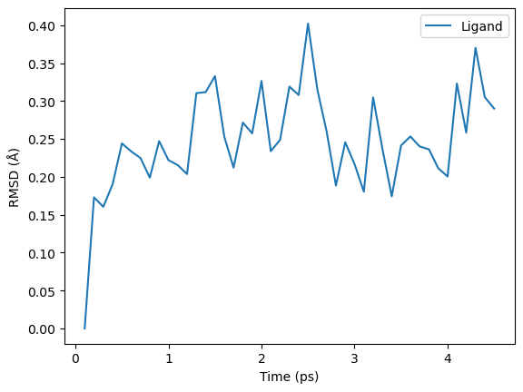
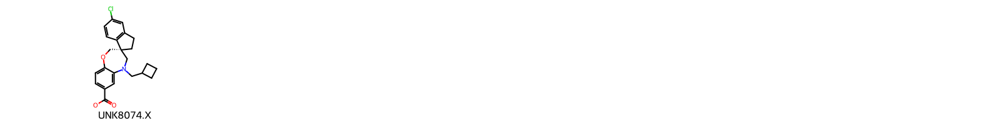
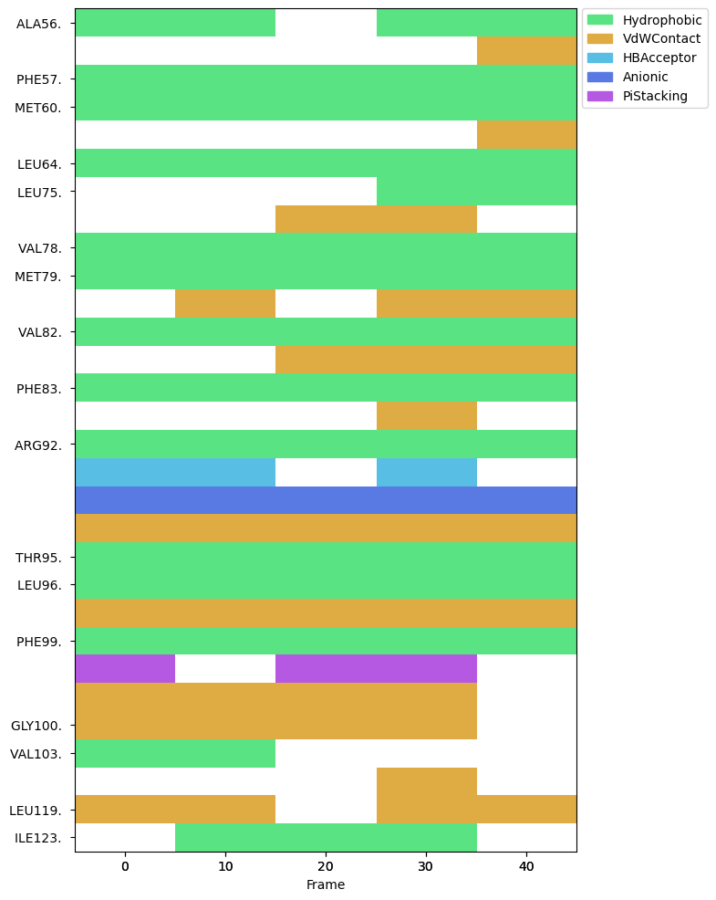

# Parameterisation, Molecular Dynamics, and Trajectory Analysis of a Protein-Ligand Complex with OpenFF, OpenMM, and MDTraj

Note: This is heavily lifted from the [toolkit showcase](https://docs.openforcefield.org/en/latest/examples/openforcefield/openff-toolkit/toolkit_showcase/toolkit_showcase.html) example.

This notebook demonstrates how to prepare a system that combines solvent, a ligand using Sage, and a protein using a standard Amber force field. We'll take the structures of the MCL-1 and the bound ligand from the crystal structure (TODO: ADD and prepare), but we could just as easily use a ligand pose from docking. We'll solvate the complex, assemble the system, parameterise it, and finally simulate it with OpenMM and visualize the results, all without leaving the notebook. Have fun!

## The plan:

| Action | Software|
|--|--|
| Assemble the topology | OpenFF Toolkit
| Visualize the complex | OpenFF Toolkit and NGLView
| Parametrize the complex | OpenFF Toolkit and OpenFF Interchange
| Simulate the complex | OpenMM
| Visualize the simulation | NGLView and MDTraj


TODO: Add outline with clickable sections and clear workflow, clearly acknowledge where/ who material was taken from (mainly previous workshop), add jupyter cheat sheet...

TODO: Format the boxes consistently with the last tutorial

TODO: Add a load of exercises

## 1. We Can Visualise the Protein and Ligand with NGLView

We'll be using the MCL-1 complex with PDBID `6o6f`. This is a common system for benchmarking protein-ligand binding free energy calcalulations and features in the [protein-ligand benchmark set hosted by OpenFF](https://github.com/openforcefield/protein-ligand-benchmark).

As we've already covered structure preparation, we provide pre-prepared protein and ligand structures in the `structures` directory. These are ready for simulation:

- Their co-ordinates are super-imposable (and there are no clashes between waters and the ligand)
- Hydrogens have been added to protein and crystallographic waters consistent with pH 7
- The protein's termini have been capped where appropriate to prevent unphysical charges
- A missing residue in the middle of the chain has been added
- The protein has been solvated and 150 mM NaCl added
- The overall system is neutral

If you'd like more information on how this was done, check out `structures/README.md`.


```python
receptor_path = "../structures/6o6f_protein_solvated.pdb"
ligand_path = "../structures/6o6f_ligand.sdf"
```

We can visualize each structure using the [NGLView] widget. These visualizations are interactive; rotate by dragging the left mouse button, pan with the right mouse button, and zoom with the scroll wheel. You can also mouse over an atom to see its details, and click an atom to center the view on it. When you mouse over the widget, a full screen button will appear in its top right corner.

[NGLView]: https://github.com/nglviewer/nglview


```python
import nglview

view = nglview.show_structure_file(ligand_path)
view
```


    


    /opt/conda/envs/openff-env/lib/python3.12/site-packages/nglview/__init__.py:12: UserWarning: pkg_resources is deprecated as an API. See https://setuptools.pypa.io/en/latest/pkg_resources.html. The pkg_resources package is slated for removal as early as 2025-11-30. Refrain from using this package or pin to Setuptools<81.
      import pkg_resources


    NGLWidget()


<div class="alert alert-info" style="max-width: 700px; margin-left: auto; margin-right: auto;">
    ℹ️ Try replacing <code>ligand_path</code> with <code>receptor_path</code> to visualize the protein!
</div>


## 2. OpenFF Toolkit Allows Us to Assemble the Topology

Conceptually, this step involves putting together the positions of all of the components of the system. We'll create  a [`Topology`] to keep track of the contents of our system. As discussed in this morning's session, `Topology` represents a collection of molecules; it doesn't have any association with any force field parameters.

[`Topology`]: https://docs.openforcefield.org/projects/toolkit/en/stable/api/generated/openff.toolkit.topology.Topology.html

First, we'll load the ligand and receptor into OpenFF Toolkit [`Molecule`] objects, which keep track of all their chemical information. As discussed previously, `Molecule` represents a collection of atoms with specified formal charges, connected by bonds with specified bond orders, optionally including any number of conformer coordinates. This is intended to closely align with a chemist's intuitive understanding of a molecule, rather than simply wrap the minimal information needed for a calculation.

SDF files include all a molecule's bond orders and formal charges, as well as coordinates, so they're ideal as a format for distributing small molecules. And that's exactly the format the ligand is stored in!

[`Molecule`]: https://docs.openforcefield.org/projects/toolkit/en/stable/api/generated/openff.toolkit.topology.Molecule.html


```python
from openff.toolkit import Molecule

# Load a molecule from a SDF file
ligand = Molecule.from_file(ligand_path)

# Print out a SMILES code for the ligand
print(ligand.to_smiles(explicit_hydrogens=False))

# Visualize the molecule
ligand.visualize(show_all_hydrogens=False)
```

    O=C([O-])c1ccc2c(c1)N(CC1CCC1)C[C@@]1(CCc3cc(Cl)ccc31)CO2


    

    


Conventionally, SDF files are used for ligands and PDB files are used for proteins. The toolkit loads polymers (including biopolymers such as proteins) via PDB files by inferring chemical information from the file and a known dictionary of common residues (and water, and ions). To do this, we'll use `Topology.from_pdb`


```python
from openff.toolkit import Topology

topology = Topology.from_pdb(receptor_path)

# Note that we have box vectors:
print(topology.box_vectors)
```

    [[6.5199 0.0 0.0] [0.0 6.5199 0.0] [0.0 0.0 6.5199]] nanometer


We can add the ligand `Molecule` to the topology created from the protein PDB file.


```python
topology.add_molecule(ligand)
```


    7923


Now that we've assembled our topology, we can save it to disk. We can use JSON for this, which makes it human readable in a pinch. This stores everything we've just assembled - molecular identities, conformers, box vectors, and everything else. The topology can then be loaded later on with the [`Topology.from_json()`] method. This is great for running the same system through different force fields, distribution with a paper, or for assembling systems in stages.

[`Topology.from_json()`]: https://docs.openforcefield.org/projects/toolkit/en/stable/api/generated/openff.toolkit.topology.Topology.html#openff.toolkit.topology.Topology.from_json


```python
with open("topology.json", "w") as f:
    print(topology.to_json(), file=f)
```

To visualize inside the notebook, we'll use `Topology.visualize`, which uses NGLview under the hood. NGLview supports a wide variety of [molecular visualization methods], as well as a VMD-like [atom selection language]. This can be used to visualize complex systems like this one.

The widget consists of a minimally documented [Python library frontend] and an extensively documented [JavaScript backend]. You'll need to refer to the documentation for both to do anything sophisticated, as the Python code delegates most of its options and functionality to the JS code.

By default, the toolkit attemps to draw some components with special representations:
* Waters: [line](https://nglviewer.org/ngl/api/manual/molecular-representations.html#line)
* Ions: [spacefill](https://nglviewer.org/ngl/api/manual/molecular-representations.html#spacefill)
* Proteins: [cartoon](https://nglviewer.org/ngl/api/manual/molecular-representations.html#cartoon)

Everything else (i.e. unrecognized ligands) are drawn with the [licorice](https://nglviewer.org/ngl/api/manual/molecular-representations.html#licorice) representation, which is basically a ball+stick model. A box representing the periodic boundary conditions is also added.

[molecular visualization methods]: https://nglviewer.org/ngl/api/manual/molecular-representations.html
[atom selection language]: https://nglviewer.org/ngl/api/manual/selection-language.html
[Python library frontend]: https://nglviewer.org/nglview/latest/api.html
[JavaScript backend]: https://nglviewer.org/ngl/api/manual/index.html


```python
view = topology.visualize()

# can make further modifications to this representation object, or just look at it
view
```


    NGLWidget()


<div class="alert alert-info" style="max-width: 700px; margin-left: auto; margin-right: auto;">
ℹ️ Have a play with this visualization! Try clearing the default representations with <code>view.clear()</code> and configuring your own cartoon <em>(Hint: <a href=https://nglviewer.org/nglview/latest/api.html#nglview.NGLWidget>Check</a> the <a href=https://nglviewer.org/ngl/api/manual/molecular-representations.html>docs</a>)</em>. See if you can display the ligand in a way you like. When you're happy with what you've made, save the image with <code>view.download_image()</code>
</div>

## 3. We Can Assemble a Combined `ForceField` and use this to Parameterise the Whole System

Now that we've prepared our co-ordinates, we should choose the force field. For now, we don't have any single SMIRNOFF force field that can handle both proteins and small molecules; the Rosemary 3.0.0 force field will support this, but it's not yet ready. As an alternative, we'll combine the [Sage] small molecule force field with the SMIRNOFF port of Amber ff14SB. These force fields parameterise non-bonded parameters in similar ways and with the same functional form, so we don't expect any outrageous artifacts, but they also haven't been carefully tested together (TODO: Still true?). Note that Sage also includes the TIP3P water model, which is appropriate for Amber ff14SB too.

When we combine multiple SMIRNOFF force fields into one, we provide them in an order from general to specific. Sage includes parameters that could be applied to a protein, but they're general across all molecules; ff14SB's parameters are specific to proteins. Since the Toolkit always applies the last parameters that match a moiety, this order makes sure the right parameters get assigned.

[Sage]: https://openforcefield.org/force-fields/force-fields/#sage

<div class="alert alert-warning" style="max-width: 700px; margin-left: auto; margin-right: auto;">
    🚧 <b> This code is not production-ready</b><br />
The Amber ff14SB port is intended as a proof-of-concept for SMIRNOFF protein force fields. It may not precisely match the energetics or forces of the original ff14SB, and it may not be appropriate in combination with Sage. Wait for protein support in the Rosemary force field to use this in production. 
</div>


```python
from openff.toolkit import ForceField

# Assemble the combined force field
sage_ff14sb = ForceField("openff-2.2.1.offxml", "ff14sb_off_impropers_0.0.3.offxml")
```

We now have a `Topology`, which stores the chemical information of the system, and a `ForceField`, which maps chemistry to force field parameters. To parametrize the system, we combine these two objects into an [`Interchange`], as discussed in this morning's session.

An `Interchange` represents a completely parametrized molecular mechanics system. Partial charges are computed here according to the instructions in the force field, and this is where virtual sites required by the force field will be introduced. This all happens behind the scenes; all we have to do is combine an abstract chemical description with a force field. This makes it easy to change water model or force field, as the chemistry being modelled is completely independent of the model itself.

[`Interchange`]: https://docs.openforcefield.org/projects/interchange/en/stable/_autosummary/openff.interchange.components.interchange.Interchange.html


```python
interchange = sage_ff14sb.create_interchange(topology)
```

*(This should take about a minute, largely because of the complexity of the Amber protein force field port. In the future, this should be faster.)*

While that runs, let's recap. We've constructed a `Topology` out of a number of `Molecule` objects, each of which represents a particular chemical independent of any model details. The `Topology` then represents an entire chemical system, which in theory could be modelled in any number of ways. Our `Topology` also includes atom positions and box vectors, but if we thought that was too concrete for our use case we could leave them out and add them after parametrization.

Separately, we've constructed a `ForceField` by combining a general SMIRNOFF force field with a protein-specific SMIRNOFF force field. A SMIRNOFF force field is a bunch of rules for applying force field parameters to chemicals via SMARTS patterns. The force field includes everything needed to compute an energy: parameters, charges, functional forms, non-bonded methods and cutoffs, virtual sites, and so on.

Then, we've parametrized our `Topology` with our `ForceField` to produce an `Interchange`. This applies all our rules and gives us a system ready to simulate. An `Interchange` can also concretely define positions, velocities, and box vectors, whether they come from the `Topology` or are added after parametrization. Once we have the `Interchange`, we can produce input data for any of the supported MM engines.

This clear delineation makes benchmarking the same system against different force fields or the same force field against different force fields easy. The SMIRNOFF format makes distributing force fields in an engine agnostic way possible. Everything is an open standard or written in open source Python, so we can see how it works and even change it if we need to.

## 3 We can Simulate the Dynamics of the Complex with OpenMM

To use an `Interchange`, we need to convert it to the input expected by a particular molecular mechanics engine. We'll use OpenMM, because its support is the most mature and the fastest, but GROMACS, LAMMPS, and Amber all enjoy [preliminary support]. (TODO: Still preliminary?)

All that remains is to tell OpenMM the details about how we want to integrate and record data for the simulation, and then to put everything together and run it! The steps are:

1. Configure and run the simulation
1. Minimise the combined system
1. Run a short simulation
1. Visualise the trajectory

[preliminary support]: https://docs.openforcefield.org/projects/interchange/en/stable/using/output.html

### 3.1 Configure and run the simulation

Here, we'll use a Langevin thermostat at 300 Kelvin and a 2 fs time step. We'll write the structure to disk every 10 steps.


```python
import openmm

# Construct and configure a Langevin integrator at 300 K with an appropriate friction constant and time-step
integrator = openmm.LangevinIntegrator(
    300 * openmm.unit.kelvin,
    1 / openmm.unit.picosecond,
    0.002 * openmm.unit.picoseconds,
)

# Under the hood, this creates *OpenMM* `System` and `Topology` objects, then combines them together
simulation = interchange.to_openmm_simulation(integrator=integrator)

# Add a reporter to record the structure every 50 steps
dcd_reporter = openmm.app.DCDReporter("trajectory.dcd", 50)
pdb_reporter = openmm.app.PDBReporter("trajectory.pdb", 50)
simulation.reporters.append(dcd_reporter)
```

### 3.2 Minimise the combined system

This will reduce any forces that are too large to integrate, such as from clashes or from disagreements between the crystal structure and force field.


```python
import numpy as np

def describe_state(state: openmm.State, name: str = "State"):
    max_force = max(np.sqrt(v.x**2 + v.y**2 + v.z**2) for v in state.getForces())
    print(
        f"{name} has energy {round(state.getPotentialEnergy()._value, 2)} kJ/mol "
        f"with maximum force {round(max_force, 2)} kJ/(mol nm)"
    )


describe_state(
    simulation.context.getState(
        getEnergy=True,
        getForces=True,
    ),
    "Original state",
)

simulation.minimizeEnergy()

describe_state(
    simulation.context.getState(getEnergy=True, getForces=True),
    "Minimized state",
)
```

    Original state has energy 14441310.99 kJ/mol with maximum force 1367210431.91 kJ/(mol nm)


    Minimized state has energy -436096.76 kJ/mol with maximum force 2441.29 kJ/(mol nm)


### 3.3 Run a short simulation

If this were anything more than a demonstration of the Toolkit, this example would need to include additional steps like equilibration. 

<div class="alert alert-warning" style="max-width: 700px; margin-left: auto; margin-right: auto;">
⚠️ Make sure you use your own, valid simulation protocol! This is just an example.
</div>


```python
simulation.context.setVelocitiesToTemperature(300 * openmm.unit.kelvin)
simulation.runForClockTime(1.0 * openmm.unit.minute)
```

_(This'll take a minute - literally, this time)_

While that runs, let's talk a bit about OpenFF (TODO: Link to discussion of OpenFF from previous notebook and remove this?)

### Open Source Force Fields

A primary goal of the Open Force Field Initiative is to make development and use of force fields as open as possible - it's in our name! We believe that open source development practices have a lot to offer the scientific community, whether that science is academic, commercial, or hobbyist.

#### The SMIRNOFF specification

The SMIRNOFF specification describes a simple format for describing molecular force fields. We provide and maintain this spec in the hopes that it will allow scientists everywhere to contribute to force field development in a unified way, without taking them away from their favourite simulation package.

SMIRNOFF is not just a spec; we're also committed to a reference implementation — that being the OpenFF Toolkit. The Toolkit endeavors to support all the functional forms in both the SMIRNOFF spec and the [`openff-forcefields`](https://github.com/openforcefield/openff-forcefields/) package.

#### Reproducibility

OpenFF force fields are completely specified by the name of the distributed `.offxml` file. We use codenames, version numbers, and tags to accomplish this. This means that as long as a user, designer, or reviewer sees the name of the force field being used, they know exactly what is going in to that simulation. We include parameters that are often neglected in force field specifications, such as the non-bonded cut-off distance, ewald methods, constraints, modifications to the Lennard-Jones function, and partial charge generation methods are all defined by the name of the force field. 

As much as possible, we want energy and force to be a deterministic output of combining a molecule and a force field. If an author provides the name of the force field in their methods section, it should be reproducible. The other side of this coin is that we never want to hide the force field from the user. In all our workflows, the name of the force field must be explicitly provided in the code. This improves reproducibility of the code and helps the user take responsibility for their results. 

#### "Plugin" support for new force fields

The OpenFF Toolkit supports distributing force field files (.offxml) through Conda data packages. Anyone can publish a package on Conda Forge that extends the list of directories the toolkit searches for force fields, allowing anyone to produce force fields without requiring their own tooling, in a format that is designed to be converted to a multitude of simulation packages. See the [FAQ](https://open-forcefield-toolkit.readthedocs.io/en/stable/faq.html#how-can-i-distribute-my-own-force-fields-in-smirnoff-format) for more details.

---

Right! Simulation should be done by now, let's take a look.

### 3.4 Visualize the simulation with nglview

NGLView can display single structures and entire trajectories. Mouse over the widget to see the animation controls.

<div class="alert alert-warning" style="max-width: 700px; margin-left: auto; margin-right: auto;">
    ❓ Can you visualize this trajectory in VMD (or another visualization tool of your choice)? Hint: DCD files only include the trajectory data (positions of each atoms over time) and lack topological information, so you might need another file.
</div>


```python
import MDAnalysis as mda

u = mda.Universe(interchange.to_openmm_topology(), "trajectory.dcd")

view = nglview.show_mdanalysis(u)
view.add_representation("line", selection="protein")
view
```

    /opt/conda/envs/openff-env/lib/python3.12/site-packages/MDAnalysis/coordinates/DCD.py:165: DeprecationWarning: DCDReader currently makes independent timesteps by copying self.ts while other readers update self.ts inplace. This behavior will be changed in 3.0 to be the same as other readers. Read more at https://github.com/MDAnalysis/mdanalysis/issues/3889 to learn if this change in behavior might affect you.
      warnings.warn("DCDReader currently makes independent timesteps"


    NGLWidget(max_frame=44)


<div class="alert alert-info" style="max-width: 700px; margin-left: auto; margin-right: auto;">
ℹ️ MDTraj is a great library for analysis. Check out the <a href=https://mdtraj.org/1.9.4/api/generated/mdtraj.Trajectory.html>docs</a> for the <code>Trajectory</code> object you just created, as well as their <a href=https://mdtraj.org/1.9.4/analysis.html>analysis functions</a>, and see if you can compute something interesting. Its real superpower is that it provides the coordinates of the trajectory as a <a href=https://numpy.org/doc/stable/reference/generated/numpy.array.html>NumPy array</a>, so if you're really keen try computing something directly from <code>mdt_traj.xyz</code>
</div>

## 4. MDAnalysis and ProLIF Enable Analysis of Pose Stability and Protein-Ligand Interactions

[`MDAnalysis`](https://www.mdanalysis.org/) is an excellent package (and an alternative to `MDTraj`) for the analysis of simulation data. [`ProLIF`](https://prolif.readthedocs.io/en/stable/) is a handy tool for computing protein-ligand interaction fingerprints based on `MDAnalysis` and the [`RDKit`](https://www.rdkit.org/docs/index.html). We'll demonstrate the use of each to perform some analyses specific to protein-ligand complexes. In particular, we'll analyse:

1. Binding pose stability
1. Protein-ligand interactions

### 4.1 Binding pose stability

RMSDs can tell us about the stability of our binding pose. We can calculate the RMSD of the ligand using `MDAnalysis`:


```python
from MDAnalysis.analysis import rms
import pandas as pd

# Define selection strings for the ligand and the binding pocket residues
LIGAND = "resname UNK"
POCKET_RESIDUES = "protein and byres around 10.0 resname UNK"

# Compute the RMSD of the ligand aligned to itself
R = rms.RMSD(u,  # universe to align
             u,  # reference universe or atomgroup
             select=LIGAND,  # group to superimpose and calculate RMSD
             ref_frame=0)  # frame index of the reference
R.run()

# Convert the results to a pandas DataFrame for easier handling
df = pd.DataFrame(R.results.rmsd,
                  columns=['Frame', 'Time (ps)', 'Ligand'])

# Plot
ax = df.plot(x='Time (ps)', y='Ligand', kind='line')
ax.set_ylabel(r'RMSD (Å)')
```


    Text(0, 0.5, 'RMSD (Å)')


    

    


<div class="alert alert-success" style="max-width: 500px; margin-left: auto; margin-right: auto; border-left: 6px solid #5cb85c; background-color: #f1fff1;">
    ✏️ <b>Exercise:</b> Does the RMSD suggest any distinct ligand conformational states? Can you identify what these states correspond to from the trajectory?
</div>

<div class="alert alert-warning" style="max-width: 700px; margin-left: auto; margin-right: auto;">
⚠️ The above analysis tells us about ligand conformation, but is missing key information about pose stability.
</div>

<div class="alert alert-success" style="max-width: 500px; margin-left: auto; margin-right: auto; border-left: 6px solid #5cb85c; background-color: #f1fff1;">
    ✏️ <b>Exercise:</b> Why is the above analysis not sufficient for determining pose stability? (Hint: what would happen if a rigid ligand drifted out of the binding site?) Can you modify the code above to compute an RMSD which is more informative about binding pose stability? (Hint: think about the alignment reference. You can specify additional groups which are used to calculate RMSD but not to align the trajectory -- have a look at the <a href="https://userguide.mdanalysis.org/stable/examples/analysis/alignment_and_rms/rmsd.html">MDAnalysis RMSD tutorial</a>. You might want to use the <code>POCKET_RESIDUES</code> selection string.) When would you expect this new RMSD to be similar or different to the RMSD computed above?
</div>


```python
# Add code to compute an RMSD which is more informative about binding pose stability
```

<div class="alert alert-warning" style="max-width: 700px; margin-left: auto; margin-right: auto;">
⚠️ Be careful when interpreting RMSDs. A low RMSD is highly informative because it tells you the relevant structure is very similar to your reference, and there are few ways to be similar; a high RMSD is much less informative because it tells you the structures are different, and there are many ways to be different. <a href=https://pubs.acs.org/doi/10.1021/jp412776d>We should take care when interpreting stable high-RMSD conformations as well-defined stable states</a>. <a href="https://pubs.acs.org/doi/10.1021/acs.jctc.7b00028">The interpretation of RMSD may also be affected by molecular size</a>. 
</div>

### 4.2 Protein-Ligand Interactions

Let's analyse the protein-ligand interactions with `ProLIF`. This section is adapted from the [ProLIF tutorial](https://prolif.readthedocs.io/en/stable/notebooks/md-ligand-protein.html#ligand-protein-md) -- check it out for more analyses. First, let's select the ligand and binding site residues:


```python
import prolif as plf

# create selections for the ligand and protein
ligand_selection = u.select_atoms(LIGAND)
protein_selection = u.select_atoms(POCKET_RESIDUES)
ligand_selection, protein_selection
```

    /opt/conda/envs/openff-env/lib/python3.12/site-packages/MDAnalysis/topology/tables.py:52: DeprecationWarning: Deprecated in version 2.8.0
    MDAnalysis.topology.tables has been moved to MDAnalysis.guesser.tables. This import point will be removed in MDAnalysis version 3.0.0
      warnings.warn(wmsg, category=DeprecationWarning)


    (<AtomGroup with 51 atoms>, <AtomGroup with 1129 atoms>)


... and visualise them:


```python
# create a molecule from the MDAnalysis selection
ligand_mol = plf.Molecule.from_mda(ligand_selection)
# display
plf.display_residues(ligand_mol, size=(400, 200))
```


    

    


```python
protein_mol = plf.Molecule.from_mda(protein_selection)
# remove the `slice(20)` part to show all residues
plf.display_residues(protein_mol, slice(20))
```


    

    


Now, let's calculate the interaction fingerprint using every 10th frame and specifying `count=True` to keep track of all interations (not just the first group of atoms that satisfied the constraints per interaction type and residue pair).

<div class="alert alert-info" style="max-width: 700px; margin-left: auto; margin-right: auto;">
    ℹ️ You may want to adjust the frame frequency depending on how many frames you generated.
</div>


```python
# use default interactions
fp = plf.Fingerprint(count=True)
# run on a slice of the trajectory frames: from begining to end with a step of 10
FRAME_FREQUENCY = 10 # Adjust this value as needed
fp.run(u.trajectory[::FRAME_FREQUENCY], ligand_selection, protein_selection)
```


      0%|          | 0/5 [00:00<?, ?it/s]


    <prolif.fingerprint.Fingerprint: 9 interactions: ['Hydrophobic', 'HBAcceptor', 'HBDonor', 'Cationic', 'Anionic', 'CationPi', 'PiCation', 'PiStacking', 'VdWContact'] at 0x7fb6efc6f080>


`ProLIF` provides handy functions to display interactions over time, and to visualise the interactions in 2D and 3D!


```python
# Display interactions over time
fp.plot_barcode()
```


    <Axes: xlabel='Frame'>


    

    


```python
# Plot the interactions in 2D
vis = fp.plot_lignetwork(ligand_mol)
vis
```


<iframe width="100%" height="590px" frameborder="0" srcdoc="
        &lt;html&gt;
        &lt;head&gt;
        &lt;script type=&quot;text/javascript&quot; src=&quot;https://unpkg.com/vis-network@9.0.4/dist/vis-network.min.js&quot;&gt;&lt;/script&gt;
        &lt;link href=&quot;https://unpkg.com/vis-network@9.0.4/dist/dist/vis-network.min.css&quot; rel=&quot;stylesheet&quot; type=&quot;text/css&quot; /&gt;
        &lt;style type=&quot;text/css&quot;&gt;
            body {
                padding: 0;
                margin: 0;
                background: #fff;
            }
            .legend-btn.residues.disabled {
                background: #b4b4b4 !important;
                color: #555 !important;
            }
            .legend-btn.interactions.disabled {
                border-color: #b4b4b4 !important;
                color: #555 !important;
            }
        &lt;/style&gt;
        &lt;/head&gt;
        &lt;body&gt;
        &lt;div id=&quot;mynetwork&quot;&gt;&lt;/div&gt;
        &lt;div id=&quot;networklegend&quot;&gt;&lt;/div&gt;
        &lt;script type=&quot;text/javascript&quot;&gt;

        var ifp, legend, nodes, edges, legend_buttons;
        function drawGraph(_id, nodes, edges, options) {
            var container = document.getElementById(_id);
            nodes = new vis.DataSet(nodes);
            edges = new vis.DataSet(edges);
            var data = {nodes: nodes, edges: edges};
            var network = new vis.Network(container, data, options);
            network.on(&quot;stabilizationIterationsDone&quot;, function () {
                network.setOptions( { physics: false } );
            });
            return network;
        }
        nodes = [{&quot;id&quot;: &quot;ALA56. &quot;, &quot;label&quot;: &quot;ALA56. &quot;, &quot;color&quot;: &quot;#59e382&quot;, &quot;shape&quot;: &quot;box&quot;, &quot;borderWidth&quot;: 0, &quot;physics&quot;: true, &quot;mass&quot;: 2, &quot;group&quot;: &quot;protein&quot;, &quot;residue_type&quot;: &quot;Aliphatic&quot;}, {&quot;id&quot;: &quot;ARG92. &quot;, &quot;label&quot;: &quot;ARG92. &quot;, &quot;color&quot;: &quot;#5979e3&quot;, &quot;shape&quot;: &quot;box&quot;, &quot;borderWidth&quot;: 0, &quot;physics&quot;: true, &quot;mass&quot;: 2, &quot;group&quot;: &quot;protein&quot;, &quot;residue_type&quot;: &quot;Basic&quot;}, {&quot;id&quot;: &quot;GLY100. &quot;, &quot;label&quot;: &quot;GLY100. &quot;, &quot;color&quot;: &quot;#59e382&quot;, &quot;shape&quot;: &quot;box&quot;, &quot;borderWidth&quot;: 0, &quot;physics&quot;: true, &quot;mass&quot;: 2, &quot;group&quot;: &quot;protein&quot;, &quot;residue_type&quot;: &quot;Aliphatic&quot;}, {&quot;id&quot;: &quot;ILE123. &quot;, &quot;label&quot;: &quot;ILE123. &quot;, &quot;color&quot;: &quot;#59e382&quot;, &quot;shape&quot;: &quot;box&quot;, &quot;borderWidth&quot;: 0, &quot;physics&quot;: true, &quot;mass&quot;: 2, &quot;group&quot;: &quot;protein&quot;, &quot;residue_type&quot;: &quot;Aliphatic&quot;}, {&quot;id&quot;: &quot;LEU119. &quot;, &quot;label&quot;: &quot;LEU119. &quot;, &quot;color&quot;: &quot;#59e382&quot;, &quot;shape&quot;: &quot;box&quot;, &quot;borderWidth&quot;: 0, &quot;physics&quot;: true, &quot;mass&quot;: 2, &quot;group&quot;: &quot;protein&quot;, &quot;residue_type&quot;: &quot;Aliphatic&quot;}, {&quot;id&quot;: &quot;LEU64. &quot;, &quot;label&quot;: &quot;LEU64. &quot;, &quot;color&quot;: &quot;#59e382&quot;, &quot;shape&quot;: &quot;box&quot;, &quot;borderWidth&quot;: 0, &quot;physics&quot;: true, &quot;mass&quot;: 2, &quot;group&quot;: &quot;protein&quot;, &quot;residue_type&quot;: &quot;Aliphatic&quot;}, {&quot;id&quot;: &quot;LEU75. &quot;, &quot;label&quot;: &quot;LEU75. &quot;, &quot;color&quot;: &quot;#59e382&quot;, &quot;shape&quot;: &quot;box&quot;, &quot;borderWidth&quot;: 0, &quot;physics&quot;: true, &quot;mass&quot;: 2, &quot;group&quot;: &quot;protein&quot;, &quot;residue_type&quot;: &quot;Aliphatic&quot;}, {&quot;id&quot;: &quot;LEU96. &quot;, &quot;label&quot;: &quot;LEU96. &quot;, &quot;color&quot;: &quot;#59e382&quot;, &quot;shape&quot;: &quot;box&quot;, &quot;borderWidth&quot;: 0, &quot;physics&quot;: true, &quot;mass&quot;: 2, &quot;group&quot;: &quot;protein&quot;, &quot;residue_type&quot;: &quot;Aliphatic&quot;}, {&quot;id&quot;: &quot;MET60. &quot;, &quot;label&quot;: &quot;MET60. &quot;, &quot;color&quot;: &quot;#e3ce59&quot;, &quot;shape&quot;: &quot;box&quot;, &quot;borderWidth&quot;: 0, &quot;physics&quot;: true, &quot;mass&quot;: 2, &quot;group&quot;: &quot;protein&quot;, &quot;residue_type&quot;: &quot;Sulfur&quot;}, {&quot;id&quot;: &quot;MET79. &quot;, &quot;label&quot;: &quot;MET79. &quot;, &quot;color&quot;: &quot;#e3ce59&quot;, &quot;shape&quot;: &quot;box&quot;, &quot;borderWidth&quot;: 0, &quot;physics&quot;: true, &quot;mass&quot;: 2, &quot;group&quot;: &quot;protein&quot;, &quot;residue_type&quot;: &quot;Sulfur&quot;}, {&quot;id&quot;: &quot;PHE57. &quot;, &quot;label&quot;: &quot;PHE57. &quot;, &quot;color&quot;: &quot;#b559e3&quot;, &quot;shape&quot;: &quot;box&quot;, &quot;borderWidth&quot;: 0, &quot;physics&quot;: true, &quot;mass&quot;: 2, &quot;group&quot;: &quot;protein&quot;, &quot;residue_type&quot;: &quot;Aromatic&quot;}, {&quot;id&quot;: &quot;PHE83. &quot;, &quot;label&quot;: &quot;PHE83. &quot;, &quot;color&quot;: &quot;#b559e3&quot;, &quot;shape&quot;: &quot;box&quot;, &quot;borderWidth&quot;: 0, &quot;physics&quot;: true, &quot;mass&quot;: 2, &quot;group&quot;: &quot;protein&quot;, &quot;residue_type&quot;: &quot;Aromatic&quot;}, {&quot;id&quot;: &quot;PHE99. &quot;, &quot;label&quot;: &quot;PHE99. &quot;, &quot;color&quot;: &quot;#b559e3&quot;, &quot;shape&quot;: &quot;box&quot;, &quot;borderWidth&quot;: 0, &quot;physics&quot;: true, &quot;mass&quot;: 2, &quot;group&quot;: &quot;protein&quot;, &quot;residue_type&quot;: &quot;Aromatic&quot;}, {&quot;id&quot;: &quot;THR95. &quot;, &quot;label&quot;: &quot;THR95. &quot;, &quot;color&quot;: &quot;#59bee3&quot;, &quot;shape&quot;: &quot;box&quot;, &quot;borderWidth&quot;: 0, &quot;physics&quot;: true, &quot;mass&quot;: 2, &quot;group&quot;: &quot;protein&quot;, &quot;residue_type&quot;: &quot;Polar&quot;}, {&quot;id&quot;: &quot;VAL103. &quot;, &quot;label&quot;: &quot;VAL103. &quot;, &quot;color&quot;: &quot;#59e382&quot;, &quot;shape&quot;: &quot;box&quot;, &quot;borderWidth&quot;: 0, &quot;physics&quot;: true, &quot;mass&quot;: 2, &quot;group&quot;: &quot;protein&quot;, &quot;residue_type&quot;: &quot;Aliphatic&quot;}, {&quot;id&quot;: &quot;VAL78. &quot;, &quot;label&quot;: &quot;VAL78. &quot;, &quot;color&quot;: &quot;#59e382&quot;, &quot;shape&quot;: &quot;box&quot;, &quot;borderWidth&quot;: 0, &quot;physics&quot;: true, &quot;mass&quot;: 2, &quot;group&quot;: &quot;protein&quot;, &quot;residue_type&quot;: &quot;Aliphatic&quot;}, {&quot;id&quot;: &quot;VAL82. &quot;, &quot;label&quot;: &quot;VAL82. &quot;, &quot;color&quot;: &quot;#59e382&quot;, &quot;shape&quot;: &quot;box&quot;, &quot;borderWidth&quot;: 0, &quot;physics&quot;: true, &quot;mass&quot;: 2, &quot;group&quot;: &quot;protein&quot;, &quot;residue_type&quot;: &quot;Aliphatic&quot;}, {&quot;id&quot;: &quot;centroid(UNK8074.X, PHE99. , PiStacking)&quot;, &quot;x&quot;: 39.57674973805746, &quot;y&quot;: 75.95924945274989, &quot;shape&quot;: &quot;text&quot;, &quot;label&quot;: &quot; &quot;, &quot;fixed&quot;: true, &quot;physics&quot;: false, &quot;group&quot;: &quot;ligand&quot;}, {&quot;label&quot;: &quot;Cl&quot;, &quot;shape&quot;: &quot;circle&quot;, &quot;color&quot;: &quot;white&quot;, &quot;font&quot;: {&quot;color&quot;: &quot;lime&quot;}, &quot;id&quot;: 0, &quot;x&quot;: 100.17575197219848, &quot;y&quot;: 111.23924740552901, &quot;fixed&quot;: true, &quot;group&quot;: &quot;ligand&quot;, &quot;borderWidth&quot;: 0}, {&quot;label&quot;: &quot;O&quot;, &quot;shape&quot;: &quot;circle&quot;, &quot;color&quot;: &quot;white&quot;, &quot;font&quot;: {&quot;color&quot;: &quot;red&quot;}, &quot;id&quot;: 1, &quot;x&quot;: -76.07725400924681, &quot;y&quot;: -147.2217496037483, &quot;fixed&quot;: true, &quot;group&quot;: &quot;ligand&quot;, &quot;borderWidth&quot;: 0}, {&quot;label&quot;: &quot;O-&quot;, &quot;shape&quot;: &quot;ellipse&quot;, &quot;color&quot;: &quot;white&quot;, &quot;font&quot;: {&quot;color&quot;: &quot;red&quot;}, &quot;id&quot;: 2, &quot;x&quot;: -16.535250377655025, &quot;y&quot;: -135.6997449040413, &quot;fixed&quot;: true, &quot;group&quot;: &quot;ligand&quot;, &quot;borderWidth&quot;: 0}, {&quot;label&quot;: &quot;O&quot;, &quot;shape&quot;: &quot;circle&quot;, &quot;color&quot;: &quot;white&quot;, &quot;font&quot;: {&quot;color&quot;: &quot;red&quot;}, &quot;id&quot;: 3, &quot;x&quot;: -79.64025144577025, &quot;y&quot;: 12.553249728679658, &quot;fixed&quot;: true, &quot;group&quot;: &quot;ligand&quot;, &quot;borderWidth&quot;: 0}, {&quot;label&quot;: &quot;N&quot;, &quot;shape&quot;: &quot;circle&quot;, &quot;color&quot;: &quot;white&quot;, &quot;font&quot;: {&quot;color&quot;: &quot;blue&quot;}, &quot;id&quot;: 4, &quot;x&quot;: -4.950250911712642, &quot;y&quot;: -13.19975024461746, &quot;fixed&quot;: true, &quot;group&quot;: &quot;ligand&quot;, &quot;borderWidth&quot;: 0}, {&quot;label&quot;: &quot; &quot;, &quot;shape&quot;: &quot;dot&quot;, &quot;color&quot;: &quot;black&quot;, &quot;size&quot;: 5.6000000000000005, &quot;id&quot;: 5, &quot;x&quot;: -61.20925016403198, &quot;y&quot;: 42.63925007581711, &quot;fixed&quot;: true, &quot;group&quot;: &quot;ligand&quot;, &quot;borderWidth&quot;: 0}, {&quot;label&quot;: &quot; &quot;, &quot;shape&quot;: &quot;dot&quot;, &quot;color&quot;: &quot;black&quot;, &quot;size&quot;: 5.6000000000000005, &quot;id&quot;: 6, &quot;x&quot;: 28.62174978256226, &quot;y&quot;: -32.61774874925613, &quot;fixed&quot;: true, &quot;group&quot;: &quot;ligand&quot;, &quot;borderWidth&quot;: 0}, {&quot;label&quot;: &quot; &quot;, &quot;shape&quot;: &quot;dot&quot;, &quot;color&quot;: &quot;black&quot;, &quot;size&quot;: 5.6000000000000005, &quot;id&quot;: 7, &quot;x&quot;: -0.6102503776550261, &quot;y&quot;: 22.47925060987473, &quot;fixed&quot;: true, &quot;group&quot;: &quot;ligand&quot;, &quot;borderWidth&quot;: 0}, {&quot;label&quot;: &quot; &quot;, &quot;shape&quot;: &quot;dot&quot;, &quot;color&quot;: &quot;black&quot;, &quot;size&quot;: 5.6000000000000005, &quot;id&quot;: 8, &quot;x&quot;: 121.15475282669068, &quot;y&quot;: -29.278751099109645, &quot;fixed&quot;: true, &quot;group&quot;: &quot;ligand&quot;, &quot;borderWidth&quot;: 0}, {&quot;label&quot;: &quot; &quot;, &quot;shape&quot;: &quot;dot&quot;, &quot;color&quot;: &quot;black&quot;, &quot;size&quot;: 5.6000000000000005, &quot;id&quot;: 9, &quot;x&quot;: 69.97075090408325, &quot;y&quot;: 58.67624996900558, &quot;fixed&quot;: true, &quot;group&quot;: &quot;ligand&quot;, &quot;borderWidth&quot;: 0}, {&quot;label&quot;: &quot; &quot;, &quot;shape&quot;: &quot;dot&quot;, &quot;color&quot;: &quot;black&quot;, &quot;size&quot;: 5.6000000000000005, &quot;id&quot;: 10, &quot;x&quot;: -95.34124631881713, &quot;y&quot;: -43.15975238084793, &quot;fixed&quot;: true, &quot;group&quot;: &quot;ligand&quot;, &quot;borderWidth&quot;: 0}, {&quot;label&quot;: &quot; &quot;, &quot;shape&quot;: &quot;dot&quot;, &quot;color&quot;: &quot;black&quot;, &quot;size&quot;: 5.6000000000000005, &quot;id&quot;: 11, &quot;x&quot;: 90.62075090408327, &quot;y&quot;: -46.63175173997879, &quot;fixed&quot;: true, &quot;group&quot;: &quot;ligand&quot;, &quot;borderWidth&quot;: 0}, {&quot;label&quot;: &quot; &quot;, &quot;shape&quot;: &quot;dot&quot;, &quot;color&quot;: &quot;black&quot;, &quot;size&quot;: 5.6000000000000005, &quot;id&quot;: 12, &quot;x&quot;: 103.83674898147584, &quot;y&quot;: 1.052249848842623, &quot;fixed&quot;: true, &quot;group&quot;: &quot;ligand&quot;, &quot;borderWidth&quot;: 0}, {&quot;label&quot;: &quot; &quot;, &quot;shape&quot;: &quot;dot&quot;, &quot;color&quot;: &quot;black&quot;, &quot;size&quot;: 5.6000000000000005, &quot;id&quot;: 13, &quot;x&quot;: -89.23724546432494, &quot;y&quot;: -77.78874789476396, &quot;fixed&quot;: true, &quot;group&quot;: &quot;ligand&quot;, &quot;borderWidth&quot;: 0}, {&quot;label&quot;: &quot; &quot;, &quot;shape&quot;: &quot;dot&quot;, &quot;color&quot;: &quot;black&quot;, &quot;size&quot;: 5.6000000000000005, &quot;id&quot;: 14, &quot;x&quot;: 39.478749942779544, &quot;y&quot;: 40.8682509303093, &quot;fixed&quot;: true, &quot;group&quot;: &quot;ligand&quot;, &quot;borderWidth&quot;: 0}, {&quot;label&quot;: &quot; &quot;, &quot;shape&quot;: &quot;dot&quot;, &quot;color&quot;: &quot;black&quot;, &quot;size&quot;: 5.6000000000000005, &quot;id&quot;: 15, &quot;x&quot;: -23.21325101852417, &quot;y&quot;: 104.81325253248215, &quot;fixed&quot;: true, &quot;group&quot;: &quot;ligand&quot;, &quot;borderWidth&quot;: 0}, {&quot;label&quot;: &quot; &quot;, &quot;shape&quot;: &quot;dot&quot;, &quot;color&quot;: &quot;black&quot;, &quot;size&quot;: 5.6000000000000005, &quot;id&quot;: 16, &quot;x&quot;: 39.814749622344976, &quot;y&quot;: 110.96624783277511, &quot;fixed&quot;: true, &quot;group&quot;: &quot;ligand&quot;, &quot;borderWidth&quot;: 0}, {&quot;label&quot;: &quot; &quot;, &quot;shape&quot;: &quot;dot&quot;, &quot;color&quot;: &quot;black&quot;, &quot;size&quot;: 5.6000000000000005, &quot;id&quot;: 17, &quot;x&quot;: -29.26125059127807, &quot;y&quot;: -67.00875216722487, &quot;fixed&quot;: true, &quot;group&quot;: &quot;ligand&quot;, &quot;borderWidth&quot;: 0}, {&quot;label&quot;: &quot; &quot;, &quot;shape&quot;: &quot;dot&quot;, &quot;color&quot;: &quot;black&quot;, &quot;size&quot;: 5.6000000000000005, &quot;id&quot;: 18, &quot;x&quot;: -44.58425016403198, &quot;y&quot;: 77.27524975538253, &quot;fixed&quot;: true, &quot;group&quot;: &quot;ligand&quot;, &quot;borderWidth&quot;: 0}, {&quot;label&quot;: &quot; &quot;, &quot;shape&quot;: &quot;dot&quot;, &quot;color&quot;: &quot;black&quot;, &quot;size&quot;: 5.6000000000000005, &quot;id&quot;: 19, &quot;x&quot;: -49.69425230026245, &quot;y&quot;: -124.26174746751785, &quot;fixed&quot;: true, &quot;group&quot;: &quot;ligand&quot;, &quot;borderWidth&quot;: 0}, {&quot;label&quot;: &quot; &quot;, &quot;shape&quot;: &quot;dot&quot;, &quot;color&quot;: &quot;black&quot;, &quot;size&quot;: 5.6000000000000005, &quot;id&quot;: 20, &quot;x&quot;: 69.87274866104126, &quot;y&quot;: 93.55725125074386, &quot;fixed&quot;: true, &quot;group&quot;: &quot;ligand&quot;, &quot;borderWidth&quot;: 0}, {&quot;label&quot;: &quot; &quot;, &quot;shape&quot;: &quot;dot&quot;, &quot;color&quot;: &quot;black&quot;, &quot;size&quot;: 5.6000000000000005, &quot;id&quot;: 21, &quot;x&quot;: -68.16725187301635, &quot;y&quot;: -20.486750137805938, &quot;fixed&quot;: true, &quot;group&quot;: &quot;ligand&quot;, &quot;borderWidth&quot;: 0}, {&quot;label&quot;: &quot; &quot;, &quot;shape&quot;: &quot;dot&quot;, &quot;color&quot;: &quot;black&quot;, &quot;size&quot;: 5.6000000000000005, &quot;id&quot;: 22, &quot;x&quot;: -35.31625165939331, &quot;y&quot;: -32.16974917650222, &quot;fixed&quot;: true, &quot;group&quot;: &quot;ligand&quot;, &quot;borderWidth&quot;: 0}, {&quot;label&quot;: &quot; &quot;, &quot;shape&quot;: &quot;dot&quot;, &quot;color&quot;: &quot;black&quot;, &quot;size&quot;: 5.6000000000000005, &quot;id&quot;: 23, &quot;x&quot;: 73.37275133132935, &quot;y&quot;: -16.230750191211698, &quot;fixed&quot;: true, &quot;group&quot;: &quot;ligand&quot;, &quot;borderWidth&quot;: 0}, {&quot;label&quot;: &quot; &quot;, &quot;shape&quot;: &quot;dot&quot;, &quot;color&quot;: &quot;black&quot;, &quot;size&quot;: 5.6000000000000005, &quot;id&quot;: 24, &quot;x&quot;: -56.225248241424545, &quot;y&quot;: -89.80075045824051, &quot;fixed&quot;: true, &quot;group&quot;: &quot;ligand&quot;, &quot;borderWidth&quot;: 0}, {&quot;label&quot;: &quot; &quot;, &quot;shape&quot;: &quot;dot&quot;, &quot;color&quot;: &quot;black&quot;, &quot;size&quot;: 5.6000000000000005, &quot;id&quot;: 25, &quot;x&quot;: 9.308749675750738, &quot;y&quot;: 93.46624783277511, &quot;fixed&quot;: true, &quot;group&quot;: &quot;ligand&quot;, &quot;borderWidth&quot;: 0}, {&quot;label&quot;: &quot; &quot;, &quot;shape&quot;: &quot;dot&quot;, &quot;color&quot;: &quot;black&quot;, &quot;size&quot;: 5.6000000000000005, &quot;id&quot;: 26, &quot;x&quot;: 9.014749622344974, &quot;y&quot;: 58.22124890089035, &quot;fixed&quot;: true, &quot;group&quot;: &quot;ligand&quot;, &quot;borderWidth&quot;: 0}, {&quot;label&quot;: &quot; &quot;, &quot;shape&quot;: &quot;dot&quot;, &quot;color&quot;: &quot;black&quot;, &quot;size&quot;: 5.6000000000000005, &quot;id&quot;: 27, &quot;x&quot;: -25.18024930953979, &quot;y&quot;: 47.7492495417595, &quot;fixed&quot;: true, &quot;group&quot;: &quot;ligand&quot;, &quot;borderWidth&quot;: 0}, {&quot;label&quot;: &quot;H&quot;, &quot;shape&quot;: &quot;circle&quot;, &quot;color&quot;: &quot;white&quot;, &quot;font&quot;: {&quot;color&quot;: &quot;grey&quot;}, &quot;id&quot;: 43, &quot;x&quot;: 39.19175004959107, &quot;y&quot;: 6.148249995708468, &quot;fixed&quot;: true, &quot;group&quot;: &quot;ligand&quot;, &quot;borderWidth&quot;: 0}, {&quot;label&quot;: &quot;H&quot;, &quot;shape&quot;: &quot;circle&quot;, &quot;color&quot;: &quot;white&quot;, &quot;font&quot;: {&quot;color&quot;: &quot;grey&quot;}, &quot;id&quot;: 46, &quot;x&quot;: 39.751749515533454, &quot;y&quot;: 146.0782503962517, &quot;fixed&quot;: true, &quot;group&quot;: &quot;ligand&quot;, &quot;borderWidth&quot;: 0}, {&quot;id&quot;: -6686324317055659449, &quot;x&quot;: -78.83445314106064, &quot;y&quot;: -144.05349252018877, &quot;shape&quot;: &quot;text&quot;, &quot;label&quot;: &quot; &quot;, &quot;fixed&quot;: true, &quot;physics&quot;: false}, {&quot;id&quot;: 395877005067252335, &quot;x&quot;: -52.45145143207626, &quot;y&quot;: -121.09349038395831, &quot;shape&quot;: &quot;text&quot;, &quot;label&quot;: &quot; &quot;, &quot;fixed&quot;: true, &quot;physics&quot;: false}, {&quot;id&quot;: -5744316815711508800, &quot;x&quot;: -73.320054877433, &quot;y&quot;: -150.39000668730782, &quot;shape&quot;: &quot;text&quot;, &quot;label&quot;: &quot; &quot;, &quot;fixed&quot;: true, &quot;physics&quot;: false}, {&quot;id&quot;: 4635733338877423728, &quot;x&quot;: -46.937053168448635, &quot;y&quot;: -127.43000455107739, &quot;shape&quot;: &quot;text&quot;, &quot;label&quot;: &quot; &quot;, &quot;fixed&quot;: true, &quot;physics&quot;: false}, {&quot;id&quot;: 502298224086678348, &quot;x&quot;: 72.08887242932055, &quot;y&quot;: 55.049466103881215, &quot;shape&quot;: &quot;text&quot;, &quot;label&quot;: &quot; &quot;, &quot;fixed&quot;: true, &quot;physics&quot;: false}, {&quot;id&quot;: 5096195845784781122, &quot;x&quot;: 41.59687146801684, &quot;y&quot;: 37.241467065184935, &quot;shape&quot;: &quot;text&quot;, &quot;label&quot;: &quot; &quot;, &quot;fixed&quot;: true, &quot;physics&quot;: false}, {&quot;id&quot;: 360805141925911896, &quot;x&quot;: 67.85262937884595, &quot;y&quot;: 62.30303383412995, &quot;shape&quot;: &quot;text&quot;, &quot;label&quot;: &quot; &quot;, &quot;fixed&quot;: true, &quot;physics&quot;: false}, {&quot;id&quot;: 870174454746029962, &quot;x&quot;: 37.360628417542245, &quot;y&quot;: 44.49503479543367, &quot;shape&quot;: &quot;text&quot;, &quot;label&quot;: &quot; &quot;, &quot;fixed&quot;: true, &quot;physics&quot;: false}, {&quot;id&quot;: -18503804198822775, &quot;x&quot;: 65.77076748127148, &quot;y&quot;: 58.66444962552203, &quot;shape&quot;: &quot;text&quot;, &quot;label&quot;: &quot; &quot;, &quot;fixed&quot;: true, &quot;physics&quot;: false}, {&quot;id&quot;: 2289140488736088150, &quot;x&quot;: 65.67276523822949, &quot;y&quot;: 93.5454509072603, &quot;shape&quot;: &quot;text&quot;, &quot;label&quot;: &quot; &quot;, &quot;fixed&quot;: true, &quot;physics&quot;: false}, {&quot;id&quot;: -7534926110508575526, &quot;x&quot;: 74.17073432689502, &quot;y&quot;: 58.68805031248913, &quot;shape&quot;: &quot;text&quot;, &quot;label&quot;: &quot; &quot;, &quot;fixed&quot;: true, &quot;physics&quot;: false}, {&quot;id&quot;: -1257075495190821619, &quot;x&quot;: 74.07273208385303, &quot;y&quot;: 93.56905159422742, &quot;shape&quot;: &quot;text&quot;, &quot;label&quot;: &quot; &quot;, &quot;fixed&quot;: true, &quot;physics&quot;: false}, {&quot;id&quot;: 8270413726430136417, &quot;x&quot;: -91.20501239228497, &quot;y&quot;: -42.430664659785215, &quot;shape&quot;: &quot;text&quot;, &quot;label&quot;: &quot; &quot;, &quot;fixed&quot;: true, &quot;physics&quot;: false}, {&quot;id&quot;: 9145097712014230548, &quot;x&quot;: -85.10101153779279, &quot;y&quot;: -77.05966017370125, &quot;shape&quot;: &quot;text&quot;, &quot;label&quot;: &quot; &quot;, &quot;fixed&quot;: true, &quot;physics&quot;: false}, {&quot;id&quot;: -490874093533071146, &quot;x&quot;: -99.47748024534928, &quot;y&quot;: -43.88884010191064, &quot;shape&quot;: &quot;text&quot;, &quot;label&quot;: &quot; &quot;, &quot;fixed&quot;: true, &quot;physics&quot;: false}, {&quot;id&quot;: 3479832956530719474, &quot;x&quot;: -93.3734793908571, &quot;y&quot;: -78.51783561582667, &quot;shape&quot;: &quot;text&quot;, &quot;label&quot;: &quot; &quot;, &quot;fixed&quot;: true, &quot;physics&quot;: false}, {&quot;id&quot;: 8071732496974223267, &quot;x&quot;: -98.03198184991813, &quot;y&quot;: -39.93485822728712, &quot;shape&quot;: &quot;text&quot;, &quot;label&quot;: &quot; &quot;, &quot;fixed&quot;: true, &quot;physics&quot;: false}, {&quot;id&quot;: 8075784270730443371, &quot;x&quot;: -70.85798740411735, &quot;y&quot;: -17.261855984245134, &quot;shape&quot;: &quot;text&quot;, &quot;label&quot;: &quot; &quot;, &quot;fixed&quot;: true, &quot;physics&quot;: false}, {&quot;id&quot;: 9147010634804656102, &quot;x&quot;: -92.65051078771613, &quot;y&quot;: -46.38464653440873, &quot;shape&quot;: &quot;text&quot;, &quot;label&quot;: &quot; &quot;, &quot;fixed&quot;: true, &quot;physics&quot;: false}, {&quot;id&quot;: -7459320676516241654, &quot;x&quot;: -65.47651634191536, &quot;y&quot;: -23.711644291366742, &quot;shape&quot;: &quot;text&quot;, &quot;label&quot;: &quot; &quot;, &quot;fixed&quot;: true, &quot;physics&quot;: false}, {&quot;id&quot;: -3456054751587481673, &quot;x&quot;: -87.80111789195547, &quot;y&quot;: -73.84190895760423, &quot;shape&quot;: &quot;text&quot;, &quot;label&quot;: &quot; &quot;, &quot;fixed&quot;: true, &quot;physics&quot;: false}, {&quot;id&quot;: 7413764205287349651, &quot;x&quot;: -54.78912066905507, &quot;y&quot;: -85.85391152108079, &quot;shape&quot;: &quot;text&quot;, &quot;label&quot;: &quot; &quot;, &quot;fixed&quot;: true, &quot;physics&quot;: false}, {&quot;id&quot;: 5401066008461318146, &quot;x&quot;: -90.67337303669441, &quot;y&quot;: -81.73558683192368, &quot;shape&quot;: &quot;text&quot;, &quot;label&quot;: &quot; &quot;, &quot;fixed&quot;: true, &quot;physics&quot;: false}, {&quot;id&quot;: 7284273634273499431, &quot;x&quot;: -57.66137581379402, &quot;y&quot;: -93.74758939540024, &quot;shape&quot;: &quot;text&quot;, &quot;label&quot;: &quot; &quot;, &quot;fixed&quot;: true, &quot;physics&quot;: false}, {&quot;id&quot;: -4571086843720171519, &quot;x&quot;: 37.399935448484236, &quot;y&quot;: 37.2187947655763, &quot;shape&quot;: &quot;text&quot;, &quot;label&quot;: &quot; &quot;, &quot;fixed&quot;: true, &quot;physics&quot;: false}, {&quot;id&quot;: -4572782331161001780, &quot;x&quot;: 6.935935128049664, &quot;y&quot;: 54.57179273615735, &quot;shape&quot;: &quot;text&quot;, &quot;label&quot;: &quot; &quot;, &quot;fixed&quot;: true, &quot;physics&quot;: false}, {&quot;id&quot;: -7229244301608739454, &quot;x&quot;: 41.55756443707485, &quot;y&quot;: 44.517707095042304, &quot;shape&quot;: &quot;text&quot;, &quot;label&quot;: &quot; &quot;, &quot;fixed&quot;: true, &quot;physics&quot;: false}, {&quot;id&quot;: 1403574813039647338, &quot;x&quot;: 11.093564116640284, &quot;y&quot;: 61.870705065623355, &quot;shape&quot;: &quot;text&quot;, &quot;label&quot;: &quot; &quot;, &quot;fixed&quot;: true, &quot;physics&quot;: false}, {&quot;id&quot;: 2022693134479522859, &quot;x&quot;: 41.91973558636559, &quot;y&quot;: 114.60067132093334, &quot;shape&quot;: &quot;text&quot;, &quot;label&quot;: &quot; &quot;, &quot;fixed&quot;: true, &quot;physics&quot;: false}, {&quot;id&quot;: -1475226249588586573, &quot;x&quot;: 71.97773462506187, &quot;y&quot;: 97.1916747389021, &quot;shape&quot;: &quot;text&quot;, &quot;label&quot;: &quot; &quot;, &quot;fixed&quot;: true, &quot;physics&quot;: false}, {&quot;id&quot;: 8788550936534413208, &quot;x&quot;: 37.70976365832436, &quot;y&quot;: 107.33182434461688, &quot;shape&quot;: &quot;text&quot;, &quot;label&quot;: &quot; &quot;, &quot;fixed&quot;: true, &quot;physics&quot;: false}, {&quot;id&quot;: 5167799379428687358, &quot;x&quot;: 67.76776269702064, &quot;y&quot;: 89.92282776258563, &quot;shape&quot;: &quot;text&quot;, &quot;label&quot;: &quot; &quot;, &quot;fixed&quot;: true, &quot;physics&quot;: false}, {&quot;id&quot;: -3953951631535000153, &quot;x&quot;: 41.90465203634167, &quot;y&quot;: 107.32312995107395, &quot;shape&quot;: &quot;text&quot;, &quot;label&quot;: &quot; &quot;, &quot;fixed&quot;: true, &quot;physics&quot;: false}, {&quot;id&quot;: 1990844366009071372, &quot;x&quot;: 11.398652089747435, &quot;y&quot;: 89.82312995107395, &quot;shape&quot;: &quot;text&quot;, &quot;label&quot;: &quot; &quot;, &quot;fixed&quot;: true, &quot;physics&quot;: false}, {&quot;id&quot;: 237843758552680367, &quot;x&quot;: 37.72484720834828, &quot;y&quot;: 114.60936571447627, &quot;shape&quot;: &quot;text&quot;, &quot;label&quot;: &quot; &quot;, &quot;fixed&quot;: true, &quot;physics&quot;: false}, {&quot;id&quot;: -3140294579387300970, &quot;x&quot;: 7.218847261754041, &quot;y&quot;: 97.10936571447627, &quot;shape&quot;: &quot;text&quot;, &quot;label&quot;: &quot; &quot;, &quot;fixed&quot;: true, &quot;physics&quot;: false}, {&quot;id&quot;: -1860721025194394967, &quot;x&quot;: -33.39921925337331, &quot;y&quot;: -67.72792902413683, &quot;shape&quot;: &quot;text&quot;, &quot;label&quot;: &quot; &quot;, &quot;fixed&quot;: true, &quot;physics&quot;: false}, {&quot;id&quot;: -2259436527710969199, &quot;x&quot;: -39.45422032148855, &quot;y&quot;: -32.88892603341417, &quot;shape&quot;: &quot;text&quot;, &quot;label&quot;: &quot; &quot;, &quot;fixed&quot;: true, &quot;physics&quot;: false}, {&quot;id&quot;: -8321043902484677256, &quot;x&quot;: -25.123281929182834, &quot;y&quot;: -66.28957531031291, &quot;shape&quot;: &quot;text&quot;, &quot;label&quot;: &quot; &quot;, &quot;fixed&quot;: true, &quot;physics&quot;: false}, {&quot;id&quot;: 1993018268597857913, &quot;x&quot;: -31.178282997298073, &quot;y&quot;: -31.450572319590268, &quot;shape&quot;: &quot;text&quot;, &quot;label&quot;: &quot; &quot;, &quot;fixed&quot;: true, &quot;physics&quot;: false}, {&quot;id&quot;: -3255780492885630088, &quot;x&quot;: -26.549935969108205, &quot;y&quot;: -70.21636389865495, &quot;shape&quot;: &quot;text&quot;, &quot;label&quot;: &quot; &quot;, &quot;fixed&quot;: true, &quot;physics&quot;: false}, {&quot;id&quot;: 1230096602911800706, &quot;x&quot;: -53.51393361925468, &quot;y&quot;: -93.00836218967059, &quot;shape&quot;: &quot;text&quot;, &quot;label&quot;: &quot; &quot;, &quot;fixed&quot;: true, &quot;physics&quot;: false}, {&quot;id&quot;: -4984865597625853922, &quot;x&quot;: -31.972565213447936, &quot;y&quot;: -63.80114043579479, &quot;shape&quot;: &quot;text&quot;, &quot;label&quot;: &quot; &quot;, &quot;fixed&quot;: true, &quot;physics&quot;: false}, {&quot;id&quot;: -9218151164618842775, &quot;x&quot;: -58.93656286359441, &quot;y&quot;: -86.59313872681044, &quot;shape&quot;: &quot;text&quot;, &quot;label&quot;: &quot; &quot;, &quot;fixed&quot;: true, &quot;physics&quot;: false}, {&quot;id&quot;: -1811875029434287883, &quot;x&quot;: -66.75992858708057, &quot;y&quot;: -16.529548959085947, &quot;shape&quot;: &quot;text&quot;, &quot;label&quot;: &quot; &quot;, &quot;fixed&quot;: true, &quot;physics&quot;: false}, {&quot;id&quot;: -3255971790878044902, &quot;x&quot;: -33.90892837345751, &quot;y&quot;: -28.21254799778223, &quot;shape&quot;: &quot;text&quot;, &quot;label&quot;: &quot; &quot;, &quot;fixed&quot;: true, &quot;physics&quot;: false}, {&quot;id&quot;: -3768163928649283658, &quot;x&quot;: -69.57457515895214, &quot;y&quot;: -24.44395131652593, &quot;shape&quot;: &quot;text&quot;, &quot;label&quot;: &quot; &quot;, &quot;fixed&quot;: true, &quot;physics&quot;: false}, {&quot;id&quot;: -7478485404066491328, &quot;x&quot;: -36.723574945329105, &quot;y&quot;: -36.12695035522221, &quot;shape&quot;: &quot;text&quot;, &quot;label&quot;: &quot; &quot;, &quot;fixed&quot;: true, &quot;physics&quot;: false}, {&quot;id&quot;: -8218979080453287032, &quot;x&quot;: 13.50860356019772, &quot;y&quot;: 93.43121428748518, &quot;shape&quot;: &quot;text&quot;, &quot;label&quot;: &quot; &quot;, &quot;fixed&quot;: true, &quot;physics&quot;: false}, {&quot;id&quot;: -2476903780903335880, &quot;x&quot;: 13.214603506791956, &quot;y&quot;: 58.18621535560042, &quot;shape&quot;: &quot;text&quot;, &quot;label&quot;: &quot; &quot;, &quot;fixed&quot;: true, &quot;physics&quot;: false}, {&quot;id&quot;: -6693200159186884893, &quot;x&quot;: 5.1088957913037545, &quot;y&quot;: 93.50128137806504, &quot;shape&quot;: &quot;text&quot;, &quot;label&quot;: &quot; &quot;, &quot;fixed&quot;: true, &quot;physics&quot;: false}, {&quot;id&quot;: 2520990890566672258, &quot;x&quot;: 4.814895737897991, &quot;y&quot;: 58.256282446180286, &quot;shape&quot;: &quot;text&quot;, &quot;label&quot;: &quot; &quot;, &quot;fixed&quot;: true, &quot;physics&quot;: false}];
        edges = [{&quot;from&quot;: 8, &quot;to&quot;: &quot;ALA56. &quot;, &quot;title&quot;: &quot;Hydrophobic: 4.15\u00c5&quot;, &quot;interaction_type&quot;: &quot;Hydrophobic&quot;, &quot;color&quot;: &quot;#59e382&quot;, &quot;smooth&quot;: {&quot;type&quot;: &quot;cubicBezier&quot;, &quot;roundness&quot;: 0.2}, &quot;dashes&quot;: [10], &quot;width&quot;: 4.800000000000001, &quot;group&quot;: &quot;interaction&quot;}, {&quot;from&quot;: 1, &quot;to&quot;: &quot;ARG92. &quot;, &quot;title&quot;: &quot;Anionic: 3.12\u00c5&quot;, &quot;interaction_type&quot;: &quot;Anionic&quot;, &quot;color&quot;: &quot;#5979e3&quot;, &quot;smooth&quot;: {&quot;type&quot;: &quot;cubicBezier&quot;, &quot;roundness&quot;: 0.2}, &quot;dashes&quot;: [10], &quot;width&quot;: 6.0, &quot;group&quot;: &quot;interaction&quot;}, {&quot;from&quot;: 1, &quot;to&quot;: &quot;ARG92. &quot;, &quot;title&quot;: &quot;HBAcceptor: 3.05\u00c5&quot;, &quot;interaction_type&quot;: &quot;HBAcceptor&quot;, &quot;color&quot;: &quot;#59bee3&quot;, &quot;smooth&quot;: {&quot;type&quot;: &quot;cubicBezier&quot;, &quot;roundness&quot;: 0.2}, &quot;dashes&quot;: [10], &quot;width&quot;: 3.5999999999999996, &quot;group&quot;: &quot;interaction&quot;}, {&quot;from&quot;: 13, &quot;to&quot;: &quot;ARG92. &quot;, &quot;title&quot;: &quot;Hydrophobic: 4.25\u00c5&quot;, &quot;interaction_type&quot;: &quot;Hydrophobic&quot;, &quot;color&quot;: &quot;#59e382&quot;, &quot;smooth&quot;: {&quot;type&quot;: &quot;cubicBezier&quot;, &quot;roundness&quot;: 0.2}, &quot;dashes&quot;: [10], &quot;width&quot;: 6.0, &quot;group&quot;: &quot;interaction&quot;}, {&quot;from&quot;: 1, &quot;to&quot;: &quot;ARG92. &quot;, &quot;title&quot;: &quot;VdWContact: 2.20\u00c5&quot;, &quot;interaction_type&quot;: &quot;VdWContact&quot;, &quot;color&quot;: &quot;#dfab43&quot;, &quot;smooth&quot;: {&quot;type&quot;: &quot;cubicBezier&quot;, &quot;roundness&quot;: 0.2}, &quot;dashes&quot;: [10], &quot;width&quot;: 4.800000000000001, &quot;group&quot;: &quot;interaction&quot;}, {&quot;from&quot;: 0, &quot;to&quot;: &quot;GLY100. &quot;, &quot;title&quot;: &quot;VdWContact: 2.69\u00c5&quot;, &quot;interaction_type&quot;: &quot;VdWContact&quot;, &quot;color&quot;: &quot;#dfab43&quot;, &quot;smooth&quot;: {&quot;type&quot;: &quot;cubicBezier&quot;, &quot;roundness&quot;: 0.2}, &quot;dashes&quot;: [10], &quot;width&quot;: 3.5999999999999996, &quot;group&quot;: &quot;interaction&quot;}, {&quot;from&quot;: 9, &quot;to&quot;: &quot;ILE123. &quot;, &quot;title&quot;: &quot;Hydrophobic: 4.41\u00c5&quot;, &quot;interaction_type&quot;: &quot;Hydrophobic&quot;, &quot;color&quot;: &quot;#59e382&quot;, &quot;smooth&quot;: {&quot;type&quot;: &quot;cubicBezier&quot;, &quot;roundness&quot;: 0.2}, &quot;dashes&quot;: [10], &quot;width&quot;: 3.5999999999999996, &quot;group&quot;: &quot;interaction&quot;}, {&quot;from&quot;: 0, &quot;to&quot;: &quot;LEU119. &quot;, &quot;title&quot;: &quot;VdWContact: 2.67\u00c5&quot;, &quot;interaction_type&quot;: &quot;VdWContact&quot;, &quot;color&quot;: &quot;#dfab43&quot;, &quot;smooth&quot;: {&quot;type&quot;: &quot;cubicBezier&quot;, &quot;roundness&quot;: 0.2}, &quot;dashes&quot;: [10], &quot;width&quot;: 4.800000000000001, &quot;group&quot;: &quot;interaction&quot;}, {&quot;from&quot;: 15, &quot;to&quot;: &quot;LEU64. &quot;, &quot;title&quot;: &quot;Hydrophobic: 4.15\u00c5&quot;, &quot;interaction_type&quot;: &quot;Hydrophobic&quot;, &quot;color&quot;: &quot;#59e382&quot;, &quot;smooth&quot;: {&quot;type&quot;: &quot;cubicBezier&quot;, &quot;roundness&quot;: 0.2}, &quot;dashes&quot;: [10], &quot;width&quot;: 4.800000000000001, &quot;group&quot;: &quot;interaction&quot;}, {&quot;from&quot;: 16, &quot;to&quot;: &quot;LEU75. &quot;, &quot;title&quot;: &quot;Hydrophobic: 4.16\u00c5&quot;, &quot;interaction_type&quot;: &quot;Hydrophobic&quot;, &quot;color&quot;: &quot;#59e382&quot;, &quot;smooth&quot;: {&quot;type&quot;: &quot;cubicBezier&quot;, &quot;roundness&quot;: 0.2}, &quot;dashes&quot;: [10], &quot;width&quot;: 2.4000000000000004, &quot;group&quot;: &quot;interaction&quot;}, {&quot;from&quot;: 46, &quot;to&quot;: &quot;LEU75. &quot;, &quot;title&quot;: &quot;VdWContact: 2.14\u00c5&quot;, &quot;interaction_type&quot;: &quot;VdWContact&quot;, &quot;color&quot;: &quot;#dfab43&quot;, &quot;smooth&quot;: {&quot;type&quot;: &quot;cubicBezier&quot;, &quot;roundness&quot;: 0.2}, &quot;dashes&quot;: [10], &quot;width&quot;: 1.2000000000000002, &quot;group&quot;: &quot;interaction&quot;}, {&quot;from&quot;: 14, &quot;to&quot;: &quot;LEU96. &quot;, &quot;title&quot;: &quot;Hydrophobic: 3.95\u00c5&quot;, &quot;interaction_type&quot;: &quot;Hydrophobic&quot;, &quot;color&quot;: &quot;#59e382&quot;, &quot;smooth&quot;: {&quot;type&quot;: &quot;cubicBezier&quot;, &quot;roundness&quot;: 0.2}, &quot;dashes&quot;: [10], &quot;width&quot;: 4.800000000000001, &quot;group&quot;: &quot;interaction&quot;}, {&quot;from&quot;: 43, &quot;to&quot;: &quot;LEU96. &quot;, &quot;title&quot;: &quot;VdWContact: 2.17\u00c5&quot;, &quot;interaction_type&quot;: &quot;VdWContact&quot;, &quot;color&quot;: &quot;#dfab43&quot;, &quot;smooth&quot;: {&quot;type&quot;: &quot;cubicBezier&quot;, &quot;roundness&quot;: 0.2}, &quot;dashes&quot;: [10], &quot;width&quot;: 4.800000000000001, &quot;group&quot;: &quot;interaction&quot;}, {&quot;from&quot;: 15, &quot;to&quot;: &quot;MET60. &quot;, &quot;title&quot;: &quot;Hydrophobic: 3.97\u00c5&quot;, &quot;interaction_type&quot;: &quot;Hydrophobic&quot;, &quot;color&quot;: &quot;#59e382&quot;, &quot;smooth&quot;: {&quot;type&quot;: &quot;cubicBezier&quot;, &quot;roundness&quot;: 0.2}, &quot;dashes&quot;: [10], &quot;width&quot;: 4.800000000000001, &quot;group&quot;: &quot;interaction&quot;}, {&quot;from&quot;: 9, &quot;to&quot;: &quot;MET79. &quot;, &quot;title&quot;: &quot;Hydrophobic: 3.41\u00c5&quot;, &quot;interaction_type&quot;: &quot;Hydrophobic&quot;, &quot;color&quot;: &quot;#59e382&quot;, &quot;smooth&quot;: {&quot;type&quot;: &quot;cubicBezier&quot;, &quot;roundness&quot;: 0.2}, &quot;dashes&quot;: [10], &quot;width&quot;: 3.5999999999999996, &quot;group&quot;: &quot;interaction&quot;}, {&quot;from&quot;: 26, &quot;to&quot;: &quot;MET79. &quot;, &quot;title&quot;: &quot;VdWContact: 2.76\u00c5&quot;, &quot;interaction_type&quot;: &quot;VdWContact&quot;, &quot;color&quot;: &quot;#dfab43&quot;, &quot;smooth&quot;: {&quot;type&quot;: &quot;cubicBezier&quot;, &quot;roundness&quot;: 0.2}, &quot;dashes&quot;: [10], &quot;width&quot;: 1.2000000000000002, &quot;group&quot;: &quot;interaction&quot;}, {&quot;from&quot;: 8, &quot;to&quot;: &quot;PHE57. &quot;, &quot;title&quot;: &quot;Hydrophobic: 3.61\u00c5&quot;, &quot;interaction_type&quot;: &quot;Hydrophobic&quot;, &quot;color&quot;: &quot;#59e382&quot;, &quot;smooth&quot;: {&quot;type&quot;: &quot;cubicBezier&quot;, &quot;roundness&quot;: 0.2}, &quot;dashes&quot;: [10], &quot;width&quot;: 4.800000000000001, &quot;group&quot;: &quot;interaction&quot;}, {&quot;from&quot;: 10, &quot;to&quot;: &quot;PHE83. &quot;, &quot;title&quot;: &quot;Hydrophobic: 4.01\u00c5&quot;, &quot;interaction_type&quot;: &quot;Hydrophobic&quot;, &quot;color&quot;: &quot;#59e382&quot;, &quot;smooth&quot;: {&quot;type&quot;: &quot;cubicBezier&quot;, &quot;roundness&quot;: 0.2}, &quot;dashes&quot;: [10], &quot;width&quot;: 6.0, &quot;group&quot;: &quot;interaction&quot;}, {&quot;from&quot;: 16, &quot;to&quot;: &quot;PHE99. &quot;, &quot;title&quot;: &quot;Hydrophobic: 3.37\u00c5&quot;, &quot;interaction_type&quot;: &quot;Hydrophobic&quot;, &quot;color&quot;: &quot;#59e382&quot;, &quot;smooth&quot;: {&quot;type&quot;: &quot;cubicBezier&quot;, &quot;roundness&quot;: 0.2}, &quot;dashes&quot;: [10], &quot;width&quot;: 2.4000000000000004, &quot;group&quot;: &quot;interaction&quot;}, {&quot;from&quot;: &quot;centroid(UNK8074.X, PHE99. , PiStacking)&quot;, &quot;to&quot;: &quot;PHE99. &quot;, &quot;title&quot;: &quot;PiStacking: 4.64\u00c5&quot;, &quot;interaction_type&quot;: &quot;PiStacking&quot;, &quot;color&quot;: &quot;#b559e3&quot;, &quot;smooth&quot;: {&quot;type&quot;: &quot;cubicBezier&quot;, &quot;roundness&quot;: 0.2}, &quot;dashes&quot;: [10], &quot;width&quot;: 3.5999999999999996, &quot;group&quot;: &quot;interaction&quot;}, {&quot;from&quot;: 14, &quot;to&quot;: &quot;PHE99. &quot;, &quot;title&quot;: &quot;VdWContact: 2.62\u00c5&quot;, &quot;interaction_type&quot;: &quot;VdWContact&quot;, &quot;color&quot;: &quot;#dfab43&quot;, &quot;smooth&quot;: {&quot;type&quot;: &quot;cubicBezier&quot;, &quot;roundness&quot;: 0.2}, &quot;dashes&quot;: [10], &quot;width&quot;: 2.4000000000000004, &quot;group&quot;: &quot;interaction&quot;}, {&quot;from&quot;: 13, &quot;to&quot;: &quot;THR95. &quot;, &quot;title&quot;: &quot;Hydrophobic: 3.69\u00c5&quot;, &quot;interaction_type&quot;: &quot;Hydrophobic&quot;, &quot;color&quot;: &quot;#59e382&quot;, &quot;smooth&quot;: {&quot;type&quot;: &quot;cubicBezier&quot;, &quot;roundness&quot;: 0.2}, &quot;dashes&quot;: [10], &quot;width&quot;: 2.4000000000000004, &quot;group&quot;: &quot;interaction&quot;}, {&quot;from&quot;: 20, &quot;to&quot;: &quot;VAL103. &quot;, &quot;title&quot;: &quot;Hydrophobic: 4.42\u00c5&quot;, &quot;interaction_type&quot;: &quot;Hydrophobic&quot;, &quot;color&quot;: &quot;#59e382&quot;, &quot;smooth&quot;: {&quot;type&quot;: &quot;cubicBezier&quot;, &quot;roundness&quot;: 0.2}, &quot;dashes&quot;: [10], &quot;width&quot;: 2.4000000000000004, &quot;group&quot;: &quot;interaction&quot;}, {&quot;from&quot;: 15, &quot;to&quot;: &quot;VAL78. &quot;, &quot;title&quot;: &quot;Hydrophobic: 3.89\u00c5&quot;, &quot;interaction_type&quot;: &quot;Hydrophobic&quot;, &quot;color&quot;: &quot;#59e382&quot;, &quot;smooth&quot;: {&quot;type&quot;: &quot;cubicBezier&quot;, &quot;roundness&quot;: 0.2}, &quot;dashes&quot;: [10], &quot;width&quot;: 3.5999999999999996, &quot;group&quot;: &quot;interaction&quot;}, {&quot;from&quot;: 22, &quot;to&quot;: &quot;VAL82. &quot;, &quot;title&quot;: &quot;Hydrophobic: 3.56\u00c5&quot;, &quot;interaction_type&quot;: &quot;Hydrophobic&quot;, &quot;color&quot;: &quot;#59e382&quot;, &quot;smooth&quot;: {&quot;type&quot;: &quot;cubicBezier&quot;, &quot;roundness&quot;: 0.2}, &quot;dashes&quot;: [10], &quot;width&quot;: 3.5999999999999996, &quot;group&quot;: &quot;interaction&quot;}, {&quot;from&quot;: 17, &quot;to&quot;: &quot;VAL82. &quot;, &quot;title&quot;: &quot;VdWContact: 2.79\u00c5&quot;, &quot;interaction_type&quot;: &quot;VdWContact&quot;, &quot;color&quot;: &quot;#dfab43&quot;, &quot;smooth&quot;: {&quot;type&quot;: &quot;cubicBezier&quot;, &quot;roundness&quot;: 0.2}, &quot;dashes&quot;: [10], &quot;width&quot;: 1.2000000000000002, &quot;group&quot;: &quot;interaction&quot;}, {&quot;from&quot;: 0, &quot;to&quot;: 20, &quot;color&quot;: &quot;black&quot;, &quot;physics&quot;: false, &quot;group&quot;: &quot;ligand&quot;, &quot;width&quot;: 4}, {&quot;from&quot;: -6686324317055659449, &quot;to&quot;: 395877005067252335, &quot;color&quot;: &quot;black&quot;, &quot;physics&quot;: false, &quot;dashes&quot;: false, &quot;group&quot;: &quot;ligand&quot;, &quot;width&quot;: 4}, {&quot;from&quot;: -5744316815711508800, &quot;to&quot;: 4635733338877423728, &quot;color&quot;: &quot;black&quot;, &quot;physics&quot;: false, &quot;dashes&quot;: false, &quot;group&quot;: &quot;ligand&quot;, &quot;width&quot;: 4}, {&quot;from&quot;: 2, &quot;to&quot;: 19, &quot;color&quot;: &quot;black&quot;, &quot;physics&quot;: false, &quot;group&quot;: &quot;ligand&quot;, &quot;width&quot;: 4}, {&quot;from&quot;: 3, &quot;to&quot;: 5, &quot;color&quot;: &quot;black&quot;, &quot;physics&quot;: false, &quot;group&quot;: &quot;ligand&quot;, &quot;width&quot;: 4}, {&quot;from&quot;: 3, &quot;to&quot;: 21, &quot;color&quot;: &quot;black&quot;, &quot;physics&quot;: false, &quot;group&quot;: &quot;ligand&quot;, &quot;width&quot;: 4}, {&quot;from&quot;: 4, &quot;to&quot;: 6, &quot;color&quot;: &quot;black&quot;, &quot;physics&quot;: false, &quot;group&quot;: &quot;ligand&quot;, &quot;width&quot;: 4}, {&quot;from&quot;: 4, &quot;to&quot;: 7, &quot;color&quot;: &quot;black&quot;, &quot;physics&quot;: false, &quot;group&quot;: &quot;ligand&quot;, &quot;width&quot;: 4}, {&quot;from&quot;: 4, &quot;to&quot;: 22, &quot;color&quot;: &quot;black&quot;, &quot;physics&quot;: false, &quot;group&quot;: &quot;ligand&quot;, &quot;width&quot;: 4}, {&quot;from&quot;: 5, &quot;to&quot;: 27, &quot;color&quot;: &quot;black&quot;, &quot;physics&quot;: false, &quot;group&quot;: &quot;ligand&quot;, &quot;width&quot;: 4}, {&quot;from&quot;: 6, &quot;to&quot;: 23, &quot;color&quot;: &quot;black&quot;, &quot;physics&quot;: false, &quot;group&quot;: &quot;ligand&quot;, &quot;width&quot;: 4}, {&quot;from&quot;: 7, &quot;to&quot;: 27, &quot;color&quot;: &quot;black&quot;, &quot;physics&quot;: false, &quot;group&quot;: &quot;ligand&quot;, &quot;width&quot;: 4}, {&quot;from&quot;: 8, &quot;to&quot;: 11, &quot;color&quot;: &quot;black&quot;, &quot;physics&quot;: false, &quot;group&quot;: &quot;ligand&quot;, &quot;width&quot;: 4}, {&quot;from&quot;: 8, &quot;to&quot;: 12, &quot;color&quot;: &quot;black&quot;, &quot;physics&quot;: false, &quot;group&quot;: &quot;ligand&quot;, &quot;width&quot;: 4}, {&quot;from&quot;: 502298224086678348, &quot;to&quot;: 5096195845784781122, &quot;color&quot;: &quot;black&quot;, &quot;physics&quot;: false, &quot;dashes&quot;: [10], &quot;group&quot;: &quot;ligand&quot;, &quot;width&quot;: 4}, {&quot;from&quot;: 360805141925911896, &quot;to&quot;: 870174454746029962, &quot;color&quot;: &quot;black&quot;, &quot;physics&quot;: false, &quot;dashes&quot;: [10], &quot;group&quot;: &quot;ligand&quot;, &quot;width&quot;: 4}, {&quot;from&quot;: -18503804198822775, &quot;to&quot;: 2289140488736088150, &quot;color&quot;: &quot;black&quot;, &quot;physics&quot;: false, &quot;dashes&quot;: [10], &quot;group&quot;: &quot;ligand&quot;, &quot;width&quot;: 4}, {&quot;from&quot;: -7534926110508575526, &quot;to&quot;: -1257075495190821619, &quot;color&quot;: &quot;black&quot;, &quot;physics&quot;: false, &quot;dashes&quot;: [10], &quot;group&quot;: &quot;ligand&quot;, &quot;width&quot;: 4}, {&quot;from&quot;: 8270413726430136417, &quot;to&quot;: 9145097712014230548, &quot;color&quot;: &quot;black&quot;, &quot;physics&quot;: false, &quot;dashes&quot;: [10], &quot;group&quot;: &quot;ligand&quot;, &quot;width&quot;: 4}, {&quot;from&quot;: -490874093533071146, &quot;to&quot;: 3479832956530719474, &quot;color&quot;: &quot;black&quot;, &quot;physics&quot;: false, &quot;dashes&quot;: [10], &quot;group&quot;: &quot;ligand&quot;, &quot;width&quot;: 4}, {&quot;from&quot;: 8071732496974223267, &quot;to&quot;: 8075784270730443371, &quot;color&quot;: &quot;black&quot;, &quot;physics&quot;: false, &quot;dashes&quot;: [10], &quot;group&quot;: &quot;ligand&quot;, &quot;width&quot;: 4}, {&quot;from&quot;: 9147010634804656102, &quot;to&quot;: -7459320676516241654, &quot;color&quot;: &quot;black&quot;, &quot;physics&quot;: false, &quot;dashes&quot;: [10], &quot;group&quot;: &quot;ligand&quot;, &quot;width&quot;: 4}, {&quot;from&quot;: 11, &quot;to&quot;: 23, &quot;color&quot;: &quot;black&quot;, &quot;physics&quot;: false, &quot;group&quot;: &quot;ligand&quot;, &quot;width&quot;: 4}, {&quot;from&quot;: 12, &quot;to&quot;: 23, &quot;color&quot;: &quot;black&quot;, &quot;physics&quot;: false, &quot;group&quot;: &quot;ligand&quot;, &quot;width&quot;: 4}, {&quot;from&quot;: -3456054751587481673, &quot;to&quot;: 7413764205287349651, &quot;color&quot;: &quot;black&quot;, &quot;physics&quot;: false, &quot;dashes&quot;: [10], &quot;group&quot;: &quot;ligand&quot;, &quot;width&quot;: 4}, {&quot;from&quot;: 5401066008461318146, &quot;to&quot;: 7284273634273499431, &quot;color&quot;: &quot;black&quot;, &quot;physics&quot;: false, &quot;dashes&quot;: [10], &quot;group&quot;: &quot;ligand&quot;, &quot;width&quot;: 4}, {&quot;from&quot;: -4571086843720171519, &quot;to&quot;: -4572782331161001780, &quot;color&quot;: &quot;black&quot;, &quot;physics&quot;: false, &quot;dashes&quot;: [10], &quot;group&quot;: &quot;ligand&quot;, &quot;width&quot;: 4}, {&quot;from&quot;: -7229244301608739454, &quot;to&quot;: 1403574813039647338, &quot;color&quot;: &quot;black&quot;, &quot;physics&quot;: false, &quot;dashes&quot;: [10], &quot;group&quot;: &quot;ligand&quot;, &quot;width&quot;: 4}, {&quot;from&quot;: 14, &quot;to&quot;: 43, &quot;color&quot;: &quot;black&quot;, &quot;physics&quot;: false, &quot;group&quot;: &quot;ligand&quot;, &quot;width&quot;: 4}, {&quot;from&quot;: 15, &quot;to&quot;: 18, &quot;color&quot;: &quot;black&quot;, &quot;physics&quot;: false, &quot;group&quot;: &quot;ligand&quot;, &quot;width&quot;: 4}, {&quot;from&quot;: 15, &quot;to&quot;: 25, &quot;color&quot;: &quot;black&quot;, &quot;physics&quot;: false, &quot;group&quot;: &quot;ligand&quot;, &quot;width&quot;: 4}, {&quot;from&quot;: 2022693134479522859, &quot;to&quot;: -1475226249588586573, &quot;color&quot;: &quot;black&quot;, &quot;physics&quot;: false, &quot;dashes&quot;: [10], &quot;group&quot;: &quot;ligand&quot;, &quot;width&quot;: 4}, {&quot;from&quot;: 8788550936534413208, &quot;to&quot;: 5167799379428687358, &quot;color&quot;: &quot;black&quot;, &quot;physics&quot;: false, &quot;dashes&quot;: [10], &quot;group&quot;: &quot;ligand&quot;, &quot;width&quot;: 4}, {&quot;from&quot;: -3953951631535000153, &quot;to&quot;: 1990844366009071372, &quot;color&quot;: &quot;black&quot;, &quot;physics&quot;: false, &quot;dashes&quot;: [10], &quot;group&quot;: &quot;ligand&quot;, &quot;width&quot;: 4}, {&quot;from&quot;: 237843758552680367, &quot;to&quot;: -3140294579387300970, &quot;color&quot;: &quot;black&quot;, &quot;physics&quot;: false, &quot;dashes&quot;: [10], &quot;group&quot;: &quot;ligand&quot;, &quot;width&quot;: 4}, {&quot;from&quot;: 16, &quot;to&quot;: 46, &quot;color&quot;: &quot;black&quot;, &quot;physics&quot;: false, &quot;group&quot;: &quot;ligand&quot;, &quot;width&quot;: 4}, {&quot;from&quot;: -1860721025194394967, &quot;to&quot;: -2259436527710969199, &quot;color&quot;: &quot;black&quot;, &quot;physics&quot;: false, &quot;dashes&quot;: [10], &quot;group&quot;: &quot;ligand&quot;, &quot;width&quot;: 4}, {&quot;from&quot;: -8321043902484677256, &quot;to&quot;: 1993018268597857913, &quot;color&quot;: &quot;black&quot;, &quot;physics&quot;: false, &quot;dashes&quot;: [10], &quot;group&quot;: &quot;ligand&quot;, &quot;width&quot;: 4}, {&quot;from&quot;: -3255780492885630088, &quot;to&quot;: 1230096602911800706, &quot;color&quot;: &quot;black&quot;, &quot;physics&quot;: false, &quot;dashes&quot;: [10], &quot;group&quot;: &quot;ligand&quot;, &quot;width&quot;: 4}, {&quot;from&quot;: -4984865597625853922, &quot;to&quot;: -9218151164618842775, &quot;color&quot;: &quot;black&quot;, &quot;physics&quot;: false, &quot;dashes&quot;: [10], &quot;group&quot;: &quot;ligand&quot;, &quot;width&quot;: 4}, {&quot;from&quot;: 18, &quot;to&quot;: 27, &quot;color&quot;: &quot;black&quot;, &quot;physics&quot;: false, &quot;group&quot;: &quot;ligand&quot;, &quot;width&quot;: 4}, {&quot;from&quot;: 19, &quot;to&quot;: 24, &quot;color&quot;: &quot;black&quot;, &quot;physics&quot;: false, &quot;group&quot;: &quot;ligand&quot;, &quot;width&quot;: 4}, {&quot;from&quot;: -1811875029434287883, &quot;to&quot;: -3255971790878044902, &quot;color&quot;: &quot;black&quot;, &quot;physics&quot;: false, &quot;dashes&quot;: [10], &quot;group&quot;: &quot;ligand&quot;, &quot;width&quot;: 4}, {&quot;from&quot;: -3768163928649283658, &quot;to&quot;: -7478485404066491328, &quot;color&quot;: &quot;black&quot;, &quot;physics&quot;: false, &quot;dashes&quot;: [10], &quot;group&quot;: &quot;ligand&quot;, &quot;width&quot;: 4}, {&quot;from&quot;: -8218979080453287032, &quot;to&quot;: -2476903780903335880, &quot;color&quot;: &quot;black&quot;, &quot;physics&quot;: false, &quot;dashes&quot;: [10], &quot;group&quot;: &quot;ligand&quot;, &quot;width&quot;: 4}, {&quot;from&quot;: -6693200159186884893, &quot;to&quot;: 2520990890566672258, &quot;color&quot;: &quot;black&quot;, &quot;physics&quot;: false, &quot;dashes&quot;: [10], &quot;group&quot;: &quot;ligand&quot;, &quot;width&quot;: 4}, {&quot;from&quot;: 26, &quot;to&quot;: 27, &quot;color&quot;: &quot;black&quot;, &quot;physics&quot;: false, &quot;group&quot;: &quot;ligand&quot;, &quot;width&quot;: 4}];
        ifp = drawGraph(&#x27;mynetwork&#x27;, nodes, edges, {&quot;width&quot;: &quot;100%&quot;, &quot;height&quot;: &quot;500px&quot;, &quot;nodes&quot;: {&quot;font&quot;: {&quot;size&quot;: 20}}, &quot;physics&quot;: {&quot;barnesHut&quot;: {&quot;avoidOverlap&quot;: 0.8, &quot;springConstant&quot;: 0.1}}});

        legend_buttons = [{&quot;index&quot;: 0, &quot;label&quot;: &quot;Aliphatic&quot;, &quot;color&quot;: &quot;#59e382&quot;, &quot;group&quot;: &quot;residues&quot;}, {&quot;index&quot;: 1, &quot;label&quot;: &quot;Aromatic&quot;, &quot;color&quot;: &quot;#b559e3&quot;, &quot;group&quot;: &quot;residues&quot;}, {&quot;index&quot;: 2, &quot;label&quot;: &quot;Basic&quot;, &quot;color&quot;: &quot;#5979e3&quot;, &quot;group&quot;: &quot;residues&quot;}, {&quot;index&quot;: 3, &quot;label&quot;: &quot;Polar&quot;, &quot;color&quot;: &quot;#59bee3&quot;, &quot;group&quot;: &quot;residues&quot;}, {&quot;index&quot;: 4, &quot;label&quot;: &quot;Sulfur&quot;, &quot;color&quot;: &quot;#e3ce59&quot;, &quot;group&quot;: &quot;residues&quot;}, {&quot;index&quot;: 0, &quot;label&quot;: &quot;Anionic&quot;, &quot;color&quot;: &quot;#5979e3&quot;, &quot;group&quot;: &quot;interactions&quot;}, {&quot;index&quot;: 1, &quot;label&quot;: &quot;HBAcceptor&quot;, &quot;color&quot;: &quot;#59bee3&quot;, &quot;group&quot;: &quot;interactions&quot;}, {&quot;index&quot;: 2, &quot;label&quot;: &quot;Hydrophobic&quot;, &quot;color&quot;: &quot;#59e382&quot;, &quot;group&quot;: &quot;interactions&quot;}, {&quot;index&quot;: 3, &quot;label&quot;: &quot;PiStacking&quot;, &quot;color&quot;: &quot;#b559e3&quot;, &quot;group&quot;: &quot;interactions&quot;}, {&quot;index&quot;: 4, &quot;label&quot;: &quot;VdWContact&quot;, &quot;color&quot;: &quot;#dfab43&quot;, &quot;group&quot;: &quot;interactions&quot;}];
        legend = document.getElementById(&#x27;networklegend&#x27;);
        var div_residues = document.createElement(&#x27;div&#x27;);
        var div_interactions = document.createElement(&#x27;div&#x27;);
        var disabled = [];
        var legend_callback = function() {
            this.classList.toggle(&quot;disabled&quot;);
            var hide = this.classList.contains(&quot;disabled&quot;);
            var show = !hide;
            var btn_label = this.innerHTML;
            if (hide) {
                disabled.push(btn_label);
            } else {
                disabled = disabled.filter(x =&gt; x !== btn_label);
            }
            var node_update = [],
                edge_update = [];
            // click on residue type
            if (this.classList.contains(&quot;residues&quot;)) {
                nodes.forEach((node) =&gt; {
                    // find nodes corresponding to this type
                    if (node.residue_type === btn_label) {
                        // if hiding this type and residue isn&#x27;t already hidden
                        if (hide &amp;&amp; !node.hidden) {
                            node.hidden = true;
                            node_update.push(node);
                        // if showing this type and residue isn&#x27;t already visible
                        } else if (show &amp;&amp; node.hidden) {
                            // display if there&#x27;s at least one of its edge that isn&#x27;t hidden
                            num_edges_active = edges.filter(x =&gt; x.to === node.id)
                                                    .map(x =&gt; Boolean(x.hidden))
                                                    .filter(x =&gt; !x)
                                                    .length;
                            if (num_edges_active &gt; 0) {
                                node.hidden = false;
                                node_update.push(node);
                            }
                        }
                    }
                });
                ifp.body.data.nodes.update(node_update);
            // click on interaction type
            } else {
                edges.forEach((edge) =&gt; {
                    // find edges corresponding to this type
                    if (edge.interaction_type === btn_label) {
                        edge.hidden = !edge.hidden;
                        edge_update.push(edge);
                        // number of active edges for the corresponding residue
                        var num_edges_active = edges.filter(x =&gt; x.to === edge.to)
                                               .map(x =&gt; Boolean(x.hidden))
                                               .filter(x =&gt; !x)
                                               .length;
                        // find corresponding residue
                        var ix = nodes.findIndex(x =&gt; x.id === edge.to);
                        // only change visibility if residue_type not being hidden
                        if (!(disabled.includes(nodes[ix].residue_type))) {
                            // hide if no edge being shown for this residue
                            if (hide &amp;&amp; (num_edges_active === 0)) {
                                nodes[ix].hidden = true;
                                node_update.push(nodes[ix]);
                            // show if edges are being shown
                            } else if (show &amp;&amp; (num_edges_active &gt; 0)) {
                                nodes[ix].hidden = false;
                                node_update.push(nodes[ix]);
                            }
                        }
                    }
                });
                ifp.body.data.nodes.update(node_update);
                ifp.body.data.edges.update(edge_update);
            }
        };
        legend_buttons.forEach(function(v,i) {
            if (v.group === &quot;residues&quot;) {
                var div = div_residues;
                var border = &quot;none&quot;;
                var color = v.color;
            } else {
                var div = div_interactions;
                var border = &quot;3px dashed &quot; + v.color;
                var color = &quot;white&quot;;
            }
            var button = div.appendChild(document.createElement(&#x27;button&#x27;));
            button.classList.add(&quot;legend-btn&quot;, v.group);
            button.innerHTML = v.label;
            Object.assign(button.style, {
                &quot;cursor&quot;: &quot;pointer&quot;,
                &quot;background-color&quot;: color,
                &quot;border&quot;: border,
                &quot;border-radius&quot;: &quot;5px&quot;,
                &quot;padding&quot;: &quot;5px&quot;,
                &quot;margin&quot;: &quot;5px&quot;,
                &quot;font&quot;: &quot;14px &#x27;Arial&#x27;, sans-serif&quot;,
            });
            button.onclick = legend_callback;
        });
        legend.appendChild(div_residues);
        legend.appendChild(div_interactions);

        &lt;/script&gt;
        &lt;/body&gt;
        &lt;/html&gt;
    "></iframe>


```python
# Plot interactions in 3D!
frame = 0

# Seek specific frame
u.trajectory[frame]
ligand_mol = plf.Molecule.from_mda(ligand_selection)
protein_mol = plf.Molecule.from_mda(protein_selection)

# Display
view = fp.plot_3d(ligand_mol, protein_mol, frame=frame, display_all=False)
view
```


<div id="3dmolviewer_17582918625883803"  style="position: relative; width: 650px; height: 600px;">
        <p id="3dmolwarning_17582918625883803" style="background-color:#ffcccc;color:black">3Dmol.js failed to load for some reason.  Please check your browser console for error messages.<br></p>
        </div>
<script>

var loadScriptAsync = function(uri){
  return new Promise((resolve, reject) => {
    //this is to ignore the existence of requirejs amd
    var savedexports, savedmodule;
    if (typeof exports !== 'undefined') savedexports = exports;
    else exports = {}
    if (typeof module !== 'undefined') savedmodule = module;
    else module = {}

    var tag = document.createElement('script');
    tag.src = uri;
    tag.async = true;
    tag.onload = () => {
        exports = savedexports;
        module = savedmodule;
        resolve();
    };
  var firstScriptTag = document.getElementsByTagName('script')[0];
  firstScriptTag.parentNode.insertBefore(tag, firstScriptTag);
});
};

if(typeof $3Dmolpromise === 'undefined') {
$3Dmolpromise = null;
  $3Dmolpromise = loadScriptAsync('https://cdn.jsdelivr.net/npm/3dmol@2.5.2/build/3Dmol-min.js');
}

var viewer_17582918625883803 = null;
var warn = document.getElementById("3dmolwarning_17582918625883803");
if(warn) {
    warn.parentNode.removeChild(warn);
}
$3Dmolpromise.then(function() {
var viewergrid_17582918625883803 = null;
viewergrid_17582918625883803 = $3Dmol.createViewerGrid(document.getElementById("3dmolviewer_17582918625883803"),{rows: 1, cols: 1, control_all: false},{backgroundColor:"white"});
viewer_17582918625883803 = viewergrid_17582918625883803[0][0];
viewergrid_17582918625883803[0][0].zoomTo();	viewergrid_17582918625883803[0][0].removeAllModels();
	viewergrid_17582918625883803[0][0].addModel("\n     RDKit          3D\n\n 51 55  0  0  0  0  0  0  0  0999 V2000\n   30.2578   53.9176   48.8253 Cl  0  0  0  0  0  0  0  0  0  0  0  0\n   42.3295   58.3640   44.0003 O   0  0  0  0  0  0  0  0  0  0  0  0\n   40.8105   59.3111   42.8074 O   0  0  0  0  0  0  0  0  0  0  0  0\n   37.0839   55.0975   45.9935 O   0  0  0  0  0  0  0  0  0  0  0  0\n   36.2461   57.5982   44.4958 N   0  0  0  0  0  0  0  0  0  0  0  0\n   36.0055   54.6614   45.0904 C   0  0  0  0  0  0  0  0  0  0  0  0\n   35.8884   58.7619   43.5887 C   0  0  0  0  0  0  0  0  0  0  0  0\n   35.1907   57.0697   45.4848 C   0  0  0  0  0  0  0  0  0  0  0  0\n   35.2874   61.9611   45.0219 C   0  0  0  0  0  0  0  0  0  0  0  0\n   32.8722   54.2827   48.2269 C   0  0  0  0  0  0  0  0  0  0  0  0\n   39.3481   55.8477   45.8053 C   0  0  0  0  0  0  0  0  0  0  0  0\n   34.9962   60.4900   45.4214 C   0  0  0  0  0  0  0  0  0  0  0  0\n   35.6825   61.4043   43.6101 C   0  0  0  0  0  0  0  0  0  0  0  0\n   40.3484   56.6838   45.2307 C   0  0  0  0  0  0  0  0  0  0  0  0\n   33.9698   54.7077   47.4455 C   0  0  0  0  0  0  0  0  0  0  0  0\n   32.5583   55.6831   44.1742 C   0  0  0  0  0  0  0  0  0  0  0  0\n   31.3534   54.7752   46.3896 C   0  0  0  0  0  0  0  0  0  0  0  0\n   38.6652   58.0074   44.1451 C   0  0  0  0  0  0  0  0  0  0  0  0\n   34.0042   55.5183   43.7738 C   0  0  0  0  0  0  0  0  0  0  0  0\n   41.0935   58.4399   43.6768 C   0  0  0  0  0  0  0  0  0  0  0  0\n   31.5613   54.4284   47.7598 C   0  0  0  0  0  0  0  0  0  0  0  0\n   37.9864   56.0243   45.4296 C   0  0  0  0  0  0  0  0  0  0  0  0\n   37.6028   57.2228   44.6760 C   0  0  0  0  0  0  0  0  0  0  0  0\n   36.0977   60.1157   44.3836 C   0  0  0  0  0  0  0  0  0  0  0  0\n   40.0187   57.6869   44.3468 C   0  0  0  0  0  0  0  0  0  0  0  0\n   32.4484   55.1089   45.5881 C   0  0  0  0  0  0  0  0  0  0  0  0\n   33.7328   55.1410   46.1421 C   0  0  0  0  0  0  0  0  0  0  0  0\n   34.7798   55.6484   45.1337 C   0  0  1  0  0  0  0  0  0  0  0  0\n   36.3903   54.5589   44.0715 H   0  0  0  0  0  0  0  0  0  0  0  0\n   35.7116   53.6483   45.3801 H   0  0  0  0  0  0  0  0  0  0  0  0\n   36.5354   58.7918   42.7071 H   0  0  0  0  0  0  0  0  0  0  0  0\n   34.8382   58.6822   43.2929 H   0  0  0  0  0  0  0  0  0  0  0  0\n   34.3082   57.7154   45.4535 H   0  0  0  0  0  0  0  0  0  0  0  0\n   35.6105   57.1148   46.4940 H   0  0  0  0  0  0  0  0  0  0  0  0\n   34.4723   62.6901   45.0518 H   0  0  0  0  0  0  0  0  0  0  0  0\n   36.1459   62.3518   45.5760 H   0  0  0  0  0  0  0  0  0  0  0  0\n   33.0977   53.9773   49.2443 H   0  0  0  0  0  0  0  0  0  0  0  0\n   39.7005   55.1294   46.5396 H   0  0  0  0  0  0  0  0  0  0  0  0\n   35.2840   60.2176   46.4411 H   0  0  0  0  0  0  0  0  0  0  0  0\n   34.0236   60.0618   45.1614 H   0  0  0  0  0  0  0  0  0  0  0  0\n   34.9194   61.1797   42.8590 H   0  0  0  0  0  0  0  0  0  0  0  0\n   36.5264   61.8956   43.1168 H   0  0  0  0  0  0  0  0  0  0  0  0\n   41.3877   56.3960   45.3588 H   0  0  0  0  0  0  0  0  0  0  0  0\n   34.9661   54.5981   47.8634 H   0  0  0  0  0  0  0  0  0  0  0  0\n   31.8920   55.1544   43.4862 H   0  0  0  0  0  0  0  0  0  0  0  0\n   32.2465   56.7262   44.0671 H   0  0  0  0  0  0  0  0  0  0  0  0\n   30.3247   54.7378   46.0436 H   0  0  0  0  0  0  0  0  0  0  0  0\n   38.4588   58.8246   43.4604 H   0  0  0  0  0  0  0  0  0  0  0  0\n   34.3123   56.3068   43.0809 H   0  0  0  0  0  0  0  0  0  0  0  0\n   34.1713   54.5739   43.2475 H   0  0  0  0  0  0  0  0  0  0  0  0\n   37.1011   60.2382   44.8019 H   0  0  0  0  0  0  0  0  0  0  0  0\n  4  6  1  0\n  5  7  1  0\n  5  8  1  0\n  9 12  1  0\n  9 13  1  0\n 11 14  1  0\n 10 15  1  0\n 16 19  1  0\n  2 20  2  0\n  3 20  1  0\n  1 21  1  0\n 10 21  2  0\n 17 21  1  0\n  4 22  1  0\n 11 22  2  0\n  5 23  1  0\n 18 23  2  0\n 22 23  1  0\n  7 24  1  0\n 12 24  1  0\n 13 24  1  0\n 14 25  2  0\n 18 25  1  0\n 20 25  1  0\n 16 26  1  0\n 17 26  2  0\n 15 27  2  0\n 26 27  1  0\n 28  6  1  6\n  8 28  1  0\n 19 28  1  0\n 27 28  1  0\n  6 29  1  0\n  6 30  1  0\n  7 31  1  0\n  7 32  1  0\n  8 33  1  0\n  8 34  1  0\n  9 35  1  0\n  9 36  1  0\n 10 37  1  0\n 11 38  1  0\n 12 39  1  0\n 12 40  1  0\n 13 41  1  0\n 13 42  1  0\n 14 43  1  0\n 15 44  1  0\n 16 45  1  0\n 16 46  1  0\n 17 47  1  0\n 18 48  1  0\n 19 49  1  0\n 19 50  1  0\n 24 51  1  0\nM  CHG  1   3  -1\nM  END\n","sdf");
		viewergrid_17582918625883803[0][0].getModel().setStyle({},{"stick": {"colorscheme": "cyanCarbon"}});
		viewergrid_17582918625883803[0][0].getModel().setHoverable({},true,"\n    function(atom,viewer) {\n        if(!atom.label) {\n            atom.label = viewer.addLabel('UNK8074.X:'+atom.atom+atom.serial,\n                {position: atom, backgroundColor: 'mintcream', fontColor:'black'});\n        }\n    }","\n    function(obj,viewer) { \n        if(obj.label) {\n            viewer.removeLabel(obj.label);\n            delete obj.label;\n        }\n    }");
	viewergrid_17582918625883803[0][0].addModel("\n     RDKit          3D\n\n  7  6  0  0  0  0  0  0  0  0999 V2000\n   32.8752   56.3452   51.2828 N   0  0  0  0  0  0  0  0  0  0  0  0\n   31.9496   55.3360   51.8173 C   0  0  0  0  0  0  0  0  0  0  0  0\n   31.2229   55.8294   53.0668 C   0  0  0  0  0  0  0  0  0  0  0  0\n   29.9879   55.7037   53.1838 O   0  0  0  0  0  0  0  0  0  0  0  0\n   33.8631   56.1566   51.1898 H   0  0  0  0  0  0  0  0  0  0  0  0\n   31.2095   55.0586   51.0667 H   0  0  0  0  0  0  0  0  0  0  0  0\n   32.5770   54.4793   52.0633 H   0  0  0  0  0  0  0  0  0  0  0  0\n  1  2  1  0\n  2  3  1  0\n  3  4  2  0\n  1  5  1  0\n  2  6  1  0\n  2  7  1  0\nM  END\n","sdf");
		viewergrid_17582918625883803[0][0].getModel().setStyle({},{"stick": {}});
		viewergrid_17582918625883803[0][0].getModel().setHoverable({},true,"\n    function(atom,viewer) {\n        if(!atom.label) {\n            atom.label = viewer.addLabel('GLY100. :'+atom.atom+atom.serial,\n                {position: atom, backgroundColor: 'mintcream', fontColor:'black'});\n        }\n    }","\n    function(obj,viewer) { \n        if(obj.label) {\n            viewer.removeLabel(obj.label);\n            delete obj.label;\n        }\n    }");
	viewergrid_17582918625883803[0][0].addCylinder({"start": {"x": 30.25775146484375, "y": 53.91755294799805, "z": 48.82532501220703}, "end": {"x": 31.20945167541504, "y": 55.05855178833008, "z": 51.066680908203125}, "color": "#dfab43", "radius": 0.15, "dashed": true, "fromCap": 1, "toCap": 1});
		viewergrid_17582918625883803[0][0].getModel(0).addAtoms([{"elem": "Z", "x": 30.733601570129395, "y": 54.48805236816406, "z": 49.94600296020508, "interaction": "VdWContact: 2.69\u00c5"}]);
		viewergrid_17582918625883803[0][0].getModel(0).setStyle({"interaction": "VdWContact: 2.69\u00c5"},{"clicksphere": {"radius": 0.5}});
		viewergrid_17582918625883803[0][0].getModel(0).setHoverable({"interaction": "VdWContact: 2.69\u00c5"},true,"\n    function(shape,viewer) {\n        if(!shape.label) {\n            shape.label = viewer.addLabel(shape.interaction,\n                {position: shape, backgroundColor: 'black', fontColor:'white'});\n        }\n    }","\n    function(obj,viewer) { \n        if(obj.label) {\n            viewer.removeLabel(obj.label);\n            delete obj.label;\n        }\n    }");
	viewergrid_17582918625883803[0][0].addModel("\n     RDKit          3D\n\n 14 13  0  0  0  0  0  0  0  0999 V2000\n   40.4143   57.5481   50.9162 N   0  0  0  0  0  0  0  0  0  0  0  0\n   39.3210   58.0197   50.0062 C   0  0  2  0  0  0  0  0  0  0  0  0\n   38.1897   56.9881   49.8901 C   0  0  0  0  0  0  0  0  0  0  0  0\n   37.0237   57.3241   50.0809 O   0  0  0  0  0  0  0  0  0  0  0  0\n   39.8146   58.3986   48.5532 C   0  0  1  0  0  0  0  0  0  0  0  0\n   38.6977   59.0926   47.7742 C   0  0  0  0  0  0  0  0  0  0  0  0\n   40.8408   59.3084   48.6738 O   0  0  0  0  0  0  0  0  0  0  0  0\n   41.3648   57.5377   50.5749 H   0  0  0  0  0  0  0  0  0  0  0  0\n   38.8692   58.8959   50.4712 H   0  0  0  0  0  0  0  0  0  0  0  0\n   40.1645   57.4870   48.0687 H   0  0  0  0  0  0  0  0  0  0  0  0\n   41.2635   59.3076   47.8118 H   0  0  0  0  0  0  0  0  0  0  0  0\n   39.0427   59.4764   46.8141 H   0  0  0  0  0  0  0  0  0  0  0  0\n   38.3474   59.9687   48.3199 H   0  0  0  0  0  0  0  0  0  0  0  0\n   37.8657   58.4216   47.5608 H   0  0  0  0  0  0  0  0  0  0  0  0\n  1  2  1  0\n  2  3  1  0\n  3  4  2  0\n  2  5  1  0\n  5  6  1  0\n  5  7  1  0\n  1  8  1  0\n  2  9  1  1\n  5 10  1  6\n  7 11  1  0\n  6 12  1  0\n  6 13  1  0\n  6 14  1  0\nM  END\n","sdf");
		viewergrid_17582918625883803[0][0].getModel().setStyle({},{"stick": {}});
		viewergrid_17582918625883803[0][0].getModel().setHoverable({},true,"\n    function(atom,viewer) {\n        if(!atom.label) {\n            atom.label = viewer.addLabel('THR95. :'+atom.atom+atom.serial,\n                {position: atom, backgroundColor: 'mintcream', fontColor:'black'});\n        }\n    }","\n    function(obj,viewer) { \n        if(obj.label) {\n            viewer.removeLabel(obj.label);\n            delete obj.label;\n        }\n    }");
	viewergrid_17582918625883803[0][0].addCylinder({"start": {"x": 37.60283660888672, "y": 57.2227783203125, "z": 44.67597961425781}, "end": {"x": 38.69773864746094, "y": 59.092552185058594, "z": 47.77416229248047}, "color": "#59e382", "radius": 0.15, "dashed": true, "fromCap": 1, "toCap": 1});
		viewergrid_17582918625883803[0][0].getModel(0).addAtoms([{"elem": "Z", "x": 38.15028762817383, "y": 58.15766525268555, "z": 46.22507095336914, "interaction": "Hydrophobic: 3.78\u00c5"}]);
		viewergrid_17582918625883803[0][0].getModel(0).setStyle({"interaction": "Hydrophobic: 3.78\u00c5"},{"clicksphere": {"radius": 0.5}});
		viewergrid_17582918625883803[0][0].getModel(0).setHoverable({"interaction": "Hydrophobic: 3.78\u00c5"},true,"\n    function(shape,viewer) {\n        if(!shape.label) {\n            shape.label = viewer.addLabel(shape.interaction,\n                {position: shape, backgroundColor: 'black', fontColor:'white'});\n        }\n    }","\n    function(obj,viewer) { \n        if(obj.label) {\n            viewer.removeLabel(obj.label);\n            delete obj.label;\n        }\n    }");
	viewergrid_17582918625883803[0][0].addModel("\n     RDKit          3D\n\n 16 15  0  0  0  0  0  0  0  0999 V2000\n   31.6540   50.1694   40.1994 N   0  0  0  0  0  0  0  0  0  0  0  0\n   32.3720   51.4555   40.1269 C   0  0  2  0  0  0  0  0  0  0  0  0\n   33.6399   51.3534   40.9737 C   0  0  0  0  0  0  0  0  0  0  0  0\n   34.7282   51.7234   40.4909 O   0  0  0  0  0  0  0  0  0  0  0  0\n   31.5015   52.6036   40.6443 C   0  0  0  0  0  0  0  0  0  0  0  0\n   32.1776   53.9809   40.3725 C   0  0  0  0  0  0  0  0  0  0  0  0\n   30.1293   52.5682   40.0751 C   0  0  0  0  0  0  0  0  0  0  0  0\n   30.9991   50.0286   40.9553 H   0  0  0  0  0  0  0  0  0  0  0  0\n   32.6158   51.5985   39.0742 H   0  0  0  0  0  0  0  0  0  0  0  0\n   31.4411   52.5429   41.7309 H   0  0  0  0  0  0  0  0  0  0  0  0\n   32.3981   54.0372   39.3066 H   0  0  0  0  0  0  0  0  0  0  0  0\n   33.0946   54.0410   40.9586 H   0  0  0  0  0  0  0  0  0  0  0  0\n   31.4909   54.7572   40.7101 H   0  0  0  0  0  0  0  0  0  0  0  0\n   29.4681   53.3913   40.3463 H   0  0  0  0  0  0  0  0  0  0  0  0\n   30.1936   52.5936   38.9873 H   0  0  0  0  0  0  0  0  0  0  0  0\n   29.6580   51.6557   40.4403 H   0  0  0  0  0  0  0  0  0  0  0  0\n  1  2  1  0\n  2  3  1  0\n  3  4  2  0\n  2  5  1  0\n  5  6  1  0\n  5  7  1  0\n  1  8  1  0\n  2  9  1  6\n  5 10  1  0\n  6 11  1  0\n  6 12  1  0\n  6 13  1  0\n  7 14  1  0\n  7 15  1  0\n  7 16  1  0\nM  END\n","sdf");
		viewergrid_17582918625883803[0][0].getModel().setStyle({},{"stick": {}});
		viewergrid_17582918625883803[0][0].getModel().setHoverable({},true,"\n    function(atom,viewer) {\n        if(!atom.label) {\n            atom.label = viewer.addLabel('VAL78. :'+atom.atom+atom.serial,\n                {position: atom, backgroundColor: 'mintcream', fontColor:'black'});\n        }\n    }","\n    function(obj,viewer) { \n        if(obj.label) {\n            viewer.removeLabel(obj.label);\n            delete obj.label;\n        }\n    }");
	viewergrid_17582918625883803[0][0].addCylinder({"start": {"x": 34.004241943359375, "y": 55.518272399902344, "z": 43.773780822753906}, "end": {"x": 32.17758560180664, "y": 53.98092269897461, "z": 40.372535705566406}, "color": "#59e382", "radius": 0.15, "dashed": true, "fromCap": 1, "toCap": 1});
		viewergrid_17582918625883803[0][0].getModel(0).addAtoms([{"elem": "Z", "x": 33.09091377258301, "y": 54.74959754943848, "z": 42.073158264160156, "interaction": "Hydrophobic: 4.16\u00c5"}]);
		viewergrid_17582918625883803[0][0].getModel(0).setStyle({"interaction": "Hydrophobic: 4.16\u00c5"},{"clicksphere": {"radius": 0.5}});
		viewergrid_17582918625883803[0][0].getModel(0).setHoverable({"interaction": "Hydrophobic: 4.16\u00c5"},true,"\n    function(shape,viewer) {\n        if(!shape.label) {\n            shape.label = viewer.addLabel(shape.interaction,\n                {position: shape, backgroundColor: 'black', fontColor:'white'});\n        }\n    }","\n    function(obj,viewer) { \n        if(obj.label) {\n            viewer.removeLabel(obj.label);\n            delete obj.label;\n        }\n    }");
	viewergrid_17582918625883803[0][0].addModel("\n     RDKit          3D\n\n 16 15  0  0  0  0  0  0  0  0999 V2000\n   37.4134   52.4658   39.7096 N   0  0  0  0  0  0  0  0  0  0  0  0\n   37.9849   53.7021   40.2352 C   0  0  2  0  0  0  0  0  0  0  0  0\n   39.1148   53.4276   41.1926 C   0  0  0  0  0  0  0  0  0  0  0  0\n   40.1454   54.1126   41.1089 O   0  0  0  0  0  0  0  0  0  0  0  0\n   36.8906   54.5776   40.8698 C   0  0  0  0  0  0  0  0  0  0  0  0\n   37.5723   55.8437   41.3647 C   0  0  0  0  0  0  0  0  0  0  0  0\n   35.7638   54.9373   39.9268 C   0  0  0  0  0  0  0  0  0  0  0  0\n   36.6139   52.1141   40.2167 H   0  0  0  0  0  0  0  0  0  0  0  0\n   38.4773   54.2972   39.4661 H   0  0  0  0  0  0  0  0  0  0  0  0\n   36.4140   54.1180   41.7357 H   0  0  0  0  0  0  0  0  0  0  0  0\n   36.8776   56.6605   41.5605 H   0  0  0  0  0  0  0  0  0  0  0  0\n   38.2954   56.2566   40.6613 H   0  0  0  0  0  0  0  0  0  0  0  0\n   38.1010   55.6520   42.2985 H   0  0  0  0  0  0  0  0  0  0  0  0\n   36.1050   55.2979   38.9564 H   0  0  0  0  0  0  0  0  0  0  0  0\n   35.0255   55.5771   40.4101 H   0  0  0  0  0  0  0  0  0  0  0  0\n   35.1774   54.0339   39.7591 H   0  0  0  0  0  0  0  0  0  0  0  0\n  1  2  1  0\n  2  3  1  0\n  3  4  2  0\n  2  5  1  0\n  5  6  1  0\n  5  7  1  0\n  1  8  1  0\n  2  9  1  6\n  5 10  1  0\n  6 11  1  0\n  6 12  1  0\n  6 13  1  0\n  7 14  1  0\n  7 15  1  0\n  7 16  1  0\nM  END\n","sdf");
		viewergrid_17582918625883803[0][0].getModel().setStyle({},{"stick": {}});
		viewergrid_17582918625883803[0][0].getModel().setHoverable({},true,"\n    function(atom,viewer) {\n        if(!atom.label) {\n            atom.label = viewer.addLabel('VAL82. :'+atom.atom+atom.serial,\n                {position: atom, backgroundColor: 'mintcream', fontColor:'black'});\n        }\n    }","\n    function(obj,viewer) { \n        if(obj.label) {\n            viewer.removeLabel(obj.label);\n            delete obj.label;\n        }\n    }");
	viewergrid_17582918625883803[0][0].addCylinder({"start": {"x": 37.60283660888672, "y": 57.2227783203125, "z": 44.67597961425781}, "end": {"x": 37.572322845458984, "y": 55.84373092651367, "z": 41.364749908447266}, "color": "#59e382", "radius": 0.15, "dashed": true, "fromCap": 1, "toCap": 1});
		viewergrid_17582918625883803[0][0].getModel(0).addAtoms([{"elem": "Z", "x": 37.58757972717285, "y": 56.533254623413086, "z": 43.02036476135254, "interaction": "Hydrophobic: 3.59\u00c5"}]);
		viewergrid_17582918625883803[0][0].getModel(0).setStyle({"interaction": "Hydrophobic: 3.59\u00c5"},{"clicksphere": {"radius": 0.5}});
		viewergrid_17582918625883803[0][0].getModel(0).setHoverable({"interaction": "Hydrophobic: 3.59\u00c5"},true,"\n    function(shape,viewer) {\n        if(!shape.label) {\n            shape.label = viewer.addLabel(shape.interaction,\n                {position: shape, backgroundColor: 'black', fontColor:'white'});\n        }\n    }","\n    function(obj,viewer) { \n        if(obj.label) {\n            viewer.removeLabel(obj.label);\n            delete obj.label;\n        }\n    }");
	viewergrid_17582918625883803[0][0].addModel("\n     RDKit          3D\n\n 17 16  0  0  0  0  0  0  0  0999 V2000\n   30.1644   64.0752   42.7979 N   0  0  0  0  0  0  0  0  0  0  0  0\n   30.1864   62.6538   42.5470 C   0  0  2  0  0  0  0  0  0  0  0  0\n   28.9921   61.8821   43.1547 C   0  0  0  0  0  0  0  0  0  0  0  0\n   28.4128   60.9669   42.4991 O   0  0  0  0  0  0  0  0  0  0  0  0\n   31.5281   62.0737   43.0500 C   0  0  0  0  0  0  0  0  0  0  0  0\n   31.6131   60.5506   42.9047 C   0  0  0  0  0  0  0  0  0  0  0  0\n   31.7729   60.0327   41.1528 S   0  0  0  0  0  0  0  0  0  0  0  0\n   31.8751   58.2411   41.2874 C   0  0  0  0  0  0  0  0  0  0  0  0\n   30.8792   64.4063   43.4300 H   0  0  0  0  0  0  0  0  0  0  0  0\n   30.1115   62.5765   41.4623 H   0  0  0  0  0  0  0  0  0  0  0  0\n   31.5876   62.3042   44.1137 H   0  0  0  0  0  0  0  0  0  0  0  0\n   32.3063   62.5337   42.4410 H   0  0  0  0  0  0  0  0  0  0  0  0\n   30.7607   60.0374   43.3498 H   0  0  0  0  0  0  0  0  0  0  0  0\n   32.5118   60.2101   43.4189 H   0  0  0  0  0  0  0  0  0  0  0  0\n   31.0564   57.8732   41.9058 H   0  0  0  0  0  0  0  0  0  0  0  0\n   32.7955   57.9549   41.7965 H   0  0  0  0  0  0  0  0  0  0  0  0\n   31.8638   57.8490   40.2704 H   0  0  0  0  0  0  0  0  0  0  0  0\n  1  2  1  0\n  2  3  1  0\n  3  4  2  0\n  2  5  1  0\n  5  6  1  0\n  6  7  1  0\n  7  8  1  0\n  1  9  1  0\n  2 10  1  6\n  5 11  1  0\n  5 12  1  0\n  6 13  1  0\n  6 14  1  0\n  8 15  1  0\n  8 16  1  0\n  8 17  1  0\nM  END\n","sdf");
		viewergrid_17582918625883803[0][0].getModel().setStyle({},{"stick": {}});
		viewergrid_17582918625883803[0][0].getModel().setHoverable({},true,"\n    function(atom,viewer) {\n        if(!atom.label) {\n            atom.label = viewer.addLabel('MET60. :'+atom.atom+atom.serial,\n                {position: atom, backgroundColor: 'mintcream', fontColor:'black'});\n        }\n    }","\n    function(obj,viewer) { \n        if(obj.label) {\n            viewer.removeLabel(obj.label);\n            delete obj.label;\n        }\n    }");
	viewergrid_17582918625883803[0][0].addCylinder({"start": {"x": 32.558292388916016, "y": 55.68311309814453, "z": 44.17416000366211}, "end": {"x": 31.875133514404297, "y": 58.24105453491211, "z": 41.28739929199219}, "color": "#59e382", "radius": 0.15, "dashed": true, "fromCap": 1, "toCap": 1});
		viewergrid_17582918625883803[0][0].getModel(0).addAtoms([{"elem": "Z", "x": 32.216712951660156, "y": 56.96208381652832, "z": 42.73077964782715, "interaction": "Hydrophobic: 3.92\u00c5"}]);
		viewergrid_17582918625883803[0][0].getModel(0).setStyle({"interaction": "Hydrophobic: 3.92\u00c5"},{"clicksphere": {"radius": 0.5}});
		viewergrid_17582918625883803[0][0].getModel(0).setHoverable({"interaction": "Hydrophobic: 3.92\u00c5"},true,"\n    function(shape,viewer) {\n        if(!shape.label) {\n            shape.label = viewer.addLabel(shape.interaction,\n                {position: shape, backgroundColor: 'black', fontColor:'white'});\n        }\n    }","\n    function(obj,viewer) { \n        if(obj.label) {\n            viewer.removeLabel(obj.label);\n            delete obj.label;\n        }\n    }");
	viewergrid_17582918625883803[0][0].addModel("\n     RDKit          3D\n\n 10  9  0  0  0  0  0  0  0  0999 V2000\n   33.9773   68.1172   45.4396 N   0  0  0  0  0  0  0  0  0  0  0  0\n   34.1066   66.8578   44.7029 C   0  0  2  0  0  0  0  0  0  0  0  0\n   33.0697   65.7909   45.1258 C   0  0  0  0  0  0  0  0  0  0  0  0\n   32.5057   65.1212   44.2311 O   0  0  0  0  0  0  0  0  0  0  0  0\n   35.5280   66.3133   44.9232 C   0  0  0  0  0  0  0  0  0  0  0  0\n   34.7715   68.5102   45.9243 H   0  0  0  0  0  0  0  0  0  0  0  0\n   33.9709   67.0834   43.6452 H   0  0  0  0  0  0  0  0  0  0  0  0\n   35.6322   65.3639   44.3980 H   0  0  0  0  0  0  0  0  0  0  0  0\n   35.7187   66.1643   45.9860 H   0  0  0  0  0  0  0  0  0  0  0  0\n   36.3406   66.9493   44.5721 H   0  0  0  0  0  0  0  0  0  0  0  0\n  1  2  1  0\n  2  3  1  0\n  3  4  2  0\n  2  5  1  0\n  1  6  1  0\n  2  7  1  6\n  5  8  1  0\n  5  9  1  0\n  5 10  1  0\nM  END\n","sdf");
		viewergrid_17582918625883803[0][0].getModel().setStyle({},{"stick": {}});
		viewergrid_17582918625883803[0][0].getModel().setHoverable({},true,"\n    function(atom,viewer) {\n        if(!atom.label) {\n            atom.label = viewer.addLabel('ALA56. :'+atom.atom+atom.serial,\n                {position: atom, backgroundColor: 'mintcream', fontColor:'black'});\n        }\n    }","\n    function(obj,viewer) { \n        if(obj.label) {\n            viewer.removeLabel(obj.label);\n            delete obj.label;\n        }\n    }");
	viewergrid_17582918625883803[0][0].addCylinder({"start": {"x": 35.287376403808594, "y": 61.961097717285156, "z": 45.021888732910156}, "end": {"x": 35.528011322021484, "y": 66.31332397460938, "z": 44.92323684692383}, "color": "#59e382", "radius": 0.15, "dashed": true, "fromCap": 1, "toCap": 1});
		viewergrid_17582918625883803[0][0].getModel(0).addAtoms([{"elem": "Z", "x": 35.40769386291504, "y": 64.13721084594727, "z": 44.97256278991699, "interaction": "Hydrophobic: 4.36\u00c5"}]);
		viewergrid_17582918625883803[0][0].getModel(0).setStyle({"interaction": "Hydrophobic: 4.36\u00c5"},{"clicksphere": {"radius": 0.5}});
		viewergrid_17582918625883803[0][0].getModel(0).setHoverable({"interaction": "Hydrophobic: 4.36\u00c5"},true,"\n    function(shape,viewer) {\n        if(!shape.label) {\n            shape.label = viewer.addLabel(shape.interaction,\n                {position: shape, backgroundColor: 'black', fontColor:'white'});\n        }\n    }","\n    function(obj,viewer) { \n        if(obj.label) {\n            viewer.removeLabel(obj.label);\n            delete obj.label;\n        }\n    }");
	viewergrid_17582918625883803[0][0].addModel("\n     RDKit          3D\n\n 20 20  0  0  0  0  0  0  0  0999 V2000\n   34.6798   58.5277   51.3786 N   0  0  0  0  0  0  0  0  0  0  0  0\n   33.4939   58.6390   50.5318 C   0  0  2  0  0  0  0  0  0  0  0  0\n   32.4707   57.5576   50.8938 C   0  0  0  0  0  0  0  0  0  0  0  0\n   31.3100   57.8669   50.9572 O   0  0  0  0  0  0  0  0  0  0  0  0\n   33.9100   58.6365   49.0369 C   0  0  0  0  0  0  0  0  0  0  0  0\n   32.6802   58.9201   48.1412 C   0  0  0  0  0  0  0  0  0  0  0  0\n   32.3438   60.2616   47.8966 C   0  0  0  0  0  0  0  0  0  0  0  0\n   31.9887   57.8601   47.5419 C   0  0  0  0  0  0  0  0  0  0  0  0\n   31.3706   60.5346   46.9564 C   0  0  0  0  0  0  0  0  0  0  0  0\n   30.9641   58.1181   46.6707 C   0  0  0  0  0  0  0  0  0  0  0  0\n   30.6626   59.4638   46.3523 C   0  0  0  0  0  0  0  0  0  0  0  0\n   35.4799   58.0555   50.9824 H   0  0  0  0  0  0  0  0  0  0  0  0\n   32.9731   59.5574   50.8030 H   0  0  0  0  0  0  0  0  0  0  0  0\n   34.6650   59.4119   48.9071 H   0  0  0  0  0  0  0  0  0  0  0  0\n   34.3876   57.6812   48.8193 H   0  0  0  0  0  0  0  0  0  0  0  0\n   32.9435   61.0534   48.3207 H   0  0  0  0  0  0  0  0  0  0  0  0\n   32.3051   56.8456   47.7344 H   0  0  0  0  0  0  0  0  0  0  0  0\n   31.1718   61.5270   46.5796 H   0  0  0  0  0  0  0  0  0  0  0  0\n   30.3762   57.3092   46.2629 H   0  0  0  0  0  0  0  0  0  0  0  0\n   29.8604   59.6606   45.6565 H   0  0  0  0  0  0  0  0  0  0  0  0\n  1  2  1  0\n  2  3  1  0\n  3  4  2  0\n  2  5  1  0\n  5  6  1  0\n  6  7  1  0\n  6  8  2  0\n  7  9  2  0\n  8 10  1  0\n  9 11  1  0\n 10 11  2  0\n  1 12  1  0\n  2 13  1  1\n  5 14  1  0\n  5 15  1  0\n  7 16  1  0\n  8 17  1  0\n  9 18  1  0\n 10 19  1  0\n 11 20  1  0\nM  END\n","sdf");
		viewergrid_17582918625883803[0][0].getModel().setStyle({},{"stick": {}});
		viewergrid_17582918625883803[0][0].getModel().setHoverable({},true,"\n    function(atom,viewer) {\n        if(!atom.label) {\n            atom.label = viewer.addLabel('PHE99. :'+atom.atom+atom.serial,\n                {position: atom, backgroundColor: 'mintcream', fontColor:'black'});\n        }\n    }","\n    function(obj,viewer) { \n        if(obj.label) {\n            viewer.removeLabel(obj.label);\n            delete obj.label;\n        }\n    }");
	viewergrid_17582918625883803[0][0].addCylinder({"start": {"x": 31.353425979614258, "y": 54.775150299072266, "z": 46.389583587646484}, "end": {"x": 31.98872184753418, "y": 57.86012649536133, "z": 47.54188919067383}, "color": "#59e382", "radius": 0.15, "dashed": true, "fromCap": 1, "toCap": 1});
		viewergrid_17582918625883803[0][0].getModel(0).addAtoms([{"elem": "Z", "x": 31.67107391357422, "y": 56.3176383972168, "z": 46.965736389160156, "interaction": "Hydrophobic: 3.35\u00c5"}]);
		viewergrid_17582918625883803[0][0].getModel(0).setStyle({"interaction": "Hydrophobic: 3.35\u00c5"},{"clicksphere": {"radius": 0.5}});
		viewergrid_17582918625883803[0][0].getModel(0).setHoverable({"interaction": "Hydrophobic: 3.35\u00c5"},true,"\n    function(shape,viewer) {\n        if(!shape.label) {\n            shape.label = viewer.addLabel(shape.interaction,\n                {position: shape, backgroundColor: 'black', fontColor:'white'});\n        }\n    }","\n    function(obj,viewer) { \n        if(obj.label) {\n            viewer.removeLabel(obj.label);\n            delete obj.label;\n        }\n    }");
	viewergrid_17582918625883803[0][0].addCylinder({"start": {"x": 32.65631707509359, "y": 54.740631103515625, "z": 46.925336837768555}, "end": {"x": 31.66832447052002, "y": 59.19306310017904, "z": 47.259849548339844}, "color": "#b559e3", "radius": 0.15, "dashed": true, "fromCap": 1, "toCap": 1});
		viewergrid_17582918625883803[0][0].getModel(0).addAtoms([{"elem": "Z", "x": 32.16232077280681, "y": 56.966847101847335, "z": 47.0925931930542, "interaction": "PiStacking: 4.57\u00c5"}]);
		viewergrid_17582918625883803[0][0].getModel(0).setStyle({"interaction": "PiStacking: 4.57\u00c5"},{"clicksphere": {"radius": 0.5}});
		viewergrid_17582918625883803[0][0].getModel(0).setHoverable({"interaction": "PiStacking: 4.57\u00c5"},true,"\n    function(shape,viewer) {\n        if(!shape.label) {\n            shape.label = viewer.addLabel(shape.interaction,\n                {position: shape, backgroundColor: 'black', fontColor:'white'});\n        }\n    }","\n    function(obj,viewer) { \n        if(obj.label) {\n            viewer.removeLabel(obj.label);\n            delete obj.label;\n        }\n    }");
	viewergrid_17582918625883803[0][0].addCylinder({"start": {"x": 31.561283111572266, "y": 54.4283561706543, "z": 47.7597770690918}, "end": {"x": 32.30509948730469, "y": 56.84561538696289, "z": 47.73444747924805}, "color": "#dfab43", "radius": 0.15, "dashed": true, "fromCap": 1, "toCap": 1});
		viewergrid_17582918625883803[0][0].getModel(0).addAtoms([{"elem": "Z", "x": 31.933191299438477, "y": 55.636985778808594, "z": 47.74711227416992, "interaction": "VdWContact: 2.53\u00c5"}]);
		viewergrid_17582918625883803[0][0].getModel(0).setStyle({"interaction": "VdWContact: 2.53\u00c5"},{"clicksphere": {"radius": 0.5}});
		viewergrid_17582918625883803[0][0].getModel(0).setHoverable({"interaction": "VdWContact: 2.53\u00c5"},true,"\n    function(shape,viewer) {\n        if(!shape.label) {\n            shape.label = viewer.addLabel(shape.interaction,\n                {position: shape, backgroundColor: 'black', fontColor:'white'});\n        }\n    }","\n    function(obj,viewer) { \n        if(obj.label) {\n            viewer.removeLabel(obj.label);\n            delete obj.label;\n        }\n    }");
	viewergrid_17582918625883803[0][0].addModel("\n     RDKit          3D\n\n 20 20  0  0  0  0  0  0  0  0999 V2000\n   32.8827   65.5549   46.4136 N   0  0  0  0  0  0  0  0  0  0  0  0\n   32.1302   64.4522   46.9712 C   0  0  2  0  0  0  0  0  0  0  0  0\n   30.6567   64.7179   46.6942 C   0  0  0  0  0  0  0  0  0  0  0  0\n   30.0302   63.8368   46.0933 O   0  0  0  0  0  0  0  0  0  0  0  0\n   32.3379   64.3315   48.4996 C   0  0  0  0  0  0  0  0  0  0  0  0\n   33.6147   63.6518   48.9913 C   0  0  0  0  0  0  0  0  0  0  0  0\n   34.7765   63.4874   48.2102 C   0  0  0  0  0  0  0  0  0  0  0  0\n   33.4858   63.1615   50.2913 C   0  0  0  0  0  0  0  0  0  0  0  0\n   35.8273   62.6963   48.7661 C   0  0  0  0  0  0  0  0  0  0  0  0\n   34.5123   62.3693   50.8242 C   0  0  0  0  0  0  0  0  0  0  0  0\n   35.6684   62.1659   50.0754 C   0  0  0  0  0  0  0  0  0  0  0  0\n   33.4221   66.1411   47.0346 H   0  0  0  0  0  0  0  0  0  0  0  0\n   32.4392   63.5035   46.5324 H   0  0  0  0  0  0  0  0  0  0  0  0\n   32.3427   65.3192   48.9607 H   0  0  0  0  0  0  0  0  0  0  0  0\n   31.4937   63.8071   48.9473 H   0  0  0  0  0  0  0  0  0  0  0  0\n   34.9144   63.8429   47.1997 H   0  0  0  0  0  0  0  0  0  0  0  0\n   32.5861   63.3027   50.8719 H   0  0  0  0  0  0  0  0  0  0  0  0\n   36.7066   62.4275   48.1996 H   0  0  0  0  0  0  0  0  0  0  0  0\n   34.3195   61.7551   51.6913 H   0  0  0  0  0  0  0  0  0  0  0  0\n   36.3677   61.4199   50.4230 H   0  0  0  0  0  0  0  0  0  0  0  0\n  1  2  1  0\n  2  3  1  0\n  3  4  2  0\n  2  5  1  0\n  5  6  1  0\n  6  7  1  0\n  6  8  2  0\n  7  9  2  0\n  8 10  1  0\n  9 11  1  0\n 10 11  2  0\n  1 12  1  0\n  2 13  1  6\n  5 14  1  0\n  5 15  1  0\n  7 16  1  0\n  8 17  1  0\n  9 18  1  0\n 10 19  1  0\n 11 20  1  0\nM  END\n","sdf");
		viewergrid_17582918625883803[0][0].getModel().setStyle({},{"stick": {}});
		viewergrid_17582918625883803[0][0].getModel().setHoverable({},true,"\n    function(atom,viewer) {\n        if(!atom.label) {\n            atom.label = viewer.addLabel('PHE57. :'+atom.atom+atom.serial,\n                {position: atom, backgroundColor: 'mintcream', fontColor:'black'});\n        }\n    }","\n    function(obj,viewer) { \n        if(obj.label) {\n            viewer.removeLabel(obj.label);\n            delete obj.label;\n        }\n    }");
	viewergrid_17582918625883803[0][0].addCylinder({"start": {"x": 35.287376403808594, "y": 61.961097717285156, "z": 45.021888732910156}, "end": {"x": 34.77647399902344, "y": 63.48741912841797, "z": 48.210182189941406}, "color": "#59e382", "radius": 0.15, "dashed": true, "fromCap": 1, "toCap": 1});
		viewergrid_17582918625883803[0][0].getModel(0).addAtoms([{"elem": "Z", "x": 35.031925201416016, "y": 62.72425842285156, "z": 46.61603546142578, "interaction": "Hydrophobic: 3.57\u00c5"}]);
		viewergrid_17582918625883803[0][0].getModel(0).setStyle({"interaction": "Hydrophobic: 3.57\u00c5"},{"clicksphere": {"radius": 0.5}});
		viewergrid_17582918625883803[0][0].getModel(0).setHoverable({"interaction": "Hydrophobic: 3.57\u00c5"},true,"\n    function(shape,viewer) {\n        if(!shape.label) {\n            shape.label = viewer.addLabel(shape.interaction,\n                {position: shape, backgroundColor: 'black', fontColor:'white'});\n        }\n    }","\n    function(obj,viewer) { \n        if(obj.label) {\n            viewer.removeLabel(obj.label);\n            delete obj.label;\n        }\n    }");
	viewergrid_17582918625883803[0][0].addModel("\n     RDKit          3D\n\n 24 23  0  0  0  0  0  0  0  0999 V2000\n   44.5050   56.9577   48.7675 N   0  0  0  0  0  0  0  0  0  0  0  0\n   43.4251   56.2824   48.0376 C   0  0  2  0  0  0  0  0  0  0  0  0\n   42.6233   55.2813   48.8478 C   0  0  0  0  0  0  0  0  0  0  0  0\n   41.3993   55.3142   48.6698 O   0  0  0  0  0  0  0  0  0  0  0  0\n   44.0816   55.5597   46.8220 C   0  0  0  0  0  0  0  0  0  0  0  0\n   44.5453   56.5732   45.7523 C   0  0  0  0  0  0  0  0  0  0  0  0\n   45.2425   55.8956   44.5529 C   0  0  0  0  0  0  0  0  0  0  0  0\n   44.3722   54.8962   43.9066 N   0  0  0  0  0  0  0  0  0  0  0  0\n   43.5585   55.0915   42.8420 C   0  0  0  0  0  0  0  0  0  0  0  0\n   43.3420   56.3134   42.3380 N   0  0  0  0  0  0  0  0  0  0  0  0\n   42.9681   54.0717   42.2705 N   0  0  0  0  0  0  0  0  0  0  0  0\n   45.4593   56.6702   48.6037 H   0  0  0  0  0  0  0  0  0  0  0  0\n   42.7391   57.0374   47.6534 H   0  0  0  0  0  0  0  0  0  0  0  0\n   44.8713   54.8980   47.1778 H   0  0  0  0  0  0  0  0  0  0  0  0\n   43.2657   54.9765   46.3952 H   0  0  0  0  0  0  0  0  0  0  0  0\n   45.1998   57.3038   46.2278 H   0  0  0  0  0  0  0  0  0  0  0  0\n   43.6526   57.1137   45.4377 H   0  0  0  0  0  0  0  0  0  0  0  0\n   46.1022   55.3548   44.9485 H   0  0  0  0  0  0  0  0  0  0  0  0\n   45.5472   56.6478   43.8253 H   0  0  0  0  0  0  0  0  0  0  0  0\n   44.4851   53.9478   44.2349 H   0  0  0  0  0  0  0  0  0  0  0  0\n   42.7590   56.3606   41.5146 H   0  0  0  0  0  0  0  0  0  0  0  0\n   43.4937   57.1293   42.9137 H   0  0  0  0  0  0  0  0  0  0  0  0\n   42.3212   54.2117   41.5076 H   0  0  0  0  0  0  0  0  0  0  0  0\n   43.0973   53.1339   42.6226 H   0  0  0  0  0  0  0  0  0  0  0  0\n  1  2  1  0\n  2  3  1  0\n  3  4  2  0\n  2  5  1  0\n  5  6  1  0\n  6  7  1  0\n  7  8  1  0\n  8  9  1  0\n  9 10  1  0\n  9 11  2  0\n  1 12  1  0\n  2 13  1  6\n  5 14  1  0\n  5 15  1  0\n  6 16  1  0\n  6 17  1  0\n  7 18  1  0\n  7 19  1  0\n  8 20  1  0\n 10 21  1  0\n 10 22  1  0\n 11 23  1  0\n 11 24  1  0\nM  CHG  1  11   1\nM  END\n","sdf");
		viewergrid_17582918625883803[0][0].getModel().setStyle({},{"stick": {}});
		viewergrid_17582918625883803[0][0].getModel().setHoverable({},true,"\n    function(atom,viewer) {\n        if(!atom.label) {\n            atom.label = viewer.addLabel('ARG92. :'+atom.atom+atom.serial,\n                {position: atom, backgroundColor: 'mintcream', fontColor:'black'});\n        }\n    }","\n    function(obj,viewer) { \n        if(obj.label) {\n            viewer.removeLabel(obj.label);\n            delete obj.label;\n        }\n    }");
	viewergrid_17582918625883803[0][0].addCylinder({"start": {"x": 40.348392486572266, "y": 56.683780670166016, "z": 45.23073196411133}, "end": {"x": 44.081626892089844, "y": 55.55970764160156, "z": 46.82200241088867}, "color": "#59e382", "radius": 0.15, "dashed": true, "fromCap": 1, "toCap": 1});
		viewergrid_17582918625883803[0][0].getModel(0).addAtoms([{"elem": "Z", "x": 42.215009689331055, "y": 56.12174415588379, "z": 46.0263671875, "interaction": "Hydrophobic: 4.21\u00c5"}]);
		viewergrid_17582918625883803[0][0].getModel(0).setStyle({"interaction": "Hydrophobic: 4.21\u00c5"},{"clicksphere": {"radius": 0.5}});
		viewergrid_17582918625883803[0][0].getModel(0).setHoverable({"interaction": "Hydrophobic: 4.21\u00c5"},true,"\n    function(shape,viewer) {\n        if(!shape.label) {\n            shape.label = viewer.addLabel(shape.interaction,\n                {position: shape, backgroundColor: 'black', fontColor:'white'});\n        }\n    }","\n    function(obj,viewer) { \n        if(obj.label) {\n            viewer.removeLabel(obj.label);\n            delete obj.label;\n        }\n    }");
	viewergrid_17582918625883803[0][0].addCylinder({"start": {"x": 42.32948303222656, "y": 58.36396789550781, "z": 44.00025177001953}, "end": {"x": 43.49365997314453, "y": 57.129295349121094, "z": 42.91366195678711}, "color": "#59bee3", "radius": 0.15, "dashed": true, "fromCap": 1, "toCap": 1});
		viewergrid_17582918625883803[0][0].getModel(0).addAtoms([{"elem": "Z", "x": 42.91157150268555, "y": 57.74663162231445, "z": 43.45695686340332, "interaction": "HBAcceptor: 2.83\u00c5"}]);
		viewergrid_17582918625883803[0][0].getModel(0).setStyle({"interaction": "HBAcceptor: 2.83\u00c5"},{"clicksphere": {"radius": 0.5}});
		viewergrid_17582918625883803[0][0].getModel(0).setHoverable({"interaction": "HBAcceptor: 2.83\u00c5"},true,"\n    function(shape,viewer) {\n        if(!shape.label) {\n            shape.label = viewer.addLabel(shape.interaction,\n                {position: shape, backgroundColor: 'black', fontColor:'white'});\n        }\n    }","\n    function(obj,viewer) { \n        if(obj.label) {\n            viewer.removeLabel(obj.label);\n            delete obj.label;\n        }\n    }");
	viewergrid_17582918625883803[0][0].addCylinder({"start": {"x": 42.32948303222656, "y": 58.36396789550781, "z": 44.00025177001953}, "end": {"x": 43.34199905395508, "y": 56.313385009765625, "z": 42.33799743652344}, "color": "#5979e3", "radius": 0.15, "dashed": true, "fromCap": 1, "toCap": 1});
		viewergrid_17582918625883803[0][0].getModel(0).addAtoms([{"elem": "Z", "x": 42.83574104309082, "y": 57.33867645263672, "z": 43.169124603271484, "interaction": "Anionic: 2.83\u00c5"}]);
		viewergrid_17582918625883803[0][0].getModel(0).setStyle({"interaction": "Anionic: 2.83\u00c5"},{"clicksphere": {"radius": 0.5}});
		viewergrid_17582918625883803[0][0].getModel(0).setHoverable({"interaction": "Anionic: 2.83\u00c5"},true,"\n    function(shape,viewer) {\n        if(!shape.label) {\n            shape.label = viewer.addLabel(shape.interaction,\n                {position: shape, backgroundColor: 'black', fontColor:'white'});\n        }\n    }","\n    function(obj,viewer) { \n        if(obj.label) {\n            viewer.removeLabel(obj.label);\n            delete obj.label;\n        }\n    }");
	viewergrid_17582918625883803[0][0].addCylinder({"start": {"x": 42.32948303222656, "y": 58.36396789550781, "z": 44.00025177001953}, "end": {"x": 43.49365997314453, "y": 57.129295349121094, "z": 42.91366195678711}, "color": "#dfab43", "radius": 0.15, "dashed": true, "fromCap": 1, "toCap": 1});
		viewergrid_17582918625883803[0][0].getModel(0).addAtoms([{"elem": "Z", "x": 42.91157150268555, "y": 57.74663162231445, "z": 43.45695686340332, "interaction": "VdWContact: 2.02\u00c5"}]);
		viewergrid_17582918625883803[0][0].getModel(0).setStyle({"interaction": "VdWContact: 2.02\u00c5"},{"clicksphere": {"radius": 0.5}});
		viewergrid_17582918625883803[0][0].getModel(0).setHoverable({"interaction": "VdWContact: 2.02\u00c5"},true,"\n    function(shape,viewer) {\n        if(!shape.label) {\n            shape.label = viewer.addLabel(shape.interaction,\n                {position: shape, backgroundColor: 'black', fontColor:'white'});\n        }\n    }","\n    function(obj,viewer) { \n        if(obj.label) {\n            viewer.removeLabel(obj.label);\n            delete obj.label;\n        }\n    }");
	viewergrid_17582918625883803[0][0].addModel("\n     RDKit          3D\n\n 20 20  0  0  0  0  0  0  0  0999 V2000\n   38.9611   52.5264   42.1639 N   0  0  0  0  0  0  0  0  0  0  0  0\n   40.0194   52.2331   43.1147 C   0  0  2  0  0  0  0  0  0  0  0  0\n   40.9114   51.0881   42.7681 C   0  0  0  0  0  0  0  0  0  0  0  0\n   42.1579   51.2628   42.7741 O   0  0  0  0  0  0  0  0  0  0  0  0\n   39.4111   51.9988   44.4957 C   0  0  0  0  0  0  0  0  0  0  0  0\n   40.3737   51.4109   45.5769 C   0  0  0  0  0  0  0  0  0  0  0  0\n   41.2593   52.2977   46.2076 C   0  0  0  0  0  0  0  0  0  0  0  0\n   40.4021   50.0319   45.7976 C   0  0  0  0  0  0  0  0  0  0  0  0\n   42.1671   51.7574   47.0825 C   0  0  0  0  0  0  0  0  0  0  0  0\n   41.3409   49.5439   46.6919 C   0  0  0  0  0  0  0  0  0  0  0  0\n   42.2326   50.3898   47.3399 C   0  0  0  0  0  0  0  0  0  0  0  0\n   38.0969   52.0055   42.2081 H   0  0  0  0  0  0  0  0  0  0  0  0\n   40.6679   53.0975   43.2578 H   0  0  0  0  0  0  0  0  0  0  0  0\n   38.9528   52.9128   44.8736 H   0  0  0  0  0  0  0  0  0  0  0  0\n   38.6228   51.2472   44.4535 H   0  0  0  0  0  0  0  0  0  0  0  0\n   41.2525   53.3576   46.0004 H   0  0  0  0  0  0  0  0  0  0  0  0\n   39.7814   49.3364   45.2524 H   0  0  0  0  0  0  0  0  0  0  0  0\n   42.8501   52.3995   47.6188 H   0  0  0  0  0  0  0  0  0  0  0  0\n   41.4303   48.4819   46.8664 H   0  0  0  0  0  0  0  0  0  0  0  0\n   42.9295   50.0209   48.0779 H   0  0  0  0  0  0  0  0  0  0  0  0\n  1  2  1  0\n  2  3  1  0\n  3  4  2  0\n  2  5  1  0\n  5  6  1  0\n  6  7  1  0\n  6  8  2  0\n  7  9  2  0\n  8 10  1  0\n  9 11  1  0\n 10 11  2  0\n  1 12  1  0\n  2 13  1  1\n  5 14  1  0\n  5 15  1  0\n  7 16  1  0\n  8 17  1  0\n  9 18  1  0\n 10 19  1  0\n 11 20  1  0\nM  END\n","sdf");
		viewergrid_17582918625883803[0][0].getModel().setStyle({},{"stick": {}});
		viewergrid_17582918625883803[0][0].getModel().setHoverable({},true,"\n    function(atom,viewer) {\n        if(!atom.label) {\n            atom.label = viewer.addLabel('PHE83. :'+atom.atom+atom.serial,\n                {position: atom, backgroundColor: 'mintcream', fontColor:'black'});\n        }\n    }","\n    function(obj,viewer) { \n        if(obj.label) {\n            viewer.removeLabel(obj.label);\n            delete obj.label;\n        }\n    }");
	viewergrid_17582918625883803[0][0].addCylinder({"start": {"x": 39.348079681396484, "y": 55.84765625, "z": 45.805274963378906}, "end": {"x": 41.25932312011719, "y": 52.2977294921875, "z": 46.207584381103516}, "color": "#59e382", "radius": 0.15, "dashed": true, "fromCap": 1, "toCap": 1});
		viewergrid_17582918625883803[0][0].getModel(0).addAtoms([{"elem": "Z", "x": 40.303701400756836, "y": 54.07269287109375, "z": 46.00642967224121, "interaction": "Hydrophobic: 4.05\u00c5"}]);
		viewergrid_17582918625883803[0][0].getModel(0).setStyle({"interaction": "Hydrophobic: 4.05\u00c5"},{"clicksphere": {"radius": 0.5}});
		viewergrid_17582918625883803[0][0].getModel(0).setHoverable({"interaction": "Hydrophobic: 4.05\u00c5"},true,"\n    function(shape,viewer) {\n        if(!shape.label) {\n            shape.label = viewer.addLabel(shape.interaction,\n                {position: shape, backgroundColor: 'black', fontColor:'white'});\n        }\n    }","\n    function(obj,viewer) { \n        if(obj.label) {\n            viewer.removeLabel(obj.label);\n            delete obj.label;\n        }\n    }");
	viewergrid_17582918625883803[0][0].addModel("\n     RDKit          3D\n\n 19 18  0  0  0  0  0  0  0  0999 V2000\n   26.1265   59.2191   41.0716 N   0  0  0  0  0  0  0  0  0  0  0  0\n   25.7888   57.7909   41.3677 C   0  0  2  0  0  0  0  0  0  0  0  0\n   24.3454   57.3967   41.4299 C   0  0  0  0  0  0  0  0  0  0  0  0\n   24.0494   56.2157   41.4286 O   0  0  0  0  0  0  0  0  0  0  0  0\n   26.5180   57.4451   42.6931 C   0  0  0  0  0  0  0  0  0  0  0  0\n   28.0702   57.4227   42.5320 C   0  0  0  0  0  0  0  0  0  0  0  0\n   28.7022   57.6947   43.9046 C   0  0  0  0  0  0  0  0  0  0  0  0\n   28.5586   56.1339   41.9364 C   0  0  0  0  0  0  0  0  0  0  0  0\n   26.4698   59.7548   41.8560 H   0  0  0  0  0  0  0  0  0  0  0  0\n   26.1525   57.1354   40.5764 H   0  0  0  0  0  0  0  0  0  0  0  0\n   26.2161   58.2067   43.4121 H   0  0  0  0  0  0  0  0  0  0  0  0\n   26.2453   56.4765   43.1121 H   0  0  0  0  0  0  0  0  0  0  0  0\n   28.4285   58.2575   41.9297 H   0  0  0  0  0  0  0  0  0  0  0  0\n   28.5272   58.7279   44.2047 H   0  0  0  0  0  0  0  0  0  0  0  0\n   29.7855   57.5757   43.8832 H   0  0  0  0  0  0  0  0  0  0  0  0\n   28.2713   56.9581   44.5827 H   0  0  0  0  0  0  0  0  0  0  0  0\n   28.1644   55.3101   42.5315 H   0  0  0  0  0  0  0  0  0  0  0  0\n   29.6419   56.1336   41.8162 H   0  0  0  0  0  0  0  0  0  0  0  0\n   28.1633   55.9458   40.9382 H   0  0  0  0  0  0  0  0  0  0  0  0\n  1  2  1  0\n  2  3  1  0\n  3  4  2  0\n  2  5  1  0\n  5  6  1  0\n  6  7  1  0\n  6  8  1  0\n  1  9  1  0\n  2 10  1  6\n  5 11  1  0\n  5 12  1  0\n  6 13  1  0\n  7 14  1  0\n  7 15  1  0\n  7 16  1  0\n  8 17  1  0\n  8 18  1  0\n  8 19  1  0\nM  END\n","sdf");
		viewergrid_17582918625883803[0][0].getModel().setStyle({},{"stick": {}});
		viewergrid_17582918625883803[0][0].getModel().setHoverable({},true,"\n    function(atom,viewer) {\n        if(!atom.label) {\n            atom.label = viewer.addLabel('LEU64. :'+atom.atom+atom.serial,\n                {position: atom, backgroundColor: 'mintcream', fontColor:'black'});\n        }\n    }","\n    function(obj,viewer) { \n        if(obj.label) {\n            viewer.removeLabel(obj.label);\n            delete obj.label;\n        }\n    }");
	viewergrid_17582918625883803[0][0].addCylinder({"start": {"x": 32.558292388916016, "y": 55.68311309814453, "z": 44.17416000366211}, "end": {"x": 28.70220947265625, "y": 57.694705963134766, "z": 43.90457534790039}, "color": "#59e382", "radius": 0.15, "dashed": true, "fromCap": 1, "toCap": 1});
		viewergrid_17582918625883803[0][0].getModel(0).addAtoms([{"elem": "Z", "x": 30.630250930786133, "y": 56.68890953063965, "z": 44.03936767578125, "interaction": "Hydrophobic: 4.36\u00c5"}]);
		viewergrid_17582918625883803[0][0].getModel(0).setStyle({"interaction": "Hydrophobic: 4.36\u00c5"},{"clicksphere": {"radius": 0.5}});
		viewergrid_17582918625883803[0][0].getModel(0).setHoverable({"interaction": "Hydrophobic: 4.36\u00c5"},true,"\n    function(shape,viewer) {\n        if(!shape.label) {\n            shape.label = viewer.addLabel(shape.interaction,\n                {position: shape, backgroundColor: 'black', fontColor:'white'});\n        }\n    }","\n    function(obj,viewer) { \n        if(obj.label) {\n            viewer.removeLabel(obj.label);\n            delete obj.label;\n        }\n    }");
	viewergrid_17582918625883803[0][0].addModel("\n     RDKit          3D\n\n 19 18  0  0  0  0  0  0  0  0999 V2000\n   26.8842   47.7084   52.6232 N   0  0  0  0  0  0  0  0  0  0  0  0\n   27.7587   48.5613   51.8473 C   0  0  2  0  0  0  0  0  0  0  0  0\n   29.1985   48.5259   52.4053 C   0  0  0  0  0  0  0  0  0  0  0  0\n   30.1317   48.2500   51.6377 O   0  0  0  0  0  0  0  0  0  0  0  0\n   27.1539   50.0059   51.8062 C   0  0  0  0  0  0  0  0  0  0  0  0\n   28.0156   51.1112   51.1070 C   0  0  0  0  0  0  0  0  0  0  0  0\n   28.3507   50.7398   49.6101 C   0  0  0  0  0  0  0  0  0  0  0  0\n   27.3483   52.4723   51.0464 C   0  0  0  0  0  0  0  0  0  0  0  0\n   26.1866   48.1996   53.1637 H   0  0  0  0  0  0  0  0  0  0  0  0\n   27.7769   48.1144   50.8533 H   0  0  0  0  0  0  0  0  0  0  0  0\n   26.1966   49.9372   51.2895 H   0  0  0  0  0  0  0  0  0  0  0  0\n   26.9751   50.3229   52.8336 H   0  0  0  0  0  0  0  0  0  0  0  0\n   28.9931   51.1529   51.5874 H   0  0  0  0  0  0  0  0  0  0  0  0\n   28.8960   49.7965   49.6400 H   0  0  0  0  0  0  0  0  0  0  0  0\n   28.8972   51.5407   49.1122 H   0  0  0  0  0  0  0  0  0  0  0  0\n   27.4248   50.6006   49.0518 H   0  0  0  0  0  0  0  0  0  0  0  0\n   26.5793   52.6141   50.2871 H   0  0  0  0  0  0  0  0  0  0  0  0\n   26.9190   52.6668   52.0293 H   0  0  0  0  0  0  0  0  0  0  0  0\n   28.1033   53.2246   50.8182 H   0  0  0  0  0  0  0  0  0  0  0  0\n  1  2  1  0\n  2  3  1  0\n  3  4  2  0\n  2  5  1  0\n  5  6  1  0\n  6  7  1  0\n  6  8  1  0\n  1  9  1  0\n  2 10  1  6\n  5 11  1  0\n  5 12  1  0\n  6 13  1  0\n  7 14  1  0\n  7 15  1  0\n  7 16  1  0\n  8 17  1  0\n  8 18  1  0\n  8 19  1  0\nM  END\n","sdf");
		viewergrid_17582918625883803[0][0].getModel().setStyle({},{"stick": {}});
		viewergrid_17582918625883803[0][0].getModel().setHoverable({},true,"\n    function(atom,viewer) {\n        if(!atom.label) {\n            atom.label = viewer.addLabel('LEU119. :'+atom.atom+atom.serial,\n                {position: atom, backgroundColor: 'mintcream', fontColor:'black'});\n        }\n    }","\n    function(obj,viewer) { \n        if(obj.label) {\n            viewer.removeLabel(obj.label);\n            delete obj.label;\n        }\n    }");
	viewergrid_17582918625883803[0][0].addCylinder({"start": {"x": 30.25775146484375, "y": 53.91755294799805, "z": 48.82532501220703}, "end": {"x": 28.89722442626953, "y": 51.540740966796875, "z": 49.11223602294922}, "color": "#dfab43", "radius": 0.15, "dashed": true, "fromCap": 1, "toCap": 1});
		viewergrid_17582918625883803[0][0].getModel(0).addAtoms([{"elem": "Z", "x": 29.57748794555664, "y": 52.72914695739746, "z": 48.968780517578125, "interaction": "VdWContact: 2.75\u00c5"}]);
		viewergrid_17582918625883803[0][0].getModel(0).setStyle({"interaction": "VdWContact: 2.75\u00c5"},{"clicksphere": {"radius": 0.5}});
		viewergrid_17582918625883803[0][0].getModel(0).setHoverable({"interaction": "VdWContact: 2.75\u00c5"},true,"\n    function(shape,viewer) {\n        if(!shape.label) {\n            shape.label = viewer.addLabel(shape.interaction,\n                {position: shape, backgroundColor: 'black', fontColor:'white'});\n        }\n    }","\n    function(obj,viewer) { \n        if(obj.label) {\n            viewer.removeLabel(obj.label);\n            delete obj.label;\n        }\n    }");
	viewergrid_17582918625883803[0][0].addModel("\n     RDKit          3D\n\n 17 16  0  0  0  0  0  0  0  0999 V2000\n   33.5142   50.8562   42.2139 N   0  0  0  0  0  0  0  0  0  0  0  0\n   34.6114   50.9006   43.2119 C   0  0  2  0  0  0  0  0  0  0  0  0\n   35.8551   50.1139   42.6807 C   0  0  0  0  0  0  0  0  0  0  0  0\n   36.9629   50.6418   42.8068 O   0  0  0  0  0  0  0  0  0  0  0  0\n   34.1690   50.3690   44.6025 C   0  0  0  0  0  0  0  0  0  0  0  0\n   33.1453   51.3626   45.1877 C   0  0  0  0  0  0  0  0  0  0  0  0\n   32.6434   50.9504   46.9183 S   0  0  0  0  0  0  0  0  0  0  0  0\n   31.5277   49.5403   46.7286 C   0  0  0  0  0  0  0  0  0  0  0  0\n   32.5742   50.6633   42.5292 H   0  0  0  0  0  0  0  0  0  0  0  0\n   34.9001   51.9414   43.3584 H   0  0  0  0  0  0  0  0  0  0  0  0\n   33.7330   49.3718   44.5430 H   0  0  0  0  0  0  0  0  0  0  0  0\n   35.0491   50.3529   45.2453 H   0  0  0  0  0  0  0  0  0  0  0  0\n   32.2825   51.4400   44.5261 H   0  0  0  0  0  0  0  0  0  0  0  0\n   33.5803   52.3614   45.2230 H   0  0  0  0  0  0  0  0  0  0  0  0\n   31.4293   49.0721   47.7079 H   0  0  0  0  0  0  0  0  0  0  0  0\n   31.9243   48.8053   46.0282 H   0  0  0  0  0  0  0  0  0  0  0  0\n   30.6294   49.9452   46.2623 H   0  0  0  0  0  0  0  0  0  0  0  0\n  1  2  1  0\n  2  3  1  0\n  3  4  2  0\n  2  5  1  0\n  5  6  1  0\n  6  7  1  0\n  7  8  1  0\n  1  9  1  0\n  2 10  1  1\n  5 11  1  0\n  5 12  1  0\n  6 13  1  0\n  6 14  1  0\n  8 15  1  0\n  8 16  1  0\n  8 17  1  0\nM  END\n","sdf");
		viewergrid_17582918625883803[0][0].getModel().setStyle({},{"stick": {}});
		viewergrid_17582918625883803[0][0].getModel().setHoverable({},true,"\n    function(atom,viewer) {\n        if(!atom.label) {\n            atom.label = viewer.addLabel('MET79. :'+atom.atom+atom.serial,\n                {position: atom, backgroundColor: 'mintcream', fontColor:'black'});\n        }\n    }","\n    function(obj,viewer) { \n        if(obj.label) {\n            viewer.removeLabel(obj.label);\n            delete obj.label;\n        }\n    }");
	viewergrid_17582918625883803[0][0].addCylinder({"start": {"x": 32.87224197387695, "y": 54.28274917602539, "z": 48.22686004638672}, "end": {"x": 32.6434211730957, "y": 50.950382232666016, "z": 46.91827392578125}, "color": "#59e382", "radius": 0.15, "dashed": true, "fromCap": 1, "toCap": 1});
		viewergrid_17582918625883803[0][0].getModel(0).addAtoms([{"elem": "Z", "x": 32.75783157348633, "y": 52.6165657043457, "z": 47.572566986083984, "interaction": "Hydrophobic: 3.59\u00c5"}]);
		viewergrid_17582918625883803[0][0].getModel(0).setStyle({"interaction": "Hydrophobic: 3.59\u00c5"},{"clicksphere": {"radius": 0.5}});
		viewergrid_17582918625883803[0][0].getModel(0).setHoverable({"interaction": "Hydrophobic: 3.59\u00c5"},true,"\n    function(shape,viewer) {\n        if(!shape.label) {\n            shape.label = viewer.addLabel(shape.interaction,\n                {position: shape, backgroundColor: 'black', fontColor:'white'});\n        }\n    }","\n    function(obj,viewer) { \n        if(obj.label) {\n            viewer.removeLabel(obj.label);\n            delete obj.label;\n        }\n    }");
	viewergrid_17582918625883803[0][0].addModel("\n     RDKit          3D\n\n 16 15  0  0  0  0  0  0  0  0999 V2000\n   28.6009   58.2812   51.9219 N   0  0  0  0  0  0  0  0  0  0  0  0\n   27.5008   57.4887   51.3562 C   0  0  2  0  0  0  0  0  0  0  0  0\n   26.6498   56.8717   52.4929 C   0  0  0  0  0  0  0  0  0  0  0  0\n   25.4310   56.8912   52.4438 O   0  0  0  0  0  0  0  0  0  0  0  0\n   27.9535   56.4941   50.3528 C   0  0  0  0  0  0  0  0  0  0  0  0\n   26.8392   55.6110   49.8651 C   0  0  0  0  0  0  0  0  0  0  0  0\n   28.4550   57.2091   49.0731 C   0  0  0  0  0  0  0  0  0  0  0  0\n   29.5258   57.8766   51.9544 H   0  0  0  0  0  0  0  0  0  0  0  0\n   26.8125   58.1881   50.8817 H   0  0  0  0  0  0  0  0  0  0  0  0\n   28.7690   55.8949   50.7577 H   0  0  0  0  0  0  0  0  0  0  0  0\n   26.3735   55.0210   50.6545 H   0  0  0  0  0  0  0  0  0  0  0  0\n   27.3272   54.8828   49.2173 H   0  0  0  0  0  0  0  0  0  0  0  0\n   25.9837   56.0616   49.3619 H   0  0  0  0  0  0  0  0  0  0  0  0\n   28.9077   56.4442   48.4421 H   0  0  0  0  0  0  0  0  0  0  0  0\n   27.6339   57.6406   48.5007 H   0  0  0  0  0  0  0  0  0  0  0  0\n   29.2372   57.9241   49.3280 H   0  0  0  0  0  0  0  0  0  0  0  0\n  1  2  1  0\n  2  3  1  0\n  3  4  2  0\n  2  5  1  0\n  5  6  1  0\n  5  7  1  0\n  1  8  1  0\n  2  9  1  6\n  5 10  1  0\n  6 11  1  0\n  6 12  1  0\n  6 13  1  0\n  7 14  1  0\n  7 15  1  0\n  7 16  1  0\nM  END\n","sdf");
		viewergrid_17582918625883803[0][0].getModel().setStyle({},{"stick": {}});
		viewergrid_17582918625883803[0][0].getModel().setHoverable({},true,"\n    function(atom,viewer) {\n        if(!atom.label) {\n            atom.label = viewer.addLabel('VAL103. :'+atom.atom+atom.serial,\n                {position: atom, backgroundColor: 'mintcream', fontColor:'black'});\n        }\n    }","\n    function(obj,viewer) { \n        if(obj.label) {\n            viewer.removeLabel(obj.label);\n            delete obj.label;\n        }\n    }");
	viewergrid_17582918625883803[0][0].addCylinder({"start": {"x": 31.561283111572266, "y": 54.4283561706543, "z": 47.7597770690918}, "end": {"x": 28.45501708984375, "y": 57.20905303955078, "z": 49.0731201171875}, "color": "#59e382", "radius": 0.15, "dashed": true, "fromCap": 1, "toCap": 1});
		viewergrid_17582918625883803[0][0].getModel(0).addAtoms([{"elem": "Z", "x": 30.008150100708008, "y": 55.81870460510254, "z": 48.41644859313965, "interaction": "Hydrophobic: 4.37\u00c5"}]);
		viewergrid_17582918625883803[0][0].getModel(0).setStyle({"interaction": "Hydrophobic: 4.37\u00c5"},{"clicksphere": {"radius": 0.5}});
		viewergrid_17582918625883803[0][0].getModel(0).setHoverable({"interaction": "Hydrophobic: 4.37\u00c5"},true,"\n    function(shape,viewer) {\n        if(!shape.label) {\n            shape.label = viewer.addLabel(shape.interaction,\n                {position: shape, backgroundColor: 'black', fontColor:'white'});\n        }\n    }","\n    function(obj,viewer) { \n        if(obj.label) {\n            viewer.removeLabel(obj.label);\n            delete obj.label;\n        }\n    }");
	viewergrid_17582918625883803[0][0].addModel("\n     RDKit          3D\n\n 19 18  0  0  0  0  0  0  0  0999 V2000\n   38.5390   55.7381   49.6113 N   0  0  0  0  0  0  0  0  0  0  0  0\n   37.5091   54.6795   49.4831 C   0  0  2  0  0  0  0  0  0  0  0  0\n   36.5632   54.5938   50.6833 C   0  0  0  0  0  0  0  0  0  0  0  0\n   35.3140   54.5007   50.5744 O   0  0  0  0  0  0  0  0  0  0  0  0\n   38.3067   53.3954   49.1883 C   0  0  0  0  0  0  0  0  0  0  0  0\n   37.4476   52.1188   49.0300 C   0  0  0  0  0  0  0  0  0  0  0  0\n   36.7695   51.9247   47.6730 C   0  0  0  0  0  0  0  0  0  0  0  0\n   38.3163   50.8928   49.1125 C   0  0  0  0  0  0  0  0  0  0  0  0\n   39.5060   55.5043   49.4370 H   0  0  0  0  0  0  0  0  0  0  0  0\n   36.8474   54.8219   48.6287 H   0  0  0  0  0  0  0  0  0  0  0  0\n   38.8773   53.5853   48.2791 H   0  0  0  0  0  0  0  0  0  0  0  0\n   38.9828   53.3075   50.0387 H   0  0  0  0  0  0  0  0  0  0  0  0\n   36.7761   52.0631   49.8868 H   0  0  0  0  0  0  0  0  0  0  0  0\n   35.8068   52.4339   47.6283 H   0  0  0  0  0  0  0  0  0  0  0  0\n   37.4014   52.2241   46.8368 H   0  0  0  0  0  0  0  0  0  0  0  0\n   36.5762   50.8628   47.5210 H   0  0  0  0  0  0  0  0  0  0  0  0\n   38.9093   50.7409   48.2107 H   0  0  0  0  0  0  0  0  0  0  0  0\n   37.8663   49.9001   49.1059 H   0  0  0  0  0  0  0  0  0  0  0  0\n   38.9478   50.9915   49.9954 H   0  0  0  0  0  0  0  0  0  0  0  0\n  1  2  1  0\n  2  3  1  0\n  3  4  2  0\n  2  5  1  0\n  5  6  1  0\n  6  7  1  0\n  6  8  1  0\n  1  9  1  0\n  2 10  1  6\n  5 11  1  0\n  5 12  1  0\n  6 13  1  0\n  7 14  1  0\n  7 15  1  0\n  7 16  1  0\n  8 17  1  0\n  8 18  1  0\n  8 19  1  0\nM  END\n","sdf");
		viewergrid_17582918625883803[0][0].getModel().setStyle({},{"stick": {}});
		viewergrid_17582918625883803[0][0].getModel().setHoverable({},true,"\n    function(atom,viewer) {\n        if(!atom.label) {\n            atom.label = viewer.addLabel('LEU96. :'+atom.atom+atom.serial,\n                {position: atom, backgroundColor: 'mintcream', fontColor:'black'});\n        }\n    }","\n    function(obj,viewer) { \n        if(obj.label) {\n            viewer.removeLabel(obj.label);\n            delete obj.label;\n        }\n    }");
	viewergrid_17582918625883803[0][0].addCylinder({"start": {"x": 33.96979904174805, "y": 54.707679748535156, "z": 47.445526123046875}, "end": {"x": 36.76952362060547, "y": 51.9246711730957, "z": 47.67295455932617}, "color": "#59e382", "radius": 0.15, "dashed": true, "fromCap": 1, "toCap": 1});
		viewergrid_17582918625883803[0][0].getModel(0).addAtoms([{"elem": "Z", "x": 35.36966133117676, "y": 53.31617546081543, "z": 47.55924034118652, "interaction": "Hydrophobic: 3.95\u00c5"}]);
		viewergrid_17582918625883803[0][0].getModel(0).setStyle({"interaction": "Hydrophobic: 3.95\u00c5"},{"clicksphere": {"radius": 0.5}});
		viewergrid_17582918625883803[0][0].getModel(0).setHoverable({"interaction": "Hydrophobic: 3.95\u00c5"},true,"\n    function(shape,viewer) {\n        if(!shape.label) {\n            shape.label = viewer.addLabel(shape.interaction,\n                {position: shape, backgroundColor: 'black', fontColor:'white'});\n        }\n    }","\n    function(obj,viewer) { \n        if(obj.label) {\n            viewer.removeLabel(obj.label);\n            delete obj.label;\n        }\n    }");
	viewergrid_17582918625883803[0][0].addCylinder({"start": {"x": 34.96610641479492, "y": 54.59805679321289, "z": 47.863426208496094}, "end": {"x": 36.847415924072266, "y": 54.821868896484375, "z": 48.62870788574219}, "color": "#dfab43", "radius": 0.15, "dashed": true, "fromCap": 1, "toCap": 1});
		viewergrid_17582918625883803[0][0].getModel(0).addAtoms([{"elem": "Z", "x": 35.906761169433594, "y": 54.70996284484863, "z": 48.24606704711914, "interaction": "VdWContact: 2.04\u00c5"}]);
		viewergrid_17582918625883803[0][0].getModel(0).setStyle({"interaction": "VdWContact: 2.04\u00c5"},{"clicksphere": {"radius": 0.5}});
		viewergrid_17582918625883803[0][0].getModel(0).setHoverable({"interaction": "VdWContact: 2.04\u00c5"},true,"\n    function(shape,viewer) {\n        if(!shape.label) {\n            shape.label = viewer.addLabel(shape.interaction,\n                {position: shape, backgroundColor: 'black', fontColor:'white'});\n        }\n    }","\n    function(obj,viewer) { \n        if(obj.label) {\n            viewer.removeLabel(obj.label);\n            delete obj.label;\n        }\n    }");
	viewergrid_17582918625883803[0][0].addModel("ATOM      1  N   ILE    11      35.676  48.760  59.478  1.00  0.00           N  \nATOM      2  CA  ILE    11      34.982  49.541  58.437  1.00  0.00           C  \nATOM      3  C   ILE    11      33.488  49.605  58.782  1.00  0.00           C  \nATOM      4  O   ILE    11      32.976  50.770  58.676  1.00  0.00           O  \nATOM      5  CB  ILE    11      35.299  48.971  57.029  1.00  0.00           C  \nATOM      6  CG1 ILE    11      36.794  49.048  56.678  1.00  0.00           C  \nATOM      7  CG2 ILE    11      34.541  49.735  55.930  1.00  0.00           C  \nATOM      8  CD1 ILE    11      37.222  48.181  55.504  1.00  0.00           C  \nATOM      9  N   TYR    14      32.900  52.263  61.747  1.00  0.00           N  \nATOM     10  CA  TYR    14      33.131  53.643  61.252  1.00  0.00           C  \nATOM     11  C   TYR    14      31.942  54.082  60.392  1.00  0.00           C  \nATOM     12  O   TYR    14      31.339  55.116  60.668  1.00  0.00           O  \nATOM     13  CB  TYR    14      34.452  53.836  60.571  1.00  0.00           C  \nATOM     14  CG  TYR    14      34.830  55.257  60.239  1.00  0.00           C  \nATOM     15  CD1 TYR    14      34.991  56.190  61.316  1.00  0.00           C  \nATOM     16  CD2 TYR    14      35.014  55.638  58.881  1.00  0.00           C  \nATOM     17  CE1 TYR    14      35.403  57.491  60.950  1.00  0.00           C  \nATOM     18  CE2 TYR    14      35.459  56.958  58.611  1.00  0.00           C  \nATOM     19  CZ  TYR    14      35.629  57.904  59.658  1.00  0.00           C  \nATOM     20  OH  TYR    14      36.067  59.144  59.338  1.00  0.00           O  \nATOM     21  N   LEU    15      31.513  53.260  59.422  1.00  0.00           N  \nATOM     22  CA  LEU    15      30.355  53.590  58.566  1.00  0.00           C  \nATOM     23  C   LEU    15      29.055  53.830  59.391  1.00  0.00           C  \nATOM     24  O   LEU    15      28.344  54.813  59.190  1.00  0.00           O  \nATOM     25  CB  LEU    15      30.260  52.531  57.486  1.00  0.00           C  \nATOM     26  CG  LEU    15      30.725  52.954  56.078  1.00  0.00           C  \nATOM     27  CD1 LEU    15      32.254  53.108  56.116  1.00  0.00           C  \nATOM     28  CD2 LEU    15      30.313  52.096  54.906  1.00  0.00           C  \nATOM     29  N   VAL    49      39.093  64.633  55.531  1.00  0.00           N  \nATOM     30  CA  VAL    49      38.812  64.477  54.096  1.00  0.00           C  \nATOM     31  C   VAL    49      37.417  64.928  53.665  1.00  0.00           C  \nATOM     32  O   VAL    49      37.331  65.726  52.746  1.00  0.00           O  \nATOM     33  CB  VAL    49      39.060  63.048  53.726  1.00  0.00           C  \nATOM     34  CG1 VAL    49      38.541  62.646  52.282  1.00  0.00           C  \nATOM     35  CG2 VAL    49      40.538  62.654  53.724  1.00  0.00           C  \nATOM     36  N   GLN    50      36.351  64.539  54.348  1.00  0.00           N  \nATOM     37  CA  GLN    50      34.987  65.006  54.113  1.00  0.00           C  \nATOM     38  C   GLN    50      34.821  66.533  54.340  1.00  0.00           C  \nATOM     39  O   GLN    50      33.791  67.082  53.948  1.00  0.00           O  \nATOM     40  CB  GLN    50      34.014  64.177  54.980  1.00  0.00           C  \nATOM     41  CG  GLN    50      33.809  62.706  54.519  1.00  0.00           C  \nATOM     42  CD  GLN    50      33.107  61.850  55.592  1.00  0.00           C  \nATOM     43  NE2 GLN    50      33.797  61.441  56.645  1.00  0.00           N  \nATOM     44  OE1 GLN    50      31.932  61.586  55.496  1.00  0.00           O  \nATOM     45  N   ASN    52      37.725  68.594  53.274  1.00  0.00           N  \nATOM     46  CA  ASN    52      38.610  69.203  52.265  1.00  0.00           C  \nATOM     47  C   ASN    52      38.189  68.927  50.819  1.00  0.00           C  \nATOM     48  O   ASN    52      38.603  69.640  49.924  1.00  0.00           O  \nATOM     49  CB  ASN    52      40.096  68.829  52.472  1.00  0.00           C  \nATOM     50  CG  ASN    52      40.591  69.222  53.860  1.00  0.00           C  \nATOM     51  ND2 ASN    52      41.581  68.533  54.359  1.00  0.00           N  \nATOM     52  OD1 ASN    52      40.123  70.104  54.581  1.00  0.00           O  \nATOM     53  N   HIS    53      37.393  67.915  50.610  1.00  0.00           N  \nATOM     54  CA  HIS    53      36.919  67.488  49.310  1.00  0.00           C  \nATOM     55  C   HIS    53      35.379  67.672  49.180  1.00  0.00           C  \nATOM     56  O   HIS    53      34.745  67.022  48.389  1.00  0.00           O  \nATOM     57  CB  HIS    53      37.470  66.090  48.990  1.00  0.00           C  \nATOM     58  CG  HIS    53      38.933  66.006  48.610  1.00  0.00           C  \nATOM     59  CD2 HIS    53      40.004  65.500  49.245  1.00  0.00           C  \nATOM     60  ND1 HIS    53      39.330  66.449  47.325  1.00  0.00           N  \nATOM     61  CE1 HIS    53      40.651  66.214  47.288  1.00  0.00           C  \nATOM     62  NE2 HIS    53      41.083  65.673  48.427  1.00  0.00           N  \nATOM     63  N   GLU    54      34.791  68.521  50.028  1.00  0.00           N  \nATOM     64  CA  GLU    54      33.320  68.679  50.057  1.00  0.00           C  \nATOM     65  C   GLU    54      32.675  68.946  48.691  1.00  0.00           C  \nATOM     66  O   GLU    54      31.610  68.441  48.391  1.00  0.00           O  \nATOM     67  CB  GLU    54      32.976  69.830  51.050  1.00  0.00           C  \nATOM     68  CG  GLU    54      31.424  69.994  51.184  1.00  0.00           C  \nATOM     69  CD  GLU    54      31.102  70.701  52.449  1.00  0.00           C  \nATOM     70  OE1 GLU    54      30.246  70.207  53.196  1.00  0.00           O1-\nATOM     71  OE2 GLU    54      31.675  71.768  52.740  1.00  0.00           O  \nATOM     72  N   THR    55      33.263  69.760  47.812  1.00  0.00           N  \nATOM     73  CA  THR    55      32.751  70.063  46.471  1.00  0.00           C  \nATOM     74  C   THR    55      32.825  68.811  45.544  1.00  0.00           C  \nATOM     75  O   THR    55      31.776  68.390  44.993  1.00  0.00           O  \nATOM     76  CB  THR    55      33.445  71.280  45.831  1.00  0.00           C  \nATOM     77  CG2 THR    55      33.006  71.594  44.393  1.00  0.00           C  \nATOM     78  OG1 THR    55      33.182  72.385  46.705  1.00  0.00           O  \nATOM     79  N   ALA    56      33.977  68.117  45.440  1.00  0.00           N  \nATOM     80  CA  ALA    56      34.107  66.858  44.703  1.00  0.00           C  \nATOM     81  C   ALA    56      33.070  65.791  45.126  1.00  0.00           C  \nATOM     82  O   ALA    56      32.506  65.121  44.231  1.00  0.00           O  \nATOM     83  CB  ALA    56      35.528  66.313  44.923  1.00  0.00           C  \nATOM     84  N   PHE    57      32.883  65.555  46.414  1.00  0.00           N  \nATOM     85  CA  PHE    57      32.130  64.452  46.971  1.00  0.00           C  \nATOM     86  C   PHE    57      30.657  64.718  46.694  1.00  0.00           C  \nATOM     87  O   PHE    57      30.030  63.837  46.093  1.00  0.00           O  \nATOM     88  CB  PHE    57      32.338  64.332  48.500  1.00  0.00           C  \nATOM     89  CG  PHE    57      33.615  63.652  48.991  1.00  0.00           C  \nATOM     90  CD1 PHE    57      34.776  63.487  48.210  1.00  0.00           C  \nATOM     91  CD2 PHE    57      33.486  63.161  50.291  1.00  0.00           C  \nATOM     92  CE1 PHE    57      35.827  62.696  48.766  1.00  0.00           C  \nATOM     93  CE2 PHE    57      34.512  62.369  50.824  1.00  0.00           C  \nATOM     94  CZ  PHE    57      35.668  62.166  50.075  1.00  0.00           C  \nATOM     95  N   GLN    58      30.105  65.953  46.877  1.00  0.00           N  \nATOM     96  CA  GLN    58      28.751  66.300  46.394  1.00  0.00           C  \nATOM     97  C   GLN    58      28.555  66.189  44.876  1.00  0.00           C  \nATOM     98  O   GLN    58      27.501  65.678  44.468  1.00  0.00           O  \nATOM     99  CB  GLN    58      28.512  67.731  46.896  1.00  0.00           C  \nATOM    100  CG  GLN    58      28.510  67.785  48.432  1.00  0.00           C  \nATOM    101  CD  GLN    58      28.186  69.214  48.898  1.00  0.00           C  \nATOM    102  NE2 GLN    58      29.085  70.157  48.764  1.00  0.00           N  \nATOM    103  OE1 GLN    58      27.160  69.469  49.510  1.00  0.00           O  \nATOM    104  N   GLY    59      29.525  66.527  44.016  1.00  0.00           N  \nATOM    105  CA  GLY    59      29.400  66.376  42.577  1.00  0.00           C  \nATOM    106  C   GLY    59      29.341  64.923  42.171  1.00  0.00           C  \nATOM    107  O   GLY    59      28.507  64.506  41.375  1.00  0.00           O  \nATOM    108  N   MET    60      30.164  64.075  42.798  1.00  0.00           N  \nATOM    109  CA  MET    60      30.186  62.654  42.547  1.00  0.00           C  \nATOM    110  C   MET    60      28.992  61.882  43.155  1.00  0.00           C  \nATOM    111  O   MET    60      28.413  60.967  42.499  1.00  0.00           O  \nATOM    112  CB  MET    60      31.528  62.074  43.050  1.00  0.00           C  \nATOM    113  CG  MET    60      31.613  60.551  42.905  1.00  0.00           C  \nATOM    114  SD  MET    60      31.773  60.033  41.153  1.00  0.00           S  \nATOM    115  CE  MET    60      31.875  58.241  41.287  1.00  0.00           C  \nATOM    116  N   LEU    61      28.560  62.242  44.331  1.00  0.00           N  \nATOM    117  CA  LEU    61      27.394  61.633  44.988  1.00  0.00           C  \nATOM    118  C   LEU    61      26.109  61.916  44.235  1.00  0.00           C  \nATOM    119  O   LEU    61      25.262  61.041  44.206  1.00  0.00           O  \nATOM    120  CB  LEU    61      27.325  62.149  46.456  1.00  0.00           C  \nATOM    121  CG  LEU    61      26.146  61.654  47.350  1.00  0.00           C  \nATOM    122  CD1 LEU    61      26.074  60.110  47.444  1.00  0.00           C  \nATOM    123  CD2 LEU    61      26.308  62.136  48.769  1.00  0.00           C  \nATOM    124  N   ARG    62      25.893  63.122  43.677  1.00  0.00           N  \nATOM    125  CA  ARG    62      24.724  63.285  42.745  1.00  0.00           C  \nATOM    126  C   ARG    62      24.926  62.333  41.570  1.00  0.00           C  \nATOM    127  O   ARG    62      23.924  61.681  41.165  1.00  0.00           O  \nATOM    128  CB  ARG    62      24.537  64.775  42.336  1.00  0.00           C  \nATOM    129  CG  ARG    62      23.185  64.856  41.525  1.00  0.00           C  \nATOM    130  CD  ARG    62      22.934  66.199  40.818  1.00  0.00           C  \nATOM    131  NE  ARG    62      21.875  66.994  41.496  1.00  0.00           N  \nATOM    132  CZ  ARG    62      20.620  67.113  41.118  1.00  0.00           C  \nATOM    133  NH1 ARG    62      20.031  66.284  40.388  1.00  0.00           N  \nATOM    134  NH2 ARG    62      19.904  68.073  41.534  1.00  0.00           N1+\nATOM    135  N   LYS    63      26.117  62.094  41.078  1.00  0.00           N  \nATOM    136  CA  LYS    63      26.351  61.322  39.861  1.00  0.00           C  \nATOM    137  C   LYS    63      26.114  59.764  39.857  1.00  0.00           C  \nATOM    138  O   LYS    63      25.841  59.128  38.835  1.00  0.00           O  \nATOM    139  CB  LYS    63      27.862  61.624  39.485  1.00  0.00           C  \nATOM    140  CG  LYS    63      28.084  61.718  37.917  1.00  0.00           C  \nATOM    141  CD  LYS    63      29.369  61.059  37.417  1.00  0.00           C  \nATOM    142  CE  LYS    63      29.310  60.843  35.920  1.00  0.00           C  \nATOM    143  NZ  LYS    63      30.289  59.826  35.350  1.00  0.00           N1+\nATOM    144  N   LEU    64      26.127  59.219  41.072  1.00  0.00           N  \nATOM    145  CA  LEU    64      25.789  57.791  41.368  1.00  0.00           C  \nATOM    146  C   LEU    64      24.345  57.397  41.430  1.00  0.00           C  \nATOM    147  O   LEU    64      24.049  56.216  41.429  1.00  0.00           O  \nATOM    148  CB  LEU    64      26.518  57.445  42.693  1.00  0.00           C  \nATOM    149  CG  LEU    64      28.070  57.423  42.532  1.00  0.00           C  \nATOM    150  CD1 LEU    64      28.702  57.695  43.905  1.00  0.00           C  \nATOM    151  CD2 LEU    64      28.559  56.134  41.936  1.00  0.00           C  \nATOM    152  N   ASP    65      23.469  58.385  41.610  1.00  0.00           N  \nATOM    153  CA  ASP    65      21.991  58.317  41.717  1.00  0.00           C  \nATOM    154  C   ASP    65      21.460  57.265  42.695  1.00  0.00           C  \nATOM    155  O   ASP    65      20.896  56.257  42.279  1.00  0.00           O  \nATOM    156  CB  ASP    65      21.255  58.263  40.340  1.00  0.00           C  \nATOM    157  CG  ASP    65      19.760  58.470  40.417  1.00  0.00           C  \nATOM    158  OD1 ASP    65      19.236  58.993  41.398  1.00  0.00           O1-\nATOM    159  OD2 ASP    65      19.094  58.222  39.431  1.00  0.00           O  \nATOM    160  N   ILE    66      21.700  57.457  43.986  1.00  0.00           N  \nATOM    161  CA  ILE    66      21.382  56.492  45.035  1.00  0.00           C  \nATOM    162  C   ILE    66      20.038  56.842  45.724  1.00  0.00           C  \nATOM    163  O   ILE    66      19.798  57.871  46.345  1.00  0.00           O  \nATOM    164  CB  ILE    66      22.541  56.400  46.086  1.00  0.00           C  \nATOM    165  CG1 ILE    66      23.966  56.277  45.500  1.00  0.00           C  \nATOM    166  CG2 ILE    66      22.223  55.177  47.023  1.00  0.00           C  \nATOM    167  CD1 ILE    66      25.139  56.408  46.492  1.00  0.00           C  \nATOM    168  N   ASP    71      20.773  50.316  43.636  1.00  0.00           N  \nATOM    169  CA  ASP    71      21.748  51.391  43.476  1.00  0.00           C  \nATOM    170  C   ASP    71      22.957  51.218  44.407  1.00  0.00           C  \nATOM    171  O   ASP    71      24.076  51.466  43.975  1.00  0.00           O  \nATOM    172  CB  ASP    71      21.105  52.741  43.853  1.00  0.00           C  \nATOM    173  CG  ASP    71      19.838  53.193  43.075  1.00  0.00           C  \nATOM    174  OD1 ASP    71      19.495  52.719  41.928  1.00  0.00           O1-\nATOM    175  OD2 ASP    71      19.148  54.143  43.592  1.00  0.00           O  \nATOM    176  N   VAL    72      22.767  50.775  45.654  1.00  0.00           N  \nATOM    177  CA  VAL    72      23.879  50.486  46.589  1.00  0.00           C  \nATOM    178  C   VAL    72      24.689  49.252  46.148  1.00  0.00           C  \nATOM    179  O   VAL    72      25.973  49.336  46.127  1.00  0.00           O  \nATOM    180  CB  VAL    72      23.320  50.225  47.989  1.00  0.00           C  \nATOM    181  CG1 VAL    72      24.356  49.556  48.874  1.00  0.00           C  \nATOM    182  CG2 VAL    72      22.949  51.559  48.678  1.00  0.00           C  \nATOM    183  N   LYS    73      24.040  48.149  45.722  1.00  0.00           N  \nATOM    184  CA  LYS    73      24.817  47.054  45.103  1.00  0.00           C  \nATOM    185  C   LYS    73      25.514  47.484  43.813  1.00  0.00           C  \nATOM    186  O   LYS    73      26.533  46.885  43.440  1.00  0.00           O  \nATOM    187  CB  LYS    73      23.868  45.901  44.836  1.00  0.00           C  \nATOM    188  CG  LYS    73      23.652  45.037  46.104  1.00  0.00           C  \nATOM    189  CD  LYS    73      22.539  44.053  45.839  1.00  0.00           C  \nATOM    190  CE  LYS    73      22.460  42.959  46.910  1.00  0.00           C  \nATOM    191  NZ  LYS    73      21.635  41.817  46.427  1.00  0.00           N1+\nATOM    192  N   SER    74      25.059  48.557  43.136  1.00  0.00           N  \nATOM    193  CA  SER    74      25.677  49.025  41.843  1.00  0.00           C  \nATOM    194  C   SER    74      27.056  49.720  41.983  1.00  0.00           C  \nATOM    195  O   SER    74      27.830  49.814  41.069  1.00  0.00           O  \nATOM    196  CB  SER    74      24.769  49.994  41.084  1.00  0.00           C  \nATOM    197  OG  SER    74      24.924  51.311  41.568  1.00  0.00           O  \nATOM    198  N   LEU    75      27.315  50.143  43.229  1.00  0.00           N  \nATOM    199  CA  LEU    75      28.531  50.848  43.604  1.00  0.00           C  \nATOM    200  C   LEU    75      29.731  49.920  43.516  1.00  0.00           C  \nATOM    201  O   LEU    75      30.786  50.411  43.093  1.00  0.00           O  \nATOM    202  CB  LEU    75      28.347  51.378  45.036  1.00  0.00           C  \nATOM    203  CG  LEU    75      27.179  52.324  45.306  1.00  0.00           C  \nATOM    204  CD1 LEU    75      27.084  52.713  46.777  1.00  0.00           C  \nATOM    205  CD2 LEU    75      27.161  53.589  44.434  1.00  0.00           C  \nATOM    206  N   SER    76      29.598  48.608  43.729  1.00  0.00           N  \nATOM    207  CA  SER    76      30.763  47.712  43.503  1.00  0.00           C  \nATOM    208  C   SER    76      31.455  47.744  42.137  1.00  0.00           C  \nATOM    209  O   SER    76      32.701  47.754  42.058  1.00  0.00           O  \nATOM    210  CB  SER    76      30.255  46.295  43.781  1.00  0.00           C  \nATOM    211  OG  SER    76      29.750  46.137  45.075  1.00  0.00           O  \nATOM    212  N   ARG    77      30.635  47.834  41.066  1.00  0.00           N  \nATOM    213  CA  ARG    77      31.092  47.893  39.640  1.00  0.00           C  \nATOM    214  C   ARG    77      31.930  49.124  39.427  1.00  0.00           C  \nATOM    215  O   ARG    77      32.862  49.108  38.650  1.00  0.00           O  \nATOM    216  CB  ARG    77      29.934  47.751  38.645  1.00  0.00           C  \nATOM    217  CG  ARG    77      30.416  47.568  37.173  1.00  0.00           C  \nATOM    218  CD  ARG    77      29.200  47.368  36.266  1.00  0.00           C  \nATOM    219  NE  ARG    77      29.666  47.004  34.934  1.00  0.00           N  \nATOM    220  CZ  ARG    77      30.222  47.672  33.932  1.00  0.00           C  \nATOM    221  NH1 ARG    77      30.443  48.923  34.054  1.00  0.00           N  \nATOM    222  NH2 ARG    77      30.534  47.015  32.838  1.00  0.00           N1+\nATOM    223  N   VAL    78      31.654  50.169  40.199  1.00  0.00           N  \nATOM    224  CA  VAL    78      32.372  51.455  40.127  1.00  0.00           C  \nATOM    225  C   VAL    78      33.640  51.353  40.974  1.00  0.00           C  \nATOM    226  O   VAL    78      34.728  51.723  40.491  1.00  0.00           O  \nATOM    227  CB  VAL    78      31.502  52.604  40.644  1.00  0.00           C  \nATOM    228  CG1 VAL    78      32.178  53.981  40.373  1.00  0.00           C  \nATOM    229  CG2 VAL    78      30.129  52.568  40.075  1.00  0.00           C  \nATOM    230  N   MET    79      33.514  50.856  42.214  1.00  0.00           N  \nATOM    231  CA  MET    79      34.611  50.901  43.212  1.00  0.00           C  \nATOM    232  C   MET    79      35.855  50.114  42.681  1.00  0.00           C  \nATOM    233  O   MET    79      36.963  50.642  42.807  1.00  0.00           O  \nATOM    234  CB  MET    79      34.169  50.369  44.602  1.00  0.00           C  \nATOM    235  CG  MET    79      33.145  51.363  45.188  1.00  0.00           C  \nATOM    236  SD  MET    79      32.643  50.950  46.918  1.00  0.00           S  \nATOM    237  CE  MET    79      31.528  49.540  46.729  1.00  0.00           C  \nATOM    238  N   ILE    80      35.672  48.956  41.943  1.00  0.00           N  \nATOM    239  CA  ILE    80      36.757  48.327  41.207  1.00  0.00           C  \nATOM    240  C   ILE    80      37.408  49.222  40.191  1.00  0.00           C  \nATOM    241  O   ILE    80      38.643  49.362  40.159  1.00  0.00           O  \nATOM    242  CB  ILE    80      36.314  46.950  40.629  1.00  0.00           C  \nATOM    243  CG1 ILE    80      35.704  45.870  41.650  1.00  0.00           C  \nATOM    244  CG2 ILE    80      37.443  46.283  39.872  1.00  0.00           C  \nATOM    245  CD1 ILE    80      36.665  45.510  42.833  1.00  0.00           C  \nATOM    246  N   HIS    81      36.642  49.793  39.292  1.00  0.00           N  \nATOM    247  CA  HIS    81      37.083  50.601  38.159  1.00  0.00           C  \nATOM    248  C   HIS    81      37.829  51.846  38.593  1.00  0.00           C  \nATOM    249  O   HIS    81      38.854  52.182  38.025  1.00  0.00           O  \nATOM    250  CB  HIS    81      35.851  50.883  37.337  1.00  0.00           C  \nATOM    251  CG  HIS    81      36.076  51.730  36.089  1.00  0.00           C  \nATOM    252  CD2 HIS    81      36.337  51.290  34.830  1.00  0.00           C  \nATOM    253  ND1 HIS    81      36.069  53.082  36.087  1.00  0.00           N  \nATOM    254  CE1 HIS    81      36.268  53.440  34.834  1.00  0.00           C  \nATOM    255  NE2 HIS    81      36.450  52.374  34.025  1.00  0.00           N  \nATOM    256  N   VAL    82      37.413  52.466  39.710  1.00  0.00           N  \nATOM    257  CA  VAL    82      37.985  53.702  40.235  1.00  0.00           C  \nATOM    258  C   VAL    82      39.115  53.428  41.193  1.00  0.00           C  \nATOM    259  O   VAL    82      40.145  54.113  41.109  1.00  0.00           O  \nATOM    260  CB  VAL    82      36.891  54.578  40.870  1.00  0.00           C  \nATOM    261  CG1 VAL    82      37.572  55.844  41.365  1.00  0.00           C  \nATOM    262  CG2 VAL    82      35.764  54.937  39.927  1.00  0.00           C  \nATOM    263  N   PHE    83      38.961  52.526  42.164  1.00  0.00           N  \nATOM    264  CA  PHE    83      40.019  52.233  43.115  1.00  0.00           C  \nATOM    265  C   PHE    83      40.911  51.088  42.768  1.00  0.00           C  \nATOM    266  O   PHE    83      42.158  51.263  42.774  1.00  0.00           O  \nATOM    267  CB  PHE    83      39.411  51.999  44.496  1.00  0.00           C  \nATOM    268  CG  PHE    83      40.374  51.411  45.577  1.00  0.00           C  \nATOM    269  CD1 PHE    83      41.259  52.298  46.208  1.00  0.00           C  \nATOM    270  CD2 PHE    83      40.402  50.032  45.798  1.00  0.00           C  \nATOM    271  CE1 PHE    83      42.167  51.757  47.083  1.00  0.00           C  \nATOM    272  CE2 PHE    83      41.341  49.544  46.692  1.00  0.00           C  \nATOM    273  CZ  PHE    83      42.233  50.390  47.340  1.00  0.00           C  \nATOM    274  N   SER    84      40.374  49.887  42.529  1.00  0.00           N  \nATOM    275  CA  SER    84      41.249  48.705  42.292  1.00  0.00           C  \nATOM    276  C   SER    84      42.094  48.755  41.056  1.00  0.00           C  \nATOM    277  O   SER    84      43.268  48.300  41.160  1.00  0.00           O  \nATOM    278  CB  SER    84      40.366  47.437  42.281  1.00  0.00           C  \nATOM    279  OG  SER    84      39.682  47.300  43.493  1.00  0.00           O  \nATOM    280  N   ASP    85      41.613  49.288  39.932  1.00  0.00           N  \nATOM    281  CA  ASP    85      42.398  49.468  38.691  1.00  0.00           C  \nATOM    282  C   ASP    85      43.240  50.755  38.819  1.00  0.00           C  \nATOM    283  O   ASP    85      43.090  51.701  38.028  1.00  0.00           O  \nATOM    284  CB  ASP    85      41.481  49.341  37.449  1.00  0.00           C  \nATOM    285  CG  ASP    85      42.247  49.259  36.156  1.00  0.00           C  \nATOM    286  OD1 ASP    85      43.477  49.263  36.127  1.00  0.00           O1-\nATOM    287  OD2 ASP    85      41.558  49.119  35.126  1.00  0.00           O  \nATOM    288  N   GLY    86      44.211  50.736  39.707  1.00  0.00           N  \nATOM    289  CA  GLY    86      45.090  51.843  40.021  1.00  0.00           C  \nATOM    290  C   GLY    86      46.089  51.533  41.103  1.00  0.00           C  \nATOM    291  O   GLY    86      45.844  50.716  42.017  1.00  0.00           O  \nATOM    292  N   VAL    87      47.188  52.225  41.022  1.00  0.00           N  \nATOM    293  CA  VAL    87      48.246  52.152  42.011  1.00  0.00           C  \nATOM    294  C   VAL    87      47.792  52.253  43.471  1.00  0.00           C  \nATOM    295  O   VAL    87      46.904  53.083  43.724  1.00  0.00           O  \nATOM    296  CB  VAL    87      49.352  53.201  41.749  1.00  0.00           C  \nATOM    297  CG1 VAL    87      50.524  53.006  42.758  1.00  0.00           C  \nATOM    298  CG2 VAL    87      49.743  53.262  40.283  1.00  0.00           C  \nATOM    299  N   THR    88      48.301  51.421  44.430  1.00  0.00           N  \nATOM    300  CA  THR    88      47.797  51.428  45.794  1.00  0.00           C  \nATOM    301  C   THR    88      48.654  52.336  46.709  1.00  0.00           C  \nATOM    302  O   THR    88      49.902  52.208  46.702  1.00  0.00           O  \nATOM    303  CB  THR    88      47.754  50.056  46.418  1.00  0.00           C  \nATOM    304  CG2 THR    88      46.750  50.136  47.616  1.00  0.00           C  \nATOM    305  OG1 THR    88      47.219  49.132  45.509  1.00  0.00           O  \nATOM    306  N   ASN    89      47.996  53.238  47.449  1.00  0.00           N  \nATOM    307  CA  ASN    89      48.560  53.956  48.568  1.00  0.00           C  \nATOM    308  C   ASN    89      47.459  54.209  49.682  1.00  0.00           C  \nATOM    309  O   ASN    89      46.263  54.101  49.401  1.00  0.00           O  \nATOM    310  CB  ASN    89      49.188  55.233  48.001  1.00  0.00           C  \nATOM    311  CG  ASN    89      48.229  56.162  47.264  1.00  0.00           C  \nATOM    312  ND2 ASN    89      48.612  56.716  46.149  1.00  0.00           N  \nATOM    313  OD1 ASN    89      47.190  56.444  47.784  1.00  0.00           O  \nATOM    314  N   TRP    90      47.865  54.519  50.922  1.00  0.00           N  \nATOM    315  CA  TRP    90      46.872  54.800  51.997  1.00  0.00           C  \nATOM    316  C   TRP    90      45.958  56.030  51.712  1.00  0.00           C  \nATOM    317  O   TRP    90      44.808  56.059  52.154  1.00  0.00           O  \nATOM    318  CB  TRP    90      47.547  55.039  53.367  1.00  0.00           C  \nATOM    319  CG  TRP    90      48.260  53.918  54.114  1.00  0.00           C  \nATOM    320  CD1 TRP    90      49.567  53.815  54.515  1.00  0.00           C  \nATOM    321  CD2 TRP    90      47.634  52.627  54.510  1.00  0.00           C  \nATOM    322  CE2 TRP    90      48.620  51.887  55.208  1.00  0.00           C  \nATOM    323  CE3 TRP    90      46.356  52.077  54.380  1.00  0.00           C  \nATOM    324  NE1 TRP    90      49.773  52.614  55.182  1.00  0.00           N  \nATOM    325  CZ2 TRP    90      48.323  50.623  55.750  1.00  0.00           C  \nATOM    326  CZ3 TRP    90      46.068  50.779  54.882  1.00  0.00           C  \nATOM    327  CH2 TRP    90      47.063  50.031  55.542  1.00  0.00           C  \nATOM    328  N   GLY    91      46.453  57.026  50.940  1.00  0.00           N  \nATOM    329  CA  GLY    91      45.598  58.172  50.593  1.00  0.00           C  \nATOM    330  C   GLY    91      44.321  57.814  49.798  1.00  0.00           C  \nATOM    331  O   GLY    91      43.196  58.125  50.184  1.00  0.00           O  \nATOM    332  N   ARG    92      44.505  56.958  48.767  1.00  0.00           N  \nATOM    333  CA  ARG    92      43.425  56.282  48.038  1.00  0.00           C  \nATOM    334  C   ARG    92      42.623  55.281  48.848  1.00  0.00           C  \nATOM    335  O   ARG    92      41.399  55.314  48.670  1.00  0.00           O  \nATOM    336  CB  ARG    92      44.082  55.560  46.822  1.00  0.00           C  \nATOM    337  CG  ARG    92      44.545  56.573  45.752  1.00  0.00           C  \nATOM    338  CD  ARG    92      45.242  55.896  44.553  1.00  0.00           C  \nATOM    339  NE  ARG    92      44.372  54.896  43.907  1.00  0.00           N  \nATOM    340  CZ  ARG    92      43.559  55.091  42.842  1.00  0.00           C  \nATOM    341  NH1 ARG    92      43.342  56.313  42.338  1.00  0.00           N  \nATOM    342  NH2 ARG    92      42.968  54.072  42.271  1.00  0.00           N1+\nATOM    343  N   ILE    93      43.200  54.578  49.800  1.00  0.00           N  \nATOM    344  CA  ILE    93      42.497  53.696  50.737  1.00  0.00           C  \nATOM    345  C   ILE    93      41.599  54.509  51.669  1.00  0.00           C  \nATOM    346  O   ILE    93      40.424  54.143  51.914  1.00  0.00           O  \nATOM    347  CB  ILE    93      43.453  52.803  51.569  1.00  0.00           C  \nATOM    348  CG1 ILE    93      43.988  51.720  50.664  1.00  0.00           C  \nATOM    349  CG2 ILE    93      42.939  52.200  52.833  1.00  0.00           C  \nATOM    350  CD1 ILE    93      45.261  51.011  51.089  1.00  0.00           C  \nATOM    351  N   VAL    94      42.085  55.653  52.177  1.00  0.00           N  \nATOM    352  CA  VAL    94      41.370  56.674  53.027  1.00  0.00           C  \nATOM    353  C   VAL    94      40.240  57.259  52.196  1.00  0.00           C  \nATOM    354  O   VAL    94      39.129  57.426  52.697  1.00  0.00           O  \nATOM    355  CB  VAL    94      42.334  57.749  53.568  1.00  0.00           C  \nATOM    356  CG1 VAL    94      41.597  58.974  54.101  1.00  0.00           C  \nATOM    357  CG2 VAL    94      43.198  57.222  54.745  1.00  0.00           C  \nATOM    358  N   THR    95      40.414  57.548  50.916  1.00  0.00           N  \nATOM    359  CA  THR    95      39.321  58.020  50.006  1.00  0.00           C  \nATOM    360  C   THR    95      38.190  56.988  49.890  1.00  0.00           C  \nATOM    361  O   THR    95      37.024  57.324  50.081  1.00  0.00           O  \nATOM    362  CB  THR    95      39.815  58.399  48.553  1.00  0.00           C  \nATOM    363  CG2 THR    95      38.698  59.093  47.774  1.00  0.00           C  \nATOM    364  OG1 THR    95      40.841  59.308  48.674  1.00  0.00           O  \nATOM    365  N   LEU    96      38.539  55.738  49.611  1.00  0.00           N  \nATOM    366  CA  LEU    96      37.509  54.680  49.483  1.00  0.00           C  \nATOM    367  C   LEU    96      36.563  54.594  50.683  1.00  0.00           C  \nATOM    368  O   LEU    96      35.314  54.501  50.574  1.00  0.00           O  \nATOM    369  CB  LEU    96      38.307  53.395  49.188  1.00  0.00           C  \nATOM    370  CG  LEU    96      37.448  52.119  49.030  1.00  0.00           C  \nATOM    371  CD1 LEU    96      36.770  51.925  47.673  1.00  0.00           C  \nATOM    372  CD2 LEU    96      38.316  50.893  49.112  1.00  0.00           C  \nATOM    373  N   ILE    97      37.179  54.682  51.834  1.00  0.00           N  \nATOM    374  CA  ILE    97      36.633  54.630  53.180  1.00  0.00           C  \nATOM    375  C   ILE    97      35.851  55.889  53.517  1.00  0.00           C  \nATOM    376  O   ILE    97      34.715  55.873  54.014  1.00  0.00           O  \nATOM    377  CB  ILE    97      37.701  54.196  54.198  1.00  0.00           C  \nATOM    378  CG1 ILE    97      38.301  52.805  53.836  1.00  0.00           C  \nATOM    379  CG2 ILE    97      37.100  54.273  55.587  1.00  0.00           C  \nATOM    380  CD1 ILE    97      39.419  52.312  54.735  1.00  0.00           C  \nATOM    381  N   SER    98      36.402  57.081  53.199  1.00  0.00           N  \nATOM    382  CA  SER    98      35.842  58.438  53.546  1.00  0.00           C  \nATOM    383  C   SER    98      34.634  58.883  52.661  1.00  0.00           C  \nATOM    384  O   SER    98      33.609  59.432  53.092  1.00  0.00           O  \nATOM    385  CB  SER    98      36.932  59.530  53.387  1.00  0.00           C  \nATOM    386  OG  SER    98      38.065  59.223  54.103  1.00  0.00           O  \nATOM    387  N   PHE    99      34.680  58.528  51.379  1.00  0.00           N  \nATOM    388  CA  PHE    99      33.494  58.639  50.532  1.00  0.00           C  \nATOM    389  C   PHE    99      32.471  57.558  50.894  1.00  0.00           C  \nATOM    390  O   PHE    99      31.310  57.867  50.957  1.00  0.00           O  \nATOM    391  CB  PHE    99      33.910  58.637  49.037  1.00  0.00           C  \nATOM    392  CG  PHE    99      32.680  58.920  48.141  1.00  0.00           C  \nATOM    393  CD1 PHE    99      32.344  60.262  47.897  1.00  0.00           C  \nATOM    394  CD2 PHE    99      31.989  57.860  47.542  1.00  0.00           C  \nATOM    395  CE1 PHE    99      31.371  60.535  46.956  1.00  0.00           C  \nATOM    396  CE2 PHE    99      30.964  58.118  46.671  1.00  0.00           C  \nATOM    397  CZ  PHE    99      30.663  59.464  46.352  1.00  0.00           C  \nATOM    398  N   GLY   100      32.875  56.345  51.283  1.00  0.00           N  \nATOM    399  CA  GLY   100      31.950  55.336  51.817  1.00  0.00           C  \nATOM    400  C   GLY   100      31.223  55.829  53.067  1.00  0.00           C  \nATOM    401  O   GLY   100      29.988  55.704  53.184  1.00  0.00           O  \nATOM    402  N   ALA   101      31.908  56.546  53.948  1.00  0.00           N  \nATOM    403  CA  ALA   101      31.290  57.157  55.127  1.00  0.00           C  \nATOM    404  C   ALA   101      30.275  58.255  54.714  1.00  0.00           C  \nATOM    405  O   ALA   101      29.149  58.307  55.262  1.00  0.00           O  \nATOM    406  CB  ALA   101      32.382  57.732  56.053  1.00  0.00           C  \nATOM    407  N   PHE   102      30.639  59.068  53.697  1.00  0.00           N  \nATOM    408  CA  PHE   102      29.764  60.092  53.091  1.00  0.00           C  \nATOM    409  C   PHE   102      28.492  59.502  52.459  1.00  0.00           C  \nATOM    410  O   PHE   102      27.382  60.019  52.563  1.00  0.00           O  \nATOM    411  CB  PHE   102      30.664  60.947  52.143  1.00  0.00           C  \nATOM    412  CG  PHE   102      30.081  62.286  51.688  1.00  0.00           C  \nATOM    413  CD1 PHE   102      29.947  63.336  52.612  1.00  0.00           C  \nATOM    414  CD2 PHE   102      29.624  62.397  50.380  1.00  0.00           C  \nATOM    415  CE1 PHE   102      29.420  64.563  52.168  1.00  0.00           C  \nATOM    416  CE2 PHE   102      29.002  63.579  49.977  1.00  0.00           C  \nATOM    417  CZ  PHE   102      28.920  64.650  50.865  1.00  0.00           C  \nATOM    418  N   VAL   103      28.601  58.281  51.922  1.00  0.00           N  \nATOM    419  CA  VAL   103      27.501  57.489  51.356  1.00  0.00           C  \nATOM    420  C   VAL   103      26.650  56.872  52.493  1.00  0.00           C  \nATOM    421  O   VAL   103      25.431  56.891  52.444  1.00  0.00           O  \nATOM    422  CB  VAL   103      27.953  56.494  50.353  1.00  0.00           C  \nATOM    423  CG1 VAL   103      26.839  55.611  49.865  1.00  0.00           C  \nATOM    424  CG2 VAL   103      28.455  57.209  49.073  1.00  0.00           C  \nATOM    425  N   ALA   104      27.272  56.448  53.580  1.00  0.00           N  \nATOM    426  CA  ALA   104      26.588  55.913  54.766  1.00  0.00           C  \nATOM    427  C   ALA   104      25.687  56.975  55.375  1.00  0.00           C  \nATOM    428  O   ALA   104      24.523  56.693  55.718  1.00  0.00           O  \nATOM    429  CB  ALA   104      27.659  55.425  55.784  1.00  0.00           C  \nATOM    430  N   LYS   105      26.175  58.224  55.494  1.00  0.00           N  \nATOM    431  CA  LYS   105      25.436  59.455  55.855  1.00  0.00           C  \nATOM    432  C   LYS   105      24.235  59.690  54.886  1.00  0.00           C  \nATOM    433  O   LYS   105      23.096  59.888  55.330  1.00  0.00           O  \nATOM    434  CB  LYS   105      26.327  60.623  55.982  1.00  0.00           C  \nATOM    435  CG  LYS   105      27.343  60.538  57.102  1.00  0.00           C  \nATOM    436  CD  LYS   105      28.536  61.512  56.935  1.00  0.00           C  \nATOM    437  CE  LYS   105      29.535  61.376  58.067  1.00  0.00           C  \nATOM    438  NZ  LYS   105      30.701  62.286  57.948  1.00  0.00           N1+\nATOM    439  N   HIS   106      24.505  59.564  53.560  1.00  0.00           N  \nATOM    440  CA  HIS   106      23.471  59.671  52.530  1.00  0.00           C  \nATOM    441  C   HIS   106      22.342  58.660  52.739  1.00  0.00           C  \nATOM    442  O   HIS   106      21.213  59.043  52.891  1.00  0.00           O  \nATOM    443  CB  HIS   106      24.079  59.623  51.087  1.00  0.00           C  \nATOM    444  CG  HIS   106      23.016  59.728  50.026  1.00  0.00           C  \nATOM    445  CD2 HIS   106      22.555  58.686  49.254  1.00  0.00           C  \nATOM    446  ND1 HIS   106      22.383  60.924  49.616  1.00  0.00           N  \nATOM    447  CE1 HIS   106      21.450  60.601  48.717  1.00  0.00           C  \nATOM    448  NE2 HIS   106      21.557  59.261  48.479  1.00  0.00           N  \nATOM    449  N   LEU   107      22.720  57.378  52.959  1.00  0.00           N  \nATOM    450  CA  LEU   107      21.807  56.295  53.222  1.00  0.00           C  \nATOM    451  C   LEU   107      20.993  56.544  54.497  1.00  0.00           C  \nATOM    452  O   LEU   107      19.763  56.450  54.359  1.00  0.00           O  \nATOM    453  CB  LEU   107      22.558  54.964  53.324  1.00  0.00           C  \nATOM    454  CG  LEU   107      23.159  54.497  52.002  1.00  0.00           C  \nATOM    455  CD1 LEU   107      23.910  53.181  52.189  1.00  0.00           C  \nATOM    456  CD2 LEU   107      22.222  54.301  50.855  1.00  0.00           C  \nATOM    457  N   CYS   115      21.124  49.324  54.354  1.00  0.00           N  \nATOM    458  CA  CYS   115      22.200  49.063  53.383  1.00  0.00           C  \nATOM    459  C   CYS   115      23.613  49.480  53.864  1.00  0.00           C  \nATOM    460  O   CYS   115      24.570  49.299  53.079  1.00  0.00           O  \nATOM    461  CB  CYS   115      21.869  49.789  52.035  1.00  0.00           C  \nATOM    462  SG  CYS   115      20.272  49.332  51.359  1.00  0.00           S  \nATOM    463  N   ILE   116      23.820  50.058  55.062  1.00  0.00           N  \nATOM    464  CA  ILE   116      25.111  50.673  55.364  1.00  0.00           C  \nATOM    465  C   ILE   116      26.160  49.619  55.710  1.00  0.00           C  \nATOM    466  O   ILE   116      27.305  49.692  55.300  1.00  0.00           O  \nATOM    467  CB  ILE   116      24.905  51.683  56.504  1.00  0.00           C  \nATOM    468  CG1 ILE   116      23.960  52.840  56.153  1.00  0.00           C  \nATOM    469  CG2 ILE   116      26.306  52.224  56.954  1.00  0.00           C  \nATOM    470  CD1 ILE   116      23.623  53.835  57.272  1.00  0.00           C  \nATOM    471  N   PRO   118      25.851  46.115  54.814  1.00  0.00           N1-\nATOM    472  CA  PRO   118      26.082  45.579  53.459  1.00  0.00           C  \nATOM    473  C   PRO   118      26.926  46.357  52.563  1.00  0.00           C  \nATOM    474  O   PRO   118      27.753  45.794  51.808  1.00  0.00           O  \nATOM    475  CB  PRO   118      24.635  45.372  52.819  1.00  0.00           C  \nATOM    476  CG  PRO   118      23.784  45.067  54.024  1.00  0.00           C  \nATOM    477  CD  PRO   118      24.467  45.919  55.145  1.00  0.00           C  \nATOM    478  N   LEU   119      26.884  47.708  52.623  1.00  0.00           N  \nATOM    479  CA  LEU   119      27.759  48.561  51.847  1.00  0.00           C  \nATOM    480  C   LEU   119      29.199  48.526  52.405  1.00  0.00           C  \nATOM    481  O   LEU   119      30.132  48.250  51.638  1.00  0.00           O  \nATOM    482  CB  LEU   119      27.154  50.006  51.806  1.00  0.00           C  \nATOM    483  CG  LEU   119      28.016  51.111  51.107  1.00  0.00           C  \nATOM    484  CD1 LEU   119      28.351  50.740  49.610  1.00  0.00           C  \nATOM    485  CD2 LEU   119      27.348  52.472  51.046  1.00  0.00           C  \nATOM    486  N   ALA   120      29.360  48.566  53.749  1.00  0.00           N  \nATOM    487  CA  ALA   120      30.664  48.323  54.404  1.00  0.00           C  \nATOM    488  C   ALA   120      31.269  46.904  54.097  1.00  0.00           C  \nATOM    489  O   ALA   120      32.476  46.807  53.932  1.00  0.00           O  \nATOM    490  CB  ALA   120      30.570  48.615  55.903  1.00  0.00           C  \nATOM    491  N   GLU   121      30.441  45.875  53.892  1.00  0.00           N  \nATOM    492  CA  GLU   121      30.842  44.515  53.499  1.00  0.00           C  \nATOM    493  C   GLU   121      31.365  44.496  52.024  1.00  0.00           C  \nATOM    494  O   GLU   121      32.410  43.980  51.683  1.00  0.00           O  \nATOM    495  CB  GLU   121      29.635  43.576  53.597  1.00  0.00           C  \nATOM    496  CG  GLU   121      29.924  42.102  53.263  1.00  0.00           C  \nATOM    497  CD  GLU   121      28.672  41.276  53.199  1.00  0.00           C  \nATOM    498  OE1 GLU   121      28.477  40.337  54.011  1.00  0.00           O1-\nATOM    499  OE2 GLU   121      27.704  41.549  52.436  1.00  0.00           O  \nATOM    500  N   SER   122      30.615  45.137  51.100  1.00  0.00           N  \nATOM    501  CA  SER   122      31.084  45.301  49.689  1.00  0.00           C  \nATOM    502  C   SER   122      32.336  46.187  49.572  1.00  0.00           C  \nATOM    503  O   SER   122      33.225  45.838  48.796  1.00  0.00           O  \nATOM    504  CB  SER   122      29.961  45.831  48.820  1.00  0.00           C  \nATOM    505  OG  SER   122      28.871  44.952  48.809  1.00  0.00           O  \nATOM    506  N   ILE   123      32.489  47.275  50.324  1.00  0.00           N  \nATOM    507  CA  ILE   123      33.787  48.016  50.450  1.00  0.00           C  \nATOM    508  C   ILE   123      34.910  47.141  51.082  1.00  0.00           C  \nATOM    509  O   ILE   123      36.044  47.148  50.605  1.00  0.00           O  \nATOM    510  CB  ILE   123      33.614  49.274  51.360  1.00  0.00           C  \nATOM    511  CG1 ILE   123      32.612  50.257  50.701  1.00  0.00           C  \nATOM    512  CG2 ILE   123      34.940  50.005  51.757  1.00  0.00           C  \nATOM    513  CD1 ILE   123      31.909  51.183  51.714  1.00  0.00           C  \nATOM    514  N   THR   124      34.598  46.326  52.104  1.00  0.00           N  \nATOM    515  CA  THR   124      35.550  45.367  52.674  1.00  0.00           C  \nATOM    516  C   THR   124      36.003  44.309  51.673  1.00  0.00           C  \nATOM    517  O   THR   124      37.193  44.052  51.677  1.00  0.00           O  \nATOM    518  CB  THR   124      34.995  44.653  53.901  1.00  0.00           C  \nATOM    519  CG2 THR   124      36.107  43.797  54.554  1.00  0.00           C  \nATOM    520  OG1 THR   124      34.621  45.580  54.950  1.00  0.00           O  \nATOM    521  N   VAL   126      36.209  44.880  48.235  1.00  0.00           N  \nATOM    522  CA  VAL   126      36.970  45.629  47.249  1.00  0.00           C  \nATOM    523  C   VAL   126      38.430  45.803  47.724  1.00  0.00           C  \nATOM    524  O   VAL   126      39.394  45.627  46.947  1.00  0.00           O  \nATOM    525  CB  VAL   126      36.316  47.009  46.949  1.00  0.00           C  \nATOM    526  CG1 VAL   126      37.285  47.936  46.188  1.00  0.00           C  \nATOM    527  CG2 VAL   126      35.050  46.838  46.162  1.00  0.00           C  \nATOM    528  N   LEU   127      38.568  46.169  49.014  1.00  0.00           N  \nATOM    529  CA  LEU   127      39.836  46.319  49.697  1.00  0.00           C  \nATOM    530  C   LEU   127      40.617  45.012  49.724  1.00  0.00           C  \nATOM    531  O   LEU   127      41.682  44.863  49.128  1.00  0.00           O  \nATOM    532  CB  LEU   127      39.695  46.948  51.140  1.00  0.00           C  \nATOM    533  CG  LEU   127      41.037  47.031  51.844  1.00  0.00           C  \nATOM    534  CD1 LEU   127      41.938  48.073  51.152  1.00  0.00           C  \nATOM    535  CD2 LEU   127      40.775  47.518  53.297  1.00  0.00           C  \nATOM    536  N   THR   130      41.649  42.562  46.644  1.00  0.00           N  \nATOM    537  CA  THR   130      42.395  43.248  45.517  1.00  0.00           C  \nATOM    538  C   THR   130      43.722  43.891  45.928  1.00  0.00           C  \nATOM    539  O   THR   130      44.628  43.863  45.127  1.00  0.00           O  \nATOM    540  CB  THR   130      41.584  44.280  44.638  1.00  0.00           C  \nATOM    541  CG2 THR   130      40.263  43.693  44.117  1.00  0.00           C  \nATOM    542  OG1 THR   130      41.369  45.545  45.293  1.00  0.00           O  \nATOM    543  N   LYS   131      43.896  44.390  47.153  1.00  0.00           N  \nATOM    544  CA  LYS   131      45.183  44.987  47.577  1.00  0.00           C  \nATOM    545  C   LYS   131      45.868  44.220  48.730  1.00  0.00           C  \nATOM    546  O   LYS   131      46.703  44.802  49.433  1.00  0.00           O  \nATOM    547  CB  LYS   131      45.067  46.498  47.893  1.00  0.00           C  \nATOM    548  CG  LYS   131      44.313  47.306  46.808  1.00  0.00           C  \nATOM    549  CD  LYS   131      44.827  47.040  45.398  1.00  0.00           C  \nATOM    550  CE  LYS   131      44.543  48.320  44.573  1.00  0.00           C  \nATOM    551  NZ  LYS   131      45.182  48.308  43.258  1.00  0.00           N1+\nTER     552      LYS   131 \nCONECT    1    2\nCONECT    2    3    5\nCONECT    3    4    4\nCONECT    5    6    7\nCONECT    6    8\nCONECT    9   10\nCONECT   10   11   13\nCONECT   11   12   12   21\nCONECT   13   14\nCONECT   14   15   15   16\nCONECT   15   17\nCONECT   16   18   18\nCONECT   17   19   19\nCONECT   18   19\nCONECT   19   20\nCONECT   21   22\nCONECT   22   23   25\nCONECT   23   24   24\nCONECT   25   26\nCONECT   26   27   28\nCONECT   29   30\nCONECT   30   31   33\nCONECT   31   32   32   36\nCONECT   33   34   35\nCONECT   36   37\nCONECT   37   38   40\nCONECT   38   39   39\nCONECT   40   41\nCONECT   41   42\nCONECT   42   43   44   44\nCONECT   45   46\nCONECT   46   47   49\nCONECT   47   48   48   53\nCONECT   49   50\nCONECT   50   51   52   52\nCONECT   53   54\nCONECT   54   55   57\nCONECT   55   56   56   63\nCONECT   57   58\nCONECT   58   59   59   60\nCONECT   59   62\nCONECT   60   61   61\nCONECT   61   62\nCONECT   63   64\nCONECT   64   65   67\nCONECT   65   66   66   72\nCONECT   67   68\nCONECT   68   69\nCONECT   69   70   71   71\nCONECT   72   73\nCONECT   73   74   76\nCONECT   74   75   75   79\nCONECT   76   77   78\nCONECT   79   80\nCONECT   80   81   83\nCONECT   81   82   82   84\nCONECT   84   85\nCONECT   85   86   88\nCONECT   86   87   87   95\nCONECT   88   89\nCONECT   89   90   90   91\nCONECT   90   92\nCONECT   91   93   93\nCONECT   92   94   94\nCONECT   93   94\nCONECT   95   96\nCONECT   96   97   99\nCONECT   97   98   98  104\nCONECT   99  100\nCONECT  100  101\nCONECT  101  102  103  103\nCONECT  104  105\nCONECT  105  106\nCONECT  106  107  107  108\nCONECT  108  109\nCONECT  109  110  112\nCONECT  110  111  111  116\nCONECT  112  113\nCONECT  113  114\nCONECT  114  115\nCONECT  116  117\nCONECT  117  118  120\nCONECT  118  119  119  124\nCONECT  120  121\nCONECT  121  122  123\nCONECT  124  125\nCONECT  125  126  128\nCONECT  126  127  127  135\nCONECT  128  129\nCONECT  129  130\nCONECT  130  131\nCONECT  131  132\nCONECT  132  133  134  134\nCONECT  135  136\nCONECT  136  137  139\nCONECT  137  138  138  144\nCONECT  139  140\nCONECT  140  141\nCONECT  141  142\nCONECT  142  143\nCONECT  144  145\nCONECT  145  146  148\nCONECT  146  147  147  152\nCONECT  148  149\nCONECT  149  150  151\nCONECT  152  153\nCONECT  153  154  156\nCONECT  154  155  155  160\nCONECT  156  157\nCONECT  157  158  159  159\nCONECT  160  161\nCONECT  161  162  164\nCONECT  162  163  163\nCONECT  164  165  166\nCONECT  165  167\nCONECT  168  169\nCONECT  169  170  172\nCONECT  170  171  171  176\nCONECT  172  173\nCONECT  173  174  175  175\nCONECT  176  177\nCONECT  177  178  180\nCONECT  178  179  179  183\nCONECT  180  181  182\nCONECT  183  184\nCONECT  184  185  187\nCONECT  185  186  186  192\nCONECT  187  188\nCONECT  188  189\nCONECT  189  190\nCONECT  190  191\nCONECT  192  193\nCONECT  193  194  196\nCONECT  194  195  195  198\nCONECT  196  197\nCONECT  198  199\nCONECT  199  200  202\nCONECT  200  201  201  206\nCONECT  202  203\nCONECT  203  204  205\nCONECT  206  207\nCONECT  207  208  210\nCONECT  208  209  209  212\nCONECT  210  211\nCONECT  212  213\nCONECT  213  214  216\nCONECT  214  215  215  223\nCONECT  216  217\nCONECT  217  218\nCONECT  218  219\nCONECT  219  220\nCONECT  220  221  222  222\nCONECT  223  224\nCONECT  224  225  227\nCONECT  225  226  226  230\nCONECT  227  228  229\nCONECT  230  231\nCONECT  231  232  234\nCONECT  232  233  233  238\nCONECT  234  235\nCONECT  235  236\nCONECT  236  237\nCONECT  238  239\nCONECT  239  240  242\nCONECT  240  241  241  246\nCONECT  242  243  244\nCONECT  243  245\nCONECT  246  247\nCONECT  247  248  250\nCONECT  248  249  249  256\nCONECT  250  251\nCONECT  251  252  252  253\nCONECT  252  255\nCONECT  253  254  254\nCONECT  254  255\nCONECT  256  257\nCONECT  257  258  260\nCONECT  258  259  259  263\nCONECT  260  261  262\nCONECT  263  264\nCONECT  264  265  267\nCONECT  265  266  266  274\nCONECT  267  268\nCONECT  268  269  269  270\nCONECT  269  271\nCONECT  270  272  272\nCONECT  271  273  273\nCONECT  272  273\nCONECT  274  275\nCONECT  275  276  278\nCONECT  276  277  277  280\nCONECT  278  279\nCONECT  280  281\nCONECT  281  282  284\nCONECT  282  283  283  288\nCONECT  284  285\nCONECT  285  286  287  287\nCONECT  288  289\nCONECT  289  290\nCONECT  290  291  291  292\nCONECT  292  293\nCONECT  293  294  296\nCONECT  294  295  295  299\nCONECT  296  297  298\nCONECT  299  300\nCONECT  300  301  303\nCONECT  301  302  302  306\nCONECT  303  304  305\nCONECT  306  307\nCONECT  307  308  310\nCONECT  308  309  309  314\nCONECT  310  311\nCONECT  311  312  313  313\nCONECT  314  315\nCONECT  315  316  318\nCONECT  316  317  317  328\nCONECT  318  319\nCONECT  319  320  320  321\nCONECT  320  324\nCONECT  321  322  322  323\nCONECT  322  324  325\nCONECT  323  326  326\nCONECT  325  327  327\nCONECT  326  327\nCONECT  328  329\nCONECT  329  330\nCONECT  330  331  331  332\nCONECT  332  333\nCONECT  333  334  336\nCONECT  334  335  335  343\nCONECT  336  337\nCONECT  337  338\nCONECT  338  339\nCONECT  339  340\nCONECT  340  341  342  342\nCONECT  343  344\nCONECT  344  345  347\nCONECT  345  346  346  351\nCONECT  347  348  349\nCONECT  348  350\nCONECT  351  352\nCONECT  352  353  355\nCONECT  353  354  354  358\nCONECT  355  356  357\nCONECT  358  359\nCONECT  359  360  362\nCONECT  360  361  361  365\nCONECT  362  363  364\nCONECT  365  366\nCONECT  366  367  369\nCONECT  367  368  368  373\nCONECT  369  370\nCONECT  370  371  372\nCONECT  373  374\nCONECT  374  375  377\nCONECT  375  376  376  381\nCONECT  377  378  379\nCONECT  378  380\nCONECT  381  382\nCONECT  382  383  385\nCONECT  383  384  384  387\nCONECT  385  386\nCONECT  387  388\nCONECT  388  389  391\nCONECT  389  390  390  398\nCONECT  391  392\nCONECT  392  393  393  394\nCONECT  393  395\nCONECT  394  396  396\nCONECT  395  397  397\nCONECT  396  397\nCONECT  398  399\nCONECT  399  400\nCONECT  400  401  401  402\nCONECT  402  403\nCONECT  403  404  406\nCONECT  404  405  405  407\nCONECT  407  408\nCONECT  408  409  411\nCONECT  409  410  410  418\nCONECT  411  412\nCONECT  412  413  413  414\nCONECT  413  415\nCONECT  414  416  416\nCONECT  415  417  417\nCONECT  416  417\nCONECT  418  419\nCONECT  419  420  422\nCONECT  420  421  421  425\nCONECT  422  423  424\nCONECT  425  426\nCONECT  426  427  429\nCONECT  427  428  428  430\nCONECT  430  431\nCONECT  431  432  434\nCONECT  432  433  433  439\nCONECT  434  435\nCONECT  435  436\nCONECT  436  437\nCONECT  437  438\nCONECT  439  440\nCONECT  440  441  443\nCONECT  441  442  442  449\nCONECT  443  444\nCONECT  444  445  445  446\nCONECT  445  448\nCONECT  446  447  447\nCONECT  447  448\nCONECT  449  450\nCONECT  450  451  453\nCONECT  451  452  452\nCONECT  453  454\nCONECT  454  455  456\nCONECT  457  458\nCONECT  458  459  461\nCONECT  459  460  460  463\nCONECT  461  462\nCONECT  463  464\nCONECT  464  465  467\nCONECT  465  466  466\nCONECT  467  468  469\nCONECT  468  470\nCONECT  471  472  477\nCONECT  472  473  475\nCONECT  473  474  474  478\nCONECT  475  476\nCONECT  476  477\nCONECT  478  479\nCONECT  479  480  482\nCONECT  480  481  481  486\nCONECT  482  483\nCONECT  483  484  485\nCONECT  486  487\nCONECT  487  488  490\nCONECT  488  489  489  491\nCONECT  491  492\nCONECT  492  493  495\nCONECT  493  494  494  500\nCONECT  495  496\nCONECT  496  497\nCONECT  497  498  499  499\nCONECT  500  501\nCONECT  501  502  504\nCONECT  502  503  503  506\nCONECT  504  505\nCONECT  506  507\nCONECT  507  508  510\nCONECT  508  509  509  514\nCONECT  510  511  512\nCONECT  511  513\nCONECT  514  515\nCONECT  515  516  518\nCONECT  516  517  517\nCONECT  518  519  520\nCONECT  521  522\nCONECT  522  523  525\nCONECT  523  524  524  528\nCONECT  525  526  527\nCONECT  528  529\nCONECT  529  530  532\nCONECT  530  531  531\nCONECT  532  533\nCONECT  533  534  535\nCONECT  536  537\nCONECT  537  538  540\nCONECT  538  539  539  543\nCONECT  540  541  542\nCONECT  543  544\nCONECT  544  545  547\nCONECT  545  546  546\nCONECT  547  548\nCONECT  548  549\nCONECT  549  550\nCONECT  550  551\nMASTER        0    0    0    0    0    0    0    0  551    1  374    0\nEND\n","pdb");
		viewergrid_17582918625883803[0][0].getModel().setStyle({},{"cartoon": {"style": "edged"}});
	viewergrid_17582918625883803[0][0].zoomTo({"model": [0, 1, 2, 3, 4, 5, 6, 7, 8, 9, 10, 11, 12, 13, 14, 15]});
viewergrid_17582918625883803[0][0].render();
});
</script>


    <py3Dmol.view at 0x7fb6f14f1820>


<div class="alert alert-success" style="max-width: 500px; margin-left: auto; margin-right: auto; border-left: 6px solid #5cb85c; background-color: #f1fff1;">
    ✏️ <b>Exercise:</b> Convert the fingerprint object to a pandas dataframe and list the residues by in order of the highest % interaction time. (Hint: check out the full <a href=https://prolif.readthedocs.io/en/stable/notebooks/md-ligand-protein.html#ligand-protein-md> ProLIF tutorial</a>) What do these analyses tell us (and not tell us) about interaction strength?
</div>


```python
# Add quantitative fingerprint analysis here...
```

<div class="alert alert-success" style="max-width: 500px; margin-left: auto; margin-right: auto; border-left: 6px solid #5cb85c; background-color: #f1fff1;">
    ✏️ <b>Exercise:</b> Repeat this entire notebook using a ligand from docked to MCL-1 during this morning's session. (Hint: You'll need to convert the pdbqt files to sdf files using obabel, adding protons as appropriate for pH 7. This will look something like <code>obabel input_lig.pdbqt  -p 7.0  -O output_lig.sdf</code>.) Is the binding pose stable? Are similar interactions formed by the docked ligand and the crystallographic ligand? Which do you think is likely to bind more strongly?
</div>


```python
# Run MD for a docked-ligand protein complex and analyse...
```

## 5. Conclusions

* The OpenFF workflow cleanly separates the chemical system from its model.
* We parametrize ligands and proteins with the same software tools.
* Open source tools installed via Conda did everything, from system assembly to simulation, visualization, and analysis
* Using OpenMM, we never had to leave Python to set up the simulation
* With Interchange, using OpenMM, GROMACS, Amber or LAMMPS is simple!
* MDAnalysis and ProLIF allows us to perform varied analyses of our trajectories

## 6. There's Lots More to OpenFF!

A variety of example notebooks for OpenFF software are provided [here](https://docs.openforcefield.org/en/latest/examples.html). A few which are particularly relevant are:

- [Host-guest systems](https://docs.openforcefield.org/en/latest/examples/openforcefield/openff-interchange/host-guest/host_guest.html)
- [Protein-ligand-water systems with Interchange](https://docs.openforcefield.org/en/latest/examples/openforcefield/openff-interchange/protein_ligand/protein_ligand.html). This has a lot of overlap with the current notebook, but there are several extra details not covered here.

## 7. Beyond OpenFF

You can parameterise your complex and run molecular dynamics -- so what's next? If you're interested in quantiatively assessing the binding affinity of your ligand for your target, then [alchemical (and path-based) free energy calculations are the gold-standard method](https://www.nature.com/articles/s42004-023-01019-9). [Open Free Energy](https://openfree.energy/) is another [Open Molecular Software Foundation](https://omsf.io/) initiative, which develops open-source tools for binding free energy calculations. Head to their [tutorials](https://docs.openfree.energy/en/latest/tutorials/index.html) to learn more! However, these calculations are computationally demanding. If you're interested in a relatively fast (but relatively inaccurate) ranking of the binding affinities of a set of ligands, methods such as MM/GBSA may be appropriate (see the upcoming tutorial).
